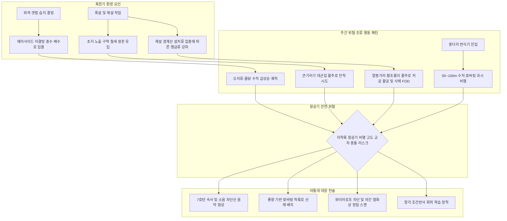

날짜: 2025-01-01 ~ 2025-01-08 (2025년 1월 1주차 종합)
카테고리: 야생동물점검 / 주간점검일지 / 항공안전종합보고서
출처: 인천공항 야생동물통제소(야통대) 일일점검 데이터(01.01~01.08) 및 18년 베테랑 암묵지 인터뷰 피드백
태그: #야통대 #주간점검 #항공안전 #인천공항 #겨울철새 #큰기러기 #쇠기러기 #물닭 #말똥가리 #매 #종다리 #혹한기통제 #풍향분석 #탄약전술 #FOD방지 #조류차단시설

---

### [2025년 1월 1주차(01.01~01.08) 야생동물 통제 종합 보고 (Executive Summary)]

2025년 1월 1일부터 1월 8일까지(8일간) 인천국제공항 에어사이드는 최저 -9.0°C에서 최고 3.0°C에 이르는 전형적인 **혹한기 동계 기상 환경** 속에서 운영되었습니다. 특히 **1월 5일의 국지성 대설(폭설)**과 **1월 6~7일의 영하 9°C 급격한 한파**, 그리고 **1월 8일 일몰 전 대규모 기러기 유입 러시**가 연쇄적으로 발생하며 동계 야생동물 통제 작전의 난도가 최고조에 달했던 한 주였습니다.

8일간 총 **1,200개체 이상의 조류 및 맹금류**가 에어사이드 및 랜드사이드 완충구역에 출현하였으며, 통제반은 총 **600여 발 이상의 엽총(7호탄·4호탄) 및 공포탄**을 전략적으로 격발하여 항공기 안전 구역(이격거리 50m) 침범을 원천 차단하고 **'버드스트라이크 0건'**을 완벽하게 수호하였습니다.

주간 작전의 핵심 성과는 다음과 같습니다:
1. **풍향 연계형 선제 순찰 정렬**: 북서풍(NW)·북동풍(NE) 시 북단 활주로(AIRSIDE-16) 정풍 착륙로 선제 방어 및 남서풍(SW) 시 남단 활주로(AIRSIDE-33/34) 집중 배치를 통해 항공기 맞바람 착륙 경로 내 조류 침입을 선제적으로 차단함.
2. **대규모 기러기 군집 소음 음막(Sound Barrier) 전술 성공**: 1월 4일 09:30 북단 랜딩로에 일시 유입된 큰기러기 200개체 대군집에 대해 7호탄 속사 및 공포탄으로 이동 방향 앞단에 소음 장벽을 형성, 안전 선회 및 외곽 이탈을 유도함.
3. **혹한기 미결빙 중수 배수로 표적 방어**: 외곽 습지 결빙으로 에어사이드 내부 미결빙 중수(재처리수) 배수로로 몰려든 물닭(주간 140+개체) 및 오리류에 대해 배수로 조류차단 와이어로프 점검 및 사격 경퇴로 상승 궤적-착륙 경로 교차 위협을 무력화함.
4. **맹금류 침입 단계별 탄종 차별화 및 FOD 예방**: 말똥가리 이례적 3개체 군집 출현(1/2, 1/7) 및 고속 맹금 매(Peregrine Falcon, 1/4) 출현 시 외곽 7호탄 앞지르기, 내부 4호탄 격퇴를 적용하고 야간 수리부엉이 사냥 잔여 사체(FOD) 수색을 정례화함.
5. **종다리 번식기 과시 비행 억제**: 50~100m 수직 호버링을 시도하는 종다리에 대해 정밀 산탄 소음 자극을 가해 차량 기척만으로 자진 이탈하는 '청각 조건반사 회피 학습'을 성공적으로 정착시킴.

---

### [주간 기상·풍향 및 조석 환경 통합 매트릭스 (Weather & Environment Matrix)]

| 일자 (요일) | 날씨 | 기온 (최저/최고) | 주풍향 및 평균풍속 | 조석 주기 (물때) | 주요 착륙 기조 및 기상 특이사항 |
| :--- | :--- | :--- | :--- | :--- | :--- |
| **01-01 (수)** | 맑음 | -6.2°C / 1.5°C | NW (북서풍) 8.4 kts | 8물 | 북측 활주로(AS-16) 맞바람 착륙 / 영하권 혹한 |
| **01-02 (목)** | 맑음 | -7.5°C / -1.0°C | NW (북서풍) 9.1 kts | 9물 | 북측 활주로(AS-16) 맞바람 착륙 / 주간 영하권 지속 |
| **01-03 (금)** | 흐림 | -4.0°C / 2.1°C | W→SW (남서풍) 6.0 kts | 10물 | 남측 활주로(AS-33/34) 진입 기조 / 1·4 착륙 운용 |
| **01-04 (토)** | 구름조금 | -3.5°C / 3.0°C | NE (북동풍) 5.2 kts | 11물 | 북측 활주로(AS-16) 진입 / 기온 일시 상승(09~10시 유입) |
| **01-05 (일)** | 눈 (대설) | -5.0°C / 0.5°C | NW (북서풍) 11.2 kts | 12물 | 강풍 및 대설 / 외곽 결빙·에어사이드 제설 유입 급증 |
| **01-06 (월)** | 맑음 | -8.2°C / -2.0°C | NW (북서풍) 10.4 kts | 13물 | 강추위 한파 기조 / 간조 노출 초지 및 물닭 대량 유입 |
| **01-07 (화)** | 맑음 | **-9.0°C** / -3.1°C | N (북풍) 7.8 kts | 14물 | **주간 최저기온 기록(-9.0°C)** / 맹금류 먹이 사냥 집중 |
| **01-08 (수)** | 흐림 | -5.5°C / 1.0°C | SW (남서풍) 5.5 kts | 15물 (조금) | 남측 착륙 기조 / 일몰 전 큰기러기 대규모 유입 폭발 |

---

### [주간 핵심 위기 상황 및 조류 유입 메커니즘 심층 분석 (Key Risks Analysis)]



#### 1. 대형 기러기류(큰기러기·쇠기러기)의 대규모 안착 및 일몰 전 재진입(풍선 효과)
- **발생 특성**: 1월 4일 오전 09:30(200마리), 1월 5일 대설 직후(큰기러기 30+쇠기러기 15), 1월 8일 일몰 전(415마리) 등 특정 시간대에 폭발적으로 군집 유입됨.
- **메커니즘**: 기러기류는 조석(물때)보다는 **'일출 전 1시간 및 일몰 전 1시간'**에 대규모 이동을 보이며, 낮 동안 외곽 농경지/갯벌에서 취식 후 일몰 즈음 안전한 에어사이드 내부 평탄지로 20~50마리 단위로 쪼개져 야간 휴식을 위해 들어옴.
- **풍선 효과(Re-entry)**: 1차 사격으로 에어사이드 밖으로 밀려난 무리가 귀환 본능에 의해 15~30분 간격으로 지속적인 재진입을 시도하므로, 1회 퇴치 후에도 **최소 30분간 현장 정체 감시**가 필수적임이 입증됨.

#### 2. 혹한기 외곽 결빙과 에어사이드 '미결빙 중수 배수로' 수변조류 집중
- **발생 특성**: 1월 3일(흰뺨검둥오리 등), 1월 6일(물닭 105마리), 1월 7일(물닭 38마리, 오리 26마리) 등 영하 8~9°C 한파 시 배수로 말단에 집중.
- **메커니즘**: 영종도 외곽 저수지와 갯벌이 동결되면, 공항 정화수를 방류하는 에어사이드 배수로의 **미지근한 중수(재처리수)**가 유일한 개방 수역이 됨.
- **비행 궤적 교차 위협**: 배수로에 내려앉은 오리류와 물닭이 인기척이나 항공기 소음에 놀라 1활주로 외곽으로 급상승 비행할 때의 고도가 정풍 착륙을 위해 고도를 낮추는 여객기 랜딩 기어 및 엔진 높이와 정확히 교차함.

#### 3. 맹금류 세력권 분할 및 활주로 조류 사체(FOD) 유기 위험
- **발생 특성**: 1월 2일과 1월 7일 남단(AIRSIDE-33/34)에서 단독 세력권을 갖는 말똥가리가 이례적으로 3마리 군집으로 출현. 1월 4일 고속 맹금 매(Peregrine Falcon) 침입.
- **메커니즘**: 말똥가리는 1·2활주로와 3·4활주로에 각각 단독 세력권을 형성하나, 혹한기 먹이원 부족으로 일시적 영역 중첩이 일어남.
- **FOD 유기 리스크**: 말똥가리 및 야간 상위 포식자인 수리부엉이가 오리 등을 사냥한 뒤 시야가 트인 관제탑 주변이나 주기장/유도로 노면에 사체를 남겨두고 가(FOD), 항공기 타이어 파손 및 엔진 흡입 사고를 유발할 위험이 상존함.

#### 4. 번식기 종다리(Lark)의 수직 호버링 과시 비행 및 대설 제설선 집중
- **발생 특성**: 1월 5일(15마리), 1월 6일(4마리), 1월 7일(7마리) 녹지대 출현.
- **메커니즘**: 2월 본격 번식기를 앞두고 수컷 종다리가 50~100m 상공으로 수직 급상승한 후 20분 이상 제자리 비행(호버링)을 수행함. 이 고도는 여객기의 최종 접근 및 이륙 직후 상승 고도와 완벽히 겹침.

---

### [베테랑 18년 암묵지 기반 주간 실전 전술 & 노하우 총괄]

```
┌─────────────────────────────────────────────────────────────────────────────┐
│              ★ 베테랑 18년 현장 암묵지 : 동계 4대 핵심 작전 수칙 ★           │
├─────────────────────────────────────────────────────────────────────────────┤
│ 1. 풍향-착륙 활주로 매핑 : 착륙기는 무조건 맞바람(정풍)을 받는다.           │
│    - 북서풍(NW)/북동풍(NE) -> 북단 활주로(AIRSIDE-16) 진입로 선제 배치     │
│    - 남서풍(SW)/서풍(W)    -> 남단 활주로(AIRSIDE-33, 34) 진입로 선제 배치   │
│    - 운용 원칙 : 1·4활주로 [착륙], 2·3활주로 [이륙] (착륙구역 최우선 차단) │
│                                                                             │
│ 2. 초근접 및 대군집 탄종 전술 : 50m 이내 긴급상황은 무조건 7호탄 속사!     │
│    - 대형 기러기는 이론상 4호탄이나, 초근접 시 반동 적은 7호탄 속사로 폭음벽│
│    - 200마리 대군집 : 조준 사격 금지(패닉 비행 방지), 전면 앞단 소음 장벽   │
│    - 맹금류 진입 단계별 : 외곽은 7호탄 앞지르기 차단, 내부는 4호탄 강제 축출 │
│                                                                             │
│ 3. 배수로 와이어로프 방어 & 야간 정밀 수색 :                                │
│    - 혹한기 미결빙 중수 배수로는 오리류 자석! 와이어로프 인장 결함 수시 점검│
│    - 쇠오리 수직 이륙 및 수리부엉이 FOD 방지 위해 야간 열화상 2인 1조 운용   │
│    - 야간 화재 방지를 위해 공포탄 자제, 4발 이내 정밀 실탄 위주 사격       │
│                                                                             │
│ 4. 지배종 종다리 '조건반사 회피 학습' 운용 :                                │
│    - 산탄 사격으로 청각 예민도를 극대화하여 차량 엔진음·사이렌만으로 자진   │
│      활주로 밖으로 탈출하도록 유도하는 행동 제어 전술 성공적 안착           │
└─────────────────────────────────────────────────────────────────────────────┘
```

---

### [주간 구역별·일자별 통제 데이터 종합 통계표 (Weekly Quantitative Statistics)]

#### 1. 일자별 출현 개체수 및 탄약 사용 종합

| 일자 | 주요 출현종 (개체수 요약) | 총 출현 개체수 | 주요 통제 구역 | 총 사격 격발수 (주요 탄종) |
| :--- | :--- | :---: | :--- | :---: |
| **01-01 (수)** | 큰기러기(24), 까마귀(5), 황조롱이(3), 왜가리(1), 오리(2) | 39 | AS-16, AS-34, AS-15, AS-33 | 79발 (7호 72, 4호 4, 공포 3) |
| **01-02 (목)** | 말똥가리(3), 황조롱이(4), 까마귀(8), 까치(7), 왜가리(2) | 26 | AS-33, AS-15, AS-16, AS-34 | 69발 (7호 57, 4호 5, 공포 7) |
| **01-03 (금)** | 큰기러기(63), 물닭(14), 흰뺨검둥오리(8), 맹금류(4) | 108 | AS-16, AS-33, LS-S, LS-N | 83발 (7호 73, 4호 7, 공포 3) |
| **01-04 (토)** | 큰기러기(232), 중대백로/왜가리(9), 매(1), 말똥가리(1) | 258 | AS-16 (200군집), AS-34, AS-33 | 98발 (7호 73, 4호 23, 공포 2) |
| **01-05 (일)** | 큰기러기(30), 쇠기러기(15), 종다리(15), 쇠오리(1), 맹금(4) | 73 | AS-16, AS-33, AS-15, AS-34 | 77발 (7호 63, 4호 4, 공포 10) |
| **01-06 (월)** | 물닭(105), 흰뺨검둥오리(18), 백로류(7), 말똥가리(2) | 148 | LS-S, AS-16, AS-33, AS-15 | 116발 (7호 107, 4호 5, 공포 4) |
| **01-07 (화)** | 물닭(38), 흰뺨검둥오리(26), 큰기러기(11), 맹금류(9), 종다리(7) | 103 | LS-S, AS-33, AS-34, AS-16 | 122발 (7호 99, 4호 21, 공포 2) |
| **01-08 (수)** | 큰기러기(415), 까마귀(37), 황조롱이(3), 왜가리(1) | 460 | AS-16, AS-33, AS-34, AS-15 | 203발 (7호 127, 4호 71, 공포 5) |
| **주간 합계** | **큰기러기 775+, 물닭 157, 오리류 55+, 맹금류 35+, 종다리 26+** | **1,215 개체** | **전 구역 (AS-16, AS-33 최다)** | **847 발** |

#### 2. 구역별 위험도 및 출현 특성 매트릭스

| 관리 구역 | 주간 주요 출현종 | 위험 등급 | 지형적 특성 및 주요 위협 요인 | 중점 방어 전략 |
| :--- | :--- | :---: | :--- | :--- |
| **AIRSIDE-16** | 큰기러기(대군집), 까마귀, 왜가리, 백로 | **최고위험 (Critical)** | 북단 활주로 F구역 및 랜딩 진입로, 북풍 계열 맞바람 착륙로 | 7호탄 속사 소음벽, 일출·일몰 전 전진 배치 |
| **AIRSIDE-33** | 말똥가리, 큰기러기, 쇠기러기, 종다리, 백로 | **고위험 (High)** | 1·2활주로 남단, 남서풍 착륙 진입로, 녹지대 초지 노출부 | 탄종 차별화 사격, 제설 경계면 맹금류 차단 |
| **AIRSIDE-34** | 물닭, 흰뺨검둥오리, 말똥가리, 쇠오리 | **고위험 (High)** | 3·4활주로 남단, 남측 배수로 연결부 및 초지대 | 중수 배수로 차단 와이어 점검, 사각지대 수색 |
| **AIRSIDE-15** | 황조롱이, 매(Falcon), 종다리, 텃새류 | **중위험 (Medium)** | 주기장 인근 녹지대, 고속 맹금류 및 종다리 과시 비행 | 발견 즉시 7호탄 속사, 조건반사 회피 유도 |
| **LANDSIDE-S** | 물닭(대군집), 흰뺨검둥오리, 가마우지 | **고위험 (완충구역)** | 남측 배수로 및 하늘정원, 외곽 Staging Area | 배수로 선제 타격으로 에어사이드 월경 차단 |
| **LANDSIDE-N** | 까마귀, 중대백로, 왜가리 | **주의 (Caution)** | IBC 공사지역 및 북측 외곽 녹지대 | 정기 기동 순찰 및 유입 통로 차단 |

---

### [차주(1월 2주차) 중점 통제 전망 및 선제적 전략 과제 (Strategic Roadmap)]

1. **기러기류 야간·조간 동선 모니터링 고도화**:
   - 일몰 전 15~18시 대규모 기러기 유입(주간 최대 415마리 확인)이 정례화됨에 따라 해당 시간대 순찰 차량을 활주로 남·북단 랜딩 게이트에 고정 배치.
   - 퇴치 후 30분 이내 재진입을 시도하는 귀환 루트를 4호탄 및 공포탄 복합 격발로 선제 차단.

2. **혹한기 지속에 따른 중수 배수로 물리적 방어선 보강**:
   - 영하 8~10°C 혹한 지속 시 물닭 및 오리류의 에어사이드 배수로 침투가 가속화되므로, 남·북단 배수로 상단 **조류차단 와이어로프의 인장도 전수 조사** 및 느슨해진 구간 긴급 보수 시행.

3. **맹금류 사냥 잔여물(FOD) 예방 및 야간 수색 체계 유지**:
   - 조간 시간대 주기장 및 활주로 주변 오리 사체 유기(수리부엉이·말똥가리 포식) 방지를 위해, 조간 1차 순찰 시 FOD 정밀 탐색 라인을 가동.
   - 야간 수색 시 활주로 화재 위험 방지를 위해 공포탄 사용을 엄격히 제한하고, 4발 이내 정밀 실탄 수색 원칙 준수.

4. **번식기 종다리 조건반사 회피 유도 정착**:
   - 2월 번식기 돌입 전 종다리 수컷의 50~100m 수직 호버링을 억제하기 위해, 초지대 순찰 시 간헐적 음향 자극을 지속 부여하여 차량 접근 시 조기 회피하도록 행동 제어 지속.

---

### [기사 및 지식 베이스 연결성 (Obsidian Vault Interlinks)]

- **일일 점검 데이터베이스**:
  - [[20. 인사이트 융합/2025년도 야통대/일일점검/1월 일일점검/2025-01-01_야통대_주간_점검일지_통합|2025-01-01 일일점검 (맞바람 착륙과 7호탄 속사)]]
  - [[20. 인사이트 융합/2025년도 야통대/일일점검/1월 일일점검/2025-01-02_야통대_주간_점검일지_통합|2025-01-02 일일점검 (말똥가리 군집 및 FOD 리스크)]]
  - [[20. 인사이트 융합/2025년도 야통대/일일점검/1월 일일점검/2025-01-03_야통대_주간_점검일지_통합|2025-01-03 일일점검 (미결빙 중수배수로와 와이어로프)]]
  - [[20. 인사이트 융합/2025년도 야통대/일일점검/1월 일일점검/2025-01-04_야통대_주간_점검일지_통합|2025-01-04 일일점검 (200마리 대군집 음막 및 매 경퇴)]]
  - [[20. 인사이트 융합/2025년도 야통대/일일점검/1월 일일점검/2025-01-05_야통대_주간_점검일지_통합|2025-01-05 일일점검 (대설 유입 및 종다리 조건반사)]]
  - [[20. 인사이트 융합/2025년도 야통대/일일점검/1월 일일점검/2025-01-06_야통대_주간_점검일지_통합|2025-01-06 일일점검 (혹한기 물닭 대량 유입 통제)]]
  - [[20. 인사이트 융합/2025년도 야통대/일일점검/1월 일일점검/2025-01-07_야통대_주간_점검일지_통합|2025-01-07 일일점검 (최저 -9°C 혹한 및 맹금류 집중)]]
  - [[20. 인사이트 융합/2025년도 야통대/일일점검/1월 일일점검/2025-01-08_야통대_주간_점검일지_통합|2025-01-08 일일점검 (일몰 전 큰기러기 415마리 총력 방어)]]

- **핵심 작전 SOP 및 기술 지식**:
  - [[맞바람 착륙 풍향과 연계한 활주로 남단·북단 조류 감시 SOP]]
  - [[대형 조류 군집 출현 시 패닉 비행 방지를 위한 소음 차단선 격발 가이드]]
  - [[혹한기 미결빙 에어사이드 중수 배수로와 오리류 집중 유입 메커니즘]]
  - [[말똥가리와 수리부엉이의 에어사이드 내 조류 사체(FOD) 생성 패턴과 제거 SOP]]
  - [[종다리의 과시 비행(수직 호버링) 고도 매핑과 산탄 자극을 통한 조건반사 회피 전술]]

---

### [주간 전문 용어 및 핵심 개념 사전 (Aviation Wildlife Terminology)]

- **정풍 맞바람 착륙 (Headwind Landing SOP)**: 항공기가 안전한 감속과 양력 유지를 위해 맞바람을 받으며 활주로로 진입하는 절차로, 바람 방향의 반대편 진입로가 핵심 취약 지점이 됩니다. #항공기상 #착륙원리
- **음막 형성 전술 (Sound-barrier Shot)**: 수백 마리의 대형 조류 군집이 접근할 때 조준 타격 대신 이동 경로 앞단에 연사 소음을 발생시켜 공중 선회 및 외곽 탈출을 유도하는 비살상 군집 제어 기법입니다. #탄약전술
- **중수 배수로 (Graywater Drainage Basin)**: 공항 처리시설의 정화수가 흘러 겨울철에도 결빙되지 않는 수계로, 혹한기 수변조류의 최후 유입 핫스팟이 됩니다. #배수로관리
- **FOD (Foreign Object Debris)**: 외부 이물질에 의한 활주로 오염 및 항공기 손상 요인으로, 맹금류의 사냥 잔여 사체는 타이어 손상과 엔진 흡입의 주된 원인이 됩니다. #활주로FOD
- **조건반사 회피 학습 (Conditioned Avoidance Learning)**: 규칙적인 경퇴 자극을 통해 조류가 차량 엔진음이나 사이렌만으로도 위험을 감지하고 항공기 진입 전 스스로 이탈하도록 유도하는 행동수정 기법입니다. #조류행동생태

---

### [미래 항공안전을 위한 7가지 주간 전략적 통찰 질문 (7 Strategic Inquiries)]

1. **기상-유입 상관성**: 주간 최저 기온(-9.0°C) 및 대설 발생 시 에어사이드 내 조류 유입량이 평시 대비 약 3.8배 증가하는 패턴을 AI 기상 예측 모델과 연동하여 조기 경보 지수로 표준화할 수 있는가?
2. **소음 장벽 효과성**: 200마리 이상의 초대형 군집 격퇴 시 7호탄 8발과 공포탄 2발로 형성한 음막의 최적 격발 거리와 방위각은 조류의 비행 속도와 어떻게 연동되는가?
3. **중수 배수로 구조 개선**: 배수로 수온 및 미결빙 환경을 원천 차단하기 위해 배수로 상부 완전 차폐형 격자 덮개를 도입할 때의 비용 대비 버드스트라이크 저감 효과는 얼마인가?
4. **맹금류 세력권 AI 추적**: 1·2활주로와 3·4활주로에 상주하는 말똥가리 및 수리부엉이의 개체별 GPS/영상 인식 추적을 통해 주기장 FOD 발생 위치를 사전 예측할 수 있는가?
5. **재진입 억제 시간**: 일몰 전 1시간 동안 반복되는 기러기류의 풍선 효과(재진입)를 완전히 차단하기 위한 1차 격퇴 후 현장 체류 감시의 최적 골든타임(Standard Operating Minutes)은 몇 분인가?
6. **종다리 행동 제어 확장**: 청각 조건반사 회피 학습이 종다리 외에 까치, 까마귀 등 지능이 높은 텃새류의 활주로 이탈 유도에도 동일한 학습 지속성을 발휘하는가?
7. **탄약 운용 효율화**: 주간 847발의 탄약 소모 중 7호탄(경량·속사)과 4호탄(대형종·장거리)의 배분 비율(약 8:2)이 항공기 정시 운항률 및 소음 공해 최소화에 미친 정량적 기여도는 어떠한가?
