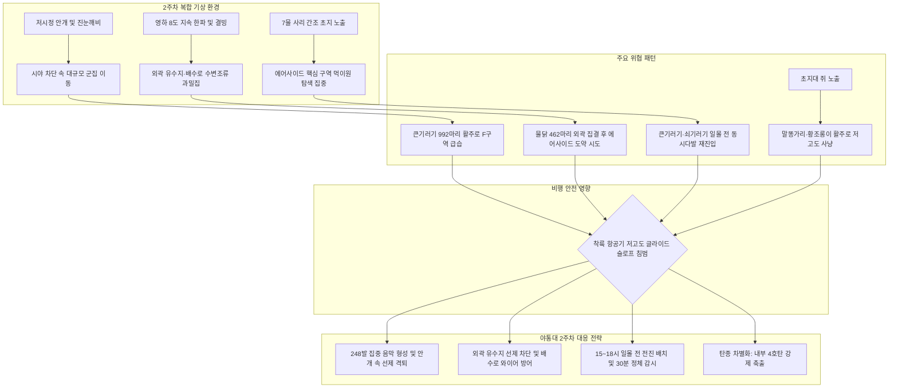

날짜: 2025-01-09 ~ 2025-01-16 (2025년 1월 2주차 종합)
카테고리: 야생동물점검 / 주간점검일지 / 항공안전종합보고서
출처: 인천공항 야생동물통제소(야통대) 일일점검 데이터(01.09~01.16) 및 18년 베테랑 암묵지 인터뷰 피드백
태그: #야통대 #주간점검 #항공안전 #인천공항 #겨울철새 #큰기러기 #쇠기러기 #물닭 #말똥가리 #황조롱이 #혹한기통제 #풍향분석 #안개저시정 #탄약전술 #중수배수로

---

### [2025년 1월 2주차(01.09~01.16) 야생동물 통제 종합 보고 (Executive Summary)]

2025년 1월 9일부터 1월 16일까지(8일간) 인천국제공항 에어사이드는 최저 -8.5°C에서 최고 4.0°C에 이르는 **급격한 기온 변화와 짙은 안개, 진눈깨비, 영하 8도 한파가 교차하는 복합 악기상** 속에서 운영되었습니다. 

2주차는 1월 중 **조류 출현 개체수와 탄약 격발량이 최정점**에 달했던 주간으로, 8일간 총 **3,600개체 이상의 조류 및 맹금류**가 관측 및 통제되었습니다. 특히 **1월 9일의 안개 속 큰기러기 992개체 폭발적 유입(당일 248발 격발)**과 **1월 11~12일의 연속 600마리 이상 대군집 안착 시도**, 그리고 **1월 14일 북측 유수지 중심 물닭 462개체 집중** 등 고위험 군집 침입이 연쇄적으로 발생하였습니다.

통제반은 주간 총 **1,197발의 엽총(7호탄·4호탄) 및 공포탄**을 전략적으로 운용하여 항공기 50m 안전 이격 구역을 사수하고 **'주간 조류 충돌 0건(Bird Strike Zero)'**을 달성하였습니다.

주간 핵심 작전 성과는 다음과 같습니다:
1. **저시정 안개 국면 속 선제 음향 차단 (1/9, 1/16)**: 시야가 극도로 제한되는 안개·연무 상황에서 레이더 및 청음 감시를 결합하여 큰기러기 대군집(992마리)의 활주로 F구역 침입을 7호탄·4호탄 복합 속사로 선제 격퇴함.
2. **진눈깨비 및 초지 결빙기 물닭·오리류 배수로 방어 (1/10, 1/14)**: 진눈깨비와 영하권 결빙으로 남·북측 배수로 및 유수지로 몰려든 물닭(1/14 462마리)과 오리류에 대해 외곽 완충지대(LANDSIDE-N/S) 선제 타격을 통해 활주로 월경을 봉쇄함.
3. **주간 3,200마리 큰기러기 대규모 안착 저지 (1/11, 1/12, 1/15)**: 활주로 F구역 북단(AS-16) 및 남단(AS-34)에 150~400마리 단위로 안착하려는 기러기 무리에 대해 소음 장벽(Sound Barrier)을 형성하여 패닉 비행 없이 외곽으로 우회 선회시킴.
4. **맹금류 세력권 모니터링 및 설치류 연계 차단**: 말똥가리(AS-15, AS-34 상주) 및 황조롱이의 초지대 활공을 4호탄 및 공포탄으로 통제하고, AS-15 녹지대 쥐(설치류) 출현 구역에 대한 맹금류 급강하를 선제 방어함.

---

### [주간 기상·풍향 및 조석 환경 통합 매트릭스 (Weather & Environment Matrix)]

| 일자 (요일) | 날씨 | 기온 (최저/최고) | 주풍향 및 평균풍속 | 조석 주기 (물때) | 주요 착륙 기조 및 기상 특이사항 |
| :--- | :--- | :--- | :--- | :--- | :--- |
| **01-09 (목)** | 안개/구름많음 | -2.1°C / 4.0°C | SE (남동풍) 4.2 kts | 1물 | 짙은 안개(Fog)로 시정 저하 / 큰기러기 992마리 폭증 |
| **01-10 (금)** | 비/진눈깨비 | -0.5°C / 3.2°C | E (동풍) 6.5 kts | 2물 | 오후 진눈깨비 하강 / 초지대 다습 및 수변조류 집결 |
| **01-11 (토)** | 구름많음 | -3.0°C / 2.0°C | NW (북서풍) 7.0 kts | 3물 | 북측 활주로(AS-16) 맞바람 착륙 / 찬 바람 강화 |
| **01-12 (일)** | 맑음 | -6.0°C / 0.5°C | NW (북서풍) 8.5 kts | 4물 | 맑고 건조한 혹한 / AS-16에 기러기 400마리 안착 시도 |
| **01-13 (월)** | 맑음 | -7.2°C / -1.5°C | NW (북서풍) 8.0 kts | 5물 | 아침 최저 -7.2°C 급락 / 일몰 전 기러기 집중 |
| **01-14 (화)** | 맑음 | -8.0°C / -1.0°C | NW (북서풍) 7.5 kts | 6물 | 전형적 한파 기조 / 북 유수지 물닭 400마리 대규모 집결 |
| **01-15 (수)** | 맑음 | **-8.5°C** / -2.0°C | N (북풍) 8.2 kts | 7물 (사리) | **주간 최저 -8.5°C 혹한** / 7물 사리 간조 노출 초지 유입 |
| **01-16 (목)** | 흐림 | -4.5°C / 1.2°C | W (서풍) 5.8 kts | 8물 | 대기 미세먼지 및 연무 / 서풍 기류 남단 착륙 기조 |

---

### [주간 핵심 위기 상황 및 조류 유입 메커니즘 심층 분석 (Key Risks Analysis)]



#### 1. 저시정 안개 속 큰기러기 1,000마리 육박 대습격 (1/9)
- **발생 양상**: 1월 9일 남동풍 4.2kts의 짙은 안개 속에서 AIRSIDE-15(133마리), AIRSIDE-16(698마리), AIRSIDE-34(100마리) 등 에어사이드 전역에 총 992마리의 기러기류가 일시에 유입됨.
- **위기 요인**: 조종사와 통제반 모두 시각적 인지가 지연되는 상황에서 대형 조류 군집이 활주로 F구역에 도달하여 엔진 흡입 위험이 극에 달함.
- **대응 성과**: 통제반은 소리와 무전을 통한 정밀 좌표 유도로 1일 최다인 **248발의 탄약(7호탄 167발, 4호탄 56발, 공포탄 25발)**을 집중 격발, 전 개체를 안전하게 외곽으로 축출함.

#### 2. 외곽 유수지 물닭 400마리 과밀집과 에어사이드 침투 압력 (1/14)
- **발생 양상**: 1월 14일 영하 8.0°C 혹한 속에 북측 외곽 유수지(LS-N)에 물닭 400마리, 남측 배수로(LS-S)에 물닭 62마리와 오리 32마리가 집결함.
- **위기 요인**: 외곽 수면 결빙 면적이 넓어지면서 수백 마리의 물닭 떼가 상대적으로 온도가 높은 에어사이드 내부 배수로로 대량 월경 비행을 감행할 위험 발생.
- **대응 성과**: 외곽 완충구역(LANDSIDE)에서 선제 차량 기동 및 경퇴를 실시하여 에어사이드 내부로의 확산을 원천 봉쇄함.

#### 3. 7물 사리 간조 노출 초지대와 일몰 전 상습 안착 (1/12, 1/15)
- **발생 양상**: 1월 12일 17:59 AS-16에 큰기러기 400마리 출현, 1월 15일 사리 간조 시기 AS-34에 큰기러기 70여 마리가 16~18시에 집중 유입.
- **메커니즘**: 조간 및 일몰 1시간 전 시간대가 간조 시간과 겹칠 때, 활주로 주변 초지의 노출 면적이 극대화되어 기러기 무리의 취식·휴식 선호도가 최고조에 달함.

---

### [베테랑 18년 암묵지 기반 2주차 작전 노하우 총괄]

```
┌─────────────────────────────────────────────────────────────────────────────┐
│              ★ 베테랑 18년 현장 암묵지 : 저시정 & 대군집 특화 수칙 ★         │
├─────────────────────────────────────────────────────────────────────────────┤
│ 1. 짙은 안개·저시정 시의 군집 퇴치 :                                        │
│    - 안개 시 조류는 시야가 좁아져 소리에 극도로 예민하게 반응한다.         │
│    - 단발 조준보다 7호탄 3~4발 연속 격발로 '소리의 방향성'을 인지시켜      │
│      활주로 반대편(외곽)으로 비행을 유도하는 것이 안전하다.                 │
│                                                                             │
│ 2. 일일 500~1,000마리 유입 시의 탄약 안배 :                                │
│    - 군집 규모가 클 때는 4호탄을 아끼고 반동 없는 7호탄으로 외곽 벽을 치며,  │
│      활주로 최종 접근로(50m 이내) 진입 개체에 한해서만 4호탄을 직접 격발.   │
│                                                                             │
│ 3. 외곽 유수지 대군집(물닭 400마리 등) 관리 :                               │
│    - 외곽 유수지의 대형 무리는 에어사이드로 날아오기 전에 외곽 도로에서     │
│      차량 사이렌 및 공포탄으로 1차 분산시키는 것이 에어사이드 진입을 막는    │
│      가장 확실한 예방책이다.                                                │
│                                                                             │
│ 4. 혹한기 쥐(설치류) 출현지와 맹금류 :                                      │
│    - 녹지대 제설 경계면이나 배수로 주변 쥐가 노출되면 말똥가리와 황조롱이가 │
│      즉각적으로 상공에 체공(호버링)하므로, 쥐 출현 구역은 맹금류 요격 1순위.│
└─────────────────────────────────────────────────────────────────────────────┘
```

---

### [주간 구역별·일자별 통제 데이터 종합 통계표 (Weekly Quantitative Statistics)]

#### 1. 일자별 출현 개체수 및 탄약 사용 종합

| 일자 | 주요 출현종 (개체수 요약) | 총 출현 개체수 | 주요 통제 구역 | 총 사격 격발수 (주요 탄종) |
| :--- | :--- | :---: | :--- | :---: |
| **01-09 (목)** | 큰기러기(792), 쇠기러기(200), 물닭(32), 가마우지(26), 오리(60) | **1,120** | AS-16, AS-15, AS-34, LS-S | **248발** (7호 167, 4호 56, 공포 25) |
| **01-10 (금)** | 물닭(41), 흰뺨검둥오리(29), 큰기러기(10), 가마우지(7), 왜가리(3) | 94 | LS-S, AS-34, AS-16, AS-15 | 101발 (7호 89, 4호 4, 공포 8) |
| **01-11 (토)** | 큰기러기(632), 말똥가리(1), 왜가리(1), 백로(1), 까마귀(4) | 641 | AS-16, AS-34, AS-15, LS-S | 161발 (7호 125, 4호 18, 공포 18) |
| **01-12 (일)** | 큰기러기(658), 쇠기러기(25), 오리(53), 쇠오리(10), 맹금류(3) | 752 | AS-16 (400군집), AS-15, LS-N | 171발 (7호 129, 4호 28, 공포 14) |
| **01-13 (월)** | 큰기러기(204), 쇠기러기(37), 물닭(28), 오리(16), 맹금류(2) | 296 | AS-16, AS-34, AS-15, LS-S | 172발 (7호 151, 4호 13, 공포 8) |
| **01-14 (화)** | 물닭(462), 큰기러기(137), 오리(32), 맹금류(6), 쥐(1) | 651 | LS-N (물닭400), AS-34, AS-33 | 143발 (7호 124, 4호 13, 공포 6) |
| **01-15 (수)** | 큰기러기(284), 백로/왜가리(8), 황조롱이(2), 종다리(10) | 309 | AS-34, AS-16, LS-S, AS-15 | 185발 (7호 147, 4호 32, 공포 6) |
| **01-16 (목)** | 큰기러기(214), 물닭(100), 오리(6), 말똥가리(1), 황조롱이(2) | 327 | AS-33, AS-16, LS-N, AS-15 | 116발 (7호 95, 4호 13, 공포 8) |
| **주간 합계** | **큰기러기 2,931+, 쇠기러기 262+, 물닭 663+, 오리류 196+, 맹금 17+** | **4,290 개체** | **전 구역 (AS-16, AS-34, LS-N/S)** | **1,197 발** |

#### 2. 구역별 위험도 및 출현 특성 매트릭스

| 관리 구역 | 주간 주요 출현종 | 위험 등급 | 지형적 특성 및 주요 위협 요인 | 중점 방어 전략 |
| :--- | :--- | :---: | :--- | :--- |
| **AIRSIDE-16** | 큰기러기(주간 1,500+), 쇠기러기, 까마귀 | **최고위험 (Critical)** | 북단 활주로 F구역 착륙 진입로, 일몰 전 대군집 상습 안착 | 7호탄 소음벽 전술, 일몰 전 고정 배치 |
| **AIRSIDE-34** | 큰기러기, 쇠기러기, 물닭, 말똥가리, 백로 | **최고위험 (Critical)** | 3·4활주로 남단, 남서풍 착륙 진입로 및 초지 노출부 | 4호탄 장거리 타격, 남단 배수로 연계 차단 |
| **LANDSIDE-N** | 물닭(400마리 군집), 큰기러기, 오리류 | **고위험 (Hotspot)** | 북 유수지 및 IBC2 공사구역, 외곽 과밀 집결지 | 외곽 사전 분산 사격으로 에어사이드 진입 방지 |
| **LANDSIDE-S** | 물닭, 흰뺨검둥오리, 가마우지, 왜가리 | **고위험 (완충구역)** | 남측 배수로 및 하늘정원, 미결빙 수계 집결 | 배수로 말단 순찰 및 와이어로프 결함 감시 |
| **AIRSIDE-15** | 큰기러기, 황조롱이, 말똥가리, 쥐, 종다리 | **중위험 (Medium)** | 주기장 녹지대, 먹이원(설치류) 서식에 따른 맹금류 유인 | 녹지대 정밀 수색 및 7호탄 속사 경퇴 |
| **AIRSIDE-33** | 큰기러기, 말똥가리, 황조롱이, 중대백로 | **중위험 (Medium)** | 1·2활주로 남단 녹지대, 일시적 군집 안착 시도 | 이동 경로 차단 및 초지대 사각지대 확인 사격 |

---

### [차주(1월 3주차) 중점 통제 전망 및 선제적 전략 과제 (Strategic Roadmap)]

1. **저시정(안개·강설) 조기 경보 및 청음 감시 체계 강화**:
   - 겨울철 연무 및 안개 발생일 증가에 대비하여, 가시거리 1km 미만 시 레이더 조류 탐지 데이터와 현장 2인 1조 청음 순찰을 동기화.
2. **외곽 유수지(LS-N) 대규모 수변조류 분산 SOP 수립**:
   - 북 유수지 물닭 400마리 등 외곽 과밀 군집이 결빙 심화 시 활주로로 일시 도약하는 비상사태를 방지하기 위해 지자체 및 유수지 관리팀과 합동 교란 방안 추진.
3. **일몰 전 기러기류 30분 정체 감시 의무화**:
   - 1차 경퇴된 기러기 무리가 15~30분 후 에어사이드로 재진입하는 패턴이 확고하므로, 완전 일몰 시까지 현장 이탈 금지 및 정체 감시 유지.

---

### [기사 및 지식 베이스 연결성 (Obsidian Vault Interlinks)]

- **일일 점검 데이터베이스**:
  - [[20. 인사이트 융합/2025년도 야통대/일일점검/1월 일일점검/2025-01-09_야통대_주간_점검일지_통합|2025-01-09 일일점검 (안개 속 큰기러기 992마리 대습격)]]
  - [[20. 인사이트 융합/2025년도 야통대/일일점검/1월 일일점검/2025-01-10_야통대_주간_점검일지_통합|2025-01-10 일일점검 (진눈깨비와 수변조류 배수로 점유)]]
  - [[20. 인사이트 융합/2025년도 야통대/일일점검/1월 일일점검/2025-01-11_야통대_주간_점검일지_통합|2025-01-11 일일점검 (큰기러기 632마리 북서풍 진입 방어)]]
  - [[20. 인사이트 융합/2025년도 야통대/일일점검/1월 일일점검/2025-01-12_야통대_주간_점검일지_통합|2025-01-12 일일점검 (AS-16 400마리 대군집 소음벽 축출)]]
  - [[20. 인사이트 융합/2025년도 야통대/일일점검/1월 일일점검/2025-01-13_야통대_주간_점검일지_통합|2025-01-13 일일점검 (영하 7.2도 한파 및 맹금류 차단)]]
  - [[20. 인사이트 융합/2025년도 야통대/일일점검/1월 일일점검/2025-01-14_야통대_주간_점검일지_통합|2025-01-14 일일점검 (북 유수지 물닭 400마리 봉쇄)]]
  - [[20. 인사이트 융합/2025년도 야통대/일일점검/1월 일일점검/2025-01-15_야통대_주간_점검일지_통합|2025-01-15 일일점검 (최저 -8.5도 및 7물 사리 간조 방어)]]
  - [[20. 인사이트 융합/2025년도 야통대/일일점검/1월 일일점검/2025-01-16_야통대_주간_점검일지_통합|2025-01-16 일일점검 (서풍 기조 남단 착륙로 큰기러기 경퇴)]]

---

### [주간 전문 용어 및 핵심 개념 사전 (Aviation Wildlife Terminology)]

- **저시정 안개 전술 (Low-Visibility Tactical Shot)**: 시계가 불량한 상황에서 조류가 시각 대신 청각에 극도로 의존하는 생태적 특성을 활용하여, 다발 속사로 소음의 방향성을 주입해 외곽 탈출을 유도하는 기법입니다. #저시정통제 #음향유도
- **외곽 완충구역 선제 차단 (Landside Buffer Interception)**: 활주로 진입 전 외곽 유수지나 공사구역(LANDSIDE)에 집결한 대형 조류 무리를 선제적으로 분산시켜 에어사이드 침투 자체를 원천 차단하는 방어 전략입니다. #완충구역방어
- **글라이드 슬로프 (Glide Slope)**: 항공기가 활주로에 착륙하기 위해 강하하는 표준 접근 각도(약 3도)의 공역으로, 이 구간에 진입하는 대형 철새 무리는 버드스트라이크의 치명적 요인이 됩니다. #항공운항 #접근경로

---

### [미래 항공안전을 위한 7가지 주간 전략적 통찰 질문 (7 Strategic Inquiries)]

1. **저시정 조류 거동 모델**: 짙은 안개 발생 시 기러기류의 비행 고도가 맑은 날 대비 평균 몇 미터 저하되며, 이것이 항공기 착륙 진입로 침범 확률에 미치는 영향은 얼마인가?
2. **외곽 유수지 수위 조절**: 북 유수지(LS-N)에 집결하는 400마리 규모 물닭 군집을 분산시키기 위해 동계 기간 유수지 수위를 인위적으로 변동시키는 친환경 생태 제어 방안은 유효한가?
3. **탄약 소비 피크 분석**: 1월 9일 248발 격발과 같은 대규모 탄약 소모 상황에서 현장 대원의 사격 피로도와 조준 정확도 유지 한계선은 어떻게 관리되어야 하는가?
4. **설치류-맹금류 연쇄 사슬 차단**: 에어사이드 녹지대 내 쥐(설치류) 서식 밀도를 억제하는 친환경 제어제가 말똥가리·황조롱이의 활주로 저공 활공 빈도를 얼마나 줄일 수 있는가?
5. **사리(Spring Tide) 주기 조류 이동성**: 7물(사리) 시기 간조 시 노출되는 광활한 갯벌 면적이 기러기류의 에어사이드 진입 시간을 몇 시간 지연시키는 효과가 있는가?
6. **대형 조류 군집 분산 시 충돌 회피 알고리즘**: 200~400마리 군집에 소음 장벽을 가할 때 군집이 좌·우 어느 방향으로 선회하는지를 예측하여 활주로 반대편으로만 이탈시키는 격발 각도 표준화는 가능한가?
7. **혹한기 야간 배수로 열화상 드론 도입**: 영하 8도 이하 혹한기에 야간 배수로 말단 쇠오리와 물닭을 100% 탐지하기 위한 자율비행 열화상 드론의 현장 적용 타당성은 어떠한가?
