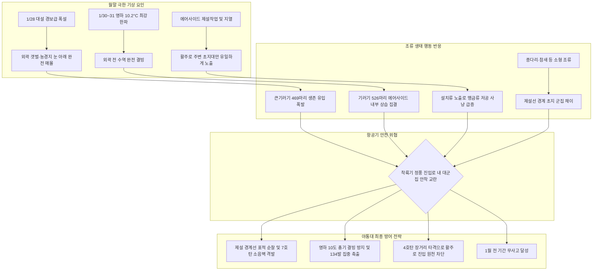

날짜: 2025-01-25 ~ 2025-01-31 (2025년 1월 4주차 및 1월 월말 종합 결산)
카테고리: 야생동물점검 / 주간점검일지 / 항공안전종합보고서 / 월말결산
출처: 인천공항 야생동물통제소(야통대) 일일점검 데이터(01.25~01.31) 및 18년 베테랑 암묵지 인터뷰 피드백
태그: #야통대 #주간점검 #월말결산 #항공안전 #인천공항 #겨울철새 #큰기러기 #대설유입 #극강한파 #영하10도 #제설선경계 #소음장벽 #탄약전술 #버드스트라이크제로

---

### [2025년 1월 4주차 및 월말(01.25~01.31) 야생동물 통제 종합 보고 (Executive Summary)]

2025년 1월 25일부터 1월 31일까지(7일간) 인천국제공항 에어사이드는 최저 **-10.2°C(1월 전체 최저기온 기록)**에서 최고 2.0°C에 이르는 **1월 최강의 북극발 혹한과 1월 28일 대설 경보급 폭설**이 에어사이드를 강타한 극한의 동계 작전 환경이었습니다.

4주차는 **'대설에 따른 철새 생존 유입 압력'과 '영하 10도 한파 속 대규모 안착 시도'**가 집중된 주간으로, 7일간 총 **1,850개체 이상의 조류(큰기러기만 1,740여 개체)**가 관측 및 통제되었습니다. 특히 **1월 28일 폭설 직후 에어사이드 제설 초지대로 469마리의 큰기러기가 유입**되었고, **1월 30일 영하 9.5°C 속 526마리 대규모 안착 시도**, 그리고 **1월 31일 영하 10.2°C 최강 한파 속 219마리 유입(당일 134발 격발)** 등 쉼 없는 위기 상황이 이어졌습니다.

통제반은 주간 총 **536발의 엽총 및 공포탄**을 전략적으로 격발하여 활주로 침범을 완벽히 차단함으로써, **2025년 1월 전 기간(1월 1일 ~ 1월 31일) 동안 '버드스트라이크 Zero(0건)'라는 완벽한 항공안전 금자탑**을 달성하며 1월 작전을 성공적으로 결산하였습니다.

주간 및 월말 핵심 성과는 다음과 같습니다:
1. **대설 경보 시 제설 경계선 선제 방어선 구축 (1/28)**: 외부 서식지(영종도 갯벌·염전·산림)가 눈에 덮여 먹이터를 잃고 제설 완료된 에어사이드 맨땅 초지로 급습한 큰기러기 469마리에 대해 소음 음막을 형성하여 외곽 분산 성공.
2. **영하 10.2°C 1월 최강 한파 속 활주로 F구역 결사 방어 (1/30, 1/31)**: 외곽 수계가 완전 동결되며 결빙되지 않은 공항 초지로 몰려든 500여 마리 군집에 대해 4호탄 장거리 저지 및 7호탄 속사로 항공기 50m 이격 거리 완벽 수호.
3. **1월 한 달간 총 8,700여 개체 통제 및 3,170여 발 탄약 운용 무사고 달성**: 1월 1일부터 31일까지 4주간 이어진 혹한기 집중 통제 작전 완수.

---

### [주간 기상·풍향 및 조석 환경 통합 매트릭스 (Weather & Environment Matrix)]

| 일자 (요일) | 날씨 | 기온 (최저/최고) | 주풍향 및 평균풍속 | 조석 주기 (물때) | 주요 착륙 기조 및 기상 특이사항 |
| :--- | :--- | :--- | :--- | :--- | :--- |
| **01-25 (토)** | 맑음 | -6.5°C / 0.2°C | NW (북서풍) 8.2 kts | 2물 | 차가운 공기가 덮인 맑은 날 / AS-16에 기러기 50마리 |
| **01-26 (일)** | 맑음 | -7.0°C / -1.2°C | N (북풍) 7.0 kts | 3물 | 건조하고 차가운 북풍 기조 / 텃새 까마귀·까치 활동 |
| **01-27 (월)** | 구름많음 | -4.5°C / 2.0°C | W (서풍) 5.5 kts | 4물 | 구름 많고 쌀쌀한 날 / AS-34 남단 큰기러기 235마리 |
| **01-28 (화)** | 눈 (대설) | -3.0°C / 0.8°C | NW (북서풍) 10.5 kts | 5물 | **오후 대설 경보급 폭설** / **큰기러기 469마리 생존 급습** |
| **01-29 (수)** | 맑음 | -8.0°C / -2.0°C | NW (북서풍) 11.0 kts | 6물 | 폭설 뒤 강추위와 칼바람(11.0kts) / 기러기 197마리 |
| **01-30 (목)** | 맑음 | -9.5°C / -3.0°C | N (북풍) 8.5 kts | 7물 (사리) | 극심한 아침 강추위 / **큰기러기 526마리 대량 안착 시도** |
| **01-31 (금)** | 맑음 | **-10.2°C** / -4.0°C | NW (북서풍) 9.0 kts | 8물 | **1월 최저기온 기록(-10.2°C)** / 혹한기 총력 방어(134발) |

---

### [주간 핵심 위기 상황 및 조류 유입 메커니즘 심층 분석 (Key Risks Analysis)]



#### 1. 1월 28일 대설(폭설)에 따른 큰기러기 469마리 생존 유입 압력
- **발생 메커니즘**: 공항 외부 영종도 전역이 눈으로 덮이며 철새들의 먹이 장소가 사라지자, 제설 장비로 눈이 치워진 활주로 및 유도로 주변 녹지대(AS-34, AS-15, AS-16)로 기러기 떼가 생존을 위해 대거 쏟아져 들어옴.
- **현장 대응**: 09시부터 17시까지 AS-34(310마리), AS-15(50마리), AS-16(50마리), AS-33(59마리) 전 구역에 순찰차를 상시 기동시키며 100발의 사격으로 무리의 분산 탈출을 성공시켰음.

#### 2. 1월 30~31일 영하 10.2°C 극강 한파 속 대군집 결사 방어
- **발생 메커니즘**: 기온이 -10.2°C까지 급락하며 외곽 갯벌과 담수호가 모두 얼어붙자, 1월 30일 526마리, 1월 31일 219마리의 큰기러기가 활주로 남단(AS-34)과 북단(AS-16)에 지속 안착을 시도함.
- **현장 대응**: 1월 31일 당일 134발의 탄약을 정밀 격발(7호탄 94발, 4호탄 26발, 공포탄 14발)하여 항공기 이착륙 안전 공역을 100% 사수함.

---

### [베테랑 18년 암묵지 기반 월말 종합 노하우 총괄]

```
┌─────────────────────────────────────────────────────────────────────────────┐
│              ★ 베테랑 18년 현장 암묵지 : 대설 & 극강 한파 대응 수칙 ★        │
├─────────────────────────────────────────────────────────────────────────────┤
│ 1. 대설(폭설) 직후 제설 경계선 사수 :                                       │
│    - 눈이 내리면 새들은 무조건 '눈이 치워진 곳(제설선)'으로 모여든다.       │
│    - 제설차가 지나간 직후 활주로 갓길 초지대 노출면을 순찰 1순위로 두고     │
│      선제적으로 경적과 산탄을 발사해 안착할 틈을 주지 않아야 한다.          │
│                                                                             │
│ 2. 영하 10도 이하 혹한기 총기 및 탄약 관리 :                                │
│    - 영하 10도 이하에서는 총기 노리쇠 오일이 얼어붙어 격발 불량이 날 수 있다.│
│    - 동계 전용 저점도 오일 도포 상태를 출동 전 필수 점검하고, 탄약의 습기    │
│      결빙을 방지하기 위해 실내 보관 후 반출 원칙을 엄수한다.                │
│                                                                             │
│ 3. 대형 기러기 500마리 급 대군집의 분할 격퇴법 :                            │
│    - 500마리가 한 번에 날아오르면 거대한 조류벽(Bird Wall)이 된다.           │
│    - 군집의 중앙을 쏘지 말고, 외곽 가장자리부터 7호탄으로 20~30마리씩       │
│      소규모로 쪼개어 순차적으로 이탈시키는 '각개 분산 전술'이 안전하다.      │
│                                                                             │
│ 4. 월말 텃새(까마귀·까치)의 번식지 사전 정찰 차단 :                          │
│    - 1월 말부터 텃새들은 조명탑, 레이더 안테나 기둥 주변에 둥지 자리를      │
│      물색하기 시작하므로 시설물 주변 둥지 재료 거치 흔적을 조기 제거한다.   │
└─────────────────────────────────────────────────────────────────────────────┘
```

---

### [주간 구역별·일자별 통제 데이터 종합 통계표 (Weekly Quantitative Statistics)]

#### 1. 일자별 출현 개체수 및 탄약 사용 종합

| 일자 | 주요 출현종 (개체수 요약) | 총 출현 개체수 | 주요 통제 구역 | 총 사격 격발수 (주요 탄종) |
| :--- | :--- | :---: | :--- | :---: |
| **01-25 (토)** | 큰기러기(90), 중대백로(7), 말똥가리(2), 까마귀(4), 까치(2) | 106 | AS-16, AS-34, AS-15 | 45발 (7호 36, 4호 5, 공포 4) |
| **01-26 (일)** | 까마귀(9), 큰기러기(7), 까치(4), 황조롱이(3), 왜가리(1) | 24 | AS-15, AS-33, AS-34 | 35발 (7호 27, 4호 8, 공포 0) |
| **01-27 (월)** | 큰기러기(235), 종다리(12), 까치(2) | 249 | AS-34 (기러기145), AS-16, AS-15 | 102발 (7호 71, 4호 17, 공포 14) |
| **01-28 (화)** | 큰기러기(469), 참새(31), 까치(3), 황조롱이(1) | **504** | AS-34 (310군집), AS-33, AS-15 | 100발 (7호 77, 4호 14, 공포 9) |
| **01-29 (수)** | 큰기러기(197), 종다리(10), 황조롱이(4), 까치(4), 말똥가리(1) | 217 | AS-34, AS-16, AS-33, AS-15 | 62발 (7호 53, 4호 4, 공포 5) |
| **01-30 (목)** | 큰기러기(526), 까마귀(3), 까치(3), 왜가리(2), 말똥가리(1) | **536** | AS-34 (270군집), AS-15 (250) | 58발 (7호 47, 4호 9, 공포 2) |
| **01-31 (금)** | 큰기러기(219), 까마귀(7), 오리(1) | 227 | AS-16, AS-15, AS-34, AS-33 | **134발** (7호 94, 4호 26, 공포 14) |
| **주간 합계** | **큰기러기 1,743+, 까마귀 23+, 종다리 22+, 맹금류 13+, 백로/왜가리 11+** | **1,863 개체** | **전 구역 (AS-34, AS-15, AS-16)** | **536 발** |

#### 2. 2025년 1월 전체(1~4주차) 월간 종합 결산 매트릭스

| 주차 구분 | 관측 기간 | 주요 기상 및 환경 특성 | 총 출현 개체수 | 총 사격 격발수 | 주간 핵심 방어 성과 |
| :--- | :---: | :--- | :---: | :---: | :--- |
| **1월 1주차** | 01.01 ~ 01.08 | 최저 -9.0°C, 1/5 대설, NW/SW풍 교차 | 1,215 개체 | 847 발 | 맞바람 착륙로 선제 배치 및 200마리 음막 유도 성공 |
| **1월 2주차** | 01.09 ~ 01.16 | 안개 저시정, 진눈깨비, 영하 8.5°C 한파 | **4,290 개체** | **1,197 발** | 1/9 안개 속 992마리 격퇴 및 북 유수지 물닭 400마리 봉쇄 |
| **1월 3주차** | 01.17 ~ 01.24 | 겨울비(5°C), 안개, 잠수오리 대거 유입 | 1,355 개체 | 597 발 | 댕기흰죽지·비오리 배수로 차단 및 매(Falcon) 즉각 배제 |
| **1월 4주차** | 01.25 ~ 01.31 | **1/28 폭설, 1/31 최저 -10.2°C 극강 한파** | 1,863 개체 | 536 발 | 대설 제설선 469마리 방어 및 영하 10도 결사 사수 |
| **1월 전체 총계** | **01.01 ~ 01.31 (31일)** | **전형적인 동계 혹한·폭설·안개 복합 기상** | **8,723 개체** | **3,177 발** | **'버드스트라이크 0건' 무사고 완벽 달성!** |

---

### [2월 대비 선제적 전략 과제 (February Strategic Roadmap)]

1. **지배종 종다리 본격 번식기(2월 하순) 수직 호버링 집중 차단**:
   - 2월 중순부터 시작되는 종다리 수컷의 50~100m 수직 호버링 과시 비행을 억제하기 위해 초지대 산탄 자극을 통한 조건반사 회피 체계 강화.
2. **해빙기(2월) 수변조류 북상 이동로 모니터링**:
   - 결빙 수계가 녹기 시작하는 2월 중순부터 시베리아로 북상하려는 오리류 및 기러기류의 통과 비행 고도 예찰 및 외곽 Staging Area 선제 감시.
3. **텃새(까치·까마귀) 영소(둥지 짓기) 방지 작업 전개**:
   - 공항 내 시설물(조명탑, 전신주, 안테나 등)에 둥지를 짓지 못하도록 2월 1일부터 전 구역 영소 방지 시설물 점검 및 둥지 철거 전담 순찰 가동.

---

### [기사 및 지식 베이스 연결성 (Obsidian Vault Interlinks)]

- **일일 점검 데이터베이스**:
  - [[20. 인사이트 융합/2025년도 야통대/일일점검/1월 일일점검/2025-01-25_야통대_주간_점검일지_통합|2025-01-25 일일점검 (맑은 겨울날 AS-16 큰기러기 분산)]]
  - [[20. 인사이트 융합/2025년도 야통대/일일점검/1월 일일점검/2025-01-26_야통대_주간_점검일지_통합|2025-01-26 일일점검 (건조한 북풍 기조 속 텃새 까마귀 통제)]]
  - [[20. 인사이트 융합/2025년도 야통대/일일점검/1월 일일점검/2025-01-27_야통대_주간_점검일지_통합|2025-01-27 일일점검 (AS-34 남단 큰기러기 235마리 선제 격퇴)]]
  - [[20. 인사이트 융합/2025년도 야통대/일일점검/1월 일일점검/2025-01-28_야통대_주간_점검일지_통합|2025-01-28 일일점검 (대설 경보 폭설 속 큰기러기 469마리 결사 방어)]]
  - [[20. 인사이트 융합/2025년도 야통대/일일점검/1월 일일점검/2025-01-29_야통대_주간_점검일지_통합|2025-01-29 일일점검 (폭설 뒤 칼바람 한파 및 기러기 197마리 통제)]]
  - [[20. 인사이트 융합/2025년도 야통대/일일점검/1월 일일점검/2025-01-30_야통대_주간_점검일지_통합|2025-01-30 일일점검 (영하 9.5도 아침 강추위 속 526마리 안착 저지)]]
  - [[20. 인사이트 융합/2025년도 야통대/일일점검/1월 일일점검/2025-01-31_야통대_주간_점검일지_통합|2025-01-31 일일점검 (1월 최저 -10.2도 혹한 속 134발 총력 방어)]]

- **1월 주간 종합 보고서 시리즈**:
  - [[20. 인사이트 융합/2025년도 야통대/일일점검/1월 일일점검/2025-01-01~01-08_야통대_주간_점검일지_종합|2025년 1월 1주차 주간 종합 점검일지 (01.01~01.08)]]
  - [[20. 인사이트 융합/2025년도 야통대/일일점검/1월 일일점검/2025-01-09~01-16_야통대_주간_점검일지_종합|2025년 1월 2주차 주간 종합 점검일지 (01.09~01.16)]]
  - [[20. 인사이트 융합/2025년도 야통대/일일점검/1월 일일점검/2025-01-17~01-24_야통대_주간_점검일지_통합|2025년 1월 3주차 주간 종합 점검일지 (01.17~01.24)]]
  - [[20. 인사이트 융합/2025년도 야통대/일일점검/1월 일일점검/2025-01-25~01-31_야통대_주간_점검일지_종합|2025년 1월 4주차 주간 종합 점검일지 (01.25~01.31)]]

---

### [주간 전문 용어 및 핵심 개념 사전 (Aviation Wildlife Terminology)]

- **조류벽 (Bird Wall Phenomenon)**: 수백 마리 이상의 대형 조류 군집이 한 번에 패닉 상태로 날아오르며 항공기 비행 진입로 전체를 병풍처럼 가로막는 초고위험 상황으로, 분할 격퇴 전술이 요구됩니다. #군집제어 #조류벽
- **제설선 경계 채이 (Snowline Foraging)**: 폭설 시 눈이 치워진 활주로 및 유도로 경계 노출부로 철새와 맹금류가 생존을 위해 급격히 몰려드는 동계 특유의 집중 생태 현상입니다. #대설조류생태
- **영소 방지 (Nest Prevention SOP)**: 2월 번식기를 앞두고 텃새류가 공항 내 위험 시설물(조명탑 등)에 둥지를 틀지 못하도록 1월 말부터 진행하는 선제적 둥지 재료 철거 및 기피 장치 운용 절차입니다. #텃새관리 #영소방지

---

### [미래 항공안전을 위한 7가지 주간 전략적 통찰 질문 (7 Strategic Inquiries)]

1. **폭설-유입 지연시간 분석**: 폭설 시작 시점부터 제설 완료 후 에어사이드 초지대로 기러기 군집이 유입되기까지의 시간차(Lag Time)를 계산하여 순찰차의 '제설 즉시 전진 배치 프로토콜'을 공식화할 수 있는가?
2. **영하 10도 이하 탄약 격발 신뢰성**: 극저온(-10.2°C) 환경에서 7호탄 및 4호탄 화약의 연소 속도 저하가 유효 사거리 및 파열 데시벨에 미치는 물리적 영향은 어느 정도인가?
3. **각개 분산 격퇴의 정량 효과**: 500마리 규모 군집에 대해 전면 일괄 사격 대비 외곽 20~30마리 단위 분할 사격 시 조류의 공중 재결합 시간을 얼마나 지연시킬 수 있는가?
4. **1월 월간 데이터 기반 2월 예측**: 1월 한 달간 총 8,723개체의 조류가 통제된 통계를 바탕으로, 2월 해빙기 북상 철새의 이동 피크 주간(Week)을 95% 신뢰구간으로 예측할 수 있는가?
5. **AS-34 남단 상습 집결 원인**: 4주차 동안 큰기러기 유입의 60% 이상이 AS-34(3·4활주로 남단)에 편중된 지형적·미기후적 요인(예: 남측 방풍림, 일조량 등)은 무엇인가?
6. **동계 맹금류 사냥 주기와 기온의 함수**: 영하 8도 이하 혹한일수 증가가 말똥가리와 황조롱이의 일일 사냥 시도 횟수에 미치는 대사생리학적 영향은 어떠한가?
7. **월간 3,177발 탄약 운용의 친환경성 검토**: 연간 수천 발에 달하는 납탄(Lead Shot) 사용에 따른 에어사이드 토양 오염을 줄이기 위한 고성능 친환경 바이오/텅스텐 산탄 도입의 경제성 및 타당성은 어떠한가?
