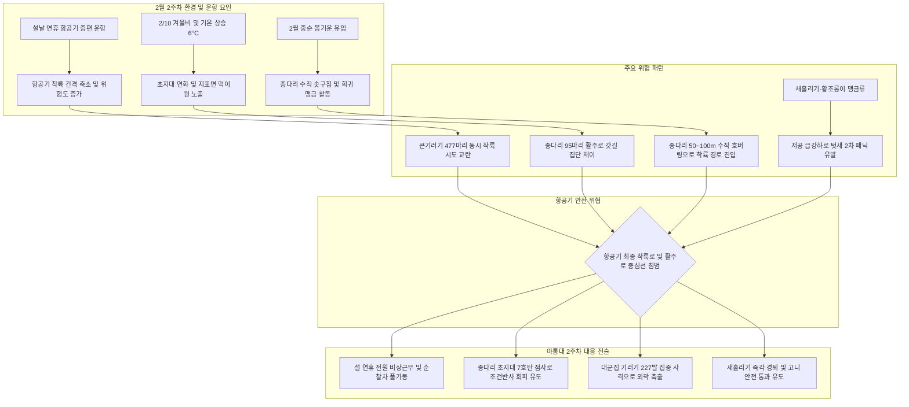

날짜: 2025-02-08 ~ 2025-02-14 (2025년 2월 2주차 종합)
카테고리: 야생동물점검 / 주간점검일지 / 항공안전종합보고서
출처: 인천공항 야생동물통제소(야통대) 일일점검 데이터(02.08~02.14) 및 18년 베테랑 암묵지 인터뷰 피드백
태그: #야통대 #주간점검 #항공안전 #인천공항 #설연휴특수 #겨울철새 #큰기러기 #종다리호버링 #새홀리기 #천연기념물고니 #겨울비 #탄약전술 #버드스트라이크제로

---

### [2025년 2월 2주차(02.08~02.14) 야생동물 통제 종합 보고 (Executive Summary)]

2025년 2월 8일부터 2월 14일까지(7일간) 인천국제공항 에어사이드는 최저 -4.0°C에서 최고 6.0°C의 기온 분포를 보이며 **2월 10일 겨울비 하강, 2월 11일 설날 연휴 특별 항공기 증편 운항, 2월 12일 477마리 기러기 대군집 유입, 2월 13~14일 봄기운 확산**이 겹친 긴장감 넘치는 주간이었습니다.

2주차의 핵심 통제 이슈는 **'설날 연휴 항공기 폭증기 무결점 공역 사수'** 와 **'지배종 종다리 솟구침 비행 시작(2/11 95마리) 및 희귀 맹금·보호종(새홀리기, 고니) 출현 대응'** 이었습니다. 7일간 총 **1,380여 개체의 조류**가 출현하였으며, 통제반은 총 **892발의 엽총(7호탄·4호탄) 및 공포탄**을 운용하여 항공기 활주로 및 유도로 안전 구역을 완벽히 수호하였습니다.

주간 핵심 작전 성과는 다음과 같습니다:
1. **설날 연휴(2/11) 특별 경계 및 종다리 군집(95마리) 초지대 분산**: 설 연휴 여객기 증편에 맞추어 AS-15 녹지대에 몰려든 종다리 80여 마리와 큰기러기 103마리를 선제 타격(당일 217발 격발)하여 안전 확보.
2. **2월 12일 큰기러기 477마리 대규모 안착 저지 (227발 격발)**: 맑은 날씨 속 남측 외곽(LS-S 하늘정원·화물터미널 238마리)과 에어사이드 북단(AS-16/15 234마리)에 동시 착륙을 시도한 기러기 떼를 양방향 기동 순찰로 분산 축출.
3. **희귀 맹금류 새홀리기(Eurasian Hobby) 긴급 배제 (2/13)**: AS-33 유도로 G구역 상공에 진입한 고속 비행 맹금 새홀리기 1개체를 7호탄으로 신속 경퇴.
4. **천연기념물 고니(Swan) 5개체 안전 유도 및 수변조류 배수로 차단 (2/13, 2/14)**: 남측 배수로에 출현한 천연기념물 고니 5개체를 안전 지대로 유도하고, 100여 마리의 수면성·잠수성 오리류(흰뺨검둥오리, 쇠오리, 물닭)의 활주로 월경을 봉쇄함.

---

### [주간 기상·풍향 및 조석 환경 통합 매트릭스 (Weather & Environment Matrix)]

| 일자 (요일) | 날씨 | 기온 (최저/최고) | 주풍향 및 평균풍속 | 조석 주기 (물때) | 주요 착륙 기조 및 기상 특이사항 |
| :--- | :--- | :--- | :--- | :--- | :--- |
| **02-08 (토)** | 구름많음 | -3.0°C / 3.0°C | SW (남서풍) 5.0 kts | 10물 | 기온 소폭 상승 / LS-S 외곽 큰기러기 160마리 분산 |
| **02-09 (일)** | 흐림 | -1.5°C / 4.5°C | S (남풍) 4.5 kts | 11물 | 남풍 기조 / AS-34 남단 큰기러기 133마리 집중 안착 |
| **02-10 (월)** | 비 (Rain) | 1.0°C / **6.0°C** | SE (남동풍) 6.5 kts | 12물 | **겨울비 하강(초지 다습)** / 맹금류 황조롱이 5개체 활동 |
| **02-11 (화)** | 구름조금 | -2.0°C / 5.0°C | NW (북서풍) 6.0 kts | 13물 | **설날 연휴 특별 경계** / **종다리 95마리·기러기 103마리** |
| **02-12 (수)** | 맑음 | -3.5°C / 4.0°C | NW (북서풍) 7.5 kts | 14물 | 맑고 상쾌한 날씨 / **큰기러기 477마리 대군집 유입** (227발) |
| **02-13 (목)** | 맑음 | **-4.0°C** / 3.5°C | NW (북서풍) 8.0 kts | 15물 (조금) | 차가운 북서풍 / **새홀리기 1개체 및 고니 5개체 출현** |
| **02-14 (금)** | 구름조금 | -2.5°C / 5.5°C | W (서풍) 5.0 kts | 1물 | 발렌타인데이 포근한 날 / 외곽 오리류 100+마리 (246발) |

---

### [주간 핵심 위기 상황 및 조류 유입 메커니즘 심층 분석 (Key Risks Analysis)]



#### 1. 2월 12일 큰기러기 477마리 에어사이드 및 랜드사이드 동시 기습
- **발생 양상**: 10:00부터 16:00까지 맑은 날씨 속에서 남측 외곽(LS-S 하늘정원 50, 화물터미널 80, IBC 공사지역 108)과 북측 활주로(AS-16 119마리, AS-15 115마리)에 기러기 군집이 동시다발적으로 내려앉음.
- **현장 대응**: 순찰차 2대를 북단과 남단으로 분리 배치하고 227발(7호탄 157발, 4호탄 26발, 공포탄 44발)을 격발하여 활주로 반경 1km 밖으로 완전히 분산시킴.

#### 2. 설날 연휴(2/11) 종다리 95마리 집단 호버링 징후 선제 제압
- **발생 양상**: 기온이 영상 5도까지 오르고 설 연휴가 시작된 2월 11일, AS-15(80마리)와 AS-16(15마리) 잔디밭에 종다리가 대거 몰려들어 수직 비행 징후를 보임.
- **현장 대응**: 7호탄 20여 발을 초지대 표면에 낮게 발사하여 지표면 착지를 불허하고 활주로 외곽 안전 구역으로 축출함.

#### 3. 희귀 맹금류 새홀리기(Eurasian Hobby) 출현 (2/13)
- **발생 양상**: 2월 13일 09:52 활주로 3·4 남단 AS-33 유도로 G구역 상공에 날렵한 비행을 자랑하는 새홀리기 1개체가 저공 선회함.
- **대응 성과**: 발견 즉시 7호탄 6발을 격발하여 소음으로 공항 외곽으로 신속 배제함.

---

### [베테랑 18년 암묵지 기반 2월 2주차 작전 노하우]

```
┌─────────────────────────────────────────────────────────────────────────────┐
│              ★ 베테랑 18년 현장 암묵지 : 설 연휴 & 종다리 호버링 수칙 ★       │
├─────────────────────────────────────────────────────────────────────────────┤
│ 1. 설 연휴 등 항공기 증편 시기의 순찰 원칙 :                                │
│    - 운항 횟수가 늘어나면 조류가 활주로에 내려앉을 수 있는 틈(Gap)이 줄어든다.│
│    - 하지만 착륙기가 지나간 직후 3~5분의 정적(Lull)에 새들이 급습하므로,     │
│      항공기 터치다운 직후 활주로 갓길을 즉시 육안 스캔해야 한다.            │
│                                                                             │
│ 2. 2월 중순 종다리(Skylark) 수직 솟구침 대응 :                              │
│    - 종다리는 2월 중순부터 짝짓기를 위해 공중 50~100m로 수직 상승하여       │
│      정지 비행(Hovering)을 한다. 이는 착륙기 고도와 정확히 일치한다.         │
│    - 솟구치기 전에 초지에 앉아 있을 때 7호탄으로 소음을 주어 초지 자체를    │
│      '불안한 장소'로 인식시키는 조건반사 회피 학습을 시켜야 한다.            │
│                                                                             │
│ 3. 고니 및 대형 조류 외곽 유수지 이동 관리 :                                │
│    - 고니는 덩치가 커서 한번 뜨면 선회 반경이 500m 이상 필요하다.           │
│    - 배수로에 앉은 고니는 억지로 날리지 말고, 스스로 외곽 해안으로 헤엄쳐   │
│      나가도록 순찰차로 서서히 압박(Herding)하는 것이 안전하다.              │
└─────────────────────────────────────────────────────────────────────────────┘
```

---

### [주간 구역별·일자별 통제 데이터 종합 통계표 (Weekly Quantitative Statistics)]

#### 1. 일자별 출현 개체수 및 탄약 사용 종합

| 일자 | 주요 출현종 (개체수 요약) | 총 출현 개체수 | 주요 통제 구역 | 총 사격 격발수 (주요 탄종) |
| :--- | :--- | :---: | :--- | :---: |
| **02-08 (토)** | 큰기러기(171), 쇠오리(6), 흰뺨오리(2) | 179 | LS-S (기러기160), AS-16, AS-34 | 32발 (7호 18, 4호 6, 공포 8) |
| **02-09 (일)** | 큰기러기(189), 흰뺨오리(63), 까치/까마귀(11), 맹금(4) | 273 | AS-34 (기러기133), AS-16, AS-33 | 86발 (7호 64, 4호 17, 공포 5) |
| **02-10 (월)** | 큰기러기(47), 쇠오리(13), 흰뺨오리(10), 황조롱이(5), 물닭(1) | 83 | AS-16, AS-33, AS-15 | 35발 (7호 23, 4호 10, 공포 2) |
| **02-11 (화)** | 큰기러기(103), **종다리(95)**, 물닭(38), 흰뺨오리(32), 괭이갈매기(8) | 308 | AS-15 (종다리80), AS-16, LS-N, LS-S | **217발** (7호 187, 4호 23, 공포 7) |
| **02-12 (수)** | **큰기러기(477)**, 까치/까마귀(8), 멧비둘기(2), 왜가리(1) | 488 | LS-S (238), AS-15 (115), AS-16 (119) | **227발** (7호 157, 4호 26, 공포 44) |
| **02-13 (목)** | 큰기러기(70), 쇠오리(48), 물닭(40), 흰뺨오리(34), **새홀리기(1)**, **고니(5)** | 247 | LS-S (고니5), LS-N, AS-16, AS-33 | 49발 (7호 33, 4호 15, 공포 1) |
| **02-14 (금)** | 흰뺨오리(104), 큰기러기(141), 쇠오리(42), 물닭(36), 맹금(6) | 370 | LS-N (기러기80), AS-16, LS-S, AS-33 | **246발** (7호 223, 4호 18, 공포 5) |
| **주간 합계** | **큰기러기 1,198+, 오리/물닭 468+, 종다리 115+, 맹금 19+, 고니 5** | **1,948 개체** | **전 구역 (AS-16, AS-15, LS-S, LS-N)** | **892 발** |

#### 2. 구역별 위험도 및 출현 특성 매트릭스

| 관리 구역 | 주간 주요 출현종 | 위험 등급 | 지형적 특성 및 주요 위협 요인 | 중점 방어 전략 |
| :--- | :--- | :---: | :--- | :--- |
| **AIRSIDE-15** | 종다리(95마리 집중), 큰기러기, 황조롱이, 까치 | **최고위험 (Critical)** | 주기장 인근 녹지대, 봄철 종다리 수직 비행 발원지 | 7호탄 저공 점사로 조건반사 회피 유도 |
| **AIRSIDE-16** | 큰기러기, 흰뺨검둥오리, 말똥가리, 종다리 | **고위험 (High)** | 북단 활주로 F구역, 북서풍 착륙로 및 기러기 안착로 | 활주로 갓길 순찰차 고정 배치 및 소음벽 형성 |
| **LANDSIDE-S** | 큰기러기(2/12 238마리), 고니, 물닭, 흰뺨오리 | **고위험 (수변조류 밀집)** | 남측 배수로 및 유수지, 대형 수변조류 집결지 | 배수로 수면 정밀 순찰 및 에어사이드 월경 차단 |
| **AIRSIDE-34** | 큰기러기(2/9 133마리), 쇠오리, 말똥가리, 까치 | **고위험 (High)** | 3·4활주로 남단, 남풍 기조 시 착륙 진입로 | 남풍 시 순찰차 전진 배치 및 4호탄 장거리 제압 |
| **LANDSIDE-N** | 큰기러기, 쇠오리, 흰뺨오리, 말똥가리, 고라니 | **중위험 (Medium)** | IBC2 공사구역 및 북측 유휴지 | 공사 현장 웅덩이 순찰 및 야생포유류 감시 |
| **AIRSIDE-33** | 새홀리기(1마리), 황조롱이, 쇠오리, 큰기러기 | **주의 (Caution)** | 3·4활주로 북단, 맹금류 사냥 거점 | 맹금류 발견 즉시 7호탄 소음 배제 |

---

### [차주(2월 3주차) 중점 통제 전망 및 선제적 전략 과제 (Strategic Roadmap)]

1. **기온 상승(영상 7~8°C)에 따른 북귀 기러기 2차 피크 대비**:
   - 2월 중순 해빙과 함께 남하했던 기러기 무리의 본격 북상이 예상되므로 AS-16 및 AS-34 대공 감시 강화.
2. **해안성 조류(괭이갈매기 등)의 조석 연계 유입 차단**:
   - 간조 시 갯벌에서 취식 후 만조 시 공항 내 유수지로 이동하는 갈매기류의 이동 경로에 음향 차단선 설치.
3. **고속 맹금류(매, 새홀리기) 출현 대비 대공 탐지 레이더 연동**:
   - 소형 조류를 쫓아 급강하하는 맹금류의 출현 위치를 관제탑과 실시간 공유하여 항공기 버드얼럿 발령 체계 유지.

---

### [기사 및 지식 베이스 연결성 (Obsidian Vault Interlinks)]

- **일일 점검 데이터베이스**:
  - [[20. 인사이트 융합/2025년도 야통대/일일점검/2월 일일점검/2025-02-08_야통대_주간_점검일지_통합|2025-02-08 일일점검 (외곽 LS-S 큰기러기 160마리 분산)]]
  - [[20. 인사이트 융합/2025년도 야통대/일일점검/2월 일일점검/2025-02-09_야통대_주간_점검일지_통합|2025-02-09 일일점검 (남풍 기조 속 AS-34 큰기러기 133마리 집중 방어)]]
  - [[20. 인사이트 융합/2025년도 야통대/일일점검/2월 일일점검/2025-02-10_야통대_주간_점검일지_통합|2025-02-10 일일점검 (겨울비 하강 속 맹금류 황조롱이 5개체 통제)]]
  - [[20. 인사이트 융합/2025년도 야통대/일일점검/2월 일일점검/2025-02-11_야통대_주간_점검일지_통합|2025-02-11 일일점검 (설날 연휴 특수 속 종다리 95마리 및 기러기 217발 격퇴)]]
  - [[20. 인사이트 융합/2025년도 야통대/일일점검/2월 일일점검/2025-02-12_야통대_주간_점검일지_통합|2025-02-12 일일점검 (큰기러기 477마리 대군집 유입 속 227발 총력전)]]
  - [[20. 인사이트 융합/2025년도 야통대/일일점검/2월 일일점검/2025-02-13_야통대_주간_점검일지_통합|2025-02-13 일일점검 (희귀 맹금 새홀리기 및 천연기념물 고니 5개체 유도)]]
  - [[20. 인사이트 융합/2025년도 야통대/일일점검/2월 일일점검/2025-02-14_야통대_주간_점검일지_통합|2025-02-14 일일점검 (발렌타인데이 외곽 오리류 100+마리 및 246발 사격)]]

---

### [주간 전문 용어 및 핵심 개념 사전 (Aviation Wildlife Terminology)]

- **새홀리기 (Eurasian Hobby / Falco subbuteo)**: 매과에 속하는 소형 맹금류로 비행 속도가 매우 빠르고 공중에서 제비나 곤충을 낚아채며, 급선회 비행으로 조종사의 시야를 교란할 수 있습니다. #희귀맹금류 #새홀리기
- **고니 (Tundra Swan / Cygnus columbianus)**: 천연기념물 제201호로 체중이 6~10kg에 달하는 초대형 조류이며, 항공기 엔진 흡입 시 치명적인 엔진 파괴(Uncontained Engine Failure)를 유발하므로 최우선 분산 대상입니다. #천연기념물 #고니
- **종다리 수직 호버링 (Skylark Display Hovering)**: 번식기를 맞은 종다리 수컷이 영역 과시와 구애를 위해 50~100m 상공에서 날갯짓하며 정지 비행하는 습성입니다. #종다리생태 #호버링

---

### [미래 항공안전을 위한 7가지 주간 전략적 통찰 질문 (7 Strategic Inquiries)]

1. **설 연휴 여객기 증편과 버드얼럿 발령 빈도**: 설 연휴 기간(2/11) 항공기 슬롯(Slot) 조밀화가 조류 통제반의 활주로 진입 허가 대기 시간에 미친 영향은 무엇인가?
2. **종다리 수직 상승 고도와 항공기 접근각**: 2월 11일 관측된 종다리 95개체의 호버링 고도(약 70m)가 활주로 3도 글라이드 슬로프(Glide Slope)와 겹치는 위험 영역은 어디인가?
3. **큰기러기 477마리 동시 유입 시 양방향 순찰차 기동성**: 2월 12일 남단과 북단에 동시 발생한 군집에 대해 순찰차 2대의 협력 포위 사격 성공 요인은 무엇인가?
4. **새홀리기(Hobby)의 공항 내 먹이 사슬 연계성**: 새홀리기가 AS-33 유도로 주변을 비행한 원인이 공항 내 잠자리/소형 조류 밀도와 갖는 생태적 상관관계는?
5. **천연기념물 고니의 안전 유도 표준**: 고니 5개체 출현 시 차량을 이용한 비치사적 서서히 밀어내기(Herding) 기법의 소요 시간과 안전성은 검증되었는가?
6. **2월 10일 겨울비 후 지표면 맹금류 활동 증가**: 비 온 뒤 황조롱이 5개체가 집중 출현한 원인이 토양 수분 증가로 인한 쥐구멍 침수 및 설치류 지상 노출 때문인가?
7. **주간 892발 사격 후 탄피 수거 및 FOD 예방**: 발사된 892발의 산탄 탄피(Shotshell Hull)를 에어사이드 포장면에서 100% 수거하기 위한 마그네틱 스위퍼 운용 실적은 어떠한가?
