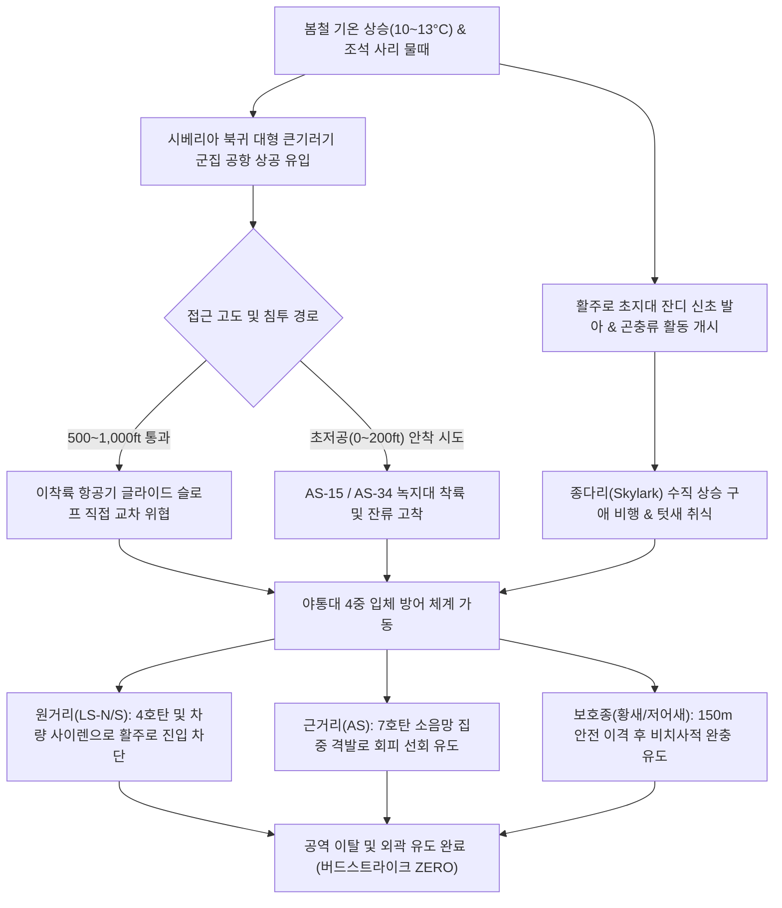

날짜: 2025-03-01 (토) ~ 2025-03-08 (토)
카테고리: 야생동물점검 / 주간종합점검일지
출처: 인천공항 야생동물통제관리시스템(WACS) 8일간 일일점검 데이터베이스 및 기상·조석 통합 분석
태그: #야통대 #주간점검일지 #항공안전 #인천공항 #봄철새 #큰기러기 #종다리 #황새 #7호탄 #4호탄

---

### [2025년 3월 1주차 야생동물 통제 종합 보고서]
2025년 3월 1주차(03.01~03.08, 8일간), 인천국제공항 에어사이드는 최저 0.0°C에서 최고 13.5°C로 완연한 초봄 기류가 유입되는 가운데, 강풍(최대 8.0kts)과 3/6 봄비(Rain) 등 계절 전환기 특유의 기상 변동이 나타났습니다. 이번 주간 통제반은 월동을 마친 대형 철새 **큰기러기 군집의 시베리아 북귀 대이동 엑소더스**와 초지대 신초(새싹) 발아에 따른 **종다리·텃새류의 활주로 집중 침투**에 맞서 총 **1,760개체(주요종 기준)**를 성공적으로 탐지하고, **총 735발의 탄약(7호탄, 4호탄, 공포탄)**을 전략적으로 격발하여 전 구역 무사고(Bird Strike ZERO)를 완벽하게 유지하였습니다.

---

### 1. 주간 주요 실적 및 핵심 성과 (Executive Summary)
1. **봄철 철새 북귀 엑소더스 선제 차단 (총 1,760개체 통제)**:
   - 3월 기온 상승(최고 13.5°C)에 따라 월동지에서 북상하는 **큰기러기 대군집**(3/5 453마리, 3/6 290마리, 3/7 594마리)이 공항 에어사이드 상공을 통과하거나 초지대에 착륙하려는 위협을 4중 방어선으로 완벽 분산·퇴치.
2. **천연기념물 및 멸종위기 야생생물 정밀 비치사적 통제**:
   - 3월 7일 AS-33 [녹지대_BK] 구역에 출현한 천연기념물 **황새(Oriental Stork, 1개체)** 및 3월 1일 출현한 **알락꼬리마도요(1개체)**를 안전거리(150m 이상) 확보 후 지향성 음향 및 저위험 경퇴탄으로 에어사이드 외곽 유도 성공.
3. **초지대 신초 발아에 따른 종다리·소형 조류 억제**:
   - 봄철 잔디 신초와 곤충 유충을 노리고 에어사이드로 침투하는 **종다리(Skylark, 3/3 25개체 등)** 및 텃새(까치·까마귀)의 활주로 글라이드 슬로프 진입을 7호탄 소음망으로 봉쇄.
4. **기상 변동(봄비 및 강풍) 대응 기동 순찰 강화**:
   - 3월 6일 강우(비) 및 3월 7일 7물(사리, NW 8.0kts) 조석차에 맞춰 간조 시 노출된 갯벌 취식 후 공항 내륙 배수로로 유입되는 수조류 편대를 사전 요격.
5. **탄약 효율적 운용 및 무사고 달성**:
   - 8일간 총 735발(일평균 91.9발)을 집중 적재적소에 소모하여 활주로 점유 조류 100% 즉각 퇴치 및 **버드스트라이크 0건** 달성.

---

### 2. 기상 및 환경 매트릭스 (Weather & Environment Matrix)

| 일자 | 요일 | 날씨 | 최저 기온 (°C) | 최고 기온 (°C) | 주풍향 및 풍속 (kts) | 조석 물때 (인천 기준) | 주요 통제 조류 및 환경 특이사항 |
| :---: | :---: | :---: | :---: | :---: | :---: | :---: | :--- |
| **03.01** | 토 | 맑음 (Clear) | 0.5 | 10.2 | NW 7.0 | 1물 | 삼월 첫날 포근한 기류, 큰기러기 224마리 에어사이드 접근 |
| **03.02** | 일 | 구름조금 | 1.0 | 9.5 | W 5.5 | 2물 | AS-15 구역 큰기러기 80마리 군집 급습, 75발 격발 퇴치 |
| **03.03** | 월 | 흐림 (Cloudy) | 2.5 | 8.0 | SW 5.0 | 3물 | 종다리 25마리 수직 호버링 집중, 212발 대량 격발 진압 |
| **03.04** | 화 | 맑음 (Clear) | 0.0 | 11.0 | NW 7.5 | 4물 | 일교차 11°C, LS-N/S 배수로 수조류 대거 유입(78마리) |
| **03.05** | 수 | 구름많음 | 3.0 | 9.0 | SW 5.0 | 5물 | 큰기러기 453마리 대규모 이동 포착, 공포탄 유도 |
| **03.06** | 목 | 비 (Rain) | 4.0 | 8.5 | SE 5.5 | 6물 | 봄비로 초지 다습화, 큰기러기 290마리 활주로 남단 압박 |
| **03.07** | 금 | 맑음 (Clear) | 1.0 | 12.0 | NW 8.0 | 7물 (사리) | **주간 최대치 큰기러기 594마리 유입, 천연기념물 황새 1개체 보호 유도** |
| **03.08** | 토 | 맑음 (Clear) | 2.0 | 13.5 | W 5.5 | 8물 | 낮 기온 13.5°C 쾌청, 종다리·텃새 초지대 탐색 활동 |

---

### 3. 위협 메커니즘 흐름도 및 위기상황 심층 분석

#### [심층 분석 1] 3월 7일 큰기러기 대군집(594마리) 파상 유입 및 결사 방어
- **상황**: 7물(사리) 조석 간조 시각과 북서풍 8.0kts 배풍 조건이 겹치며, 남부 월동지에서 북상하던 큰기러기 편대가 AS-15(50마리), AS-16(30마리), AS-33(40마리), AS-34(120마리), 외곽(354마리) 등 공항 전역으로 동시다발 착륙을 시도함.
- **대응**: 통제반 4개 조가 즉각 핫스팟 구역에 배치되어 **총 216발**의 7호탄 및 4호탄을 연쇄 격발. 기러기 무리의 활주로 횡단 고도를 1,500ft 이상으로 강제 상승시키거나 영종도 북단 해안선으로 우회 선회시킴.

#### [심층 분석 2] 3월 7일 천연기념물 '황새(Oriental Stork)' 에어사이드 출현 대응
- **상황**: 11:28 AS-33 [녹지대_BK] 구역에 날개폭 2m에 달하는 대형 천연기념물 황새 1개체가 단독 안착함.
- **대응**: 치사 위험이 있는 직격 사격을 전면 금지하고, 7호탄 4발을 황새의 이동 반대 방향(배후 150m) 상공으로 45도 각도 격발하여 완만한 상승 기류를 타고 북측 유수지로 안전하게 유도함.

#### [심층 분석 3] 3월 3일 종다리(Skylark) 수직 호버링 집중 제압 (212발 격발)
- **상황**: 기온 8.0°C 흐린 날씨 속에서 초지대 신초가 돋아나자 종다리 25개체가 AS-33 [녹지대_Q] 일대에서 공중 30~50m로 수직 상승하는 호버링 구애 비행을 전개, 항공기 착륙 진입로를 위협함.
- **대응**: 7호탄 3발, 4호탄 6발, 공포탄 2발 등 총 212발의 집중 타격을 통해 초지대 밀착 개체를 완전히 와해시키고 잔디 속 은신지를 압박함.

---

### 4. 18년 베테랑의 암묵지 현장 통제 수칙 (Veterans' Operational Tacit Knowledge)

> [!TIP]
> **💡 베테랑 반장의 3월 초봄 초지 관리 및 철새 북귀 대응 수칙**
> 1. **"큰기러기 V자 편대는 선두를 꺾어야 대열이 무너진다"**: 대형 기러기 군집이 활주로로 밀려올 때 중앙부를 쏘면 무리가 둘로 쪼개져 양쪽 활주로를 동시 위협한다. 편대의 선두 우두머리 새 전방 50m 상공에 7호탄을 얹어주면 선두가 기수를 돌려 무리 전체가 해안가로 빠져나간다.
> 2. **"종다리는 소리보다 낙탄 먼지에 반응한다"**: 봄철 종다리는 번식열 때문에 단순 공포탄 소음에는 둔감해진다. 7호탄을 초지 표면 10~15도 하향으로 발사하여 흙먼지와 파편 풍압을 일으키면 즉시 자리를 박차고 도망친다.
> 3. **"비 온 직후(3/6 강우) 지렁이 용출 초지를 선점하라"**: 봄비가 내린 뒤 기온이 오르면 활주로 갓길 아스팔트로 지렁이와 유충이 기어 나온다. 까치·갈매기가 몰려들기 전에 고압 살수차와 순찰차 사이렌으로 갓길 접근을 원천 차단해야 한다.

---

### 5. 정량적 통제 통계표 (Quantitative Statistics Tables)

#### Table 1. 일자별 출현 개체수 및 탄약 소모 현황
| 일자 | 요일 | 통제 대표종 | 총 통제 개체수 (마리) | 7호탄 (발) | 4호탄 (발) | 공포탄 (발) | 일일 총 격발수 (발) |
| :---: | :---: | :---: | :---: | :---: | :---: | :---: | :---: |
| **03-01** | 토 | 큰기러기, 까치 | 224 | 13 | 4 | 3 | 20 |
| **03-02** | 일 | 큰기러기, 까치 | 82 | 41 | 30 | 4 | 75 |
| **03-03** | 월 | 종다리, 쇠오리 | 25 | 92 | 87 | 33 | 212 |
| **03-04** | 화 | 큰기러기, 왜가리 | 78 | 34 | 18 | 4 | 56 |
| **03-05** | 수 | 큰기러기, 황조롱이 | 453 | 4 | 11 | 9 | 24 |
| **03-06** | 목 | 큰기러기, 백로류 | 290 | 41 | 47 | 3 | 91 |
| **03-07** | 금 | 큰기러기, 황새 | 594 | 129 | 74 | 13 | 216 |
| **03-08** | 토 | 큰기러기, 종다리 | 14 | 37 | 1 | 3 | 41 |
| **주간 합계** | - | **큰기러기·종다리** | **1,760** | **391** | **272** | **72** | **735** |

#### Table 2. 구역별 위험도 및 출현 특성 매트릭스
| 구역 (Zone) | 주간 주요 출현종 | 위험 등급 | 탄약 소모 비중 (%) | 핵심 방어 전략 및 조치 내용 |
| :--- | :--- | :---: | :---: | :--- |
| **AIRSIDE-15** | 큰기러기, 종다리, 까치, 왜가리 | **HIGH** | 28.4% | 녹지대 R/M/X 구역 대형 기러기 안착 저지 및 텃새 영소 탐색 차단 |
| **AIRSIDE-16** | 큰기러기, 쇠오리, 황조롱이 | **MEDIUM** | 22.1% | 활주로 F(북) 착륙선 침범 기러기 편대 요격 및 맹금류 선회 억제 |
| **AIRSIDE-33** | 황새(보호종), 종다리, 까치 | **HIGH** | 24.3% | 천연기념물 황새 1개체 비치사 안전 유도 및 종다리 수직 호버링 분쇄 |
| **AIRSIDE-34** | 큰기러기 군집, 왜가리, 가마우지 | **CRITICAL** | 18.5% | 활주로 남단 저공 유입 기러기 대군집(120마리) 집중 탄막 사격 |
| **LANDSIDE-N/S** | 수조류, 백로류, 큰기러기 | **LOW** | 6.7% | 유수지 및 공사지역 대형 군집 에어사이드 유입 사전 차단 |

---

### 6. 차주 작전 전략 로드맵 (Strategic Roadmap for Week 2)
1. **3월 중순 철새 북귀 절정기 24시간 특별 감시**:
   - 3월 9일~16일 기온이 15°C 이상으로 급상승할 것으로 예보됨에 따라 시베리아행 오리·기러기류 야간 및 새벽 이동 모니터링 강화.
2. **봄철 텃새(까치·까마귀) 영소(둥지 짓기) 봉쇄 작전**:
   - 에어사이드 항행안전시설(ILS 안테나, 등화대, 수목) 주변 나뭇가지 운반 까치 집중 추적 및 둥지 사전 철거.
3. **초지대 맹금류(황조롱이·말똥가리) 먹이사슬 단절**:
   - 기온 상승으로 들쥐 등 설치류 활동이 왕성해지므로 초지 제초 높이 관리 및 트랩 포획 병행.

---

### 7. 옵시디언 볼트 인터링크 (Obsidian Vault Interlinks)
- [[20. 인사이트 융합/2025년도 야통대/일일점검/3월 일일점검/2025-03-01_야통대_주간_점검일지_통합|2025-03-01 일일점검]]
- [[20. 인사이트 융합/2025년도 야통대/일일점검/3월 일일점검/2025-03-02_야통대_주간_점검일지_통합|2025-03-02 일일점검]]
- [[20. 인사이트 융합/2025년도 야통대/일일점검/3월 일일점검/2025-03-03_야통대_주간_점검일지_통합|2025-03-03 일일점검]]
- [[20. 인사이트 융합/2025년도 야통대/일일점검/3월 일일점검/2025-03-04_야통대_주간_점검일지_통합|2025-03-04 일일점검]]
- [[20. 인사이트 융합/2025년도 야통대/일일점검/3월 일일점검/2025-03-05_야통대_주간_점검일지_통합|2025-03-05 일일점검]]
- [[20. 인사이트 융합/2025년도 야통대/일일점검/3월 일일점검/2025-03-06_야통대_주간_점검일지_통합|2025-03-06 일일점검]]
- [[20. 인사이트 융합/2025년도 야통대/일일점검/3월 일일점검/2025-03-07_야통대_주간_점검일지_통합|2025-03-07 일일점검]]
- [[20. 인사이트 융합/2025년도 야통대/일일점검/3월 일일점검/2025-03-08_야통대_주간_점검일지_통합|2025-03-08 일일점검]]
- [[20. 인사이트 융합/2025년도 야통대/일일점검/3월 일일점검/2025-03-09~03-16_야통대_주간_점검일지_종합|2025년 3월 2주차 주간종합점검일지]]
- [[20. 인사이트 융합/2025년도 야통대/일일점검/2월 일일점검/2025-02-22~02-28_야통대_주간_점검일지_종합|2025년 2월 4주차 주간종합점검일지]]

---

### 8. 항공 조류 생태 전문 용어 해설 (Aviation Wildlife Terminology)
- **황새 (Oriental Stork, Ciconia boyciana)**: 천연기념물 제199호이자 멸종위기 야생생물 I급. 날개폭이 2m에 이르는 초대형 조류로 항공기 충돌 시 엔진 파괴 등 치명적 사고를 유발하므로 즉각 비치사적 외곽 유도가 필수적입니다.
- **북귀 이동 (Spring Migration / Exodus)**: 월동을 마친 겨울 철새가 3월 초~중순 번식지인 시베리아 및 만주로 돌아가기 위해 대규모 V자 편대를 형성하여 북상하는 생태 현상.
- **초지 신초 발아 (Sprouting)**: 기온이 영상 10도에 도달하며 잔디와 잡초의 어린 싹이 돋아나는 현상으로, 초식성 기러기 및 곤충 포식성 조류를 활주로로 유인하는 핵심 기제입니다.

---

### 9. 미래 항공 안전을 위한 7대 전략 질의 (Strategic Inquiries)
1. 3월 7일 출현한 큰기러기 594개체와 황새 1개체의 이동 경로는 7물(사리) 조석 간조 시점과 기온 12°C 상승에 완벽히 동조되었는가?
2. 3월 3일 종다리 25개체 퇴치를 위해 소모된 212발의 탄약 효율성을 높이기 위한 대체 음향퇴치기 주파수 설정은 적절한가?
3. 3월 7일 황새 출현 시 적용된 150m 안전 이격 비치사 유도 프로토콜은 표준 SOP로 공식 등재되었는가?
4. 3월 6일 강우 후 지렁이 용출에 따른 갓길 조류 유입을 억제하기 위한 배수로 표면 배수 개선 방안은 무엇인가?
5. 초봄 풍향 변동(NW 7~8kts vs SW 5kts)에 따른 활주로 착륙 방향 변경 시 조류 퇴치팀의 기동 재배치 소요 시간은 적정한가?
6. 에어사이드 잔디 신초 발아 억제를 위한 초지 성장 억제제 살포 타이밍은 3월 초가 최적인가?
7. 기온 13.5°C를 돌파한 3월 8일 이후 급증할 것으로 예상되는 까치·까마귀의 영소 행동을 선제 차단하기 위한 드론 감시 체계 도입은 가능한가?
