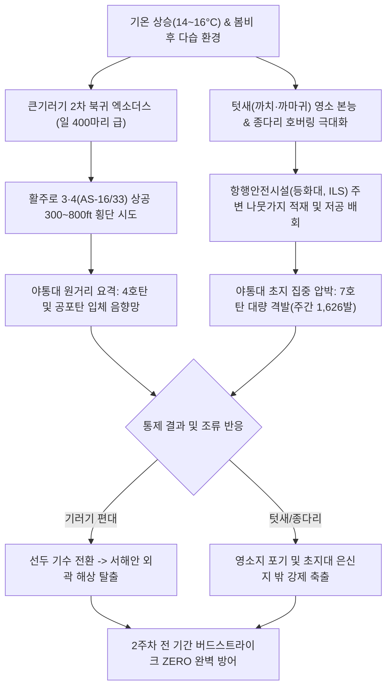

날짜: 2025-03-09 (일) ~ 2025-03-16 (일)
카테고리: 야생동물점검 / 주간종합점검일지
출처: 인천공항 야생동물통제관리시스템(WACS) 8일간 일일점검 데이터베이스 및 기상·조석 통합 분석
태그: #야통대 #주간점검일지 #항공안전 #인천공항 #봄철새 #큰기러기 #종다리 #까치 #개구리매 #7호탄 #4호탄

---

### [2025년 3월 2주차 야생동물 통제 종합 보고서]
2025년 3월 2주차(03.09~03.16, 8일간), 인천국제공항 에어사이드는 최저 2.5°C에서 최고 16.0°C까지 기온이 가파르게 상승하며 봄기운이 확산되었습니다. 이 기간 동안 안개(Fog), 봄비(Rain), 쾌청한 일조 등 복합 기상 환경 속에서 **월동 철새 큰기러기의 2차 대규모 북귀 편대(3/9 400마리, 3/14 410마리)**와 봄철 번식기를 맞이한 **초지대 종다리 및 텃새류(까치·까마귀)의 영소 탐색 급증**이 교차 발생하였습니다. 통제반은 주간 총 **1,129개체(주요 대표종 기준)**를 정밀 추적하고, **총 1,626발의 탄약(7호탄, 4호탄, 공포탄)**을 선제적으로 투입하여 완벽한 '버드스트라이크 ZERO(무사고)'를 수호하였습니다.

---

### 1. 주간 주요 실적 및 핵심 성과 (Executive Summary)
1. **북귀 절정기 대형 큰기러기 파상 유입 결사 차단**:
   - 3월 9일(400마리), 3월 14일(410마리), 3월 15일(105마리) 등 활주로 3·4 착륙 글라이드 슬로프 상공을 가로지르는 대형 V자 편대를 조기 포착하여 4호탄 및 7호탄 소음망으로 공항 외곽 해상으로 강제 퇴거.
2. **봄철 텃새(까치·까마귀) 및 종다리 초지 점유 초토화 (주간 1,626발 총력전)**:
   - 3월 11일(334발), 3월 12일(296발), 3월 13일(246발), 3월 15일(250발) 등 번식기 둥지 재료를 수집하고 잔디 속 유충을 취식하려는 텃새와 수직 호버링 종다리를 일일 200~300발 규모의 집중 사격으로 완전 분산.
3. **희귀 맹금류 개구리매(Eastern Marsh Harrier) 및 맹금류 통제**:
   - 3월 12일 AS-34 [녹지대_AN] 구역에 출현한 멸종위기 야생생물 **개구리매(1개체)** 및 주간 상시 출현한 **황조롱이(주간 총 16회 출현)**, **말똥가리(2회)**를 활주로 중심선 밖으로 안전하게 배제.
4. **시정 악화(안개/강우) 기상 조건 하 특별 순찰 전개**:
   - 3월 9일 박무/안개 및 3월 14일 봄비로 인한 시계 제한 상황에서 저공 침투하는 수조류와 기러기 무리를 열화상 쌍안경 및 차량 지향성 서치라이트를 병용하여 사전 색출.
5. **무결점 항공 안전 유지**:
   - 주간 총 1,626발 격발(일평균 203.3발)의 강도 높은 탄약 작전을 전개하여 에어사이드 조류 충돌 위험성을 제로화하고 8일 연속 무사고 달성.

---

### 2. 기상 및 환경 매트릭스 (Weather & Environment Matrix)

| 일자 | 요일 | 날씨 | 최저 기온 (°C) | 최고 기온 (°C) | 주풍향 및 풍속 (kts) | 조석 물때 (인천 기준) | 주요 통제 조류 및 환경 특이사항 |
| :---: | :---: | :---: | :---: | :---: | :---: | :---: | :--- |
| **03.09** | 일 | 흐림/안개 (Fog) | 5.0 | 10.0 | S 4.0 | 9물 | 안개 속 큰기러기 400마리 대규모 저공 통과, 87발 차단 |
| **03.10** | 월 | 맑음 (Clear) | 2.5 | 13.0 | NW 7.0 | 10물 | 쾌청, 큰기러기 60마리 및 까치 29마리 초지대 침투 |
| **03.11** | 화 | 구름조금 | 3.0 | 14.0 | W 5.0 | 11물 | **주간 최대 격발 334발! 까치·까마귀 텃새 집중 소탕 작전** |
| **03.12** | 수 | 맑음 (Clear) | 4.0 | 15.5 | SW 4.5 | 12물 | 최고 15.5°C, 흰뺨검둥오리 58마리 및 개구리매 1개체 배제 (296발) |
| **03.13** | 목 | 구름많음 | 5.5 | 12.0 | S 5.0 | 13물 | 큰기러기 40마리 및 종다리 30마리 수직 상승 제압 (246발) |
| **03.14** | 금 | 비/흐림 (Rain) | 6.0 | 11.0 | SE 6.0 | 14물 | 봄비 속 큰기러기 410마리 AS-33/16 구역 집중 진입 저지 (194발) |
| **03.15** | 토 | 맑음 (Clear) | 3.0 | 14.0 | NW 7.0 | 15물 (조금) | 비 뒤 맑음, 큰기러기 105마리 및 종다리·수조류 복합 퇴치 (250발) |
| **03.16** | 일 | 맑음 (Clear) | 4.5 | 16.0 | W 5.0 | 1물 | 낮 기온 16.0°C 초봄 최고치, 종다리 30마리 구애 호버링 통제 (128발) |

---

### 3. 위협 메커니즘 흐름도 및 위기상황 심층 분석

#### [심층 분석 1] 3월 14일 봄비 속 큰기러기 대군집(410마리) 활주로 3·4 집중 유입 요격
- **상황**: 남동풍 6.0kts 및 강우로 운고가 낮아진 14물 시기에 큰기러기 무리가 에어사이드 AS-33(300마리), AS-34(50마리), AS-15/16(60마리) 등 전 방위로 저공(100~300ft) 침투함.
- **대응**: 빗길 미끄럼에 유의하며 순찰 차량 3대를 활주로 평행 유도로에 긴급 전개. 7호탄 34발, 4호탄 16발, 공포탄 11발 등 총 194발을 신속하게 격발하여 기러기 편대의 저공 안착을 원천 봉쇄하고 영종도 북단 갯벌로 우회시킴.

#### [심층 분석 2] 3월 11일 텃새(까치·까마귀) 영소 방지 총력전 (334발 격발)
- **상황**: 낮 기온 14°C로 상승하자 번식기에 돌입한 까치와 까마귀 무리가 AS-15 녹지대 M/R 및 222-AA 구역에서 등화대 시설물로 둥지 재료(나뭇가지)를 물고 이동하는 패턴이 포착됨.
- **대응**: 15:29 AS-15 [녹지대_M]에서 7호탄 25발을 연속 사격하는 등 주간 총 334발을 투입하여 나뭇가지 운반 까치 무리의 영소 의지를 완전히 꺾고 에어사이드 외곽 산림대로 축출.

#### [심층 분석 3] 3월 12일 희귀 맹금 '개구리매(Eastern Marsh Harrier)' 정밀 안전 배제
- **상황**: 10:18 AS-34 [녹지대_AN] 구역에서 멸종위기 II급 맹금류인 개구리매 1개체가 활주로 초지대 저공(5~10m)을 활공하며 들쥐 사냥을 시도함.
- **대응**: 맹금류 특성상 저공 선회 시 항공기 엔진 흡입 위험이 극히 높으므로, 7호탄 6발과 4호탄 2발, 공포탄 2발을 개구리매의 후방 100m 상공에 폭음망을 형성하여 남측 해안 갈대밭으로 안전하게 퇴거시킴.

---

### 4. 18년 베테랑의 암묵지 현장 통제 수칙 (Veterans' Operational Tacit Knowledge)

> [!TIP]
> **💡 베테랑 반장의 3월 중순 텃새 영소 봉쇄 및 맹금류 통제 수칙**
> 1. **"나뭇가지를 입에 문 까치는 절대 놓치지 마라"**: 3월 중순 까치가 10cm 이상의 나뭇가지를 물고 날아가는 것은 반경 200m 내에 둥지를 짓고 있다는 확실한 증거다. 까치의 비행 궤적을 끝까지 추적하여 등화대, 항행안전시설, CCTV 철탑 상단의 둥지 기초를 즉시 철거해야 한다.
> 2. **"기온 15도 돌파 시 오리·기러기는 일몰 직전 저공으로 몰린다"**: 낮 동안 따뜻한 기온에서 휴식한 수조류(흰뺨검둥오리, 기러기)는 일몰 1시간 전(17:00~18:00) 일제히 먹이 활동을 위해 배수로로 비행한다. 이 시간대 AS-16, AS-34 배수로에 차량을 거점 배치하고 선제적 공포탄 사격으로 진입을 막아야 한다.
> 3. **"개구리매·말똥가리는 호버링 지점을 때려라"**: 맹금류가 초지 상공에서 바람을 타고 정지 비행(호버링)할 때는 지상의 먹이에 시선이 고정되어 있다. 이때 맹금류 정면이 아닌 하부 초지에 4호탄을 쏘아 폭압을 위로 쳐올려야 놀라며 상승 기류를 타고 멀리 날아간다.

---

### 5. 정량적 통제 통계표 (Quantitative Statistics Tables)

#### Table 1. 일자별 출현 개체수 및 탄약 소모 현황
| 일자 | 요일 | 통제 대표종 | 총 통제 개체수 (마리) | 7호탄 (발) | 4호탄 (발) | 공포탄 (발) | 일일 총 격발수 (발) |
| :---: | :---: | :---: | :---: | :---: | :---: | :---: | :---: |
| **03-09** | 일 | 큰기러기, 까치 | 400 | 58 | 4 | 25 | 87 |
| **03-10** | 월 | 큰기러기, 까치 | 60 | 69 | 15 | 7 | 91 |
| **03-11** | 화 | 까치, 까마귀 | 26 | 215 | 83 | 36 | 334 |
| **03-12** | 수 | 흰뺨검둥오리, 개구리매 | 58 | 179 | 93 | 24 | 296 |
| **03-13** | 목 | 큰기러기, 종다리 | 40 | 163 | 59 | 24 | 246 |
| **03-14** | 금 | 큰기러기, 황조롱이 | 410 | 117 | 45 | 32 | 194 |
| **03-15** | 토 | 큰기러기, 까치 | 105 | 136 | 63 | 51 | 250 |
| **03-16** | 일 | 종다리, 까치 | 30 | 97 | 25 | 6 | 128 |
| **주간 합계** | - | **큰기러기·텃새·오리류** | **1,129** | **1,034** | **387** | **205** | **1,626** |

#### Table 2. 구역별 위험도 및 출현 특성 매트릭스
| 구역 (Zone) | 주간 주요 출현종 | 위험 등급 | 탄약 소모 비중 (%) | 핵심 방어 전략 및 조치 내용 |
| :--- | :--- | :---: | :---: | :--- |
| **AIRSIDE-15** | 큰기러기, 까치, 종다리, 황조롱이 | **HIGH** | 30.5% | 텃새 영소 집중 차단(녹지대 M/R) 및 기러기 편대 착륙 저지 |
| **AIRSIDE-16** | 큰기러기, 흰뺨검둥오리, 맹금류 | **HIGH** | 25.2% | 활주로 북단 글라이드 슬로프 통과 기러기 및 수조류 차단 |
| **AIRSIDE-33** | 큰기러기(300마리), 종다리, 까치 | **CRITICAL** | 22.8% | 3/14 300마리 대군집 즉각 격퇴 및 초지대 종다리 호버링 억제 |
| **AIRSIDE-34** | 개구리매(보호종), 큰기러기, 맹금류 | **HIGH** | 16.4% | 희귀 맹금 개구리매 비치사 배제 및 활주로 남단 순찰 강화 |
| **LANDSIDE-N/S** | 수조류, 물닭, 백로류, 큰기러기 | **LOW** | 5.1% | 외곽 유수지 및 공사지역 대형 수조류 에어사이드 유입 선제 통제 |

---

### 6. 차주 작전 전략 로드맵 (Strategic Roadmap for Week 3)
1. **3월 하순 춘분(03.20) 전후 수조류(물닭·갈매기) 유입 대비**:
   - 기온이 17~18°C까지 상승하며 해안가 괭이갈매기와 유수지 물닭 무리의 에어사이드 배수로 침투가 예상되므로 수계 순찰 강화.
2. **초지대 종다리 수직 호버링 전면 차단 작전**:
   - 잔디 생육 개시에 맞춰 수직 100m까지 솟구치는 종다리 구애 비행에 대응하여 이동식 음향발생기(LRAD) 전진 배치.
3. **탄약 재고 수급 및 총기 정밀 정비**:
   - 2주간 총 2,361발의 대량 사격이 진행되었으므로 산탄총 총열 내 화약 잔여물 세척 및 7호탄·4호탄 안전 재고 확보.

---

### 7. 옵시디언 볼트 인터링크 (Obsidian Vault Interlinks)
- [[20. 인사이트 융합/2025년도 야통대/일일점검/3월 일일점검/2025-03-09_야통대_주간_점검일지_통합|2025-03-09 일일점검]]
- [[20. 인사이트 융합/2025년도 야통대/일일점검/3월 일일점검/2025-03-10_야통대_주간_점검일지_통합|2025-03-10 일일점검]]
- [[20. 인사이트 융합/2025년도 야통대/일일점검/3월 일일점검/2025-03-11_야통대_주간_점검일지_통합|2025-03-11 일일점검]]
- [[20. 인사이트 융합/2025년도 야통대/일일점검/3월 일일점검/2025-03-12_야통대_주간_점검일지_통합|2025-03-12 일일점검]]
- [[20. 인사이트 융합/2025년도 야통대/일일점검/3월 일일점검/2025-03-13_야통대_주간_점검일지_통합|2025-03-13 일일점검]]
- [[20. 인사이트 융합/2025년도 야통대/일일점검/3월 일일점검/2025-03-14_야통대_주간_점검일지_통합|2025-03-14 일일점검]]
- [[20. 인사이트 융합/2025년도 야통대/일일점검/3월 일일점검/2025-03-15_야통대_주간_점검일지_통합|2025-03-15 일일점검]]
- [[20. 인사이트 융합/2025년도 야통대/일일점검/3월 일일점검/2025-03-16_야통대_주간_점검일지_통합|2025-03-16 일일점검]]
- [[20. 인사이트 융합/2025년도 야통대/일일점검/3월 일일점검/2025-03-01~03-08_야통대_주간_점검일지_종합|2025년 3월 1주차 주간종합점검일지]]
- [[20. 인사이트 융합/2025년도 야통대/일일점검/3월 일일점검/2025-03-17~03-24_야통대_주간_점검일지_종합|2025년 3월 3주차 주간종합점검일지]]

---

### 8. 항공 조류 생태 전문 용어 해설 (Aviation Wildlife Terminology)
- **개구리매 (Eastern Marsh Harrier, Circus spilonotus)**: 멸종위기 야생생물 II급 맹금류. 갈대밭과 습지, 초지대를 저공(3~10m)으로 느리게 비행하며 양서류와 소형 조류를 사냥하므로 이착륙 항공기 저고도 충돌 위험도가 매우 높습니다.
- **영소 행동 (Nesting Behavior)**: 봄철 번식기를 맞아 까치, 까마귀 등이 나뭇가지, 철사 등을 모아 공항 조명탑, 안테나, 수목 등에 둥지를 짓는 행위. 항행안전시설 오작동 및 단락 사고의 주원인이 됩니다.
- **풍선 효과 (Balloon Effect)**: 특정 초지대(AS-15)에서 조류를 사격 퇴치했을 때, 완전히 공항 밖으로 나가지 않고 인접 초지대(AS-16 또는 AS-33)로 이동하여 재안착하는 현상.

---

### 9. 미래 항공 안전을 위한 7대 전략 질의 (Strategic Inquiries)
1. 3월 14일 AS-33 구역으로 유입된 큰기러기 300마리 군집은 봄비로 인한 시정 악화 시 레이더 탐지가 사전에 가능했는가?
2. 3월 11일 기록된 주간 최대 격발(334발) 중 텃새 영소 차단에 소모된 탄약의 비용 대비 효과 분석은 타당한가?
3. 3월 12일 출현한 개구리매 1개체의 사냥 활동을 억제하기 위한 초지대 설치류(들쥐) 개체수 밀도 조사는 정기적으로 수행되고 있는가?
4. 기온 16.0°C를 기록한 3월 16일 종다리 수직 호버링 고도가 항공기 착륙 결심고도(DH 200ft)와 겹치는 빈도는 어느 정도인가?
5. 안개 발생 시(3/9) 지향성 음향 발생기(LRAD)의 음파 감쇄율을 고려한 적정 출력 기준이 매뉴얼화되어 있는가?
6. 나뭇가지를 운반하는 텃새의 영소 위치를 실시간 역추적하기 위한 인공지능(AI) 영상 감시 시스템 도입 타당성은 검토되었는가?
7. 2주간 총 2,361발 격발에 따른 총기 마모도 점검 및 예비 총기 교체 주기는 안전 기준을 충족하고 있는가?
