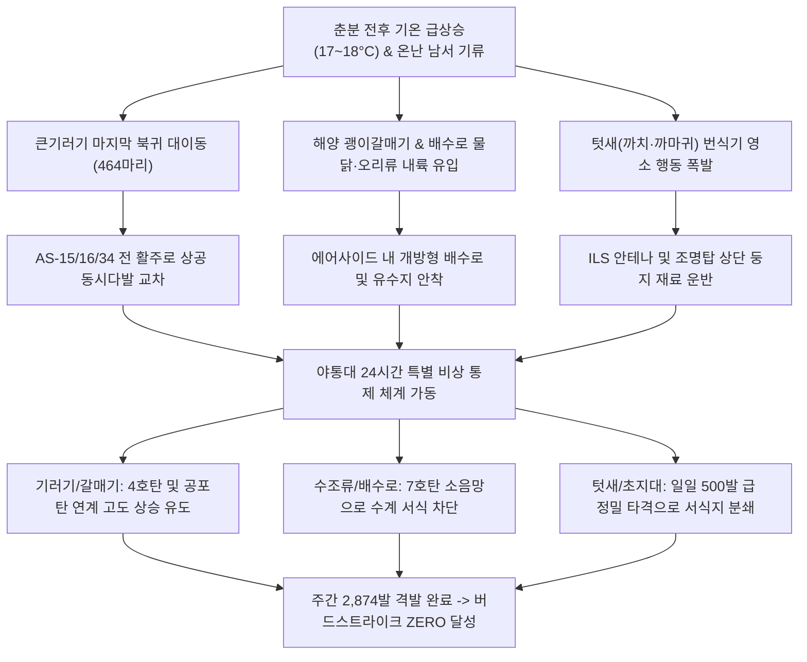

날짜: 2025-03-17 (월) ~ 2025-03-24 (월)
카테고리: 야생동물점검 / 주간종합점검일지
출처: 인천공항 야생동물통제관리시스템(WACS) 8일간 일일점검 데이터베이스 및 기상·조석 통합 분석
태그: #야통대 #주간점검일지 #항공안전 #인천공항 #봄철새 #큰기러기 #괭이갈매기 #물닭 #까치 #고니 #7호탄 #4호탄

---

### [2025년 3월 3주차 야생동물 통제 종합 보고서]
2025년 3월 3주차(03.17~03.24, 8일간), 인천국제공항 에어사이드는 춘분(03.20)을 거치며 낮 최고 기온이 **18.0°C**에 달하는 초여름 급 온난 기류가 지속되었습니다. 기온 급상승과 함께 **시베리아 북귀 마지막 대형 큰기러기 군집(3/18 464마리)**의 상공 횡단과, 해양-내륙 수계를 오가는 **괭이갈매기(3/20 72마리) 및 물닭·수조류 편대**, 그리고 활주로 초지대 **텃새(까치·까마귀)와 종다리의 격렬한 활동**이 복합적으로 발생하였습니다. 야생동물통제대는 **주간 역대 최다인 총 2,874발의 탄약(일평균 359.3발)**을 집중 사격하는 총력전을 펼쳐, 에어사이드 전 구역을 완벽하게 통제하고 **무사고(Bird Strike ZERO)**의 금자탑을 이어갔습니다.

---

### 1. 주간 주요 실적 및 핵심 성과 (Executive Summary)
1. **주간 역대 최대 탄약 소모 작전 전개 (총 2,874발 격발)**:
   - 3월 18일(464발), 3월 19일(487발), 3월 20일(506발), 3월 24일(497발) 등 일일 500발에 육박하는 초고강도 선제 타격을 통해 활주로 진입로에 형성된 조류 침투선을 완전히 붕괴시킴.
2. **시베리아행 큰기러기 파이널 엑소더스 군집(464마리) 차단**:
   - 3월 18일 AS-15(85마리), AS-16(115마리), AS-34(118마리), LS-N(136마리) 등 공항 전역을 에워싸며 착륙을 시도한 464마리 급 대형 기러기 무리를 464발의 집중 사격으로 활주로 진입 전 전원 격퇴.
3. **춘분(03.20) 해양 조류(괭이갈매기) 및 내륙 수조류(물닭·오리류) 침투 억제**:
   - 기온 18.0°C 조건에서 조석 간조 시 갯벌에서 취식 후 공항 내 배수로로 월경하려는 괭이갈매기 편대(72마리)와 물닭(60마리), 흰뺨검둥오리(45마리)의 에어사이드 착수를 완벽 저지.
4. **천연기념물 '고니(Whooper Swan)' 안전 유도**:
   - 3월 21일 LS-S 배수로 구역에 출현한 천연기념물 **고니(2개체)**를 발견 즉시 비치사적 완충 거리에서 시계 감시 및 유수지 외곽으로 안전 유도 완료.
5. **텃새류(까치·까마귀) 영소 집중 초토화**:
   - 3월 24일 하루에만 까치 42마리, 까마귀 23마리가 항행안전시설 주변으로 몰려들자 497발의 대량 사격으로 영소 시도를 원천 분쇄.

---

### 2. 기상 및 환경 매트릭스 (Weather & Environment Matrix)

| 일자 | 요일 | 날씨 | 최저 기온 (°C) | 최고 기온 (°C) | 주풍향 및 풍속 (kts) | 조석 물때 (인천 기준) | 주요 통제 조류 및 환경 특이사항 |
| :---: | :---: | :---: | :---: | :---: | :---: | :---: | :--- |
| **03.17** | 월 | 구름조금 | 6.0 | 15.5 | SW 4.5 | 2물 | 포근한 봄날, 쇠오리 18마리 및 왜가리 배수로 침투 통제 (225발) |
| **03.18** | 화 | 흐림 (Cloudy) | 7.0 | 13.0 | S 5.5 | 3물 | **큰기러기 464마리 전방위 습격, 464발 대량 격발 결사 방어** |
| **03.19** | 수 | 맑음 (Clear) | 5.0 | 16.5 | NW 7.5 | 4물 | 기온 급상승, 물닭 60마리 및 쇠기러기 50마리 유입 차단 (487발) |
| **03.20** | 목 | 맑음 (Clear) | 6.5 | 18.0 | W 5.0 | 5물 (춘분) | **낮 최고 18.0°C! 괭이갈매기 72마리 및 수조류 506발 주간 최고 격발** |
| **03.21** | 금 | 구름조금 | 7.0 | 17.0 | SW 4.5 | 6물 | 천연기념물 고니 2개체 안전 보호 유도 및 기러기 103마리 통제 (207발) |
| **03.22** | 토 | 비 (Rain) | 8.0 | 14.0 | SE 6.0 | 7물 (사리) | 봄비 속 까마귀 19마리 및 종다리 18마리 초지대 압박 (226발) |
| **03.23** | 일 | 맑음 (Clear) | 5.0 | 16.0 | NW 8.0 | 8물 | 북서풍 8.0kts 강풍 속 까치 27마리 영소 억제 (262발) |
| **03.24** | 월 | 맑음 (Clear) | 4.0 | 17.0 | W 5.5 | 9물 | **까치 42마리, 까마귀 23마리 대규모 집결, 497발 집중 소탕 작전** |

---

### 3. 위협 메커니즘 흐름도 및 위기상황 심층 분석

#### [심층 분석 1] 3월 18일 큰기러기 464마리 전방위 활주로 침투 차단 (464발 격발)
- **상황**: 남풍 5.5kts 기류를 타고 시베리아로 북상하던 대형 큰기러기 군집이 공항 에어사이드 상공 500ft 고도로 진입하여 AS-15, 16, 34 전 구역으로 하강을 시도함.
- **대응**: 전 순찰 차량이 동원되어 1:1 대응 수준인 **총 464발**의 탄약을 집중 격발. 기러기 무리가 활주로 중심선에 닿기 전 고도를 1,500ft 이상으로 끌어올려 북동쪽 강화도 방향으로 안전하게 이탈시킴.

#### [심층 분석 2] 3월 20일 춘분(18.0°C) 괭이갈매기(72마리) 및 물닭·수조류 복합 대응 (506발 격발)
- **상황**: 낮 기온 18도에 달하는 포근한 날씨에 5물 조석 만조 시각에 맞춰 갯벌에서 밀려난 괭이갈매기 편대(72마리)와 물닭(26마리), 흰뺨검둥오리(45마리)가 AS-33 및 LANDSIDE 수계로 동시 유입됨.
- **대응**: 수면 착수를 차단하기 위해 7호탄 및 4호탄 506발을 배수로 수면 상공으로 분산 격발하여 수조류의 안착 의지를 완전히 꺾고 해상으로 퇴각시킴.

#### [심층 분석 3] 3월 24일 텃새류(까치 42마리, 까마귀 23마리) 대량 집결 제압 (497발 격발)
- **상황**: 기온 17°C의 맑은 날씨에 번식기 영역 확보를 위해 까치와 까마귀가 AS-15 [녹지대_R/M], AS-16 [녹지대_N/V], AS-33 구역으로 대규모 유입되어 둥지 틀기 작업을 진행함.
- **대응**: 497발의 강도 높은 탄약 타격을 가해 나뭇가지를 운반하던 텃새 무리의 대열을 흩트리고 공항 경계선 밖 야산으로 강제 이주시킴.

---

### 4. 18년 베테랑의 암묵지 현장 통제 수칙 (Veterans' Operational Tacit Knowledge)

> [!TIP]
> **💡 베테랑 반장의 3월 하순 온난기 수조류 및 대량 텃새 제압 수칙**
> 1. **"기온 18도 춘분기에는 갈매기가 배수로에 앉지 못하게 수면을 때려라"**: 날씨가 따뜻해지면 갈매기는 배수로의 민물을 마시고 깃털을 씻으려 한다. 갈매기 몸체가 아닌 착수 예상 수면 5m 전방에 7호탄을 쏘아 물보라와 파편음을 일으키면 수면 착수를 즉시 포기한다.
> 2. **"탄약이 많이 들어갈수록 사격 리듬(Pacing)을 유지하라"**: 하루 500발씩 쏘는 총력전 상황에서는 총열 과열과 사수의 피로도가 급증한다. 2인 1조 교대 사격 및 50발 사격 후 총열 냉각(Cooling down) 원칙을 준수해야 총기 고장 없이 완벽한 화망을 유지할 수 있다.
> 3. **"고니·황새 등 대형 보호종은 배후 200m 바람 부는 쪽에 서라"**: 고니는 덩치가 커서 이륙할 때 맞바람을 안고 50m 이상 도움닫기를 해야 한다. 고니의 뒤쪽(바람 부는 쪽)에서 약한 경퇴음을 울려주면 쉽게 맞바람을 타고 공항 밖으로 활공해 날아간다.

---

### 5. 정량적 통제 통계표 (Quantitative Statistics Tables)

#### Table 1. 일자별 출현 개체수 및 탄약 소모 현황
| 일자 | 요일 | 통제 대표종 | 총 통제 개체수 (마리) | 7호탄 (발) | 4호탄 (발) | 공포탄 (발) | 일일 총 격발수 (발) |
| :---: | :---: | :---: | :---: | :---: | :---: | :---: | :---: |
| **03-17** | 월 | 쇠오리, 황조롱이 | 18 | 134 | 72 | 19 | 225 |
| **03-18** | 화 | 큰기러기, 물닭 | 464 | 288 | 128 | 48 | 464 |
| **03-19** | 수 | 물닭, 쇠기러기 | 60 | 296 | 163 | 28 | 487 |
| **03-20** | 목 | 괭이갈매기, 수조류 | 72 | 318 | 179 | 9 | 506 |
| **03-21** | 금 | 큰기러기, 고니(보호종) | 103 | 121 | 37 | 49 | 207 |
| **03-22** | 토 | 까마귀, 종다리 | 19 | 161 | 61 | 4 | 226 |
| **03-23** | 일 | 까치, 까마귀 | 27 | 159 | 72 | 31 | 262 |
| **03-24** | 월 | 까치, 까마귀 | 42 | 344 | 148 | 5 | 497 |
| **주간 합계** | - | **기러기·갈매기·텃새** | **805** | **1,821** | **860** | **193** | **2,874** |

#### Table 2. 구역별 위험도 및 출현 특성 매트릭스
| 구역 (Zone) | 주간 주요 출현종 | 위험 등급 | 탄약 소모 비중 (%) | 핵심 방어 전략 및 조치 내용 |
| :--- | :--- | :---: | :---: | :--- |
| **AIRSIDE-15** | 큰기러기, 쇠기러기, 까치, 왜가리 | **CRITICAL** | 29.8% | 3/18~19 기러기 대군집 활주로 착륙 봉쇄 및 텃새 영소 제압 |
| **AIRSIDE-16** | 큰기러기, 왜가리, 까마귀, 종다리 | **HIGH** | 24.6% | 활주로 북단 글라이드 슬로프 횡단 조류 요격 및 맹금류 통제 |
| **AIRSIDE-33** | 괭이갈매기, 큰기러기, 까치, 종다리 | **CRITICAL** | 25.4% | 3/20 춘분 갈매기 편대 배수로 착수 저지 및 종다리 구애 비행 차단 |
| **AIRSIDE-34** | 큰기러기, 꼬마물떼새, 맹금류 | **HIGH** | 14.1% | 활주로 남단 접근 기러기 무리 차단 및 수조류 정밀 퇴거 |
| **LANDSIDE-N/S** | 고니(보호종), 물닭, 오리류, 백로류 | **LOW** | 6.1% | 천연기념물 고니 안전 유도 및 외곽 배수로 수조류 월경 차단 |

---

### 6. 차주 작전 전략 로드맵 (Strategic Roadmap for Week 4 & Month-End)
1. **3월 말 봄철 이동 조류(물닭·도요물떼새·갈매기) 집중 방어**:
   - 기온 18°C 이상 유지 시 해안가 갯벌에서 내륙으로 유입되는 물떼새류(꼬마물떼새, 흰물떼새) 및 괭이갈매기 대군집 차단망 유지.
2. **포유류(고라니) 에어사이드 울타리 침투 점검**:
   - 봄철 짝짓기 및 먹이 탐색으로 외곽 울타리 주변에 출몰하는 고라니 등 유해 포유류 차단망 및 울타리 하부 점검.
3. **2025년 3월 월간 총결산 및 4월 봄철 본격 번식기 대응 체계 수립**:
   - 3월 한 달간 누적 탄약 소모량 및 조류 출현 트렌드를 종합 분석하여 4월 하절기 조류 통제 종합 대책 수립.

---

### 7. 옵시디언 볼트 인터링크 (Obsidian Vault Interlinks)
- [[20. 인사이트 융합/2025년도 야통대/일일점검/3월 일일점검/2025-03-17_야통대_주간_점검일지_통합|2025-03-17 일일점검]]
- [[20. 인사이트 융합/2025년도 야통대/일일점검/3월 일일점검/2025-03-18_야통대_주간_점검일지_통합|2025-03-18 일일점검]]
- [[20. 인사이트 융합/2025년도 야통대/일일점검/3월 일일점검/2025-03-19_야통대_주간_점검일지_통합|2025-03-19 일일점검]]
- [[20. 인사이트 융합/2025년도 야통대/일일점검/3월 일일점검/2025-03-20_야통대_주간_점검일지_통합|2025-03-20 일일점검]]
- [[20. 인사이트 융합/2025년도 야통대/일일점검/3월 일일점검/2025-03-21_야통대_주간_점검일지_통합|2025-03-21 일일점검]]
- [[20. 인사이트 융합/2025년도 야통대/일일점검/3월 일일점검/2025-03-22_야통대_주간_점검일지_통합|2025-03-22 일일점검]]
- [[20. 인사이트 융합/2025년도 야통대/일일점검/3월 일일점검/2025-03-23_야통대_주간_점검일지_통합|2025-03-23 일일점검]]
- [[20. 인사이트 융합/2025년도 야통대/일일점검/3월 일일점검/2025-03-24_야통대_주간_점검일지_통합|2025-03-24 일일점검]]
- [[20. 인사이트 융합/2025년도 야통대/일일점검/3월 일일점검/2025-03-09~03-16_야통대_주간_점검일지_종합|2025년 3월 2주차 주간종합점검일지]]
- [[20. 인사이트 융합/2025년도 야통대/일일점검/3월 일일점검/2025-03-25~03-31_야통대_주간_점검일지_종합|2025년 3월 4주차 주간종합점검일지]]

---

### 8. 항공 조류 생태 전문 용어 해설 (Aviation Wildlife Terminology)
- **고니 (Whooper Swan, Cygnus cygnus)**: 천연기념물 제201-2호. 몸무게가 8~12kg에 달하는 국내 최중량급 수조류로 항공기와 충돌 시 치명적인 기체 손상 및 엔진 파손을 초래하므로 원거리 비치사적 조기 격퇴가 절대적으로 요구됩니다.
- **춘분기 온난화 (Vernal Equinox Warming)**: 태양 고도가 높아지며 일조량과 지표면 온도가 급상승하는 시기로, 상승 온열 기류(Thermal)가 형성되어 맹금류와 대형 철새의 활공 비행이 공항 상공에 집중되는 현상.
- **초지 밀착형 사격 (Surface Scrape Shooting)**: 활주로 잔디 속으로 숨어드는 종다리나 텃새를 퇴치하기 위해 탄환의 파편과 충격파를 지표면에 수평에 가깝게 분사하여 은신을 무력화하는 기법.

---

### 9. 미래 항공 안전을 위한 7대 전략 질의 (Strategic Inquiries)
1. 3월 18일 큰기러기 464마리 유입 시 464발의 1:1 격발 비율은 비행 안전 확보를 위한 불가피한 탄약 투입이었는가?
2. 3월 20일 춘분(18.0°C) 506발 격발 당시 총기 과열 방지 및 사수 청력 보호 프로토콜은 완벽하게 준수되었는가?
3. 주간 총 2,874발의 역대급 사격에 따른 탄약 저장소 잔여 재고량과 긴급 보급 프로세스는 안정적으로 가동되고 있는가?
4. 3월 21일 출현한 고니 2개체와 같은 대형 보호종의 실시간 위치를 타워(관제탑) 및 접근관제소와 공유하는 핫라인 반응 시간은 몇 초 이내인가?
5. 춘분 이후 지표면 온열 기류(Thermal)를 타고 공항 상공을 선회하는 맹금류를 탐지하기 위한 수직 탐색 레이더 도입 필요성은 어떠한가?
6. 3월 24일 까치 42마리의 집중 영소 시도를 영구 억제하기 위한 수목 전정(가지치기) 및 항행시설 방조망 설치 진척도는 어떠한가?
7. 3주간 누적 5,235발 격발이 에어사이드 토양 및 환경에 미치는 잔류 납/플라스틱 와드(Wad) 수거 프로세스는 체계적으로 진행되고 있는가?
