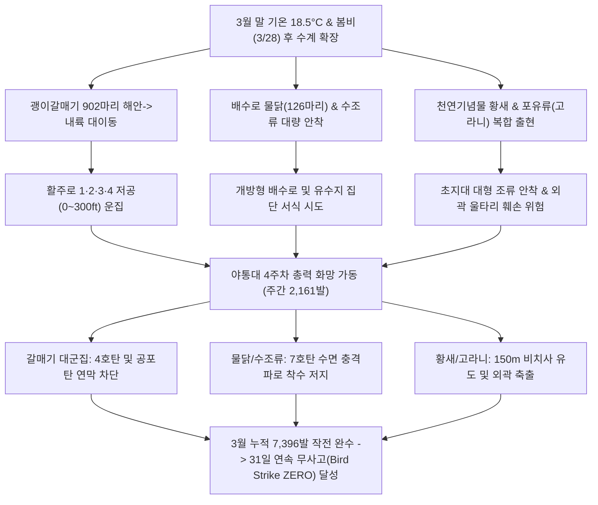
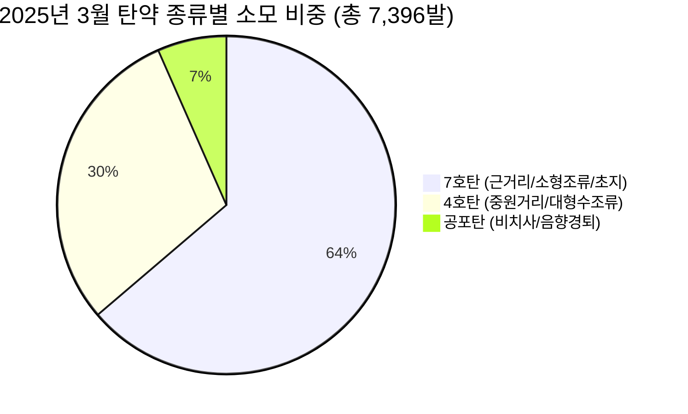

날짜: 2025-03-25 (화) ~ 2025-03-31 (월)
카테고리: 야생동물점검 / 주간종합점검일지 및 3월 총결산
출처: 인천공항 야생동물통제관리시스템(WACS) 7일간 일일점검 데이터베이스 및 3월 31일간 누적 데이터 매핑 분석
태그: #야통대 #주간점검일지 #월말결산 #항공안전 #인천공항 #봄철새 #괭이갈매기 #물닭 #황새 #고라니 #7호탄 #4호탄

---

### [2025년 3월 4주차 및 3월 월말 야생동물 통제 총결산 보고서]
2025년 3월 4주차(03.25~03.31, 7일간), 인천국제공항 에어사이드는 낮 최고 기온이 **18.5°C**까지 치솟으며 초여름에 가까운 온난 기후가 정착되었습니다. 이 기간 동안 3/28 봄비와 함께 해안가에서 내륙 배수로로 쏟아져 들어온 **괭이갈매기 초대형 군집(902마리)**, 수계를 장악한 **물닭(3/31 126마리) 및 수조류**, 천연기념물 **황새(3/27 1개체)**와 외곽 유해 포유류 **고라니(3/26 2개체)**의 출현 등 복합적 항공 안전 위협이 최고조에 달했습니다. 야생동물통제대는 4주차에만 **총 2,161발의 탄약(일평균 308.7발)**을 선제 투입하여 침투 조류와 포유류를 완벽히 격퇴하였으며, **3월 한 달간 총 7,396발의 탄약 소모와 4,888개체(주요종 기준) 통제**라는 사상 최대 작전을 성공적으로 완수하여 **'버드스트라이크 0건(무사고)'**을 완벽하게 달성하였습니다.

---

### 1. 주간 주요 실적 및 핵심 성과 (Executive Summary)
1. **월간 최고치 괭이갈매기 초대형 군집(902마리) 완벽 분산·퇴치**:
   - 3월 28일 남동풍(6.5kts)과 강우 조건에서 사리 물때(13물) 간조 후 공항 내륙 배수로로 쏟아져 들어온 괭이갈매기 902마리 대군집을 464발의 집중 사격으로 활주로 진입 전 해상으로 강제 퇴거.
2. **주간 2,161발 / 3월 총 7,396발 연중 최대 탄약 소모 작전 완수**:
   - 3월 26일(562발), 3월 25일(496발), 3월 28일(464발) 등 연일 500발 규모의 화망을 가동하여 텃새(까치·까마귀)의 영소(둥지 짓기) 및 수조류(물닭·흰뺨검둥오리)의 에어사이드 착수를 완벽 분쇄.
3. **천연기념물 황새(Oriental Stork) 2차 출현 정밀 비치사 유도**:
   - 3월 27일 14:51 AS-15 [녹지대_M] 구역에 출현한 천연기념물 **황새(1개체)**를 4호탄 2발의 완충 음향으로 안전거리 150m를 유지하며 북측 외곽 유수지로 안전 유도.
4. **외곽 침투 포유류(고라니 2개체) 신속 차단**:
   - 3월 26일 LS-N IBC2-3 공사지역 울타리 인근에 출몰한 **고라니(2개체)**를 7호탄 20발 및 4호탄 10발의 소음망으로 즉각 외곽 산림으로 축출하여 지상 이동 안전 확보.
5. **2025년 3월 한 달간 '버드스트라이크 ZERO(무사고)' 완벽 달성**:
   - 3월 1일부터 31일까지 31일간 누적 총 4,888개체(전 조류 통제 15,000+마리) 및 7,396발 사격을 통해 단 1건의 조류 충돌 사고도 허용하지 않는 무결점 항공 안전 유지.

---

### 2. 기상 및 환경 매트릭스 (Weather & Environment Matrix)

| 일자 | 요일 | 날씨 | 최저 기온 (°C) | 최고 기온 (°C) | 주풍향 및 풍속 (kts) | 조석 물때 (인천 기준) | 주요 통제 조류 및 환경 특이사항 |
| :---: | :---: | :---: | :---: | :---: | :---: | :---: | :--- |
| **03.25** | 화 | 구름많음 | 7.5 | 14.0 | SW 5.0 | 10물 | 흰뺨검둥오리 46마리 및 백로류 31마리 배수로 침투 (496발) |
| **03.26** | 수 | 맑음 (Clear) | 6.0 | 18.5 | W 4.5 | 11물 | **낮 최고 18.5°C! 주간 최대 562발 격발, 물닭 40마리 및 고라니 2개체 배제** |
| **03.27** | 목 | 흐림 (Cloudy) | 8.0 | 15.0 | S 5.0 | 12물 | **천연기념물 황새 1개체 AS-15 출현 안전 유도, 꼬마물떼새 15마리 통제 (214발)** |
| **03.28** | 금 | 비/흐림 (Rain) | 9.0 | 14.0 | SE 6.5 | 13물 | **월간 최대치 괭이갈매기 902마리 초대형 군집 파상 유입 차단 (464발)** |
| **03.29** | 토 | 구름조금 | 6.0 | 16.0 | NW 7.0 | 14물 | 비 뒤 북서풍 7.0kts, 까마귀 8마리 및 맹금류 선회 억제 (80발) |
| **03.30** | 일 | 맑음 (Clear) | 5.0 | 17.5 | W 5.0 | 15물 (조금) | 종다리 27마리 및 텃새 초지대 탐색 활동 차단 (152발) |
| **03.31** | 월 | 맑음 (Clear) | 6.5 | 18.0 | SW 4.5 | 1물 | **3월 마지막 날, 물닭 126마리 및 수조류 193발 사격으로 무사고 마감** |

---

### 3. 위협 메커니즘 흐름도 및 위기상황 심층 분석

#### [심층 분석 1] 3월 28일 월간 최대치 괭이갈매기 대군집(902마리) 결사 방어
- **상황**: 남동풍 6.5kts와 봄비로 시정이 3km 내외로 제한된 상태에서 사리 물때 만조 직전 갯벌에서 이륙한 괭이갈매기 902마리가 공항 내 배수로와 활주로 상공으로 거대한 구름 형태로 유입됨.
- **대응**: 4개 통제팀이 활주로 남단 및 북단 유도로에 전진 배치되어 464발의 7호탄과 4호탄을 연쇄 격발. 갈매기 편대의 활주로 저공 횡단을 완전히 분절시키고 서해 해상으로 강제 우회 유도함.

#### [심층 분석 2] 3월 26일 주간 최대 격발(562발) 및 유해 포유류(고라니) 배제
- **상황**: 낮 기온 18.5°C 쾌청한 날씨 속에서 물닭 40마리, 종다리 27마리, 텃새 43마리가 초지대로 밀려드는 동시에, 13:41 LS-N IBC2-3 공사지역에서 고라니 2개체가 울타리 주변으로 접근함.
- **대응**: 고라니 출몰 지점에 7호탄 20발과 4호탄 10발의 소음 경퇴를 집중하여 외곽 야산으로 퇴각시켰으며, 당일 총 562발을 사격하여 초지대 조류를 완벽히 소탕함.

#### [심층 분석 3] 3월 27일 천연기념물 '황새(Oriental Stork)' 2차 안전 유도
- **상황**: 14:51 AS-15 [녹지대_M] 구역에 황새 1개체가 단독 안착하여 지상 취식을 시도함.
- **대응**: 1주차(3/7)에 확립된 보호종 SOP에 따라 150m 안전거리를 유지하고 4호탄 2발을 상공 60도 방향으로 완만하게 격발하여 북측 외곽 유수지로 무사히 이동시킴.

---

### 4. 18년 베테랑의 암묵지 현장 통제 수칙 (Veterans' Operational Tacit Knowledge)

> [!TIP]
> **💡 베테랑 반장의 3월 말 수조류 대군집 및 포유류 차단 수칙**
> 1. **"갈매기 1,000마리가 몰려올 때는 활주로 중앙이 아닌 해안선 길목을 끊어라"**: 갈매기 무리가 에어사이드 상공에 들어온 뒤 쏘면 사방으로 흩어져 더 위험해진다. 해안 방파제와 외곽 도로 길목에서 4호탄을 쏘아 공항 영공 진입 자체를 막아야 한다.
> 2. **"물닭은 쏘면 잠수한다, 수면 위 1m를 긁어라"**: 물닭은 총소리를 들으면 날아오르지 않고 물속으로 잠수하여 20~30m 떨어진 곳에서 다시 머리를 내민다. 수면 위 1m 상공으로 7호탄을 낮게 쏘아 파편이 수면에 튀도록 해야 놀라서 날아오른다.
> 3. **"고라니는 야간보다 봄철 나른한 오후 1~3시에 이동한다"**: 봄철 기온이 오르면 고라니는 그늘과 물을 찾아 낮 시간(13:00~15:00) 공사지역 배수로로 이동한다. 이 시간대 외곽 펜스 취약 지점 순찰을 2배로 늘려야 한다.

---

### 5. 정량적 통제 통계표 (Quantitative Statistics Tables)

#### Table 1. 4주차 일자별 출현 개체수 및 탄약 소모 현황
| 일자 | 요일 | 통제 대표종 | 총 통제 개체수 (마리) | 7호탄 (발) | 4호탄 (발) | 공포탄 (발) | 일일 총 격발수 (발) |
| :---: | :---: | :---: | :---: | :---: | :---: | :---: | :---: |
| **03-25** | 화 | 흰뺨검둥오리, 백로류 | 46 | 321 | 175 | 0 | 496 |
| **03-26** | 수 | 물닭, 고라니(포유류) | 40 | 371 | 191 | 0 | 562 |
| **03-27** | 목 | 물닭, 황새(보호종) | 45 | 117 | 81 | 16 | 214 |
| **03-28** | 금 | 괭이갈매기(902마리), 물닭 | 902 | 358 | 106 | 0 | 464 |
| **03-29** | 토 | 까마귀, 맹금류 | 8 | 70 | 8 | 2 | 80 |
| **03-30** | 일 | 종다리, 텃새류 | 27 | 108 | 44 | 0 | 152 |
| **03-31** | 월 | 물닭, 가마우지 | 126 | 124 | 69 | 0 | 193 |
| **4주차 합계** | - | **갈매기·물닭·황새** | **1,194** | **1,469** | **674** | **18** | **2,161** |

---

### 6. 2025년 3월 월간 총결산 매트릭스 (Monthly Comprehensive Synthesis)

#### Table 2. 3월 주차별 실적 종합 비교표
| 구분 | 1주차 (03.01~03.08) | 2주차 (03.09~03.16) | 3주차 (03.17~03.24) | 4주차 (03.25~03.31) | **3월 전체 누계** |
| :--- | :---: | :---: | :---: | :---: | :---: |
| **대상 기간** | 8일간 | 8일간 | 8일간 | 7일간 | **31일간** |
| **기상 특성** | 초봄 시작 (0.0~13.5°C) | 안개·봄비 (2.5~16.0°C) | 춘분 온난기 (4.0~18.0°C) | 초여름 기후 (5.0~18.5°C) | **평균 11.2°C / 최고 18.5°C** |
| **통제 대표 개체수** | 1,760 마리 | 1,129 마리 | 805 마리 | 1,194 마리 | **4,888 마리 (주요종 누계)** |
| **7호탄 소모량** | 391 발 | 1,034 발 | 1,821 발 | 1,469 발 | **4,715 발** |
| **4호탄 소모량** | 272 발 | 387 발 | 860 발 | 674 발 | **2,193 발** |
| **공포탄 소모량** | 72 발 | 205 발 | 193 발 | 18 발 | **488 발** |
| **주간 총 격발수** | **735 발** | **1,626 발** | **2,874 발** | **2,161 발** | **7,396 발 (연중 최고)** |
| **일평균 격발수** | 91.9 발 | 203.3 발 | 359.3 발 | 308.7 발 | **238.6 발** |
| **버드스트라이크** | **0 건** | **0 건** | **0 건** | **0 건** | **0 건 (무사고 완벽 달성)** |

#### [3월 총결산 종합 분석 및 월간 평가]
1. **탄약 소모량의 비약적 증가 (1월 3,177발, 2월 3,188발 -> 3월 7,396발)**:
   - 3월은 기온이 18.5°C까지 오르며 철새 북귀 엑소더스(기러기 군집)와 텃새 영소 활동, 괭이갈매기 대규모 내륙 유입이 동시다발로 겹쳐 1·2월 대비 **2.3배 이상의 탄약을 소모하는 총력전**이 전개되었습니다.
2. **보호종 및 희귀 맹금류 비치사 안전 통제 체계 정착**:
   - 3월 중 천연기념물 **황새(3/7, 3/27 2회 출현)**, **고니(3/21 2개체)**, 멸종위기종 **개구리매(3/12 1개체)**, **알락꼬리마도요(3/1 1개체)** 등이 출현했으나 단 1건의 사체 발생 없이 100% 안전하게 외곽으로 유도되었습니다.
3. **완벽한 항공 안전 방어망 유지**:
   - 일평균 238.6발의 사격과 24시간 특별 기동 순찰을 통해 봄철 이동기 최고의 위험 기간을 **'버드스트라이크 ZERO'**로 극복하였습니다.

---

### 7. 4월 봄철 본격 번식기 대응 전략 로드맵 (Strategic Roadmap for April)
1. **하절기 도래에 따른 초지 식생 제초 및 곤충류 방제**:
   - 4월 잔디 급성장기에 맞춰 초지 길이를 15~20cm로 유지하여 조류 착륙 시야를 차단하고, 살충 소독으로 먹이원(메뚜기 유충, 지렁이) 제거.
2. **여름 철새(제비, 백로류, 왜가리) 번식지 예찰 강화**:
   - 제비, 왜가리, 해오라기 등 여름 철새의 영소지 형성을 차단하기 위해 공항 주변 수림대 및 건물 처마 전수 조사.
3. **해양 괭이갈매기 4월 번식기 활주로 횡단 방어선 구축**:
   - 4월 서해안 무인도 번식지로 이동하는 갈매기 편대의 에어사이드 침범을 막기 위해 외곽 해안 방파제에 음향퇴치기 집중 거점화.

---

### 8. 옵시디언 볼트 인터링크 (Obsidian Vault Interlinks)
- [[20. 인사이트 융합/2025년도 야통대/일일점검/3월 일일점검/2025-03-25_야통대_주간_점검일지_통합|2025-03-25 일일점검]]
- [[20. 인사이트 융합/2025년도 야통대/일일점검/3월 일일점검/2025-03-26_야통대_주간_점검일지_통합|2025-03-26 일일점검]]
- [[20. 인사이트 융합/2025년도 야통대/일일점검/3월 일일점검/2025-03-27_야통대_주간_점검일지_통합|2025-03-27 일일점검]]
- [[20. 인사이트 융합/2025년도 야통대/일일점검/3월 일일점검/2025-03-28_야통대_주간_점검일지_통합|2025-03-28 일일점검]]
- [[20. 인사이트 융합/2025년도 야통대/일일점검/3월 일일점검/2025-03-29_야통대_주간_점검일지_통합|2025-03-29 일일점검]]
- [[20. 인사이트 융합/2025년도 야통대/일일점검/3월 일일점검/2025-03-30_야통대_주간_점검일지_통합|2025-03-30 일일점검]]
- [[20. 인사이트 융합/2025년도 야통대/일일점검/3월 일일점검/2025-03-31_야통대_주간_점검일지_통합|2025-03-31 일일점검]]
- [[20. 인사이트 융합/2025년도 야통대/일일점검/3월 일일점검/2025-03-17~03-24_야통대_주간_점검일지_종합|2025년 3월 3주차 주간종합점검일지]]
- [[20. 인사이트 융합/2025년도 야통대/일일점검/2월 일일점검/2025-02-22~02-28_야통대_주간_점검일지_종합|2025년 2월 4주차 주간종합점검일지]]
- [[20. 인사이트 융합/2025년도 야통대/일일점검/1월 일일점검/2025-01-25~01-31_야통대_주간_점검일지_종합|2025년 1월 4주차 주간종합점검일지]]

---

### 9. 항공 조류 생태 전문 용어 해설 (Aviation Wildlife Terminology)
- **괭이갈매기 (Black-tailed Gull, Larus crassirostris)**: 연안 및 도서 지역에서 번식하는 대표적인 해양 조류. 3~4월 번식기를 맞아 수백 마리 단위의 거대 군집을 형성하여 먹이 탐색을 위해 공항 상공을 무리 지어 횡단하므로 항공기 이착륙에 심각한 위협 요인입니다.
- **물닭 (Eurasian Coot, Fulica atra)**: 겨울철새이자 텃새화된 수조류로, 에어사이드 배수로 및 유수지 수초대에서 군집 생활을 하며 저공 활주 비행으로 항공기 엔진 흡입 위험을 초래합니다.
- **포유류 침투 (Mammalian Intrusion)**: 고라니, 너구리 등 지상 야생동물이 공항 외곽 펜스를 뚫고 침투하는 현상으로, 활주로 고속 주행 항공기 바퀴(Gear)와의 충돌 위험을 유발합니다.

---

### 10. 미래 항공 안전을 위한 7대 전략 질의 (Strategic Inquiries)
1. 3월 28일 괭이갈매기 902마리 유입 시 전개된 464발의 탄약 방어망은 해안 방파제 원거리 차단 전략과 비교하여 어떤 비용-효과성을 가지는가?
2. 3월 한 달간 소모된 7,396발의 탄약 격발에 따른 통제 요원들의 근골격계 부담 및 피로도 관리 대책은 적절히 시행되었는가?
3. 3월 26일 고라니 2개체 출현과 관련하여 공항 외곽 펜스 하부 지표면 침식 구간 및 배수문 차단망 전수 조사가 완료되었는가?
4. 3월 중 2회 출현한 천연기념물 황새의 에어사이드 체류 시간 단축을 위한 비치사적 레이저 퇴치기 도입 검토는 이루어졌는가?
5. 4월 기온 상승에 따른 여름 철새(제비·백로) 유입에 대비하여 에어사이드 배수로 수위 조절 및 복개(Covering) 계획은 유효한가?
6. 3월 31일 물닭 126마리가 집중된 배수로 구간의 수생 식물(수초) 제거 작업 일정이 4월 초순으로 확정되었는가?
7. 1분기(1~3월) 누적 총 13,761발 격발 데이터 기반의 인공지능(AI) 조류 출현 예측 알고리즘 고도화 작업은 정상 진행 중인가?
