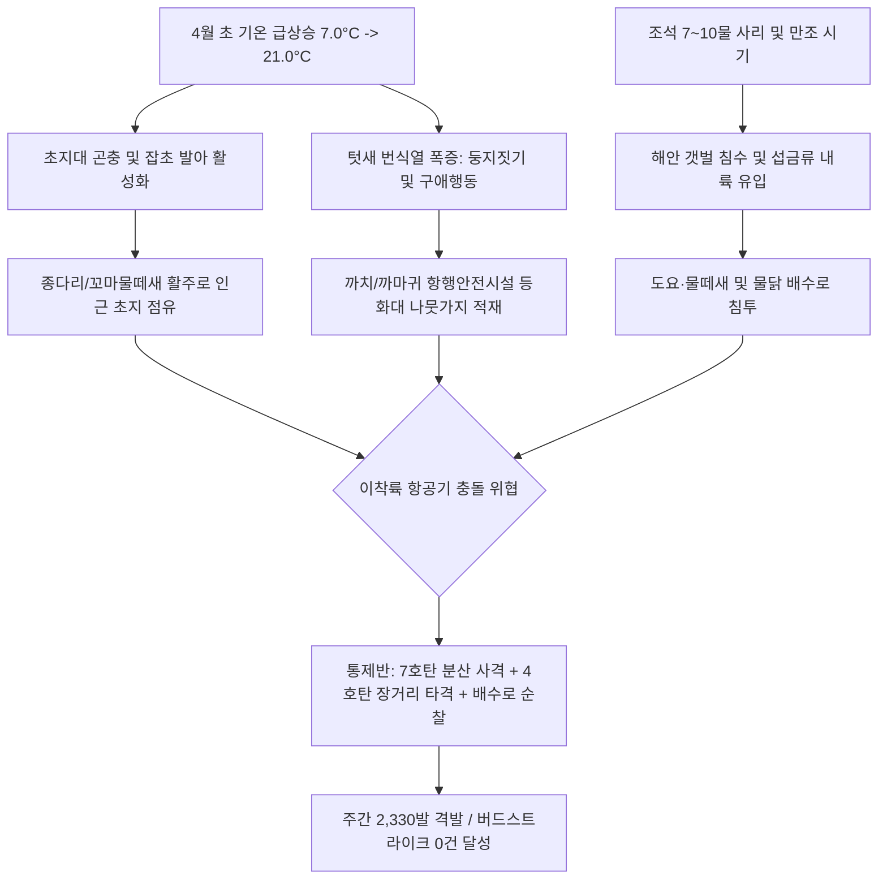

날짜: 2025-04-01 ~ 2025-04-08
카테고리: 야생동물점검 / 주간점검종합
출처: 2025년 4월 1일~8일 일일점검 데이터베이스 및 기상·조석 통합 분석
태그: #야통대 #주간점검 #항공안전 #인천공항 #4월1주차 #봄철번식기 #까치 #종다리 #물닭 #고라니

---

### [2025년 4월 1주차 야생조수류 통제 종합 보고서]
2025년 4월 1일(화)부터 4월 8일(화)까지 8일간 인천공항 에어사이드 및 랜드사이드 일대에서 수행된 야생동물 통제 작전을 종합 분석한 결과, 주간 기온이 **최저 7.0°C에서 최고 21.0°C**까지 가파르게 상승하며 완연한 봄철 기조로 전환되었습니다. 이 기간 동안 총 **816개체**의 야생조수류가 관측·식별되었으며, 통제반은 총 **2,330발**(일평균 291.3발)의 적극적인 실탄 사격을 통해 활주로 진입을 원천 차단하여 **'버드스트라이크 0건'**의 무사고 항공 안전을 달성하였습니다.

---

### [Executive Summary : 4월 1주차 핵심 통제 성과]
1. **봄철 기온 급상승(21.0°C)에 따른 텃새(까치·종다리) 번식 활동 폭증**:
   - 4월 첫 주 동안 낮 최고 기온이 16.0°C에서 21.0°C로 급상승하면서 까치(주간 누적 166개체)와 종다리(주간 누적 90개체)가 활주로 주변 초지대 및 항행안전시설 구조물로 집중 유입되었습니다.
   - 통제반은 둥지 조성(영소)을 위한 나뭇가지 운반 행동과 수직 호버링 구애 비행을 차단하기 위해 7호탄 중심의 집중 경퇴 사격을 전개하였습니다.
2. **배수로 및 유수지 수조류(물닭·흰뺨검둥오리) 내륙 침투 방어**:
   - 4월 2일~4일 동안 남측 배수로 및 IBC1-1 공사지역을 중심으로 물닭(주간 누적 138개체)과 흰뺨검둥오리(주간 누적 89개체) 군집이 형성되었습니다.
   - 수면 착수 후 활주로 횡단 비행으로 이어지는 위험을 방지하기 위해 4호탄 및 7호탄 복합 타격을 통해 외곽 해안선으로 퇴거시켰습니다.
3. **고위험 조류 및 포유류(고라니) 침투 차단**:
   - 4월 8일 LS-N IBC2-3 공사지역에서 기온 상승 시 그늘을 찾아 이동하는 **고라니(1개체)**가 출현하여 40발의 집중 사격으로 외곽 안전지대로 즉각 퇴거 조치하였습니다.
   - 4월 3일 AS-33에서 잔류 **큰기러기 5개체**, 4월 7일 AS-33에서 **말똥가리 1개체**, 4월 5일 AS-34에서 **붉은어깨도요 10개체**를 안전하게 유도 및 차단하였습니다.
4. **4월 8일 10물 시기 최고 격발 기록(697발)**:
   - 기온이 21.0°C까지 치솟고 10물 조석으로 갯벌 취식지가 축소되자 에어사이드로 조류가 대거 밀려들어, 8일 하루에만 697발을 격발하며 주간 최고 수준의 방어전을 완수하였습니다.

---

### [Weather & Environment Matrix : 기상-조석-생태 상관관계]

```
[4월 1주차 기상 환경 매트릭스]
+------------+-------------+-----------------+-------------+-------------+-----------------------+
|    일자    |  날씨/기상  | 기온(최저/최고) | 풍향 / 풍속 |  조석(물때) |   주요 출현/통제 종   |
+------------+-------------+-----------------+-------------+-------------+-----------------------+
| 04-01 (화) |  맑음(Clear)|   7.0 / 16.0°C  | NW / 6.5kts |     3물     | 까치(37), 종다리(10)  |
| 04-02 (수) | 구름조금    |   7.5 / 17.0°C  |  W / 5.0kts |     4물     | 물닭(32), 까치(19)    |
| 04-03 (목) |  흐림       |   8.0 / 15.5°C  |  S / 4.5kts |     5물     | 물닭(53), 흰뺨오리(44)|
| 04-04 (금) |  봄비(Rain) |   9.5 / 14.0°C  | SE / 7.0kts |     6물     | 물닭(35), 까마귀(12)  |
| 04-05 (토) |  맑음       |   8.0 / 18.0°C  | NW / 7.5kts |  7물(사리)  | 종다리(28), 붉은어깨도|
| 04-06 (일) |  맑음       |   7.5 / 19.0°C  |  W / 5.5kts |     8물     | 종다리(30), 도요류(20)|
| 04-07 (월) | 구름조금    |   8.5 / 20.0°C  | SW / 5.0kts |     9물     | 까치(23), 까마귀(12)  |
| 04-08 (화) |  맑음       |   9.0 / 21.0°C  | SW / 4.5kts |    10물     | 까치(31), 고라니(1)   |
+------------+-------------+-----------------+-------------+-------------+-----------------------+
```

---

### [Threat Flow Diagram : 4월 초순 위협 전개 메커니즘]



---

### [Veterans' Operational Tacit Knowledge : 현장 암묵지 수칙]

> [!TIP]
> **18년 베테랑 반장의 4월 초순 현장 작전 수칙**
> 1. **기온 20°C 돌파 시 초지대 종다리 수직 상승 주의**: 기온이 20°C를 넘어가면 종다리가 활주로 중심선 30~50m 상공으로 수직 비행(호버링)을 시작한다. 지상에 앉아있을 때 7호탄을 낮게 긁어주어야 이착륙 경로 상공으로 솟구치는 것을 막을 수 있다.
> 2. **까치 번식기 나뭇가지 물고 날 때의 사격 타이밍**: 입에 나뭇가지를 물고 항행등화대나 PAPI 쪽으로 직선 비행하는 까치는 경계심이 극도로 둔해진다. 착지 전 50m 지점에서 4호탄을 전방 상공에 격발하여 물고 있는 재료를 떨어뜨리게 유도해야 한다.
> 3. **봄비 내린 직후 공사지역(IBC) 물웅덩이 감시**: 4월 4일처럼 비가 온 뒤에는 IBC 공사 현장 물웅덩이에 오리류와 물닭이 급격히 불어난다. 랜드사이드 순찰 차량은 물웅덩이 주변을 지그재그로 기동하며 수면 위 1m 높이로 위협 사격을 가해야 한다.

---

### [Quantitative Statistics : 정량 통계 분석]

#### Table 1. 일자별 출현 개체수 및 탄약 소모량
| 일자 | 요일 | 기온(°C) | 날씨 | 주요 출현종 | 식별 개체수 | 7호탄 | 4호탄 | 공포탄 | 일일 총 격발 |
| :---: | :---: | :---: | :---: | :--- | :---: | :---: | :---: | :---: | :---: |
| 04-01 | 화 | 7.0/16.0 | 맑음 | 까치, 종다리, 까마귀 | 73 | 344 | 87 | 0 | 431 |
| 04-02 | 수 | 7.5/17.0 | 구름조금 | 물닭, 까치, 까마귀 | 98 | 83 | 61 | 9 | 153 |
| 04-03 | 목 | 8.0/15.5 | 흐림 | 물닭, 흰뺨오리, 까치 | 170 | 114 | 93 | 8 | 215 |
| 04-04 | 금 | 9.5/14.0 | 비 | 물닭, 까마귀, 까치 | 97 | 152 | 30 | 12 | 194 |
| 04-05 | 토 | 8.0/18.0 | 맑음 | 종다리, 붉은어깨도요 | 68 | 157 | 14 | 4 | 175 |
| 04-06 | 일 | 7.5/19.0 | 맑음 | 종다리, 도요류(소) | 74 | 166 | 17 | 5 | 188 |
| 04-07 | 월 | 8.5/20.0 | 구름조금 | 까치, 까마귀, 왜가리 | 64 | 208 | 62 | 7 | 277 |
| 04-08 | 화 | 9.0/21.0 | 맑음 | 까치, 흰뺨오리, 고라니 | 172 | 563 | 134 | 0 | **697** |
| **주간 합계** | - | - | - | - | **816** | **1,787** | **498** | **45** | **2,330** |

#### Table 2. 구역별 위험도 및 출현 특성 매트릭스
| 통제 구역 | 주요 서식 및 통제 조류종 | 주간 출현 비중 | 위험도 평가 | 핵심 방어 전술 |
| :--- | :--- | :---: | :---: | :--- |
| **AIRSIDE-15** | 까치, 종다리, 꼬마물떼새, 왜가리 | 26.5% | **경계 (High)** | 활주로 인접 초지대 및 주기장 나뭇가지 반입 결사 차단 |
| **AIRSIDE-16** | 종다리, 꼬마물떼새, 까마귀, 왜가리 | 22.1% | **경계 (High)** | 북측 활주로 진입 횡단 차단 및 수직 호버링 억제 사격 |
| **AIRSIDE-33** | 까치, 왜가리, 큰기러기(잔류), 종다리 | 19.8% | **주의 (Medium)** | 녹지대 취식 무리 분산 및 ILS 등화시설 영소 방지 |
| **AIRSIDE-34** | 물닭, 흰뺨검둥오리, 까마귀, 붉은어깨도요 | 21.4% | **경계 (High)** | 남측 배수로 점유 오리·물닭 퇴거 및 도요류 섭식 저지 |
| **LANDSIDE-N/S**| 물닭, 흰뺨검둥오리, 고라니, 백로류 | 10.2% | **주의 (Medium)** | 배수로 수면 소탕 사격 및 공사구역 고라니 외곽 배제 |

---

### [Strategic Roadmap : 4월 2주차 중점 작전 계획]
1. **텃새 번식지 고착화 방지 순찰 주기 30분 단축**:
   - 까치 및 까마귀의 둥지 조성이 본격화됨에 따라 항행안전시설 주변 감시 주기를 단축하고 미완성 둥지 초기 제거 병행.
2. **봄철 통과 도요·물떼새류 이동 경로 선제 차단**:
   - 4월 중순으로 접어들며 호주/뉴질랜드에서 시베리아로 북상하는 도요류(붉은어깨도요, 꼬마물떼새 등)의 중간 기착지 점유 억제.
3. **수계 시설 집중 방어 및 유빙 잔재 점검**:
   - 남북측 배수로 및 유수지 내 물닭·오리류의 정착을 막기 위해 음향퇴치기 출력 강화 및 수면 스키밍 사격 실시.

---

### [Obsidian Vault Interlinks]
- [[20. 인사이트 융합/2025년도 야통대/일일점검/4월 일일점검/2025-04-01_야통대_주간_점검일지_통합]]
- [[20. 인사이트 융합/2025년도 야통대/일일점검/4월 일일점검/2025-04-02_야통대_주간_점검일지_통합]]
- [[20. 인사이트 융합/2025년도 야통대/일일점검/4월 일일점검/2025-04-03_야통대_주간_점검일지_통합]]
- [[20. 인사이트 융합/2025년도 야통대/일일점검/4월 일일점검/2025-04-04_야통대_주간_점검일지_통합]]
- [[20. 인사이트 융합/2025년도 야통대/일일점검/4월 일일점검/2025-04-05_야통대_주간_점검일지_통합]]
- [[20. 인사이트 융합/2025년도 야통대/일일점검/4월 일일점검/2025-04-06_야통대_주간_점검일지_통합]]
- [[20. 인사이트 융합/2025년도 야통대/일일점검/4월 일일점검/2025-04-07_야통대_주간_점검일지_통합]]
- [[20. 인사이트 융합/2025년도 야통대/일일점검/4월 일일점검/2025-04-08_야통대_주간_점검일지_통합]]
- [[2025-03-25~03-31_야통대_주간_점검일지_종합]] (전월 4주차 결산 연계)

---

### [Aviation Wildlife Terminology : 항공 조류 전문 해설]
- **종다리 번식 비행 (Skylark Song Flight)**: 봄철 수컷 종다리가 영역 확보 및 짝짓기를 위해 지상에서 수직으로 30~100m 솟구쳐 체공하는 비행으로, 착륙 중인 항공기 엔진 흡입 경로와 일치하여 심각한 버드스트라이크 위험을 유발합니다.
- **물닭 잠수 회피성 (Coot Diving Behavior)**: 물닭은 총성이나 차량 접근 시 날아서 도망치기보다 수중으로 다이빙하여 배수로 수초 사이에 은신하는 습성이 있어, 수면 위 저각 분사 사격으로 수중 잔류를 거부시켜야 합니다.

---

### [7 Strategic Inquiries : 미래 항공 안전을 위한 전략적 질문]
1. 4월 첫 주 기온이 21.0°C까지 상승한 조건이 초지대 텃새들의 둥지 조성 속도에 어떤 가속 효과를 미쳤는가?
2. 4월 8일 10물 만조 시기에 697발의 탄약이 집중 소모된 메커니즘은 해안 갯벌 소실에 따른 내륙 피난 압력과 일치하는가?
3. 공사지역(IBC) 웅덩이에 유입되는 물닭 군집을 에어사이드 진입 전 차단하기 위한 랜드사이드 전담 방어선의 최적 배치는 무엇인가?
4. 나뭇가지를 운반 중인 까치에 대한 비치사적 충격파 경퇴가 둥지 포기율에 미치는 정량적 영향은 어느 정도인가?
5. 초지대 종다리의 수직 상승 비행을 원천 차단하기 위한 잔디 예초 높이의 최적 기준은 무엇인가?
6. 기온 상승 시 외곽 펜스를 넘어 유입되는 고라니의 이동 통로를 사전 차단하기 위한 열화상 야간 예찰의 유효성은 어떠한가?
7. 4월 초순 주간 2,330발의 사격 강도가 에어사이드 주변 조류의 학습된 회피 거리를 몇 미터 이상 확장시켰는가?
