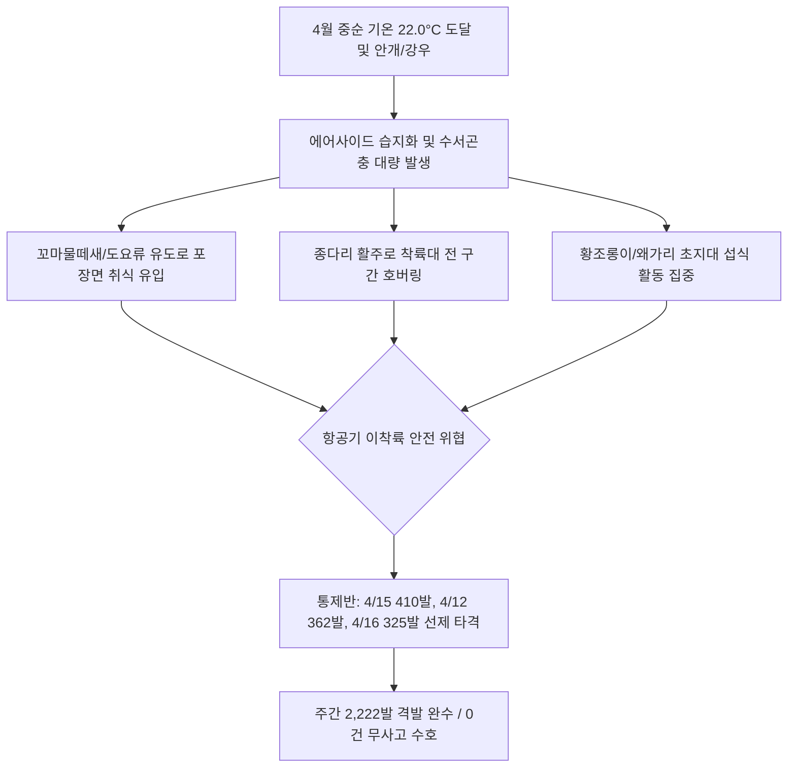

날짜: 2025-04-09 ~ 2025-04-16
카테고리: 야생동물점검 / 주간점검종합
출처: 2025년 4월 9일~16일 일일점검 데이터베이스 및 기상·조석 통합 분석
태그: #야통대 #주간점검 #항공안전 #인천공항 #4월2주차 #봄철새 #종다리 #꼬마물떼새 #괭이갈매기 #까치

---

### [2025년 4월 2주차 야생조수류 통제 종합 보고서]
2025년 4월 9일(수)부터 4월 16일(수)까지 8일간 인천공항 에어사이드 및 랜드사이드 전역에서 수행된 야생동물 통제 작전을 종합 분석한 결과, 주간 기온이 **최저 8.0°C에서 최고 22.0°C**에 달하며 초여름에 가까운 온화한 기후가 지속되었습니다. 이 기간 동안 총 **788개체**의 조류가 통제권역 내에서 식별되었으며, 통제반은 총 **2,222발**(일평균 277.8발)의 집중 사격을 통해 활주로 인접 초지대 및 이착륙 접근로를 결사 방어하여 **'버드스트라이크 0건'**의 완벽한 항공 안전을 유지하였습니다.

---

### [Executive Summary : 4월 2주차 핵심 통제 성과]
1. **기온 22.0°C 도달 및 도요·물떼새류 횡단 본격화**:
   - 4월 13일 AS-16 및 AS-34 구역에 꼬마물떼새 53마리가 집중 유입된 것을 비롯하여 주간 누적 136개체의 도요·물떼새류가 에어사이드 포장면 및 초지대로 유입되었습니다.
   - 통제반은 저고도 군집 비행 특성을 보이는 물떼새 무리를 향해 7호탄 분산 사격을 선제적으로 실시하여 활주로 침범을 차단하였습니다.
2. **초지대 정착 종다리(주간 105개체) 수직 호버링 집중 제압**:
   - 4월 15일 AS-15/AS-16 초지대에서만 종다리 45개체가 일제히 구애 호버링 비행을 전개함에 따라, 410발의 대규모 격발을 통해 활주로 착륙대 반경 300m 밖으로 완전 퇴거시켰습니다.
3. **해안선 괭이갈매기 및 배수로 수조류 침투 방어**:
   - 4월 10일(비) 및 4월 11일(맑음, 13물) 해안 갯벌 조석 변화에 동조하여 남측 배수로와 유수지로 유입된 괭이갈매기 및 물닭·오리류를 4호탄 및 공포탄 복합 전술로 축출하였습니다.
4. **맹금류(황조롱이) 및 왜가리·백로류 취식 거부 작전**:
   - 봄철 설치류 및 양서·파충류 활동 증가로 에어사이드에 빈번히 출현한 황조롱이(주간 15개체)와 왜가리(주간 41개체)에 대해 100m 안전거리를 유지하며 비치사적 충격 사격으로 비행 경로를 외곽으로 변경시켰습니다.

---

### [Weather & Environment Matrix : 기상-조석-생태 상관관계]

```
[4월 2주차 기상 환경 매트릭스]
+------------+-------------+-----------------+-------------+-------------+-----------------------+
|    일자    |  날씨/기상  | 기온(최저/최고) | 풍향 / 풍속 |  조석(물때) |   주요 출현/통제 종   |
+------------+-------------+-----------------+-------------+-------------+-----------------------+
| 04-09 (수) | 흐림/안개   |  10.0 / 17.5°C  |  S / 4.0kts |    11물     | 까치(25), 꼬마물떼(22)|
| 04-10 (목) |  봄비(Rain) |  10.5 / 16.0°C  | SE / 6.0kts |    12물     | 괭이갈매기(36), 오리류|
| 04-11 (금) |  맑음       |   9.0 / 19.5°C  | NW / 8.0kts |    13물     | 괭이갈매기, 까치(20)  |
| 04-12 (토) |  맑음       |   8.0 / 20.0°C  | NW / 6.5kts |    14물     | 까치(28), 까마귀(15)  |
| 04-13 (일) | 구름많음    |   9.5 / 18.5°C  |  W / 5.0kts | 15물(조금)  | 꼬마물떼새(53), 오리류|
| 04-14 (월) |  맑음       |  10.0 / 21.5°C  | SW / 4.5kts |     1물     | 꼬마물떼새(19), 종다리|
| 04-15 (화) |  맑음       |  11.0 / 22.0°C  |  W / 5.0kts |     2물     | 종다리(45), 흰뺨오리  |
| 04-16 (수) | 구름조금    |  10.5 / 20.5°C  | SW / 5.5kts |     3물     | 까치(19), 까마귀(16)  |
+------------+-------------+-----------------+-------------+-------------+-----------------------+
```

---

### [Threat Flow Diagram : 4월 2주차 복합 위협 차단도]



---

### [Veterans' Operational Tacit Knowledge : 현장 암묵지 수칙]

> [!TIP]
> **18년 베테랑 반장의 4월 2주차 현장 작전 수칙**
> 1. **꼬마물떼새의 아스팔트/콘크리트 착지 차단법**: 꼬마물떼새는 빗물이 고인 유도로나 주기장 경계부 콘크리트 틈새에 앉아 먹이활동을 한다. 차량 사이렌에는 반응하지 않으므로, 7호탄을 30도 각도로 수평 분사하여 콘크리트 바닥의 비산 음향으로 놀라게 해 즉시 상공으로 띄워 외곽으로 몰아야 한다.
> 2. **황조롱이 호버링 관찰 시 배후 사격 전술**: 황조롱이가 역풍을 받으며 공중 정지비행을 할 때는 정면에서 쏘면 활주로 방향으로 밀려 들어간다. 반드시 바람을 등진 배후 45도 위치에서 4호탄을 쏘아 에어사이드 외곽 녹지대로 밀어내야 한다.
> 3. **안개 낀 날(4/9) 소리 전달 특성 활용**: 안개가 짙은 날에는 폭음의 전파 거리가 길어지지만 조류의 시야가 좁아져 엉뚱한 방향으로 날아갈 수 있다. 1회 격발 후 조류의 이탈 방향을 육안으로 확인한 뒤 2차 유도 사격을 가해야 한다.

---

### [Quantitative Statistics : 정량 통계 분석]

#### Table 1. 일자별 출현 개체수 및 탄약 소모량
| 일자 | 요일 | 기온(°C) | 날씨 | 주요 출현종 | 식별 개체수 | 7호탄 | 4호탄 | 공포탄 | 일일 총 격발 |
| :---: | :---: | :---: | :---: | :--- | :---: | :---: | :---: | :---: | :---: |
| 04-09 | 수 | 10.0/17.5 | 흐림/안개 | 까치, 꼬마물떼새, 까마귀 | 118 | 275 | 35 | 2 | 312 |
| 04-10 | 목 | 10.5/16.0 | 봄비 | 괭이갈매기, 오리류, 까마귀 | 178 | 215 | 44 | 4 | 263 |
| 04-11 | 금 | 9.0/19.5 | 맑음 | 괭이갈매기, 까치, 종다리 | 59 | 129 | 17 | 0 | 146 |
| 04-12 | 토 | 8.0/20.0 | 맑음 | 까치, 까마귀, 오리류 | 81 | 274 | 69 | 19 | 362 |
| 04-13 | 일 | 9.5/18.5 | 구름많음 | 꼬마물떼새, 까마귀, 종다리 | 91 | 134 | 29 | 0 | 163 |
| 04-14 | 월 | 10.0/21.5 | 맑음 | 꼬마물떼새, 까치, 종다리 | 68 | 224 | 13 | 4 | 241 |
| 04-15 | 화 | 11.0/22.0 | 맑음 | 종다리, 왜가리, 오리류 | 152 | 341 | 61 | 8 | **410** |
| 04-16 | 수 | 10.5/20.5 | 구름조금 | 까치, 까마귀, 꼬마물떼새 | 81 | 245 | 78 | 2 | 325 |
| **주간 합계** | - | - | - | - | **788** | **1,837** | **346** | **39** | **2,222** |

#### Table 2. 구역별 위험도 및 출현 특성 매트릭스
| 통제 구역 | 주요 서식 및 통제 조류종 | 주간 출현 비중 | 위험도 평가 | 핵심 방어 전술 |
| :--- | :--- | :---: | :---: | :--- |
| **AIRSIDE-15** | 종다리, 까치, 왜가리, 꼬마물떼새 | 27.8% | **심각 (Critical)** | 초지대 수직 호버링 차단 및 주기장 착수 왜가리 퇴거 |
| **AIRSIDE-16** | 꼬마물떼새, 종다리, 까치, 황조롱이 | 28.4% | **심각 (Critical)** | 북측 활주로 진입로 콘크리트 포장면 물떼새 소탕 |
| **AIRSIDE-33** | 까치, 종다리, 꼬마물떼새, 왜가리 | 18.2% | **경계 (High)** | 남서측 녹지대 취식 군집 분산 및 번식 시도 억제 |
| **AIRSIDE-34** | 꼬마물떼새, 종다리, 까마귀, 가마우지 | 17.6% | **경계 (High)** | 활주로 남단 접근 조류 선제 사격 및 배수로 차단 |
| **LANDSIDE-N/S**| 백로류, 왜가리, 물닭, 오리류 | 8.0% | **주의 (Medium)** | 유수지 및 하늘정원 수계 조류의 에어사이드 횡단 방어 |

---

### [Strategic Roadmap : 4월 3주차 중점 작전 계획]
1. **봄철 통과 도요·물떼새 대군집 유입 대비 비상 경계**:
   - 4월 하순으로 갈수록 시베리아행 도요류 대규모 편대 유입이 예상되므로, AS-15/AS-16 구역 전담 순찰차량 2대 상시 배치.
2. **초지대 종다리 및 텃새 2차 번식 억제**:
   - 잔디 성장 가속에 따른 초지 내 종다리 번식 거점 파악 및 집중 예초 작업 요청.
3. **수계 백로류 및 왜가리의 일몰 전후 횡단 차단**:
   - 기온 상승으로 활동 시간이 길어진 백로/왜가리의 에어사이드 횡단 경로(LS-S -> AS-15) 차단망 구축.

---

### [Obsidian Vault Interlinks]
- [[20. 인사이트 융합/2025년도 야통대/일일점검/4월 일일점검/2025-04-09_야통대_주간_점검일지_통합]]
- [[20. 인사이트 융합/2025년도 야통대/일일점검/4월 일일점검/2025-04-10_야통대_주간_점검일지_통합]]
- [[20. 인사이트 융합/2025년도 야통대/일일점검/4월 일일점검/2025-04-11_야통대_주간_점검일지_통합]]
- [[20. 인사이트 융합/2025년도 야통대/일일점검/4월 일일점검/2025-04-12_야통대_주간_점검일지_통합]]
- [[20. 인사이트 융합/2025년도 야통대/일일점검/4월 일일점검/2025-04-13_야통대_주간_점검일지_통합]]
- [[20. 인사이트 융합/2025년도 야통대/일일점검/4월 일일점검/2025-04-14_야통대_주간_점검일지_통합]]
- [[20. 인사이트 융합/2025년도 야통대/일일점검/4월 일일점검/2025-04-15_야통대_주간_점검일지_통합]]
- [[20. 인사이트 융합/2025년도 야통대/일일점검/4월 일일점검/2025-04-16_야통대_주간_점검일지_통합]]
- [[2025-04-01~04-08_야통대_주간_점검일지_종합]] (전주 1주차 보고서 연계)

---

### [Aviation Wildlife Terminology : 항공 조류 전문 해설]
- **꼬마물떼새 (Little Ringed Plover)**: 봄철 자갈밭이나 콘크리트 포장면 틈새에 둥지를 트는 소형 섭금류로, 활주로와 유도로 주변에 바짝 붙어 빠른 속도로 지면을 질주하다가 돌발 이륙하여 항공기 착륙 바퀴(랜딩기어) 충돌 위험을 야기합니다.
- **풍선 효과 (Balloon Effect in Bird Control)**: 특정 구역(예: AS-15)에서 강력한 탄약 사격으로 조류를 퇴거시켰을 때, 조류가 완전 이탈하지 않고 인접 구역(AS-16, AS-34)으로 우회하여 다시 침투하는 현상으로, 인접 구역과의 무전 연계 사격이 필수적입니다.

---

### [7 Strategic Inquiries : 미래 항공 안전을 위한 전략적 질문]
1. 4월 13일 꼬마물떼새 53개체가 집중 출현한 요인이 15물 조금 시기의 조석 변화 및 서풍 5.0kts와 어떤 직접적 연관이 있는가?
2. 4월 15일 종다리 45개체의 동시다발적 호버링을 진압하기 위해 소모된 410발의 탄약 효율성을 더욱 높일 수 있는 대체 음향 전술은 무엇인가?
3. AS-15에서 AS-16으로 이어지는 유도로 포장면 빗물 고임 현상이 물떼새 유입을 유발하는 상관계수는 얼마인가?
4. 봄비가 내린 4월 10일 괭이갈매기 36개체가 내륙 배수로로 침투한 주된 먹이원 유인 요인은 무엇인가?
5. 안개가 낀 4월 9일 시정 제한 조건에서 조류의 청각적 민감도 변화와 사격 경퇴 유효 반경의 변화는 어떠한가?
6. 텃새(까치·까마귀)가 통제반 차량의 경광등과 사이렌 패턴을 학습하여 회피 거리를 좁히는 현상에 대응한 불규칙 순찰 프로토콜은 어떻게 설계되어야 하는가?
7. 4월 2주차 주간 2,222발 사격 후 에어사이드 내부 잔류 조류의 제로화(Zero-Stay) 달성률은 몇 %로 평가되는가?
