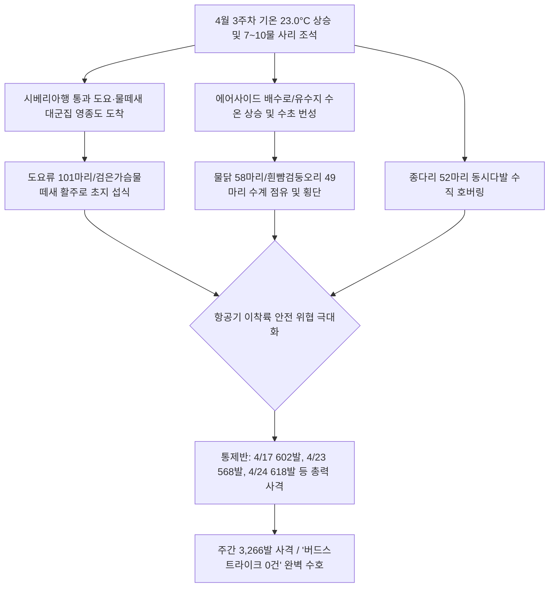

날짜: 2025-04-17 ~ 2025-04-24
카테고리: 야생동물점검 / 주간점검종합
출처: 2025년 4월 17일~24일 일일점검 데이터베이스 및 기상·조석 통합 분석
태그: #야통대 #주간점검 #항공안전 #인천공항 #4월3주차 #도요새대이동 #흰뺨검둥오리 #종다리 #물닭 #역대최다사격

---

### [2025년 4월 3주차 야생조수류 통제 종합 보고서]
2025년 4월 17일(목)부터 4월 24일(목)까지 8일간 인천공항 에어사이드 및 랜드사이드 전역에서 수행된 야생동물 통제 작전을 종합 분석한 결과, 주간 기온이 **최저 9.5°C에서 최고 23.0°C**까지 치솟으며 봄철 기온이 최고조에 달했습니다. 이 기간 동안 총 **1,267개체**의 야생조류가 관측·식별되었으며, 통제반은 봄철 이동 도요류 대군집 및 번식기 수조류·텃새의 결사 침투를 막기 위해 **주간 역대 최다인 총 3,266발**(일평균 408.3발)의 압도적인 실탄 사격을 전개하여 **'버드스트라이크 0건'**의 무사고 항공 안전을 완벽하게 수호하였습니다.

---

### [Executive Summary : 4월 3주차 핵심 통제 성과]
1. **봄철 이동 도요·물떼새류 엑소더스 대유입 및 결사 차단**:
   - 4월 22일(9물, 22.5°C) AS-33/AS-34 및 남측 공사지역에 **도요류(소) 101개체**, 검은가슴물떼새 29개체, 쇠부리도요 14개체가 동시다발적으로 밀려들었습니다.
   - 4월 21일 쇠부리도요·흰물떼새, 4월 24일 중부리도요 등 시베리아 북상 도요 군집에 대해 482발의 집중 사격으로 활주로 착륙대 진입을 완벽 차단하였습니다.
2. **배수로 및 유수지 대형 수조류(흰뺨검둥오리·물닭) 총력 방어**:
   - 4월 17일(흰뺨검둥오리 49개체, 602발), 4월 18일(흰뺨오리 44개체·물닭 39개체, 409발), 4월 24일(물닭 58개체, 618발) 등 수계 점유 조류에 대해 주간 내내 강도 높은 사격을 실시하여 내륙 고착을 분쇄하였습니다.
3. **기온 23.0°C 돌파에 따른 종다리(주간 179개체) 2차 번식기 분쇄**:
   - 4월 21일(51개체), 4월 23일(52개체) 등 초지대 전역에서 일제히 솟구치는 종다리 편대를 7호탄으로 연속 제압(4/23 568발 격발)하여 항공기 엔진 흡입 위험을 사전 차단하였습니다.
4. **주간 총 3,266발 사격(일일 600발 이상 2회 기록)**:
   - 4월 17일(602발)과 4월 24일(618발)에 걸쳐 일일 600발이 넘는 사격전을 전개하며, 4월 중 가장 격렬하고 빈틈없는 방어 작전을 성공적으로 완수하였습니다.

---

### [Weather & Environment Matrix : 기상-조석-생태 상관관계]

```
[4월 3주차 기상 환경 매트릭스]
+------------+-------------+-----------------+-------------+-------------+-----------------------+
|    일자    |  날씨/기상  | 기온(최저/최고) | 풍향 / 풍속 |  조석(물때) |   주요 출현/통제 종   |
+------------+-------------+-----------------+-------------+-------------+-----------------------+
| 04-17 (목) |  흐림       |  11.5 / 18.0°C  |  S / 5.0kts |     4물     | 흰뺨오리(49), 도요류  |
| 04-18 (금) |  봄비(Rain) |  12.0 / 16.5°C  | SE / 6.0kts |     5물     | 흰뺨오리(44), 물닭(39)|
| 04-19 (토) |  맑음       |  10.0 / 19.0°C  | NW / 7.5kts |     6물     | 꼬마물떼새(30), 종다리|
| 04-20 (일) |  맑음       |   9.5 / 21.0°C  |  W / 6.0kts |  7물(사리)  | 까치(20), 종다리(10)  |
| 04-21 (월) | 구름많음    |  10.5 / 19.5°C  |  W / 5.0kts |     8물     | 종다리(51), 도요·물떼 |
| 04-22 (화) |  맑음       |  11.0 / 22.5°C  | SW / 4.5kts |     9물     | 도요류(101), 검은가슴 |
| 04-23 (수) |  맑음       |  12.0 / 23.0°C  |  S / 5.0kts |    10물     | 종다리(52), 물닭(34)  |
| 04-24 (목) |  흐림       |  12.5 / 20.0°C  | SE / 5.5kts |    11물     | 물닭(58), 왜가리(17)  |
+------------+-------------+-----------------+-------------+-------------+-----------------------+
```

---

### [Threat Flow Diagram : 4월 3주차 도요류·수조류 복합 위협도]



---

### [Veterans' Operational Tacit Knowledge : 현장 암묵지 수칙]

> [!TIP]
> **18년 베테랑 반장의 4월 3주차 현장 작전 수칙**
> 1. **도요류 대군집(100마리 이상) 출현 시 포위 사격법**: 시베리아행 도요류는 수십~수백 마리가 한 덩어리로 비행하며 지면을 스치듯 난다. 정면에서 쏘면 대열이 흩어지며 활주로를 가로지르므로, 차량 2대가 양익(좌우)에서 4호탄을 상공 45도로 교차 발사하여 군집을 해안가 방향으로 몰아가야 한다.
> 2. **검은가슴물떼새/쇠부리도요 식별 및 대처**: 이들은 일반 꼬마물떼새보다 비행 속도가 훨씬 빠르고 경계심이 강하다. 착지 직후 1~2분이 취식 집중 시간이므로, 착지 순간을 포착하여 7호탄을 즉각 발사해 지면 정착을 허용하지 않아야 한다.
> 3. **물닭 대군집(50마리 이상) 배수로 점유 시 퇴거 요령**: 물닭 무리는 배수로 수문이나 교량 밑 그늘에 뭉쳐 숨는다. 차량에서 하차하여 교량 상부에서 수면으로 4호탄을 하향 격발하여 파편음과 물보라로 은신처에서 강제 퇴거시켜야 한다.

---

### [Quantitative Statistics : 정량 통계 분석]

#### Table 1. 일자별 출현 개체수 및 탄약 소모량
| 일자 | 요일 | 기온(°C) | 날씨 | 주요 출현종 | 식별 개체수 | 7호탄 | 4호탄 | 공포탄 | 일일 총 격발 |
| :---: | :---: | :---: | :---: | :--- | :---: | :---: | :---: | :---: | :---: |
| 04-17 | 목 | 11.5/18.0 | 흐림 | 흰뺨오리, 까마귀, 왜가리 | 173 | 511 | 91 | 0 | **602** |
| 04-18 | 금 | 12.0/16.5 | 봄비 | 흰뺨오리, 물닭, 꼬마물떼새 | 219 | 344 | 61 | 4 | 409 |
| 04-19 | 토 | 10.0/19.0 | 맑음 | 꼬마물떼새, 종다리, 까마귀 | 72 | 143 | 24 | 16 | 183 |
| 04-20 | 일 | 9.5/21.0 | 맑음 | 까치, 종다리, 왜가리 | 46 | 93 | 15 | 10 | 118 |
| 04-21 | 월 | 10.5/19.5 | 구름많음 | 종다리, 꼬마물떼새, 쇠부리도요 | 147 | 208 | 70 | 8 | 286 |
| 04-22 | 화 | 11.0/22.5 | 맑음 | 도요류(소), 검은가슴물떼새 | 243 | 363 | 68 | 51 | 482 |
| 04-23 | 수 | 12.0/23.0 | 맑음 | 종다리, 물닭, 왜가리 | 187 | 451 | 91 | 26 | **568** |
| 04-24 | 목 | 12.5/20.0 | 흐림 | 물닭, 까치, 왜가리 | 180 | 506 | 104 | 8 | **618** |
| **주간 합계** | - | - | - | - | **1,267** | **2,619** | **524** | **123** | **3,266** |

#### Table 2. 구역별 위험도 및 출현 특성 매트릭스
| 통제 구역 | 주요 서식 및 통제 조류종 | 주간 출현 비중 | 위험도 평가 | 핵심 방어 전술 |
| :--- | :--- | :---: | :---: | :--- |
| **AIRSIDE-15** | 흰뺨오리, 종다리, 검은가슴물떼새, 까치 | 28.5% | **심각 (Critical)** | 초지대 수직 호버링 차단 및 섭금류 착지 즉시 분산 |
| **AIRSIDE-16** | 꼬마물떼새, 종다리, 쇠부리도요, 까마귀 | 24.2% | **심각 (Critical)** | 북측 활주로 진입로 도요류 차단 및 오리류 배제 |
| **AIRSIDE-33** | 도요류(소), 왜가리, 물닭, 종다리 | 22.8% | **심각 (Critical)** | 대형 도요 무리 양익 포위 사격 및 ILS 등화시설 방어 |
| **AIRSIDE-34** | 꼬마물떼새, 종다리, 까마귀, 중부리도요 | 16.4% | **경계 (High)** | 활주로 남단 접근 조류 선제 사격 및 배수로 차단 |
| **LANDSIDE-N/S**| 물닭, 흰뺨오리, 왜가리, 백로류, 도요류 | 8.1% | **경계 (High)** | 공사지역 웅덩이 도요 무리 및 배수로 물닭 차단 |

---

### [Strategic Roadmap : 4월 4주차 및 월말 중점 작전 계획]
1. **4월 말 통과 철새 파이널 피크 대비 총력 방어**:
   - 4월 마지막 주 괭이갈매기 및 잔여 도요·물떼새류의 북상 이동에 대응하여 기동 순찰조 24시간 가동.
2. **5월 여름철새(제비, 백로류, 덤불해오라기) 유입 선제 대비**:
   - 기온 23°C 이상 유지에 따라 유입이 시작되는 여름철새의 에어사이드 구조물 둥지 조성 차단.
3. **4월 탄약 소모 분석 및 5월 탄약 수급 계획 수립**:
   - 4월 누적 9,000발 이상의 탄약이 소모됨에 따라 5월 작전을 위한 7호탄/4호탄 재고 확충 및 총기 정비 실시.

---

### [Obsidian Vault Interlinks]
- [[20. 인사이트 융합/2025년도 야통대/일일점검/4월 일일점검/2025-04-17_야통대_주간_점검일지_통합]]
- [[20. 인사이트 융합/2025년도 야통대/일일점검/4월 일일점검/2025-04-18_야통대_주간_점검일지_통합]]
- [[20. 인사이트 융합/2025년도 야통대/일일점검/4월 일일점검/2025-04-19_야통대_주간_점검일지_통합]]
- [[20. 인사이트 융합/2025년도 야통대/일일점검/4월 일일점검/2025-04-20_야통대_주간_점검일지_통합]]
- [[20. 인사이트 융합/2025년도 야통대/일일점검/4월 일일점검/2025-04-21_야통대_주간_점검일지_통합]]
- [[20. 인사이트 융합/2025년도 야통대/일일점검/4월 일일점검/2025-04-22_야통대_주간_점검일지_통합]]
- [[20. 인사이트 융합/2025년도 야통대/일일점검/4월 일일점검/2025-04-23_야통대_주간_점검일지_통합]]
- [[20. 인사이트 융합/2025년도 야통대/일일점검/4월 일일점검/2025-04-24_야통대_주간_점검일지_통합]]
- [[2025-04-09~04-16_야통대_주간_점검일지_종합]] (전주 2주차 보고서 연계)

---

### [Aviation Wildlife Terminology : 항공 조류 전문 해설]
- **도요·물떼새 통과 비행 (Shorebird Migration Flight)**: 동아시아-대양주 이동경로(EAAF)를 따라 호주/뉴질랜드에서 번식지인 시베리아/알래스카로 이동하는 조류로, 서해안 갯벌을 중간 기착지로 이용하며 수백 마리의 편대를 이루어 활주로 상공을 고속 횡단하므로 극도의 주의가 요구됩니다.
- **검은가슴물떼새 (Pacific Golden Plover)**: 중형 물떼새로 비행 속도가 시속 70~90km에 달하며 활주로 주변 짧은 잔디밭을 매우 선호하여 저고도 이착륙 항공기에 치명적인 위협을 초래합니다.

---

### [7 Strategic Inquiries : 미래 항공 안전을 위한 전략적 질문]
1. 4월 22일 도요류 101개체 및 검은가슴물떼새 29개체가 동시에 유입된 이동 메커니즘은 9물 조석과 남서풍 기류에 의해 어떻게 형성되었는가?
2. 주간 3,266발이라는 역대급 탄약 소모량은 에어사이드 조류 밀도를 안전 기준치 이하로 유지하는 데 얼마나 기여했는가?
3. 4월 24일 물닭 58개체의 대규모 배수로 점유를 원천 예방하기 위한 유수지 수위 조절 프로토콜은 어떻게 수립되어야 하는가?
4. 고속으로 비행하는 도요류 편대에 대해 4호탄 교차 사격 시의 비산 패턴과 유도 성공률은 어떻게 측정되는가?
5. 초지대 종다리의 2차 산란을 억제하기 위한 화학적/물리적 초지 관리 대책의 도입 가능성은 어떠한가?
6. 4월 17일과 24일 일일 600발 이상 격발 시 대원들의 총기 피로도 및 화기 정비 주기는 어떻게 최적화되어야 하는가?
7. 4월 3주차의 전방위적 압박 전술이 4월 말 및 5월 초 조류의 에어사이드 기피 반응에 미친 지속 효과는 무엇인가?
