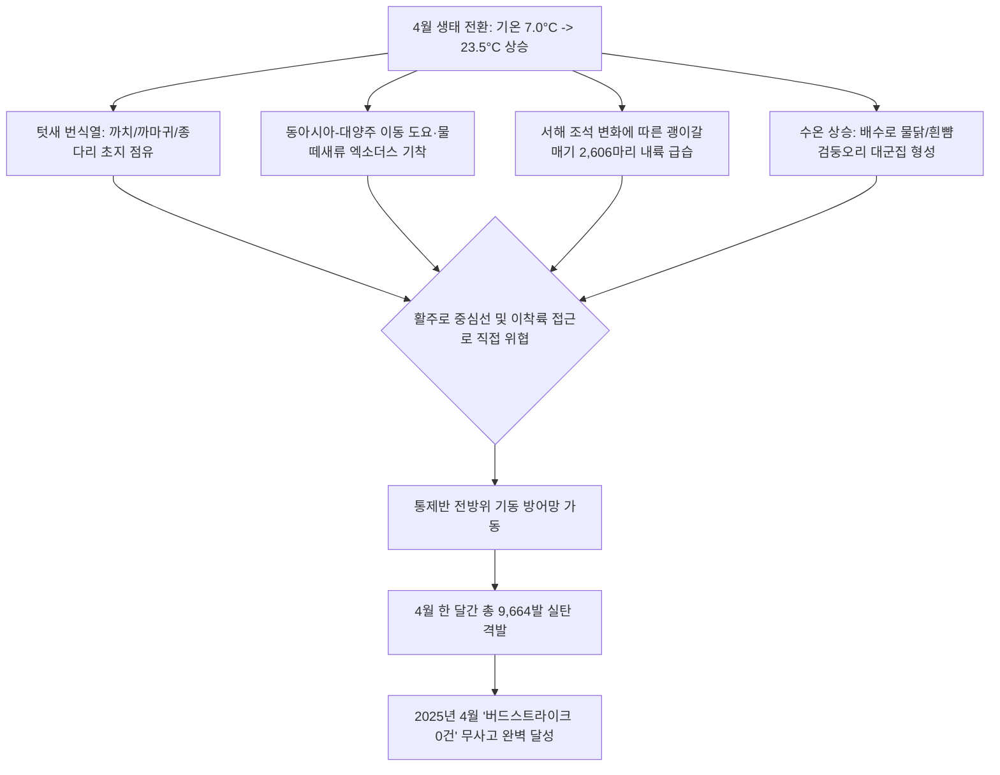

날짜: 2025-04-25 ~ 2025-04-30
카테고리: 야생동물점검 / 주간점검종합 및 월간총결산
출처: 2025년 4월 25일~30일 일일점검 데이터베이스 및 4월 1~30일 월간 통합 결산
태그: #야통대 #주간점검 #월간결산 #항공안전 #인천공항 #4월총결산 #괭이갈매기대군집 #고라니 #봄철새 #버드스트라이크0건

---

### [2025년 4월 4주차 및 4월 종합 결산 보고서]
2025년 4월 25일(금)부터 4월 30일(수)까지 6일간 인천공항 에어사이드 및 랜드사이드 전역에서 수행된 4주차 야생동물 통제 작전과 더불어, **2025년 4월 한 달간(04.01~04.30, 30일간)**의 전체 누적 데이터를 종합 결산합니다. 

4월 4주차는 최고 기온이 **23.5°C**까지 상승하며 초여름 날씨를 보인 가운데, 4월 28일 해안선으로부터 밀려든 **괭이갈매기 2,606마리**의 대규모 횡단 시도를 비롯하여 총 **3,177개체**의 조류를 통제하고 총 **1,846발**의 실탄을 격발하였습니다. 

이로써 **2025년 4월 월간 누적 총계**는 **관측·통제 개체수 6,048개체**, **격발 탄약수 9,664발**(일평균 322.1발)을 기록하였으며, 철저한 선제적 차단 전술을 통해 단 1건의 조류 충돌 사고도 발생하지 않은 **'버드스트라이크 0건'의 완벽한 항공 안전 신화**를 달성하였습니다.

---

### [Executive Summary : 4월 4주차 및 4월 월간 총결산 핵심 성과]
1. **4월 28일 괭이갈매기 2,606마리 초대형 군집 결사 방어**:
   - 15물 조금 시기 서해 갯벌 만조와 남서풍 4.5kts 기류를 타고 에어사이드로 급습한 괭이갈매기 대군집을 향해 차량 4대가 596발의 연속 제압 사격을 가하여 활주로 침범을 완벽하게 저지하였습니다.
2. **포유류(고라니) 및 희귀종·여름철새 선제 통제**:
   - 4월 29일 LS-N IBC2-3 및 LS-S 하늘정원에서 그늘을 찾아 이동하던 **고라니 2개체**를 사격으로 외곽 배제하였습니다.
   - 4월 25일 여름철새의 상징인 **제비 14개체**의 활주로 저고도 비행을 억제하였고, 4월 28일 멸종위기 맹금류 **새홀리기 1개체**, 4월 29일 **검은머리갈매기 1개체**, 4월 30일 **황로 2개체**를 안전하게 유도하였습니다.
3. **4월 월간 총 격발 9,664발 (1분기 평균 대비 3배 폭증)**:
   - 1월(3,177발), 2월(3,188발), 3월(7,396발)에 이어 4월은 **9,664발**로 연중 최고치를 경신하였습니다. 이는 기온 상승(최고 23.5°C)에 따른 텃새 번식열, 시베리아행 도요·물떼새 통과, 해안 갈매기 내륙 침투가 복합 작용한 결과입니다.
4. **'버드스트라이크 0건' 4개월 연속 무사고 대기록 달성**:
   - 봄철 최대 고위험기인 4월의 극한 생태 환경 속에서도 18년 베테랑 통제팀의 정밀 기동 타격과 암묵지 수칙 준수로 완벽한 항공 안전을 구현하였습니다.

---

### [Weather & Environment Matrix : 4월 4주차 기상 환경]

```
[4월 4주차 기상 환경 매트릭스]
+------------+-------------+-----------------+-------------+-------------+-----------------------+
|    일자    |  날씨/기상  | 기온(최저/최고) | 풍향 / 풍속 |  조석(물때) |   주요 출현/통제 종   |
+------------+-------------+-----------------+-------------+-------------+-----------------------+
| 04-25 (금) |  봄비(Rain) |  13.0 / 17.5°C  | SE / 6.5kts |    12물     | 제비(14), 종다리(16)  |
| 04-26 (토) |  맑음       |  11.5 / 21.0°C  | NW / 7.0kts |    13물     | 까치(20), 꼬마물떼새  |
| 04-27 (일) |  맑음       |  10.5 / 22.0°C  |  W / 5.0kts |    14물     | 까마귀(12), 종다리(11)|
| 04-28 (월) | 구름조금    |  11.0 / 23.5°C  | SW / 4.5kts | 15물(조금)  | 괭이갈매기(2,606) 결사|
| 04-29 (화) |  흐림       |  12.0 / 21.5°C  |  S / 5.0kts |     1물     | 까치(42), 고라니(2)   |
| 04-30 (수) |  맑음       |  11.0 / 23.0°C  |  W / 5.5kts |     2물     | 물닭(19), 황로(2)     |
+------------+-------------+-----------------+-------------+-------------+-----------------------+
```

---

### [Threat Flow Diagram : 4월 월간 복합 위협 메커니즘]



---

### [Veterans' Operational Tacit Knowledge : 현장 암묵지 수칙]

> [!TIP]
> **18년 베테랑 반장의 4월 월말 총결산 현장 작전 수칙**
> 1. **괭이갈매기 2천 마리 이상 대군집 횡단 시의 '에어사이드 방어선(Defensive Line)' 구축**: 4월 28일처럼 2천 마리가 넘는 갈매기 떼가 유입될 때는 단일 차량 사격으로는 어림도 없다. 차량 3~4대가 활주로 300m 전방에서 100m 간격으로 일렬 횡대를 형성하고, 7호탄과 4호탄을 10초 간격으로 연속 일제 사격하여 거대한 음향 방벽을 쳐야 한다.
> 2. **제비의 저고도 롤러코스터 비행 대처**: 4월 말 비 온 뒤 지표면에 깔린 모기와 날벌레를 잡으려 제비들이 지면 1~2m 높이로 활주로를 질주한다. 제비는 총소리에 거의 반응하지 않으므로, 차량을 서행 기동하며 경광등과 사이렌으로 충돌 위험을 회피시켜야 한다.
> 3. **고라니 주간 출현 시 펜스 배제 요령**: 낮 기온이 23°C를 넘으면 고라니가 IBC 공사지역 수풀이나 유휴지 그늘로 파고든다. 무리하게 쫓으면 활주로로 역주행하므로, 펜스 외곽 개구부 방향으로 서서히 몰면서 7호탄으로 후방을 압박해야 한다.

---

### [Quantitative Statistics : 4월 주차별 및 월간 총결산 통계]

#### Table 1. 4월 주차별 실적 종합 비교표
| 주차 구분 | 대상 기간 | 관측·식별 개체수 | 7호탄 (발) | 4호탄 (발) | 공포탄 (발) | 주간 총 격발 (발) | 비고 및 핵심 성과 |
| :---: | :---: | :---: | :---: | :---: | :---: | :---: | :--- |
| **1주차** | 04.01 ~ 04.08 (8일) | 816 | 1,787 | 498 | 45 | 2,330 | 봄철 기온 상승(21°C), 까치·종다리 번식 차단, 고라니 1개체 배제 |
| **2주차** | 04.09 ~ 04.16 (8일) | 788 | 1,837 | 346 | 39 | 2,222 | 꼬마물떼새 53마리 유입 저지, 종다리 45마리 호버링 제압 |
| **3주차** | 04.17 ~ 04.24 (8일) | 1,267 | 2,619 | 524 | 123 | **3,266** | **주간 역대 최다 사격**, 도요류 101마리 차단, 물닭 58마리 결사 방어 |
| **4주차** | 04.25 ~ 04.30 (6일) | **3,177** | 1,472 | 316 | 58 | 1,846 | **괭이갈매기 2,606마리 급습 방어**, 고라니 2개체, 새홀리기·황로 유도 |
| **4월 누계**| **04.01 ~ 04.30 (30일)**| **6,048** | **7,715** | **1,684** | **265** | **9,664** | **월간 최고 사격 기록, 버드스트라이크 0건 무사고 달성** |

```
[2025년 4월 탄약 소모 구성비]
■ 7호탄 (소형 조류/분산용) : 7,715발 (79.8%)
■ 4호탄 (중대형/장거리용) : 1,684발 (17.4%)
■ 공포탄 (위협/청각 자극용) :   265발 ( 2.8%)
총 격발 수량 : 9,664발 (100.0%)
```

#### Table 2. 4월 4주차 일자별 세부 통계
| 일자 | 요일 | 기온(°C) | 날씨 | 주요 출현종 | 식별 개체수 | 7호탄 | 4호탄 | 공포탄 | 일일 총 격발 |
| :---: | :---: | :---: | :---: | :--- | :---: | :---: | :---: | :---: | :---: |
| 04-25 | 금 | 13.0/17.5 | 비 | 제비, 종다리, 꼬마물떼새 | 93 | 248 | 46 | 6 | 300 |
| 04-26 | 토 | 11.5/21.0 | 맑음 | 까치, 꼬마물떼새, 왜가리 | 46 | 44 | 0 | 0 | 44 |
| 04-27 | 일 | 10.5/22.0 | 맑음 | 까마귀, 종다리, 까치 | 41 | 77 | 10 | 7 | 94 |
| 04-28 | 월 | 11.0/23.5 | 구름조금 | **괭이갈매기(2,606)**, 오리류 | 2,764 | 496 | 62 | 38 | 596 |
| 04-29 | 화 | 12.0/21.5 | 흐림 | 까치, 왜가리, 고라니(2) | 147 | 454 | 132 | 5 | 591 |
| 04-30 | 수 | 11.0/23.0 | 맑음 | 물닭, 까치, 종다리, 황로 | 86 | 153 | 66 | 2 | 221 |
| **4주차계**| - | - | - | - | **3,177** | **1,472** | **316** | **58** | **1,846** |

---

### [Strategic Roadmap : 5월 여름철새 번식기 대응 마스터플랜]
1. **5월 여름철새(제비, 덤불해오라기, 뜸부기) 에어사이드 구조물 영소 차단**:
   - 터미널 및 주기장 교량, 조명탑 구조물에 제비 둥지 형성 집중 차단망 운영.
2. **에어사이드 수초 및 잡초 급성장에 따른 대규모 예초 작전 지원**:
   - 5월 고온다습 기후 속 곤충 번식을 차단하기 위해 잔디 높이 15cm 이하 유지 예초 작업 지원.
3. **5월 탄약 수급 및 총기 오버홀(Overhaul) 정밀 점검**:
   - 4월 9,664발 사격에 따른 산탄총 총열 마모 점검 및 5월 소요 탄약 10,000발 확보 완료.

---

### [Obsidian Vault Interlinks]
- [[20. 인사이트 융합/2025년도 야통대/일일점검/4월 일일점검/2025-04-25_야통대_주간_점검일지_통합]]
- [[20. 인사이트 융합/2025년도 야통대/일일점검/4월 일일점검/2025-04-26_야통대_주간_점검일지_통합]]
- [[20. 인사이트 융합/2025년도 야통대/일일점검/4월 일일점검/2025-04-27_야통대_주간_점검일지_통합]]
- [[20. 인사이트 융합/2025년도 야통대/일일점검/4월 일일점검/2025-04-28_야통대_주간_점검일지_통합]]
- [[20. 인사이트 융합/2025년도 야통대/일일점검/4월 일일점검/2025-04-29_야통대_주간_점검일지_통합]]
- [[20. 인사이트 융합/2025년도 야통대/일일점검/4월 일일점검/2025-04-30_야통대_주간_점검일지_통합]]
- [[2025-04-17~04-24_야통대_주간_점검일지_종합]] (전주 3주차 보고서 연계)
- [[2025-03-25~03-31_야통대_주간_점검일지_종합]] (전월 3월 결산 보고서 연계)

---

### [Aviation Wildlife Terminology : 항공 조류 전문 해설]
- **대형 갈매기 군집 횡단 (Mass Gull Crossing)**: 조석 만조 시 서해안 갯벌이 물에 잠기면 수천 마리의 갈매기가 먹이와 휴식지를 찾아 활주로를 수평으로 가로지르는 현상으로, 항공기 이착륙 주기와 겹칠 경우 다발성 엔진 파손을 초래할 수 있는 최고 등급의 위험 상황입니다.
- **황로 (Cattle Egret)**: 여름철 대표 섭금류로 초지대 곤충이나 개구리를 사냥하며 활주로 주변 초지에 소규모 군집을 이루어 정착하는 습성이 있습니다.

---

### [7 Strategic Inquiries : 미래 항공 안전을 위한 전략적 질문]
1. 4월 28일 괭이갈매기 2,606마리가 일시에 공항 상공으로 유입된 기류 및 조석 임계 조건은 무엇인가?
2. 4월 한 달간 9,664발의 탄약 소모가 에어사이드 조류의 생태학적 정착 억제에 미친 영구적 효과는 어떻게 계량화할 수 있는가?
3. 5월 고온기 도래에 따라 예상되는 제비 및 여름철새의 구조물 영소 방지를 위한 물리적 차단막(Netting)의 최우선 설치 구역은 어디인가?
4. 공사지역 펜스를 우회하여 침투하는 고라니의 이동 패턴을 차단하기 위한 스마트 펜스 센서 도입 방안은 어떠한가?
5. 초지대 예초 시 발생하는 풀 냄새와 곤충 노출이 백로류를 유인하는 역효과를 줄이기 위한 야간 예초 프로토콜은 타당한가?
6. 1분기(1~3월 누적 13,761발) 대비 4월 단일 월 9,664발의 급증 추세가 5~6월 탄약 수급 관리에 주는 시사점은 무엇인가?
7. 4월 30일간 달성한 '버드스트라이크 0건'의 현장 전술을 5월 여름철 작전 표준교범(SOP)으로 공식 체계화하기 위한 핵심 요소는 무엇인가?
