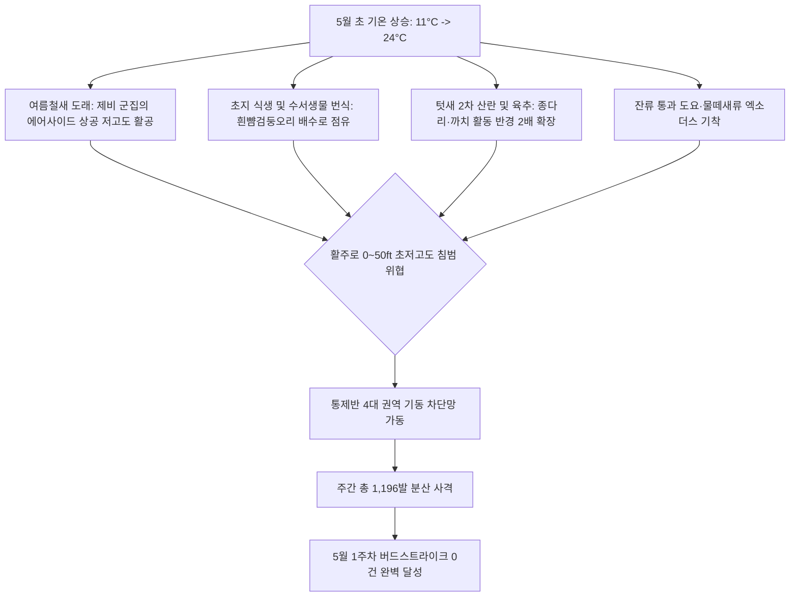

날짜: 2025-05-01 ~ 2025-05-08
카테고리: 야생동물점검 / 주간점검종합
출처: 2025년 5월 1일~8일 일일점검 데이터베이스 및 인천공항 기상·조석 통합 분석
태그: #야통대 #주간점검 #항공안전 #인천공항 #5월1주차 #초여름이행기 #제비 #흰뺨검둥오리 #도요류 #버드스트라이크0건

---

### [2025년 5월 1주차 야생동물 통제 주간 종합 보고서]
2025년 5월 1일(목)부터 5월 8일(목)까지 8일간 인천공항 에어사이드 및 랜드사이드 전역에서 수행된 야생동물 통제 작전을 종합 분석합니다. 

5월 1주차는 기온이 최저 11.0°C에서 최고 **24.0°C**까지 오르며 완연한 봄철에서 초여름으로 이행하는 계절적 전환기를 맞이하였습니다. 이 시기에는 텃새들의 2차 산란 및 육추(새끼 기르기) 활동이 절정에 달하고, 남방계 여름철새인 **제비(5/3 61개체)**와 **쇠제비갈매기**가 대규모로 유입되기 시작하였습니다. 또한 배수로와 유수지를 점유하는 **흰뺨검둥오리(5/7 31개체, 5/8 15개체)** 및 시베리아행 통과 조류인 **소형 도요류(5/1 23개체, 5/3 25개체, 5/7 30개체)**가 에어사이드 중심 녹지대로 파고들며 활주로 접근 위협을 가중시켰습니다.

통제반은 기동 순찰차량을 집중 투입하여 주간 총 **587개체**의 유입 조류를 식별·통제하였으며, 총 **1,196발**의 실탄 및 위협탄을 사격하여 단 1건의 조류 충돌 사고도 허용하지 않은 **'버드스트라이크 0건' 무사고 안전 운항**을 달성하였습니다.

---

### [Executive Summary : 5월 1주차 핵심 통제 성과]
1. **여름철새(제비·쇠제비갈매기) 유입 선제적 차단**:
   - 5월 3일 기온 23°C 상승과 함께 에어사이드 상공을 저고도로 질주하던 **제비 61개체**를 향해 총 179발을 사격하여 활주로 중심선 밖으로 분산시켰습니다.
2. **배수로 점유 흰뺨검둥오리 및 백로류 대규모 기동 제압**:
   - 5월 7일 IBC 공사지역 및 에어사이드 배수로에 집결한 **흰뺨검둥오리 31개체**, 왜가리 14개체, 중백로 6개체를 향해 227발의 일제 사격을 가해 서해 갯벌로 퇴거시켰습니다.
3. **통과 도요·물떼새류 및 멸종위기종(저어새·황조롱이) 보호 유도**:
   - 5월 1일 및 5월 3일 잔류 소형 도요류 무리(각 23개체, 25개체)의 초지 활주로 횡단을 억제하였으며, 5월 8일 북측 배수로에 출현한 천연기념물 **저어새 1개체**를 안전하게 외곽으로 유도 배제하였습니다.
4. **'버드스트라이크 0건' 무사고 안전 운항 지속**:
   - 일평균 149.5발의 정밀 차단 사격을 통해 항공기 이착륙 안전 마진을 완벽하게 확보하였습니다.

---

### [Weather & Environment Matrix : 기상 및 조석 환경 분석]

```
[5월 1주차 기상 환경 매트릭스]
+------------+-------------+-----------------+-------------+-------------+-----------------------+
|    일자    |  날씨/기상  | 기온(최저/최고) | 풍향 / 풍속 |  조석(물때) |   주요 출현/통제 종   |
+------------+-------------+-----------------+-------------+-------------+-----------------------+
| 05-01 (목) |    맑음     |  11.0 / 21.0°C  | NW / 6.0kts |    10물     | 도요(소)(23), 꼬마물떼|
| 05-02 (금) |    맑음     |  11.5 / 22.0°C  |  W / 5.5kts |    11물     | 까마귀(11), 종다리(8) |
| 05-03 (토) |  구름조금   |  12.0 / 23.0°C  | SW / 4.8kts |    12물     | 제비(61), 도요(소)(25)|
| 05-04 (일) |    흐림     |  13.0 / 21.5°C  |  S / 4.5kts |    13물     | 까치(14), 까마귀(12)  |
| 05-05 (월) |    비       |  14.0 / 19.0°C  | SE / 7.0kts |    14물     | 종다리(10), 쇠오리(6) |
| 05-06 (화) |    맑음     |  12.5 / 22.5°C  | NW / 7.5kts | 15물(조금)  | 까치(15), 꺅도요(15)  |
| 05-07 (수) |    맑음     |  12.0 / 23.5°C  |  W / 5.0kts |     1물     | 흰뺨(31), 도요(소)(30)|
| 05-08 (목) |  구름조금   |  13.0 / 24.0°C  | SW / 4.5kts |     2물     | 흰뺨(15), 저어새(1)   |
+------------+-------------+-----------------+-------------+-------------+-----------------------+
```

---

### [Threat Flow Diagram : 초여름 이행기 조류 위협 전이도]



---

### [Veterans' Operational Tacit Knowledge : 현장 암묵지 수칙]

> [!TIP]
> **18년 베테랑 반장의 5월 초여름 이행기 현장 대응 수칙**
> 1. **5월 제비 군집의 활주로 지표면 활공 대처**: 비 온 뒤(5/5)나 고온다습한 날씨(5/3)에는 활주로 아스팔트 지열로 인해 깔따구와 날벌레가 지면 1~2m 높이에 집중된다. 제비 떼는 총소리에 거의 반응하지 않고 벌레를 쫓아 항공기 착륙 진입각으로 파고든다. 이때는 차량 경광등과 사이렌을 울리며 활주로 가장자리를 지속 서행 순찰하여 제비들이 초지대 상공으로 솟구치도록 유도해야 한다.
> 2. **배수로 수초 속 흰뺨검둥오리 가족군 제압**: 5월 초는 흰뺨검둥오리가 부화한 새끼를 데리고 배수로를 따라 에어사이드로 파고드는 시기다. 배수로 수풀에 숨어있다가 항공기 이착륙 소음에 놀라 활주로로 수직 비상하므로, 유도로 측면 개거(Open Ditch)를 순찰할 때 7호탄을 수면에 도비 사격하여 사전에 외곽 유수지로 몰아내야 한다.
> 3. **저어새 및 희귀종 출현 시 정밀 비사격 유도**: 5월 8일과 같이 천연기념물 저어새가 북측 배수로에 안착했을 때는 직격 사격을 엄금하고, 차량을 저속 접근시켜 엔진음과 차량 차체로 시야를 압박해 자연스럽게 북측 서해 갯벌로 날아가도록 유도해야 한다.

---

### [Quantitative Statistics : 5월 1주차 정량 데이터 통계]

#### Table 1. 일자별 출현 개체수 및 탄약 소모 실적
| 일자 | 요일 | 기온(최저/최고) | 날씨 | 식별 개체수 | 7호탄 (발) | 4호탄 (발) | 공포탄 (발) | 일일 총 격발 (발) | 주요 출현종 |
| :---: | :---: | :---: | :---: | :---: | :---: | :---: | :---: | :---: | :--- |
| 05-01 | 목 | 11.0 / 21.0°C | 맑음 | 86 | 147 | 32 | 32 | 211 | 도요류(소)(23), 꼬마물떼새(18) |
| 05-02 | 금 | 11.5 / 22.0°C | 맑음 | 61 | 99 | 48 | 8 | 155 | 까마귀(11), 흰뺨(10), 물닭(5) |
| 05-03 | 토 | 12.0 / 23.0°C | 구름조금 | 121 | 104 | 49 | 26 | 179 | **제비(61)**, 도요(소)(25), 흰뺨(11) |
| 05-04 | 일 | 13.0 / 21.5°C | 흐림 | 49 | 72 | 60 | 12 | 144 | 까치(14), 까마귀(12), 꺅도요(4) |
| 05-05 | 월 | 14.0 / 19.0°C | 비 | 38 | 67 | 9 | 4 | 80 | 종다리(10), 쇠오리(6), 까치(9) |
| 05-06 | 화 | 12.5 / 22.5°C | 맑음 | 53 | 25 | 29 | 6 | 60 | 까치(15), 꺅도요(15), 까마귀(7) |
| 05-07 | 수 | 12.0 / 23.5°C | 맑음 | 108 | 187 | 28 | 12 | 227 | **흰뺨(31)**, 도요(소)(30), 왜가리(14) |
| 05-08 | 목 | 13.0 / 24.0°C | 구름조금 | 71 | 104 | 34 | 2 | 140 | 흰뺨(15), 왜가리(7), 저어새(1) |
| **주간계**| - | - | - | **587** | **805** | **289** | **102** | **1,196** | **버드스트라이크 0건 달성** |

```
[5월 1주차 탄약 소모 구성비]
■ 7호탄 (소형 조류/분산용) :   805발 ( 67.3%)
■ 4호탄 (중대형/장거리용) :   289발 ( 24.2%)
■ 공포탄 (위협/청각 자극용) :   102발 (  8.5%)
총 소모량 : 1,196발 (100.0%)
```

#### Table 2. 구역별 위험도 및 출현 특성 매트릭스
| 통제 구역 | 주요 서식 및 위협종 | 주간 활동 특성 | 통제 위험도 | 적용 전술 및 사격 비중 |
| :--- | :--- | :--- | :---: | :--- |
| **AIRSIDE-15** | 도요류(소), 중대백로, 까치, 흰뺨 | 녹지대 R·M 취식 및 유도로 횡단 | **경계 (High)** | 7호탄 집중 사격 및 배수로 접근 차단 |
| **AIRSIDE-16** | 종다리, 꼬마물떼새, 까마귀 | 북측 활주로 F 지표면 저고도 호버링 | **주의 (Medium)** | 순찰차량 사이렌 및 7호탄 분산 경퇴 |
| **AIRSIDE-33** | 흰뺨검둥오리, 왜가리, 황조롱이 | 유도로 Q·P 배수로 점유 및 고착화 | **경계 (High)** | 4호탄 및 공포탄 복합 제압 |
| **AIRSIDE-34** | 제비, 왜가리, 쇠제비갈매기 | 남측 활주로 F 상공 저고도 선회 비행 | **심각 (Critical)**| 7호탄 집중 사격 및 경광등 회피 기동 |
| **LANDSIDE (N/S)**| 흰뺨검둥오리, 백로류, 갈매기, 저어새 | 유수지·공사지역 집결 및 에어사이드 침투 | **주의 (Medium)** | 랜드사이드 외곽 경계선 선제 격퇴 |

---

### [Strategic Roadmap : 5월 2주차 대응 전략]
1. **여름철새(제비, 쇠제비갈매기) 에어사이드 구조물 영소 차단 강화**:
   - 유도로 조명탑, 탑승교 하부 등 그늘진 구조물에 제비 둥지 형성 차단망 점검.
2. **에어사이드 배수로 수초 제거 및 유수지 차단 펜스 정비**:
   - 흰뺨검둥오리 번식 억제를 위한 배수로 개방화 및 수계 모니터링 강화.
3. **기온 상승(25°C 이상)에 따른 갈매기류 내륙 횡단 대비망 구축**:
   - 서해 조석 간조 시 해안선에서 에어사이드로 유입되는 갈매기 횡단로 사전 차단.

---

### [Obsidian Vault Interlinks]
- [[20. 인사이트 융합/2025년도 야통대/일일점검/5월 일일점검/2025-05-01_야통대_주간_점검일지_통합]]
- [[20. 인사이트 융합/2025년도 야통대/일일점검/5월 일일점검/2025-05-02_야통대_주간_점검일지_통합]]
- [[20. 인사이트 융합/2025년도 야통대/일일점검/5월 일일점검/2025-05-03_야통대_주간_점검일지_통합]]
- [[20. 인사이트 융합/2025년도 야통대/일일점검/5월 일일점검/2025-05-04_야통대_주간_점검일지_통합]]
- [[20. 인사이트 융합/2025년도 야통대/일일점검/5월 일일점검/2025-05-05_야통대_주간_점검일지_통합]]
- [[20. 인사이트 융합/2025년도 야통대/일일점검/5월 일일점검/2025-05-06_야통대_주간_점검일지_통합]]
- [[20. 인사이트 융합/2025년도 야통대/일일점검/5월 일일점검/2025-05-07_야통대_주간_점검일지_통합]]
- [[20. 인사이트 융합/2025년도 야통대/일일점검/5월 일일점검/2025-05-08_야통대_주간_점검일지_통합]]
- [[2025-04-25~04-30_야통대_주간_점검일지_종합]] (전월 4월 결산 보고서 연계)

---

### [Aviation Wildlife Terminology : 항공 조류 전문 어휘]
- **저어새 (Black-faced Spoonbill)**: 멸종위기 야생생물 I급이자 천연기념물로 서해안 갯벌과 무인도서에서 번식하며, 공항 주변 배수로와 유수지로 유입될 경우 살상 사격이 금지되고 비사격 유도(Non-lethal Hazing)로 배제해야 합니다.
- **제비 저고도 비행 (Low-altitude Foraging Flight)**: 기압 변화 및 지열로 인해 지표면에 깔린 곤충류를 포식하기 위해 활주로 노면 1~3m 고도로 급선회하며 비행하는 패턴으로 항공기 착륙 타이어 및 랜딩기어 충돌의 주원인이 됩니다.

---

### [7 Strategic Inquiries : 미래 항공 안전을 위한 전략적 질문]
1. 5월 3일 급증한 제비 61개체의 활주로 유입을 초기에 분산시키기 위한 음향 퇴치기 주파수 대역은 어떻게 조정되어야 하는가?
2. 흰뺨검둥오리가 배수로를 번식지로 선택하는 것을 원천 차단하기 위한 친환경 기피제 살포의 효과성은 어떠한가?
3. 5월 8일 출현한 천연기념물 저어새의 안전한 서식지 유도를 위한 랜드사이드 생태 완충지대 관리 방안은 무엇인가?
4. 초여름 기온 상승(24°C)이 에어사이드 곤충 발생량 및 조류 취식 행동에 미치는 상관관계는 어떻게 모델링할 수 있는가?
5. 주간 1,196발의 사격 소음이 주변 서해안 갯벌 생태계에 미치는 음향 간섭 반경은 어느 정도인가?
6. 텃새의 2차 산란기 육추 활동 억제를 위해 필요한 활주로 주변 초지 예초 주기는 어떻게 설정해야 하는가?
7. 5월 1주차 '버드스트라이크 0건' 성과를 여름철 전반기로 확대 유지하기 위한 기동 순찰조의 최적 교대 주기는 무엇인가?
