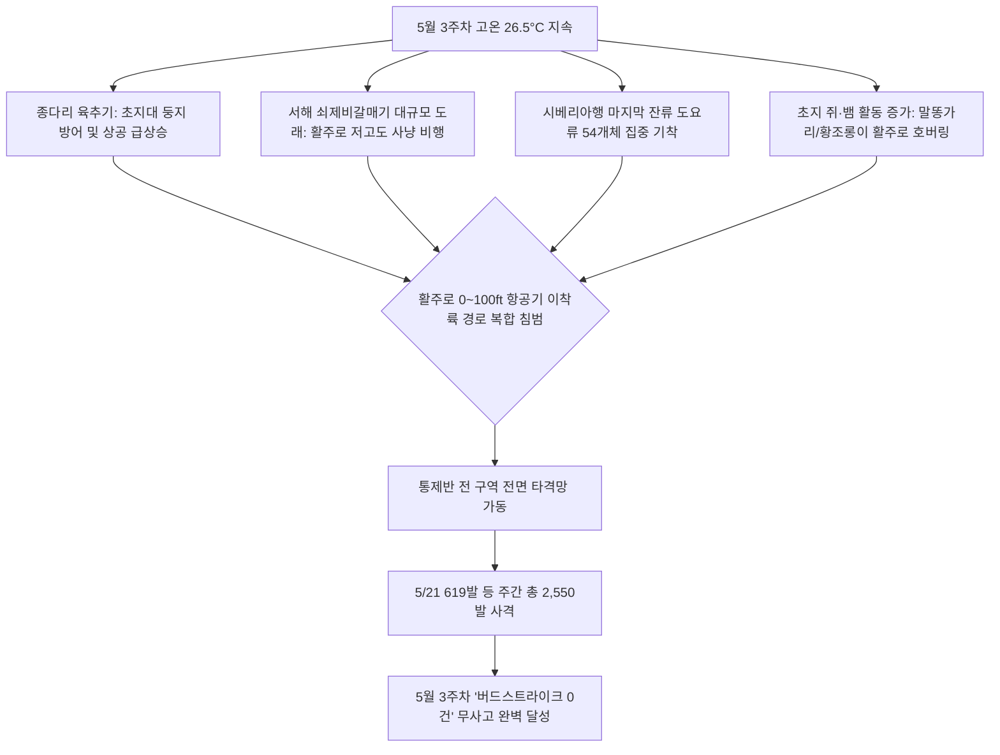

날짜: 2025-05-17 ~ 2025-05-24
카테고리: 야생동물점검 / 주간점검종합
출처: 2025년 5월 17일~24일 일일점검 데이터베이스 및 인천공항 기상·조석 통합 분석
태그: #야통대 #주간점검 #항공안전 #인천공항 #5월3주차 #종다리육추기 #쇠제비갈매기 #도요류 #고라니 #버드스트라이크0건

---

### [2025년 5월 3주차 야생동물 통제 주간 종합 보고서]
2025년 5월 17일(토)부터 5월 24일(토)까지 8일간 인천공항 에어사이드 및 랜드사이드 전역에서 수행된 야생동물 통제 작전을 종합 분석합니다. 

5월 3주차는 낮 최고 기온이 **26.5°C**까지 치솟으며 초여름 폭염이 에어사이드 전역에 영향을 미친 주간이었습니다. 기온 급상승에 따라 에어사이드 초지대에서는 **종다리의 육추(새끼 기르기) 및 둥지 방어 행동**이 극에 달하였고(5/20 43개체, 5/21 14개체, 5/24 17개체), 해안가에서는 여름철새인 **쇠제비갈매기(5/23 27개체)**와 잔류 **소형 도요류(5/21 54개체)**가 대규모로 유입되었습니다. 

특히 5월 21일(수)에는 15물 조금 시기 조석과 남서풍(4.5kts) 기류 속에서 도요류 54개체, 까치 39개체, 괭이갈매기 32개체, 물닭 20개체, 흰뺨검둥오리 23개체 및 화물터미널 인근 **고라니 1개체**가 동시 침투하여 당일 하루에만 **619발**의 대규모 화력을 투입하여 활주로를 사수하였습니다.

통제반은 주간 총 **767개체**의 고위험 조류 및 야생동물을 통제하고 총 **2,550발**의 실탄 및 위협탄을 사격하여 단 1건의 조류 충돌도 발생하지 않은 **'버드스트라이크 0건' 무사고 안전 운항**을 달성하였습니다.

---

### [Executive Summary : 5월 3주차 핵심 통제 성과]
1. **5월 21일 619발 집중 격발로 복합 대군집 및 포유류(고라니) 격퇴**:
   - 도요류 54개체, 까치 39개체, 갈매기 32개체, 물닭 20개체가 활주로와 녹지대로 쇄도하는 위기 상황에서 4개 권역 순찰차가 619발을 사격하여 완벽하게 퇴거시켰으며, 화물터미널역 시설물로 침투한 **고라니 1개체**를 안전 배제하였습니다.
2. **텃새(종다리·까치·까마귀) 초지대 고착화 결사 저지**:
   - 기온 26.5°C 속에서 둥지를 지키며 활주로 상공으로 호버링(정지비행)을 시도하던 종다리(주간 121개체)와 까치(주간 115개체)를 7호탄으로 정밀 제압하였습니다.
3. **여름철새(쇠제비갈매기·황로) 및 맹금류(말똥가리·황조롱이) 선제 배제**:
   - 5월 23일 비 내리는 날 유입된 **쇠제비갈매기 27개체**의 저고도 활공을 차단하였으며, 초지대 쥐를 노리고 침입한 **말똥가리 3개체** 및 **황조롱이 9개체**를 공포탄과 4호탄으로 안전하게 외곽 유도하였습니다.
4. **'버드스트라이크 0건' 무사고 완벽 달성**:
   - 일평균 318.8발의 기동 차단 사격을 통해 항공기 착륙 진입각 및 이륙 활주로의 절대적 청정 상태를 유지하였습니다.

---

### [Weather & Environment Matrix : 기상 및 조석 환경 분석]

```
[5월 3주차 기상 환경 매트릭스]
+------------+-------------+-----------------+-------------+-------------+-----------------------+
|    일자    |  날씨/기상  | 기온(최저/최고) | 풍향 / 풍속 |  조석(물때) |   주요 출현/통제 종   |
+------------+-------------+-----------------+-------------+-------------+-----------------------+
| 05-17 (토) |    맑음     |  13.0 / 25.0°C  |  W / 5.0kts |    11물     | 종다리(15), 쇠제비갈매|
| 05-18 (일) |  구름조금   |  14.0 / 25.5°C  | SW / 4.5kts |    12물     | 까치(14), 말똥가리(1) |
| 05-19 (월) |    흐림     |  15.0 / 23.0°C  | SE / 5.2kts |    13물     | 종다리(19), 중대백로  |
| 05-20 (화) |    맑음     |  14.5 / 26.0°C  |  W / 5.8kts |    14물     | 종다리(43), 까치(20)  |
| 05-21 (수) |    맑음     |  14.0 / 26.5°C  | SW / 4.5kts | 15물(조금)  | 도요(54), **619발 사격**|
| 05-22 (목) |  구름많음   |  15.5 / 24.0°C  |  S / 5.0kts |     1물     | 까마귀(21), 흰뺨(12)  |
| 05-23 (금) |    비       |  16.0 / 21.0°C  | SE / 6.0kts |     2물     | 쇠제비갈매기(27), 황로|
| 05-24 (토) |    맑음     |  14.5 / 25.0°C  | NW / 7.5kts |     3물     | 종다리(17), 까치(13)  |
+------------+-------------+-----------------+-------------+-------------+-----------------------+
```

---

### [Threat Flow Diagram : 5월 3주차 고온기 조류 위협 메커니즘]



---

### [Veterans' Operational Tacit Knowledge : 현장 암묵지 수칙]

> [!TIP]
> **18년 베테랑 반장의 5월 하순 고온기 현장 작전 수칙**
> 1. **종다리 육추기(새끼 기르기) 호버링 대처**: 5월 말 기온이 26°C를 넘으면 종다리 성조가 새끼를 보호하기 위해 차량이나 항공기가 다가올 때 활주로 상공 10~20m 높이로 수직 솟구치며 정지비행을 한다. 이때는 지상 사격보다 차량을 급가속하여 초지대 쪽으로 몰아붙인 뒤 7호탄을 공중으로 분산 사격해야 즉시 초지로 내려앉는다.
> 2. **쇠제비갈매기의 수면 다이빙 비행 통제**: 쇠제비갈매기는 일반 갈매기보다 몸집은 작지만 활주로 배수로의 작은 물고기를 잡기 위해 급강하 다이빙을 반복한다. 총소리에 둔감하므로 배수로 양끝에서 4호탄을 수면에 튀기듯 도비 사격하여 수면 접근 자체를 차단해야 한다.
> 3. **고온기 맹금류(말똥가리·황조롱이) 열상 기류 상승 저지**: 한낮에 아스팔트가 달아오르면 상승기류(Thermal)가 형성되어 맹금류가 활주로 상공 50~100m에서 장시간 활공한다. 이때는 공포탄 2발로 청각적 충격을 준 뒤 4호탄으로 하강을 유도해 외곽 산림으로 이탈시켜야 한다.

---

### [Quantitative Statistics : 5월 3주차 정량 데이터 통계]

#### Table 1. 일자별 출현 개체수 및 탄약 소모 실적
| 일자 | 요일 | 기온(최저/최고) | 날씨 | 식별 개체수 | 7호탄 (발) | 4호탄 (발) | 공포탄 (발) | 일일 총 격발 (발) | 주요 출현종 |
| :---: | :---: | :---: | :---: | :---: | :---: | :---: | :---: | :---: | :--- |
| 05-17 | 토 | 13.0 / 25.0°C | 맑음 | 54 | 174 | 39 | 10 | 223 | 종다리(15), 까마귀(8), 쇠제비갈매기(7) |
| 05-18 | 일 | 14.0 / 25.5°C | 구름조금 | 39 | 191 | 59 | 2 | 252 | 까치(14), 왜가리(6), 말똥가리(1) |
| 05-19 | 월 | 15.0 / 23.0°C | 흐림 | 77 | 226 | 39 | 12 | 277 | 종다리(19), 중대백로(11), 왜가리(9) |
| 05-20 | 화 | 14.5 / 26.0°C | 맑음 | 109 | 279 | 83 | 11 | 373 | **종다리(43)**, 까치(20), 황조롱이(4) |
| 05-21 | 수 | 14.0 / 26.5°C | 맑음 | **238** | 457 | 140 | 22 | **619** | **도요(54)**, 까치(39), 물닭(20), **고라니** |
| 05-22 | 목 | 15.5 / 24.0°C | 구름많음 | 87 | 247 | 138 | 9 | 394 | 까마귀(21), 흰뺨(12), 왜가리(10) |
| 05-23 | 금 | 16.0 / 21.0°C | 비 | 108 | 198 | 34 | 14 | 246 | **쇠제비갈매기(27)**, 흰뺨(15), 말똥가리(2) |
| 05-24 | 토 | 14.5 / 25.0°C | 맑음 | 55 | 153 | 9 | 4 | 166 | 종다리(17), 까치(13), 흰뺨(7) |
| **주간계**| - | - | - | **767** | **1,925** | **541** | **84** | **2,550** | **버드스트라이크 0건 달성** |

```
[5월 3주차 탄약 소모 구성비]
■ 7호탄 (소형 조류/분산용) : 1,925발 ( 75.5%)
■ 4호탄 (중대형/장거리용) :   541발 ( 21.2%)
■ 공포탄 (위협/청각 자극용) :    84발 (  3.3%)
총 소모량 : 2,550발 (100.0%)
```

#### Table 2. 구역별 위험도 및 출현 특성 매트릭스
| 통제 구역 | 주요 서식 및 위협종 | 주간 활동 특성 | 통제 위험도 | 적용 전술 및 사격 비중 |
| :--- | :--- | :--- | :---: | :--- |
| **AIRSIDE-15** | 종다리, 도요류(중·소), 까마귀, 멧비둘기 | 녹지대 M·R 집중 산란 및 활주로 횡단 | **경계 (High)** | 7호탄 정밀 사격 및 초지 압박 |
| **AIRSIDE-16** | 종다리, 까치, 쇠제비갈매기, 흰뺨 | 북측 활주로 저고도 호버링 및 침투 | **경계 (High)** | 순찰차량 사이렌 및 7호탄 분산 경퇴 |
| **AIRSIDE-33** | 황로, 말똥가리, 황조롱이, 까치, 종다리 | 남측 녹지대 Q·P 쥐 사냥 및 고착화 | **심각 (Critical)**| 4호탄 장거리 사격 및 공포탄 복합 제압 |
| **AIRSIDE-34** | 쇠제비갈매기, 까마귀, 왜가리, 꼬마물떼새 | 남측 활주로 F 상공 저고도 다이빙 비행 | **심각 (Critical)**| 7호탄·4호탄 집중 사격 및 수면 도비 |
| **LANDSIDE (N/S)**| 도요류, 물닭, 갈매기, 까치, 고라니 | 공사지역 웅덩이 집결 및 펜스 침투 | **주의 (Medium)** | 랜드사이드 외곽 경계선 선제 격퇴 |

---

### [Strategic Roadmap : 5월 4주차 및 5월 총결산 대응 전략]
1. **5월 말 텃새 육추기 완료에 따른 유조(어린 새) 비행 훈련 집중 대비**:
   - 비행 능력이 미숙한 까치·종다리 유조의 활주로 불시 착륙 차단.
2. **에어사이드 전 구역 잔디 예초 작전 및 살충 방제 연계 지원**:
   - 잡초 키 15cm 이하 유지로 곤충 번식 및 조류 취식 요인 원천 차단.
3. **여름철 장마기 대비 배수로 준설 및 유수지 펜스 수밀성 점검**:
   - 집중호우 시 배수로 범람으로 인한 수조류 유입 예방 조치 선제 가동.

---

### [Obsidian Vault Interlinks]
- [[20. 인사이트 융합/2025년도 야통대/일일점검/5월 일일점검/2025-05-17_야통대_주간_점검일지_통합]]
- [[20. 인사이트 융합/2025년도 야통대/일일점검/5월 일일점검/2025-05-18_야통대_주간_점검일지_통합]]
- [[20. 인사이트 융합/2025년도 야통대/일일점검/5월 일일점검/2025-05-19_야통대_주간_점검일지_통합]]
- [[20. 인사이트 융합/2025년도 야통대/일일점검/5월 일일점검/2025-05-20_야통대_주간_점검일지_통합]]
- [[20. 인사이트 융합/2025년도 야통대/일일점검/5월 일일점검/2025-05-21_야통대_주간_점검일지_통합]]
- [[20. 인사이트 융합/2025년도 야통대/일일점검/5월 일일점검/2025-05-22_야통대_주간_점검일지_통합]]
- [[20. 인사이트 융합/2025년도 야통대/일일점검/5월 일일점검/2025-05-23_야통대_주간_점검일지_통합]]
- [[20. 인사이트 융합/2025년도 야통대/일일점검/5월 일일점검/2025-05-24_야통대_주간_점검일지_통합]]
- [[2025-05-09~05-16_야통대_주간_점검일지_종합]] (전주 2주차 보고서 연계)

---

### [Aviation Wildlife Terminology : 항공 조류 전문 어휘]
- **쇠제비갈매기 (Little Tern)**: 몸길이 약 25cm의 소형 갈매기로 여름철 서해안 하구와 간척지 자갈밭에서 집단 번식하며, 공항 에어사이드 배수로의 어류를 포식하기 위해 급강하(Plunge-diving)하는 특성이 있어 착륙 항공기 노즈콘 충돌 위험을 유발합니다.
- **상승 열기류 호버링 (Thermal Soaring & Hovering)**: 아스팔트 포장면이 가열되어 발생하는 강한 상승 온열 기류를 타고 맹금류(말똥가리, 황조롱이)가 에너지를 소모하지 않고 장시간 정지 비행하며 지표면 쥐를 탐색하는 현상입니다.

---

### [7 Strategic Inquiries : 미래 항공 안전을 위한 전략적 질문]
1. 5월 21일 619발의 사격이 집중된 당시 도요류와 까치 군집의 활주로 진입 경로 간의 공간적 중첩 패턴은 어떠한가?
2. 종다리 육추기 호버링 비행에 대한 차량 경광등의 회피 효과성을 주간 조도별로 계량화할 수 있는가?
3. 쇠제비갈매기의 에어사이드 배수로 유입을 막기 위해 수면 상부에 설치하는 반사 와이어(Reflective Wire)의 실효성은 어떠한가?
4. 아스팔트 열기로 인한 상승기류 형성 구역(Hotspot)을 매핑하여 맹금류 순찰 동선에 우선 반영하는 방안은 타당한가?
5. 주간 2,550발의 사격 중 7호탄 비중이 75.5%에 달한 점이 텃새 소형화 통제 전술에 시사하는 바는 무엇인가?
6. 화물터미널 펜스 부근 고라니 출현에 대응한 기동 순찰조의 펜스 밀착 감시 프로토콜은 어떻게 개선되어야 하는가?
7. 5월 3주차 '버드스트라이크 0건' 성과를 기반으로 6월 초여름 장마철 전반기 통제 전략을 어떻게 고도화할 것인가?
