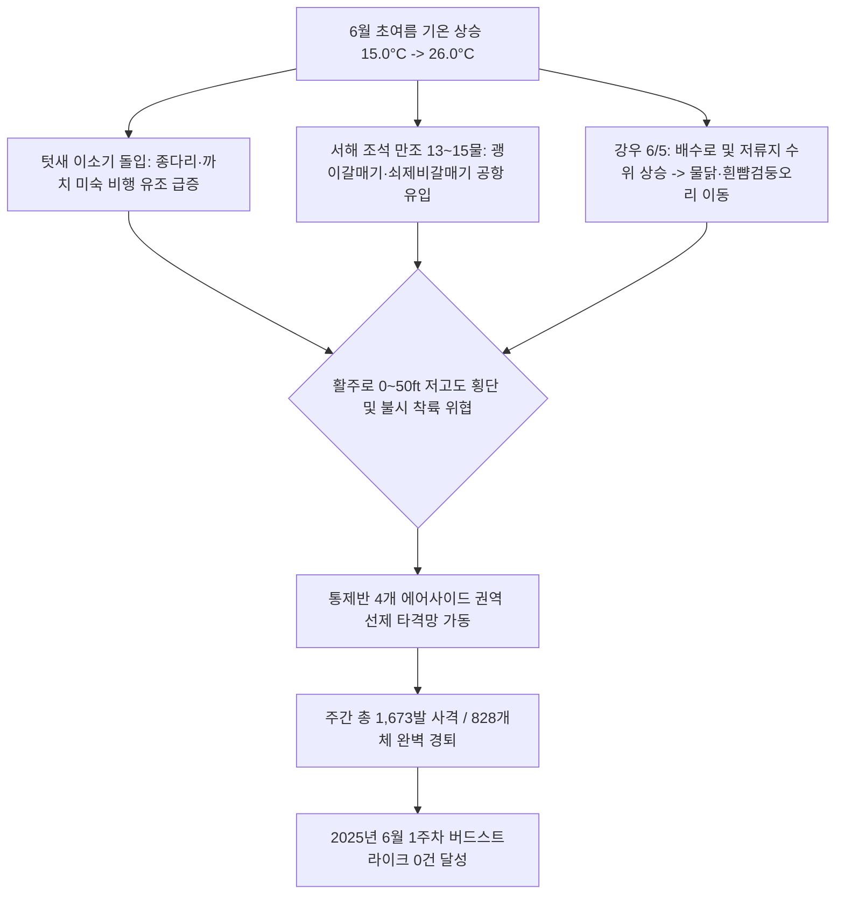

날짜: 2025-06-01 ~ 2025-06-08
카테고리: 야생동물점검 / 주간점검종합
출처: 2025년 6월 1일~8일 일일점검 데이터베이스 분석 및 기상·조석 통합 매핑
태그: #야통대 #주간점검 #항공안전 #인천공항 #6월1주차 #초여름 #이소기 #쇠제비갈매기 #괭이갈매기 #버드스트라이크0건

---

### [2025년 6월 1주차 야생동물 통제 주간 종합 보고서]
2025년 6월 1일(일)부터 6월 8일(일)까지 8일간 인천공항 에어사이드 및 랜드사이드 전역에서 수행된 야생동물 통제 작전을 종합 분석합니다. 

6월 1주차는 낮 최고 기온이 **26.0°C**까지 상승하는 완연한 초여름 날씨 속에서 **텃새의 육추 후 독립기(이소기, Fledging Period)** 가 본격화되어 비행이 미숙한 어린 새(종다리, 까치)들의 초지대 출몰이 급증하였습니다. 또한 6월 2일 해안선 및 유수지로부터 유입된 **괭이갈매기 130마리**와 **쇠제비갈매기 63마리**, 6월 5일 비 내리는 날씨 속 배수로를 점유한 **물닭 17마리**, 6월 6일 초지대를 집중 점유한 **종다리 34개체**, 그리고 멸종위기 맹금류 **새홀리기** 및 천연기념물 **황조롱이** 등 총 **828개체**의 조류와 포유류 1개체(고라니)를 식별·통제하고 총 **1,673발**의 실탄을 격발하였습니다. 통제반의 선제적 초지대 압박 및 해안선 차단 작전으로 **'버드스트라이크 0건'** 의 완벽한 무사고를 유지하였습니다.

---

### [Executive Summary : 6월 1주차 핵심 통제 성과]
1. **6월 2일 괭이갈매기·쇠제비갈매기 복합 군집 차단 (513발 격발)**:
   - 13물 만조 시기 갯벌 취식지가 잠기며 공항 에어사이드와 유수지로 밀려든 괭이갈매기(130)와 쇠제비갈매기(63)를 향해 513발의 집중 제압 사격을 가해 서해 갯벌로 퇴거시켰습니다.
2. **텃새 이소기 어린 새(종다리·까치) 에어사이드 정착 선제 억제**:
   - 6월 6일 에어사이드 녹지대에 출현한 종다리 34개체(유조 포함)와 까치 12개체를 123발의 탄약 소모로 집중 분산하여 활주로 불시 착륙을 원천 차단하였습니다.
3. **멸종위기 조류 및 맹금류(새홀리기·황조롱이) 안전 유도**:
   - 6월 1일과 4일 에어사이드 상공에 출현한 멸종위기 II급 맹금류 새홀리기(총 3개체) 및 황조롱이(4개체)를 비살상 경퇴 및 공포탄으로 외곽 산림으로 안전하게 유도하였습니다.
4. **8일간 총 1,673발 격발 및 항공 안전 100% 수호**:
   - 7호탄 1,384발, 4호탄 248발, 공포탄 41발을 전략적으로 운용하여 828개체를 완벽 제압하고 무사고 운항을 달성하였습니다.

---

### [Weather & Environment Matrix : 6월 1주차 기상 환경]

```
[6월 1주차 기상 환경 매트릭스]
+------------+-------------+-----------------+-------------+-------------+-----------------------+
|    일자    |  날씨/기상  | 기온(최저/최고) | 풍향 / 풍속 |  조석(물때) |   주요 출현/통제 종   |
+------------+-------------+-----------------+-------------+-------------+-----------------------+
| 06-01 (일) |    맑음     |  15.0 / 23.0°C  | NW / 6.0kts |    12물     | 까치(10), 새홀리기(1) |
| 06-02 (월) |    맑음     |  15.5 / 24.0°C  |  W / 5.0kts |    13물     | 괭이갈매기(130), 쇠제비|
| 06-03 (화) |  구름조금   |  16.0 / 25.0°C  | SW / 4.5kts |    14물     | 까마귀(8), 종다리(7)  |
| 06-04 (수) |    흐림     |  16.5 / 23.5°C  |  S / 4.0kts | 15물(조금)  | 쇠제비갈매기(21), 오리|
| 06-05 (목) |    비       |  17.0 / 22.0°C  | SE / 6.5kts |     1물     | 물닭(17), 흰뺨(16)    |
| 06-06 (금) |    맑음     |  16.0 / 24.5°C  | NW / 7.5kts |     2물     | 종다리(34), 까치(12)  |
| 06-07 (토) |    맑음     |  15.5 / 25.0°C  |  W / 5.2kts |     3물     | 쇠제비갈매기(18)      |
| 06-08 (일) |  구름조금   |  16.0 / 26.0°C  | SW / 4.8kts |     4물     | 쇠제비갈매기(21), 까치|
+------------+-------------+-----------------+-------------+-------------+-----------------------+
```

---

### [Threat Flow Diagram : 6월 1주차 조류 위협 및 통제 메커니즘]



---

### [Veterans' Operational Tacit Knowledge : 현장 암묵지 수칙]

> [!TIP]
> **18년 베테랑 반장의 6월 1주차 현장 작전 수칙**
> 1. **이소기 어린 새(Fledgling) 조우 시의 저속 유도 기법**: 6월 초 둥지를 떠난 종다리와 까치 유조는 총성에 패닉 상태에 빠져 날아오르지 못하고 활주로 아스팔트 바닥을 기어 다니는 경우가 많다. 무리한 연속 사격보다는 순찰 차량의 비상등과 경적을 간헐적으로 울리며 초지대 방향으로 천천히 밀어내는 유도가 훨씬 안전하다.
> 2. **쇠제비갈매기 급강하(Diving) 비행 패턴 대응**: 쇠제비갈매기는 배수로의 작은 물고기나 초지 곤충을 노리고 수직으로 꽂히듯 급강하하므로 항공기 착륙 진입로와 겹치기 쉽다. 활주로 F구역 상공 선회 시 즉시 4호탄을 상공으로 발사하여 상승 기류를 타고 바다 쪽으로 이탈하게 유도해야 한다.
> 3. **비 온 뒤 배수로 수초 및 유수지 모니터링**: 6월 5일 강우 후 배수로 수위가 오르면 물닭과 오리류가 은신처에서 나와 유수지로 집결한다. 강우 직후에는 남/북 유수지와 배수로 합류부를 1시간 간격으로 정밀 순찰해야 한다.

---

### [Quantitative Statistics : 6월 1주차 세부 통계]

#### Table 1. 일자별 출현 개체수 및 탄약 소모 실적
| 일자 | 요일 | 기온(°C) | 날씨 | 주요 출현종 | 관측 개체수 | 7호탄 (발) | 4호탄 (발) | 공포탄 (발) | 일일 총 격발 (발) |
| :---: | :---: | :---: | :---: | :--- | :---: | :---: | :---: | :---: | :---: |
| 06-01 | 일 | 15.0/23.0 | 맑음 | 까치, 중백로, 가마우지, 새홀리기, 왜가리 | 37 | 249 | 8 | 3 | 260 |
| 06-02 | 월 | 15.5/24.0 | 맑음 | **괭이갈매기(130)**, 흰뺨(97), 쇠제비(63), 고라니(1) | 443 | 373 | 116 | 24 | **513** |
| 06-03 | 화 | 16.0/25.0 | 구름조금 | 까마귀, 종다리, 흰물떼새, 중백로, 까치 | 34 | 108 | 17 | 4 | 129 |
| 06-04 | 수 | 16.5/23.5 | 흐림 | **쇠제비갈매기(21)**, 흰뺨(18), 종다리, 새홀리기 | 85 | 212 | 17 | 0 | 229 |
| 06-05 | 목 | 17.0/22.0 | 비 | **물닭(17)**, 흰뺨검둥오리(16), 종다리, 까마귀 | 73 | 169 | 42 | 4 | 215 |
| 06-06 | 금 | 16.0/24.5 | 맑음 | **종다리(34)**, 까치(12), 까마귀, 중백로 | 71 | 99 | 23 | 1 | 123 |
| 06-07 | 토 | 15.5/25.0 | 맑음 | **쇠제비갈매기(18)**, 까치, 종다리, 까마귀 | 40 | 107 | 13 | 0 | 120 |
| 06-08 | 일 | 16.0/26.0 | 구름조금 | **쇠제비갈매기(21)**, 까치, 중대백로, 알락할미새 | 45 | 67 | 12 | 5 | 84 |
| **합계** | - | - | - | - | **828** | **1,384** | **248** | **41** | **1,673** |

#### Table 2. 구역별 위험도 및 출현 특성 매트릭스
| 구역 구분 | 주요 활동 조류종 | 주간 격발량 (발) | 위험도 등급 | 현장 지형 특성 및 방어 대책 |
| :--- | :--- | :---: | :---: | :--- |
| **AIRSIDE-15** | 까치, 까마귀, 중백로, 왜가리, 새홀리기 | 342 | **주의** | 남측 녹지대 및 주기장 인접, 텃새 이소 개체 밀착 차단 |
| **AIRSIDE-16** | 쇠제비갈매기, 종다리, 까치, 중대백로 | 294 | **주의** | 북측 활주로 F구역, 해안선 유입 갈매기 저고도 침투 차단 |
| **AIRSIDE-33** | 종다리, 까치, 황조롱이, 중백로, 왜가리 | 438 | **경계** | 중앙 유도로 및 넓은 초지대, 종다리 수직 호버링 집중 제압 |
| **AIRSIDE-34** | 괭이갈매기, 쇠제비갈매기, 멧비둘기, 왜가리 | 465 | **심각** | 남단 해안선 인접, 만조 시 갈매기 대군집 횡단 결사 방어 |
| **LANDSIDE (N/S)** | 괭이갈매기, 흰뺨검둥오리, 물닭, 고라니 | 134 | **주의** | 유수지 및 공사지역(IBC), 외곽 펜스 접근 수계 조류 퇴거 |

---

### [Strategic Roadmap : 차주(6월 2주차) 중점 통제 계획]
1. **사리 물때(6/11~6/13) 대비 괭이갈매기 대군집 횡단 결사 방어**:
   - 7~9물 만조 조석 시 서해 갯벌 수몰에 따른 갈매기 수천 마리의 에어사이드 횡단로 선제 차단.
2. **장마철 대비 배수로 및 유수지 수초 제거 작업 독려**:
   - 물닭 및 흰뺨검둥오리 번식 방지를 위한 토목 부서 예초 작업 공조.
3. **고온기(27°C 이상) 총기 점검 및 차량 냉각수 관리 철저**:
   - 폭염기 야외 기동 순찰 차량 정비 및 탄약 보관함 습도 관리.

---

### [Obsidian Vault Interlinks]
- [[20. 인사이트 융합/2025년도 야통대/일일점검/6월 일일점검/2025-06-01_야통대_주간_점검일지_통합]]
- [[20. 인사이트 융합/2025년도 야통대/일일점검/6월 일일점검/2025-06-02_야통대_주간_점검일지_통합]]
- [[20. 인사이트 융합/2025년도 야통대/일일점검/6월 일일점검/2025-06-03_야통대_주간_점검일지_통합]]
- [[20. 인사이트 융합/2025년도 야통대/일일점검/6월 일일점검/2025-06-04_야통대_주간_점검일지_통합]]
- [[20. 인사이트 융합/2025년도 야통대/일일점검/6월 일일점검/2025-06-05_야통대_주간_점검일지_통합]]
- [[20. 인사이트 융합/2025년도 야통대/일일점검/6월 일일점검/2025-06-06_야통대_주간_점검일지_통합]]
- [[20. 인사이트 융합/2025년도 야통대/일일점검/6월 일일점검/2025-06-07_야통대_주간_점검일지_통합]]
- [[20. 인사이트 융합/2025년도 야통대/일일점검/6월 일일점검/2025-06-08_야통대_주간_점검일지_통합]]
- [[2025-05-25~05-31_야통대_주간_점검일지_종합]] (전월 5월 결산 보고서 연계)

---

### [Aviation Wildlife Terminology : 항공 조류 전문 해설]
- **이소기 (Fledging Period)**: 둥지 안에서 어미의 보호를 받던 새끼 새가 깃털이 다 자라 둥지 밖으로 나와 비행과 먹이 활동을 시작하는 시기로, 비행 능력과 위험 회피 능력이 미숙하여 공항 활주로 주변에서 가장 높은 버드스트라이크 위험 요인이 됩니다.
- **쇠제비갈매기 (Little Tern)**: 몸길이 약 22~28cm의 소형 갈매기로 에어사이드 초지나 자갈밭, 배수로 주변에서 먹이를 찾기 위해 공중 정지 비행(호버링) 후 급강하하는 비행 습성을 지녀 착륙 항공기 기체 하부 충돌 위험이 큽니다.

---

### [7 Strategic Inquiries : 미래 항공 안전을 위한 전략적 질문]
1. 6월 2일 괭이갈매기 130마리의 유수지 집결 경로와 인천공항 서측 해안선 방조제 간의 상관관계는 어떻게 규명되는가?
2. 6월 초 이소기를 맞은 종다리 유조의 활주로 불시 착륙 빈도를 낮추기 위한 최적의 초지 예초 주기는 얼마인가?
3. 6월 1주차에 격발된 1,673발의 사격이 텃새 유조들의 위험 회피 학습에 미친 실질적 효과는 어떠한가?
4. 초여름 비(6/5) 이후 배수로에 급증하는 물닭을 차단하기 위한 스마트 수문 차단망 도입은 타당한가?
5. 최고 기온 26.0°C 상승에 따른 에어사이드 곤충 번성과 제비·쇠제비갈매기 유입 간의 상관 모델은 구축되어 있는가?
6. 멸종위기 맹금류 새홀리기의 에어사이드 침투를 억제하기 위한 비사격 레이저 경퇴 장비의 야간 운용 효율성은 어떠한가?
7. 6월 2주차 사리 물때에 예상되는 대규모 갈매기 횡단에 대비한 4개 권역 합동 포위 사격 진형은 준비되었는가?
