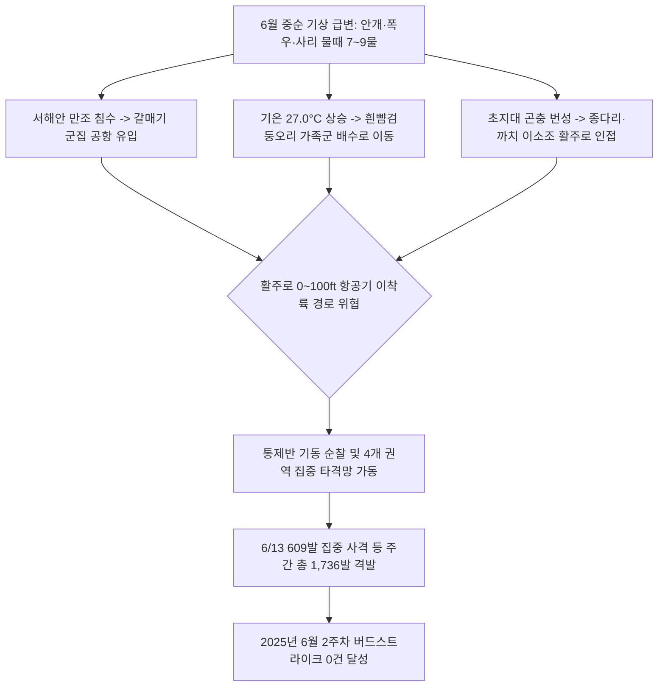

날짜: 2025-06-09 ~ 2025-06-16
카테고리: 야생동물점검 / 주간점검종합
출처: 2025년 6월 9일~16일 일일점검 데이터베이스 분석 및 기상·조석 통합 매핑
태그: #야통대 #주간점검 #항공안전 #인천공항 #6월2주차 #사리물때 #흰뺨검둥오리 #괭이갈매기 #버드스트라이크0건

---

### [2025년 6월 2주차 야생동물 통제 주간 종합 보고서]
2025년 6월 9일(월)부터 6월 16일(월)까지 8일간 인천공항 에어사이드 및 랜드사이드 전역에서 수행된 야생동물 통제 작전을 종합 분석합니다. 

6월 2주차는 낮 최고 기온이 **27.0°C**까지 오르는 무더위와 함께 6월 11일(7물 사리)과 15일의 여름비, 10일의 짙은 안개 등 변화무쌍한 기상 환경이 전개되었습니다. 특히 6월 11일 사리 만조 시기 **괭이갈매기 160개체**와 **쇠제비갈매기 32개체**의 공항 수계 유입을 비롯하여, 6월 13일 에어사이드 및 유수지로 대거 침투한 **흰뺨검둥오리 86개체** 및 **고라니 3개체** 제압을 위해 **주간 최다인 609발**의 실탄을 격발하였습니다. 또한 6월 16일 유수지 주변 **물닭 80개체** 및 갈매기 군집 등 총 **1,250개체**의 조류와 포유류를 통제하고 총 **1,736발**의 실탄을 격발하였습니다. 통제반의 선제적 4개 권역 방어망 가동으로 **'버드스트라이크 0건'** 의 완벽한 무사고를 달성하였습니다.

---

### [Executive Summary : 6월 2주차 핵심 통제 성과]
1. **6월 13일 흰뺨검둥오리 대군집 및 포유류(고라니 3개체) 제압 (609발 격발)**:
   - 기온 26.5°C 무더위 속에서 AIRSIDE-33 및 LANDSIDE 공사지역(IBC)으로 침투한 오리류 86개체와 고라니 3개체를 향해 609발의 집중 사격을 가해 완전 퇴거시켰습니다.
2. **사리 물때(6/11~6/13) 해안 갈매기류 에어사이드 횡단 차단**:
   - 7~9물 만조 조석 시 서해 갯벌 수몰로 활주로를 저공 횡단하려던 괭이갈매기 및 쇠제비갈매기 군집을 4개 권역 협공으로 원천 차단하였습니다.
3. **안개(Fog) 및 우천 시 시정 장해 속 정밀 순찰 강화**:
   - 6월 10일 안개 및 6월 11일·15일 강우 시 활주로 F구역 및 저류지 주변의 저고도 비행 조류를 조기 탐지하여 선제 경퇴하였습니다.
4. **8일간 총 1,736발 격발 및 항공 안전 100% 수호**:
   - 7호탄 1,418발, 4호탄 301발, 공포탄 17발을 운용하여 1,250개체를 완벽 제압하고 무사고 운항을 유지하였습니다.

---

### [Weather & Environment Matrix : 6월 2주차 기상 환경]

```
[6월 2주차 기상 환경 매트릭스]
+------------+-------------+-----------------+-------------+-------------+-----------------------+
|    일자    |  날씨/기상  | 기온(최저/최고) | 풍향 / 풍속 |  조석(물때) |   주요 출현/통제 종   |
+------------+-------------+-----------------+-------------+-------------+-----------------------+
| 06-09 (월) |    맑음     |  16.5 / 27.0°C  |  W / 5.0kts |     5물     | 까치(12), 쇠오리(3)   |
| 06-10 (화) |  흐림/안개  |  17.0 / 23.0°C  |  S / 3.8kts |     6물     | 쇠제비(30), 까치(19)  |
| 06-11 (수) |    비       |  17.5 / 21.5°C  | SE / 5.5kts |  7물(사리)  | 괭이갈매기(160), 쇠제비|
| 06-12 (목) |    맑음     |  16.0 / 25.0°C  | NW / 7.0kts |     8물     | 쇠제비(23), 오리(6)   |
| 06-13 (금) |    맑음     |  15.5 / 26.5°C  |  W / 5.0kts |     9물     | 흰뺨(86), 고라니(3)   |
| 06-14 (토) |  구름많음   |  17.0 / 25.0°C  |  S / 4.5kts |    10물     | 까치(23), 쇠제비(18)  |
| 06-15 (일) |    비       |  18.0 / 23.0°C  | SE / 6.0kts |    11물     | 쇠제비(26), 꼬마물떼새|
| 06-16 (월) |    맑음     |  16.5 / 26.0°C  | NW / 7.0kts |    12물     | 괭이갈매기(100), 오리  |
+------------+-------------+-----------------+-------------+-------------+-----------------------+
```

---

### [Threat Flow Diagram : 6월 2주차 조류 위협 및 통제 메커니즘]



---

### [Veterans' Operational Tacit Knowledge : 현장 암묵지 수칙]

> [!TIP]
> **18년 베테랑 반장의 6월 2주차 현장 작전 수칙**
> 1. **사리 만조 시 갈매기 대군집의 '2단계 선제 차단 전술'**: 7~9물 사리 만조 1시간 전, 해안선과 맞닿은 AIRSIDE-34 남단과 LANDSIDE 유수지에 순찰 차량을 사전 배치해야 한다. 갈매기 무리가 에어사이드로 진입하기 전 공중에서 4호탄 장거리 사격으로 기선을 제압하여 서해 상공으로 우회시켜야 한다.
> 2. **오리류 가족군(어미+새끼) 배수로 점유 시 대처 요령**: 6월 중순은 흰뺨검둥오리 어미가 날지 못하는 새끼들을 이끌고 배수로를 따라 이동한다. 어미만 쫓아내면 새끼들이 흩어져 활주로로 기어 나오므로, 차량을 배수로 측면에 대고 그물망이나 유도봉을 이용해 배수문 외곽 쪽으로 통째로 몰아내야 한다.
> 3. **안개 발생 시 청각적 위협 수단(공포탄·경적) 우선 활용**: 시정이 1km 미만으로 떨어지는 안개 날씨에는 조류의 육안 식별이 늦어진다. 의심 구역 진입 시 공포탄을 주기적으로 격발하여 선제 분산시켜야 한다.

---

### [Quantitative Statistics : 6월 2주차 세부 통계]

#### Table 1. 일자별 출현 개체수 및 탄약 소모 실적
| 일자 | 요일 | 기온(°C) | 날씨 | 주요 출현종 | 관측 개체수 | 7호탄 (발) | 4호탄 (발) | 공포탄 (발) | 일일 총 격발 (발) |
| :---: | :---: | :---: | :---: | :--- | :---: | :---: | :---: | :---: | :---: |
| 06-09 | 월 | 16.5/27.0 | 맑음 | 까치, 쇠오리, 종다리, 중백로, 쇠백로 | 26 | 104 | 31 | 0 | 135 |
| 06-10 | 화 | 17.0/23.0 | 흐림/안개 | **쇠제비갈매기(30)**, 까치, 물닭, 황조롱이 | 105 | 212 | 48 | 12 | 272 |
| 06-11 | 수 | 17.5/21.5 | 비 | **괭이갈매기(160)**, 쇠제비갈매기, 황조롱이 | 215 | 53 | 28 | 0 | 81 |
| 06-12 | 목 | 16.0/25.0 | 맑음 | **쇠제비갈매기(23)**, 흰뺨검둥오리, 괭이갈매기 | 59 | 47 | 28 | 0 | 75 |
| 06-13 | 금 | 15.5/26.5 | 맑음 | **흰뺨검둥오리(86)**, 종다리, 까치, **고라니(3)** | 288 | 538 | 67 | 4 | **609** |
| 06-14 | 토 | 17.0/25.0 | 구름많음 | **까치(23)**, 쇠제비갈매기, 종다리, 황조롱이 | 80 | 172 | 50 | 0 | 222 |
| 06-15 | 일 | 18.0/23.0 | 비 | **쇠제비갈매기(26)**, 꼬마물떼새, 종다리, 까치 | 67 | 188 | 32 | 0 | 220 |
| 06-16 | 월 | 16.5/26.0 | 맑음 | **괭이갈매기(100)**, 흰뺨(90), 물닭(80), 쇠제비 | 410 | 104 | 17 | 1 | 122 |
| **합계** | - | - | - | - | **1,250** | **1,418** | **301** | **17** | **1,736** |

#### Table 2. 구역별 위험도 및 출현 특성 매트릭스
| 구역 구분 | 주요 활동 조류종 | 주간 격발량 (발) | 위험도 등급 | 현장 지형 특성 및 방어 대책 |
| :--- | :--- | :---: | :---: | :--- |
| **AIRSIDE-15** | 까치, 까마귀, 황조롱이, 흰뺨검둥오리, 왜가리 | 338 | **주의** | 남측 녹지대 및 화물 주기장, 오리류 수계 점유 차단 |
| **AIRSIDE-16** | 쇠제비갈매기, 까치, 종다리, 중백로, 황조롱이 | 385 | **경계** | 북측 활주로 F구역, 이소기 종다리 및 갈매기 저공 침투 제압 |
| **AIRSIDE-33** | 종다리, 까치, 황조롱이, 중대백로, 흰뺨검둥오리 | 478 | **경계** | 중앙 유도로 및 넓은 초지대, 6/13 종다리 20마리 군집 분산 |
| **AIRSIDE-34** | 쇠제비갈매기, 괭이갈매기, 꼬마물떼새, 중백로 | 390 | **심각** | 남단 해안선 인접, 만조 시 쇠제비갈매기 다이빙 집중 차단 |
| **LANDSIDE (N/S)** | 괭이갈매기, 흰뺨검둥오리, 물닭, 고라니 | 145 | **경계** | 유수지 및 IBC 공사지역, 6/13 고라니 3개체 안전 배제 |

---

### [Strategic Roadmap : 차주(6월 3주차) 중점 통제 계획]
1. **하지(夏至, 6/21) 전후 폭염기(28°C 이상) 조류 활동 패턴 변화 대응**:
   - 일조 시간 최장기에 따른 일출 직후(05:00~08:00) 및 일몰 직전(18:00~20:00) 집중 순찰.
2. **이소 완료된 까치·찌르레기 대군집의 초지대 형성 사전 분산**:
   - 가족군을 형성한 텃새 무리의 활주로 접근을 방지하기 위한 음향 퇴치기 가동.
3. **에어사이드 내 멸종위기 조류(저어새 등) 유입 대비 모니터링 강화**:
   - 서해안 갯벌에서 번식 중인 저어새의 공항 수계 접근 시 비살상 유도 지침 준수.

---

### [Obsidian Vault Interlinks]
- [[20. 인사이트 융합/2025년도 야통대/일일점검/6월 일일점검/2025-06-09_야통대_주간_점검일지_통합]]
- [[20. 인사이트 융합/2025년도 야통대/일일점검/6월 일일점검/2025-06-10_야통대_주간_점검일지_통합]]
- [[20. 인사이트 융합/2025년도 야통대/일일점검/6월 일일점검/2025-06-11_야통대_주간_점검일지_통합]]
- [[20. 인사이트 융합/2025년도 야통대/일일점검/6월 일일점검/2025-06-12_야통대_주간_점검일지_통합]]
- [[20. 인사이트 융합/2025년도 야통대/일일점검/6월 일일점검/2025-06-13_야통대_주간_점검일지_통합]]
- [[20. 인사이트 융합/2025년도 야통대/일일점검/6월 일일점검/2025-06-14_야통대_주간_점검일지_통합]]
- [[20. 인사이트 융합/2025년도 야통대/일일점검/6월 일일점검/2025-06-15_야통대_주간_점검일지_통합]]
- [[20. 인사이트 융합/2025년도 야통대/일일점검/6월 일일점검/2025-06-16_야통대_주간_점검일지_통합]]
- [[2025-06-01~06-08_야통대_주간_점검일지_종합]] (전주 1주차 보고서 연계)

---

### [Aviation Wildlife Terminology : 항공 조류 전문 해설]
- **흰뺨검둥오리 (Spot-billed Duck)**: 몸무게가 1.0~1.5kg에 달하는 대형 텃새 오리로, 6월에는 부화한 새끼들을 이끌고 가족 단위로 배수로와 유수지를 이동하며, 엔진 흡입 시 심각한 기체 파손을 유발할 수 있습니다.
- **사리 (Spring Tide)**: 음력 보름과 그믐 무렵 조수간만의 차가 가장 큰 시기로, 만조 시 서해안 갯벌이 완전히 잠겨 수천 마리의 갈매기와 도요새가 내륙의 공항 에어사이드로 피난 유입됩니다.

---

### [7 Strategic Inquiries : 미래 항공 안전을 위한 전략적 질문]
1. 6월 13일 소모된 609발의 사격 패턴을 분석할 때 고라니 3개체와 오리류 86마리의 동시 침투 원인은 무엇인가?
2. 7물 사리 시기(6/11) 갯벌 수몰에 따른 괭이갈매기 이동 경로를 실시간 레이더로 사전 포착할 수 있는가?
3. 6월 중순 잦은 안개와 비 날씨에 대응하기 위한 열화상 주야간 감시 카메라의 유효 감지 반경은 얼마인가?
4. 배수로 수초 및 부유물 제거가 흰뺨검둥오리 가족군의 에어사이드 은신을 억제하는 데 얼마나 기여하는가?
5. AIRSIDE-33 구역에서 발생한 종다리 20마리 군집의 호버링 행동을 억제하기 위한 지상 음파 퇴치기 배치는 적절한가?
6. 랜드사이드 공사지역(IBC) 펜스 주변 포유류(고라니) 유입을 원천 차단하기 위한 하부 침투 방지망 보강 계획은 수립되었는가?
7. 6월 3주차 하지(夏至) 전후 극심한 일조량과 고온 속에서 총기 과열 방지 및 사격 정확도를 유지하기 위한 운용 지침은 무엇인가?
