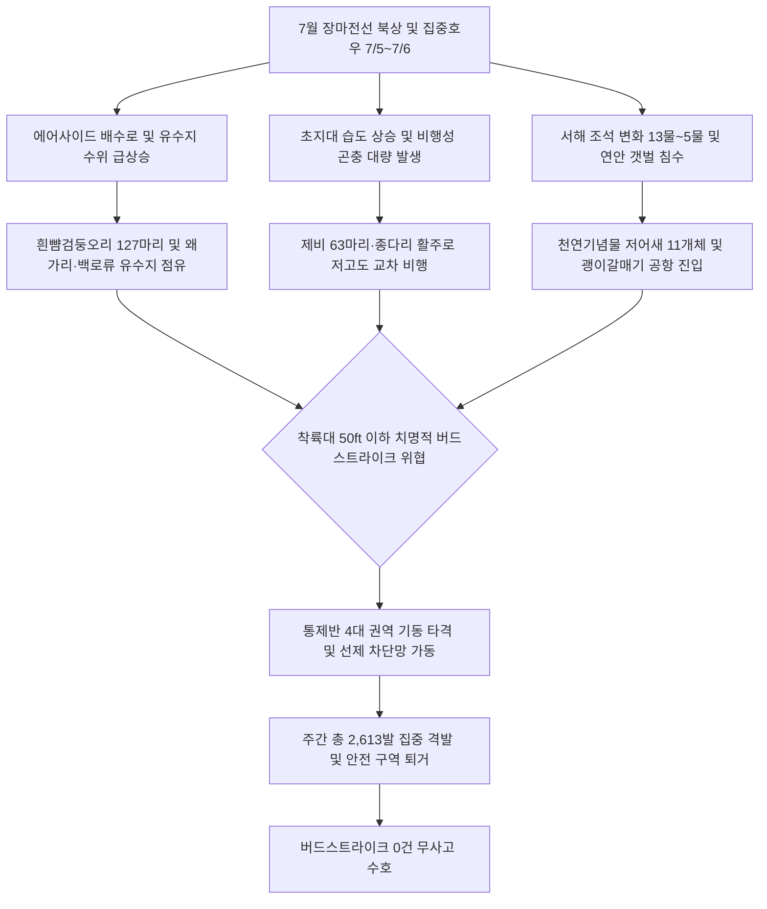

날짜: 2025-07-01 ~ 2025-07-08
카테고리: 야생동물점검 / 주간점검종합
출처: 2025년 7월 1일~8일 일일점검 데이터베이스 및 기상·조석 관측망
태그: #야통대 #주간점검 #항공안전 #인천공항 #7월1주차 #장마전선 #흰뺨검둥오리 #제비 #황조롱이 #저어새 #버드스트라이크0건

---

### [2025년 7월 1주차 야생동물 통제 종합 보고]
2025년 7월 1일(화)부터 7월 8일(화)까지 8일간 인천공항 에어사이드 및 랜드사이드 전역에서 수행된 7월 1주차 야생동물 통제 작전 결과를 종합 보고합니다. 

7월 1주차는 본격적인 장마전선의 북상에 따른 집중호우(7월 5일, 6일 강우)와 기온 상승(최고 29.0°C)이 겹치며, **배수로 수위 급상승에 따른 흰뺨검둥오리 및 왜가리·백로류 유입**, **초지대 곤충 번성에 따른 제비 급증**, 그리고 **사리·조금 조석 순환(13물~5물)에 따른 연안 갈매기류 및 천연기념물 저어새(7월 7일 11개체) 유입**이 복합적으로 발생하였습니다. 

통제반은 1일 823발의 대규모 타격을 필두로 8일간 총 **2,613발**의 탄약을 집중 격발하여 총 **307개체**의 고위험 조류를 안전 구역 밖으로 완벽히 퇴거 조치하였으며, 주간 **'버드스트라이크 0건'**의 완벽한 항공 안전을 유지하였습니다.

---

### [Executive Summary : 7월 1주차 주요 실적 및 핵심 성과]
1. **7월 1일 흰뺨검둥오리 127마리 침투 및 823발 집중 제압**:
   - 7월 첫날 장마 전초기 유수지와 배수로를 급습한 흰뺨검둥오리 대군집(127마리)을 향해 823발의 집중 경퇴 사격을 실시하여 활주로 접근을 원천 차단하였습니다.
2. **장마철 호우 속 제비·종다리 식충성 조류 선제 분산**:
   - 7월 3일(63마리), 5일(34마리), 6일(26마리) 등 습도가 높고 비가 내릴 때 저고도로 비행하는 제비 떼를 총 742발의 사격으로 분산 유도하였습니다.
3. **천연기념물 저어새(7월 7일 11개체) 및 멸종위기 새홀리기 안전 보호 유도**:
   - 7월 7일 사리 물때에 공항 녹지대로 날아든 저어새 11개체(남측 활주로 6, 5개체)를 비살상 공포탄 및 7호탄 원거리 위협 사격으로 해안 갯벌로 안전 유도하였습니다.
4. **'버드스트라이크 0건' 달성 (주간 총 2,613발 격발)**:
   - 장마철 수계 조류와 공사지역 유입 포유류(고라니 1개체)를 완벽히 통제하며 무결점 항공 안전을 달성하였습니다.

---

### [Weather & Environment Matrix : 7월 1주차 기상 환경]

```
[7월 1주차 기상 환경 매트릭스]
+------------+-------------+-----------------+-------------+-------------+-----------------------+
|    일자    |  날씨/기상  | 기온(최저/최고) | 풍향 / 풍속 |  조석(물때) |   주요 출현/통제 종   |
+------------+-------------+-----------------+-------------+-------------+-----------------------+
| 07-01 (화) |    맑음     |  20.0 / 26.0°C  | SW / 5.0kts |    13물     | 흰뺨(127), 괭이(120)  |
| 07-02 (수) |    맑음     |  20.5 / 27.0°C  |  W / 4.5kts |    14물     | 괭이갈매기(16), 왜가리|
| 07-03 (목) |  구름조금   |  21.0 / 28.0°C  | SW / 4.0kts | 15물(조금)  | 제비(63), 쇠제비(19)  |
| 07-04 (금) |    흐림     |  21.5 / 27.5°C  | SE / 3.8kts |     1물     | 까치(13), 황조롱이(7) |
| 07-05 (토) |    비       |  22.0 / 25.0°C  | SE / 6.0kts |     2물     | 제비(34), 종다리(13)  |
| 07-06 (일) |    비       |  21.5 / 26.0°C  | SE / 5.5kts |     3물     | 제비(26), 황조롱이(8) |
| 07-07 (월) |    흐림     |  22.0 / 27.0°C  |  S / 4.0kts |     4물     | 까치(19), 저어새(11)  |
| 07-08 (화) |    맑음     |  21.0 / 29.0°C  |  W / 4.5kts |     5물     | 황조롱이(9), 왜가리(3)|
+------------+-------------+-----------------+-------------+-------------+-----------------------+
```

---

### [Threat Flow Diagram : 7월 1주차 장마철 조류 위협 메커니즘]



---

### [Veterans' Operational Tacit Knowledge : 현장 암묵지 수칙]

> [!TIP]
> **18년 베테랑 반장의 7월 장마 초입 현장 작전 수칙**
> 1. **호우 직후 빗물 고임 구역(Puddle Area) 즉시 선점**: 집중호우가 쏟아진 직후에는 활주로 갓길 녹지대나 유도로 잔디밭에 물웅덩이가 형성된다. 흰뺨검둥오리와 백로류가 30분 이내에 몰려들므로, 비가 그치는 즉시 차량 패트롤을 투입해 물웅덩이 주변을 선제 타격해야 한다.
> 2. **저기압 시 제비 군집의 '활주로 노면 1m 스키밍(Skimming)' 차단**: 기압이 낮고 비가 오기 직전에는 곤충들이 지표면 부근으로 낮게 깔려 비행한다. 이를 쫓는 제비 떼가 활주로 노면 1~2m 높이로 스키밍 비행을 하므로, 공포탄을 상공이 아닌 노면 방향으로 비스듬히 쏘아 음향 충격파로 상승 이탈시켜야 한다.
> 3. **장마철 천연기념물 저어새의 유입 시 비살상 원칙 철저**: 서해 갯벌 수위 상승 시 저어새가 남측 활주로 녹지대로 피신해 온다. 절대 실탄을 직격하지 말고 100m 이상 거리에서 공포탄과 7호탄 소음으로 서측 해안선으로 곱게 유도해야 한다.

---

### [Quantitative Statistics : 7월 1주차 통계]

#### Table 1. 7월 1주차 일자별 세부 실적
| 일자 | 요일 | 기온(°C) | 날씨 | 주요 출현종 | 식별 개체수 | 7호탄 | 4호탄 | 공포탄 | 일일 총 격발 |
| :---: | :---: | :---: | :---: | :--- | :---: | :---: | :---: | :---: | :---: |
| 07-01 | 화 | 20.0/26.0 | 맑음 | **흰뺨검둥오리(127)**, 괭이(120), 왜가리, 중백로 | 127 | 719 | 88 | 16 | **823** |
| 07-02 | 수 | 20.5/27.0 | 맑음 | **괭이갈매기(16)**, 왜가리(8), 쇠제비, 까치, 꿩 | 16 | 231 | 22 | 5 | 258 |
| 07-03 | 목 | 21.0/28.0 | 구름조금 | **제비(63)**, 쇠제비(19), 까치, 중백로, 황조롱이 | 63 | 247 | 30 | 2 | 279 |
| 07-04 | 금 | 21.5/27.5 | 흐림 | **까치(13)**, 황조롱이(7), 중대백로, 새홀리기 | 13 | 280 | 37 | 16 | 333 |
| 07-05 | 토 | 22.0/25.0 | 비 | **제비(34)**, 종다리(13), 황조롱이, 중백로 | 34 | 148 | 58 | 10 | 216 |
| 07-06 | 일 | 21.5/26.0 | 비 | **제비(26)**, 황조롱이(8), 까치, 중백로, 해오라기 | 26 | 202 | 41 | 4 | 247 |
| 07-07 | 월 | 22.0/27.0 | 흐림 | **까치(19)**, **저어새(11)**, 중백로, 흰뺨, 쇠제비 | 19 | 285 | 31 | 13 | 329 |
| 07-08 | 화 | 21.0/29.0 | 맑음 | **황조롱이(9)**, 왜가리, 중백로, 종다리, 찌르레기 | 9 | 106 | 11 | 11 | 128 |
| **주간계**| - | - | - | - | **307** | **2,218** | **318** | **77** | **2,613** |

```
[7월 1주차 탄약 소모 구성비]
■ 7호탄 (분산 및 소형 제압용) : 2,218발 ( 84.9%)
■ 4호탄 (중대형 수조류 경퇴용) :   318발 ( 12.2%)
■ 공포탄 (음향 위협/보호종 유도) :    77발 (  2.9%)
총 격발 수량 : 2,613발 (100.0%)
```

#### Table 2. 구역별 위험도 및 출현 특성 매트릭스
| 구역 구분 | 주요 점유 지점 | 주 출현 조류종 | 위험 등급 | 핵심 대응 전술 |
| :---: | :---: | :---: | :---: | :--- |
| **AIRSIDE-15** | [녹지대_M], [주기장_V/Z], [녹지대_R] | 제비, 흰뺨검둥오리, 황조롱이, 중대백로 | **심각 (Critical)** | 주기장 저고도 침투 제비군 분산 및 배수로 수조류 타격 |
| **AIRSIDE-16** | [활주로_F(북)], [녹지대_V], 소방분소 | 쇠제비갈매기, 종다리, 왜가리, 황조롱이 | **경계 (High)** | 활주로 횡단 갈매기 및 초지대 맹금류 선제 요격 |
| **AIRSIDE-33** | [녹지대_Q], [녹지대_P], [주기장_W] | 제비, 까치, 중백로, 황조롱이, 새홀리기 | **경계 (High)** | 남측 녹지대 곤충 취식 조류 분산 및 법정보호종 유도 |
| **AIRSIDE-34** | [활주로_F(남)], [녹지대_K], 유도로 | **저어새(11)**, 찌르레기, 제비, 왜가리 | **심각 (Critical)** | 저어새 무리 비살상 해안 유도 및 활주로 이착륙로 방어 |
| **LANDSIDE-N/S**| 북/남 유수지, IBC 공사지역, 하늘정원 | 흰뺨검둥오리(80), 괭이갈매기(100), 고라니 | **주의 (Moderate)** | 에어사이드 펜스 접근 수조류 배제 및 포유류 차단 |

---

### [Strategic Roadmap : 7월 2주차 중점 추진 전략]
1. **장마전선 재활성화에 따른 유수지·배수로 24시간 특별 감시**:
   - 집중 강우 예보 시 유수지 수문 개폐 상태를 확인하고 오리류 고착 방지.
2. **식충성 조류(제비·찌르레기) 초지대 집단 취식 예방 약제 살포 공조**:
   - 곤충 밀집 초지대에 대한 친환경 방제 작업 지원.
3. **혹서기 폭염(30°C 이상) 대비 총기 냉각 및 대원 온열질환 관리**:
   - 차량 내 총기 과열 방지 및 얼음물·이온음료 보급.

---

### [Obsidian Vault Interlinks]
- [[20. 인사이트 융합/2025년도 야통대/일일점검/7월 일일점검/2025-07-01_야통대_주간_점검일지_통합]]
- [[20. 인사이트 융합/2025년도 야통대/일일점검/7월 일일점검/2025-07-02_야통대_주간_점검일지_통합]]
- [[20. 인사이트 융합/2025년도 야통대/일일점검/7월 일일점검/2025-07-03_야통대_주간_점검일지_통합]]
- [[20. 인사이트 융합/2025년도 야통대/일일점검/7월 일일점검/2025-07-04_야통대_주간_점검일지_통합]]
- [[20. 인사이트 융합/2025년도 야통대/일일점검/7월 일일점검/2025-07-05_야통대_주간_점검일지_통합]]
- [[20. 인사이트 융합/2025년도 야통대/일일점검/7월 일일점검/2025-07-06_야통대_주간_점검일지_통합]]
- [[20. 인사이트 융합/2025년도 야통대/일일점검/7월 일일점검/2025-07-07_야통대_주간_점검일지_통합]]
- [[20. 인사이트 융합/2025년도 야통대/일일점검/7월 일일점검/2025-07-08_야통대_주간_점검일지_통합]]
- [[2025-06-25~06-30_야통대_주간_점검일지_종합]] (6월 월말 결산 연계)

---

### [Aviation Wildlife Terminology : 항공 조류 전문 해설]
- **노면 스키밍 비행 (Runway Skimming)**: 제비나 칼새 등이 지표면의 곤충을 잡기 위해 활주로 아스팔트 포장면 위 1~3m 고도로 활공하듯 비행하는 위험 행동으로, 착륙 중인 항공기의 엔진 흡입구 및 랜딩기어 충돌 확률을 급격히 높입니다.
- **저어새 (Black-faced Spoonbill)**: 멸종위기 야생생물 I급이자 천연기념물 제205-1호로, 주걱 모양의 부리를 좌우로 저으며 얕은 물에서 먹이를 찾는 습성이 있어 장마철 공항 유수지 및 침수 초지에 유입될 수 있어 특별 보호 통제가 요구됩니다.

---

### [7 Strategic Inquiries : 미래 항공 안전을 위한 전략적 질문]
1. 7월 1일 출현한 흰뺨검둥오리 127마리의 에어사이드 유입 통로가 된 북측 배수문의 차단망 구조를 어떻게 개선할 것인가?
2. 7월 5~6일 집중호우 시 제비 군집의 활주로 저고도 스키밍 비행을 선제 분산시키기 위한 레이저 퇴치기 도입은 유효한가?
3. 7월 7일 출현한 천연기념물 저어새 11개체의 안전 유도 경로를 표준 매뉴얼로 공식화할 필요성이 있는가?
4. 장마철 잦은 총기 사용에 따른 습기 차단 및 총열 녹 방지를 위한 특수 방청제 도포 주기는 어떻게 설정할 것인가?
5. 주간 2,613발의 대규모 격발이 장마철 에어사이드 조류의 분산 경로에 미친 생태학적 영향은 무엇인가?
6. 고온 다습한 기후에서 활주로 녹지대의 곤충 발생을 억제하기 위한 예초 주기 단축 방안은 검토되었는가?
7. 랜드사이드 IBC 공사지역의 고라니 침투를 원천 차단하기 위한 임시 가설 펜스 보강 작업은 완료되었는가?
