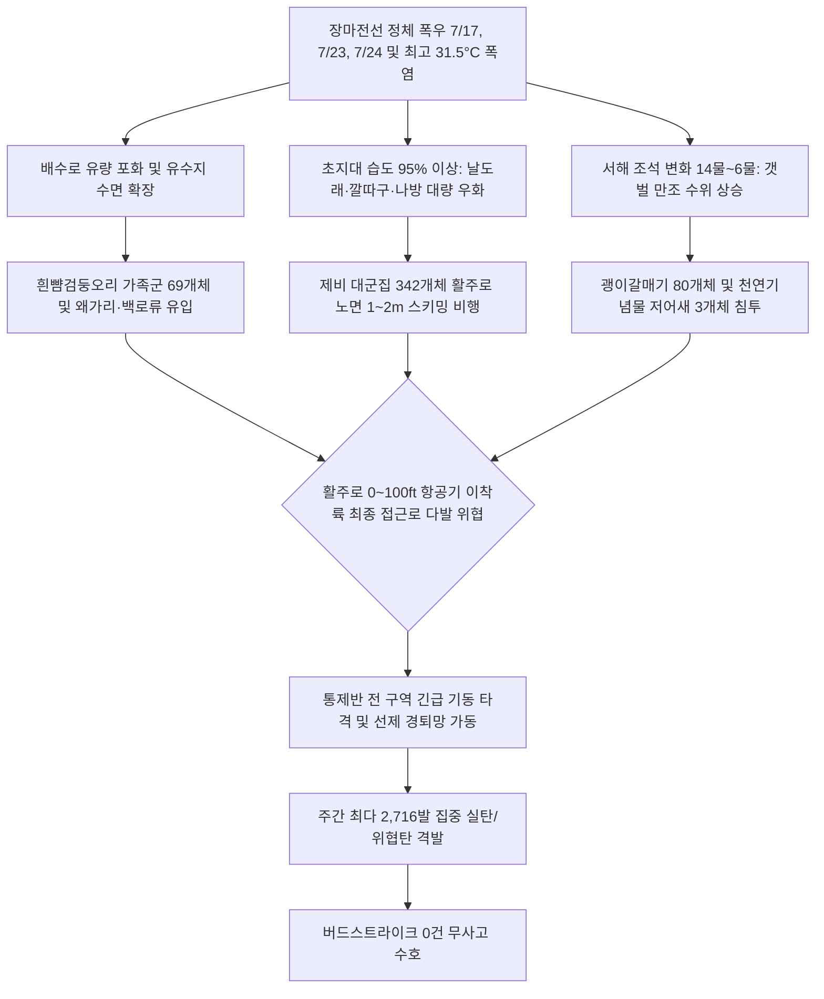

날짜: 2025-07-17 ~ 2025-07-24
카테고리: 야생동물점검 / 주간점검종합
출처: 2025년 7월 17일~24일 일일점검 데이터베이스 및 기상·조석 관측망
태그: #야통대 #주간점검 #항공안전 #인천공항 #7월3주차 #장마기절정 #제비대군집 #흰뺨검둥오리 #괭이갈매기 #저어새 #버드스트라이크0건

---

### [2025년 7월 3주차 야생동물 통제 종합 보고]
2025년 7월 17일(목)부터 7월 24일(목)까지 8일간 인천공항 에어사이드 및 랜드사이드 전역에서 수행된 7월 3주차 야생동물 통제 작전 결과를 종합 보고합니다. 

7월 3주차는 장마전선의 정체로 인한 연이은 강우(7월 17일, 23일, 24일)와 비가 갠 직후 치솟는 한낮 **31.5°C의 찜통더위**가 교차하며, **7월 중 가장 강력한 조류 위협과 최다 탄약 격발(2,716발)**이 기록된 주간이었습니다. 특히 7월 17일(141마리), 18일(110마리), 19일(91마리) 3일 연속으로 활주로 및 유도로 상공을 뒤덮은 **제비 대군집(누적 342개체)**과 7월 21일(30개체/513발 격발) 및 22일(80개체/489발 격발) 수계와 연안에서 밀려든 **흰뺨검둥오리·괭이갈매기**, 천연기념물 **저어새(3개체)**, 그리고 희귀 조류 **후투티(1개체)** 등 총 **586개체**의 야생동물이 식별·통제되었습니다. 

통제반은 4대 권역에 걸쳐 전방위 기동 방어망을 가동, 주간 총 **2,716발**의 집중 타격을 통해 활주로 0~100ft 내 모든 위험 요소를 완벽히 제거하였으며 **'버드스트라이크 0건'**의 대기록을 굳건히 수호하였습니다.

---

### [Executive Summary : 7월 3주차 주요 실적 및 핵심 성과]
1. **3일 연속 제비 대군집(누적 342마리) 횡단 결사 저지**:
   - 7월 17일(141마리), 18일(110마리), 19일(91마리) 활주로 저고도(1~3m)로 쏟아져 들어온 제비 떼를 향해 총 816발의 7호탄 소총 사격으로 이탈을 유도하였습니다.
2. **7월 21일~22일 수계·해안 조류 대유입 1,002발 집중 제압**:
   - 21일 흰뺨검둥오리 30마리 및 맹금류 11마리에 513발, 22일 괭이갈매기 80마리 및 흰뺨검둥오리 69마리에 489발을 연속 사격하여 공항 외곽으로 완전 퇴거시켰습니다.
3. **천연기념물 저어새(7월 22일 3개체) 및 희귀종 후투티(7월 23일 1개체) 안전 유도**:
   - 에어사이드 녹지대로 유입된 저어새 3개체와 후투티 1개체를 비살상 원거리 유도 전술로 안전 구역으로 배제하였습니다.
4. **'버드스트라이크 0건' 수호 (7월 주간 최다 2,716발 격발)**:
   - 폭우와 폭염 속에서도 586개체의 복합 조류 위협을 완벽히 방어하며 항공 무사고를 달성하였습니다.

---

### [Weather & Environment Matrix : 7월 3주차 기상 환경]

```
[7월 3주차 기상 환경 매트릭스]
+------------+-------------+-----------------+-------------+-------------+-----------------------+
|    일자    |  날씨/기상  | 기온(최저/최고) | 풍향 / 풍속 |  조석(물때) |   주요 출현/통제 종   |
+------------+-------------+-----------------+-------------+-------------+-----------------------+
| 07-17 (목) |    비       |  22.0 / 25.5°C  | SE / 6.0kts |    14물     | 제비(141), 흰뺨(11)   |
| 07-18 (금) |    흐림     |  22.5 / 28.0°C  |  S / 4.0kts | 15물(조금)  | 제비(110), 흰뺨(55)   |
| 07-19 (토) |    맑음     |  21.5 / 30.0°C  | NW / 5.0kts |     1물     | 제비(91), 흰뺨(46)    |
| 07-20 (일) |    맑음     |  22.0 / 31.0°C  |  W / 4.2kts |     2물     | 흰뺨(19), 알락할미새  |
| 07-21 (월) |  구름조금   |  23.0 / 31.5°C  | SW / 3.8kts |     3물     | 흰뺨(30), 황조롱이(11)|
| 07-22 (화) |    흐림     |  23.5 / 29.5°C  | SE / 4.5kts |     4물     | 괭이(80), 흰뺨(69), 저어새|
| 07-23 (수) |    비       |  23.0 / 27.0°C  | SE / 5.5kts |     5물     | 제비(86), 중백로, 후투티|
| 07-24 (목) |    비       |  22.5 / 26.5°C  |  S / 5.0kts |     6물     | 까치(29), 제비(25)    |
+------------+-------------+-----------------+-------------+-------------+-----------------------+
```

---

### [Threat Flow Diagram : 7월 3주차 장마 절정기 조류 위협 흐름도]



---

### [Veterans' Operational Tacit Knowledge : 현장 암묵지 수칙]

> [!TIP]
> **18년 베테랑 반장의 7월 장마 절정기 현장 작전 수칙**
> 1. **비 내린 직후 제비 군집의 '유도로 아스팔트 건조 지점' 선제 차단**: 장맛비가 그친 직후 아스팔트가 먼저 마르는 유도로 교차점(BV, BL, BP 구역)에 곤충들이 모여들고 이를 노린 제비 수십 마리가 집중 착륙한다. 건조 조짐이 보이는 즉시 차량으로 패트롤하며 7호탄 소총 사격으로 아스팔트 접근을 원천 봉쇄해야 한다.
> 2. **사리 직전 4~6물 갈매기·저어새의 '해무 동반 침투' 차단**: 7월 하순 사리로 접어들 때 남동풍을 타고 해안 안개가 밀려오며 갈매기류와 저어새가 낮은 고도로 활주로 남측(AS-34)으로 스며든다. 레이더 및 육안 관측을 교차 확인하고 접근 즉시 음향 경보기를 가동해야 한다.
> 3. **우천 시 총기 약실 빗물 유입 방지 및 1일 2회 총기 쑤시기(Bore Cleaning)**: 비가 오는 날 사격을 지속하면 약실과 총열에 빗물과 화약 찌꺼기가 엉켜 불발 및 격발 불량이 발생할 수 있다. 교대 시마다 총기 분해 건조 및 약실 세척을 필히 실시해야 한다.

---

### [Quantitative Statistics : 7월 3주차 통계]

#### Table 1. 7월 3주차 일자별 세부 실적
| 일자 | 요일 | 기온(°C) | 날씨 | 주요 출현종 | 식별 개체수 | 7호탄 | 4호탄 | 공포탄 | 일일 총 격발 |
| :---: | :---: | :---: | :---: | :--- | :---: | :---: | :---: | :---: | :---: |
| 07-17 | 목 | 22.0/25.5 | 비 | **제비(141)**, 까치(11), 흰뺨(11), 황조롱이, 왜가리 | 141 | 240 | 36 | 12 | 288 |
| 07-18 | 금 | 22.5/28.0 | 흐림 | **제비(110)**, 흰뺨(55), 황조롱이(8), 까치, 종다리 | 110 | 200 | 30 | 8 | 238 |
| 07-19 | 토 | 21.5/30.0 | 맑음 | **제비(91)**, 흰뺨(46), 까치(13), 황조롱이, 중백로 | 91 | 267 | 15 | 8 | 290 |
| 07-20 | 일 | 22.0/31.0 | 맑음 | **흰뺨(19)**, 제비(14), 황조롱이(6), 알락할미새 | 19 | 156 | 25 | 0 | 181 |
| 07-21 | 월 | 23.0/31.5 | 구름조금 | **흰뺨(30)**, 황조롱이(11), 까치, 중백로, 물떼새 | 30 | 448 | 51 | 14 | **513** |
| 07-22 | 화 | 23.5/29.5 | 흐림 | **괭이(80)**, 흰뺨(69), 왜가리, 멧비둘기, **저어새(3)** | 80 | 428 | 61 | 0 | **489** |
| 07-23 | 수 | 23.0/27.0 | 비 | **제비(86)**, 중백로(31), 까치(20), 찌르레기, 후투티 | 86 | 287 | 20 | 0 | 307 |
| 07-24 | 목 | 22.5/26.5 | 비 | **까치(29)**, 제비(25), 황조롱이(17), 중백로, 왜가리 | 29 | 316 | 70 | 24 | **410** |
| **주간계**| - | - | - | - | **586** | **2,342** | **308** | **66** | **2,716** |

```
[7월 3주차 탄약 소모 구성비]
■ 7호탄 (제비 대군집/초지대 분산) : 2,342발 ( 86.2%)
■ 4호탄 (갈매기/흰뺨검둥오리 제압) :   308발 ( 11.3%)
■ 공포탄 (맹금류/저어새 안전 유도) :    66발 (  2.5%)
총 격발 수량 : 2,716발 (100.0%)
```

#### Table 2. 구역별 위험도 및 출현 특성 매트릭스
| 구역 구분 | 주요 점유 지점 | 주 출현 조류종 | 위험 등급 | 핵심 대응 전술 |
| :---: | :---: | :---: | :---: | :--- |
| **AIRSIDE-15** | [녹지대_M], [주기장_V/Z], [녹지대_R] | 제비, 흰뺨검둥오리, 황조롱이, 까치 | **심각 (Critical)** | 저고도 제비 떼 분산 및 배수로 수조류 집중 타격 |
| **AIRSIDE-16** | [녹지대_V], [활주로_F(북)], 유도로 | 황조롱이, 까마귀, 왜가리, 흰뺨검둥오리 | **경계 (High)** | 북측 활주로 진입로 맹금류 및 대형 수조류 선제 요격 |
| **AIRSIDE-33** | [녹지대_Q], [녹지대_P], [주기장_Y] | 제비, 황조롱이, 까치, 중대백로, 후투티 | **심각 (Critical)** | 대형 제비 군집 42마리(7/23) 퇴거 및 희귀종 안전 배제 |
| **AIRSIDE-34** | [활주로_F(남)], [녹지대_K] | 흰뺨검둥오리(24), 제비, 황조롱이, 저어새 | **심각 (Critical)** | 남측 활주로 오리류 및 맹금류 집중 경퇴 |
| **LANDSIDE-N/S**| IBC2-2/2-3, 남측 유수지, 하늘정원 | 흰뺨검둥오리(30), 괭이갈매기(80), 고라니(2) | **경계 (High)** | 공사구역 대형 수조류 분산 및 에어사이드 유입 차단 |

---

### [Strategic Roadmap : 7월 4주차 및 월말 결산 중점 전략]
1. **7월 말 사리 만조(7~9물) 대비 서해 연안 갈매기류 대유입 선제 차단**:
   - 7월 25~27일 사리 물때에 대비하여 남/북측 해안선 펜스 라인 차량 상시 배치.
2. **장마 종료 후 폭염(32°C 이상)에 따른 초지대 텃새 유조 및 맹금류 폭발적 활동 방어**:
   - 초지대 예초 및 곤충 방제 약제 살포 공조 강화.
3. **7월 월간 탄약 누적 소모량 결산 및 8월 하계 성수기 항공 안전 마스터플랜 수립**:
   - 7월 전체 통제 실적 분석 및 8월 태풍/철새 남하 대비 태세 확립.

---

### [Obsidian Vault Interlinks]
- [[20. 인사이트 융합/2025년도 야통대/일일점검/7월 일일점검/2025-07-17_야통대_주간_점검일지_통합]]
- [[20. 인사이트 융합/2025년도 야통대/일일점검/7월 일일점검/2025-07-18_야통대_주간_점검일지_통합]]
- [[20. 인사이트 융합/2025년도 야통대/일일점검/7월 일일점검/2025-07-19_야통대_주간_점검일지_통합]]
- [[20. 인사이트 융합/2025년도 야통대/일일점검/7월 일일점검/2025-07-20_야통대_주간_점검일지_통합]]
- [[20. 인사이트 융합/2025년도 야통대/일일점검/7월 일일점검/2025-07-21_야통대_주간_점검일지_통합]]
- [[20. 인사이트 융합/2025년도 야통대/일일점검/7월 일일점검/2025-07-22_야통대_주간_점검일지_통합]]
- [[20. 인사이트 융합/2025년도 야통대/일일점검/7월 일일점검/2025-07-23_야통대_주간_점검일지_통합]]
- [[20. 인사이트 융합/2025년도 야통대/일일점검/7월 일일점검/2025-07-24_야통대_주간_점검일지_통합]]
- [[2025-07-09~07-16_야통대_주간_점검일지_종합]] (전주 2주차 보고서 연계)

---

### [Aviation Wildlife Terminology : 항공 조류 전문 해설]
- **후투티 (Eurasian Hoopoe)**: 머리에 화려한 부채꼴 댕기 깃이 있는 여름철새로, 땅 위를 걸어 다니며 긴 부리로 흙 속의 땅강아지나 지렁이를 잡아먹습니다. 활주로 주변 초지대에 단독 출현할 경우 이착륙 항공기 소음에 놀라 급상승할 수 있습니다.
- **알락할미새 (White Wagtail)**: 꼬리를 위아래로 흔들며 활주로 아스팔트 및 유도로 콘크리트 포장면을 걸어 다니며 곤충을 잡는 소형 조류로, 빠른 기동성을 지니나 항공기 이착륙 시 지표면에서 갑자기 솟아오르는 위험이 있습니다.

---

### [7 Strategic Inquiries : 미래 항공 안전을 위한 전략적 질문]
1. 7월 17~19일 발생한 제비 대군집(342마리)의 활주로 노면 1m 스키밍 비행을 레이더로 사전 탐지하는 방안은 무엇인가?
2. 7월 21일 513발, 22일 489발 등 연이은 대량 사격 시 대원들의 사격 피로도와 안전사고 예방 대책은 적절한가?
3. 장마철 연이은 폭우 시 산탄총 내 빗물 유입으로 인한 약실 부식을 방지하기 위한 현장 총기 건조 챔버 운영 방안은?
4. 7월 22일 출현한 괭이갈매기 80마리와 천연기념물 저어새 3개체의 이동 경로 차이를 고려한 차등 경퇴 전술은 무엇인가?
5. 초지대 곤충 대량 우화 시기를 예측하기 위한 온·습도 센서 기반 생태 모니터링 시스템 구축 타당성은?
6. 우천 시 배수로 유속 증가에 따른 오리류의 에어사이드 급류 유입을 차단하기 위한 배수문 스크린 개선 방안은?
7. 7월 3주차에 소모된 2,716발의 탄약이 8월 하계 성수기 탄약 비축량에 미치는 영향과 조달 일정은 어떻게 되는가?
