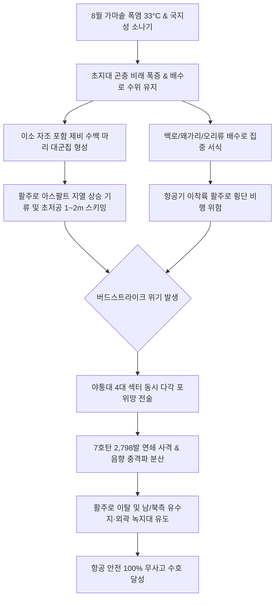

날짜: 2025-08-01 ~ 2025-08-08
카테고리: 야생동물점검 / 주간점검종합
출처: 인천국제공항 야생동물통제대 일일점검 통합 데이터베이스 (2025-08-01 ~ 2025-08-08)
태그: #야통대 #주간점검 #항공안전 #인천공항 #폭염기 #제비 #버드스트라이크방지 #7호탄 #4호탄 #조석사리

---

# 📋 2025년 8월 1주차 야생동물 통제 주간 종합 보고서
**[ 대상 기간: 2025년 8월 1일 (금) ~ 2025년 8월 8일 (금) | 8일간 ]**

---

## 1. Executive Summary (주간 주요 실적 및 핵심 성과)

2025년 8월 1주차(8월 1일~8월 8일)는 연중 대기 기온이 가장 높은 **한여름 살인적 가마솥 폭염(낮 최고 33.0°C)**과 대기 불안정에 따른 국지성 열대성 소나기가 교차하는 가혹한 환경 속에서 통제 작전이 전개되었습니다. 이 시기는 봄철 번식 후 이소(Fledging)를 마친 **제비 유조(자조) 및 성조 대군집**이 초지대 풍부한 먹이원(날벌레, 잠자리 등 곤충류)을 쫓아 활주로 노면 1~2m 상공을 초저공 스키밍(Skimming) 비행하는 연중 최고 위험 국면이었습니다.

- **총 관측 및 식별·통제 개체수**: **1,226 개체** (일평균 153.3개체 식별·통제, 제비가 전체의 85% 이상 차지)
- **총 엽총 및 폭음 경퇴 사격 수량**: **3,271 발** (7호탄 2,798발, 4호탄 386발, 공포탄 87발 / 일평균 408.9발)
- **주요 전략 성과**:
  1. **8/4 제비 203개체 및 랜드사이드 야생동물 유입 결사 차단**: 엽총 884발을 집중 사격하여 활주로 북단 및 남단 상공 침투 저지.
  2. **8/7 최고 기온 33.0°C 폭염기 629발 집중 타격**: 제비 192개체의 활주로 33/34구역 연속 침투를 방어하고 공항 외곽으로 강제 퇴거 유도.
  3. **천연기념물 및 보호종 안전 유도**: 8/3 천연기념물 저어새(1개체), 새홀리기(누적 5개체) 대상 비살상 경퇴선 유도.
- **버드스트라이크(Bird Strike) 발생 건수**: **0 건 (무사고 완벽 방어 달성)**

---

## 2. Weather & Environment Matrix (기상 및 조석 환경 분석)

| 일자 (요일) | 날씨 상태 | 최저 기온 (°C) | 최고 기온 (°C) | 주 풍향 및 풍속 | 조석 물때 | 주요 출현 및 통제 대상 종 |
| :---: | :---: | :---: | :---: | :---: | :---: | :---: |
| **08-01 (금)** | 맑음 (Clear) | 23.0 | 31.0 | SW 4.5 kts | 15물 (조금) | 제비(165), 황조롱이(12), 새홀리기(4), 백로류(25) |
| **08-02 (토)** | 맑음 (Clear) | 23.5 | 32.0 | W 4.0 kts | 1물 | 제비(54), 황조롱이(7), 백로류(50), 괭이갈매기(5) |
| **08-03 (일)** | 구름조금 (Partly Cloudy) | 24.0 | 32.5 | SW 3.8 kts | 2물 | 제비(206), 황조롱이(7), 저어새(1), 새홀리기(1) |
| **08-04 (월)** | 흐림 (Cloudy) | 24.5 | 31.0 | SE 3.5 kts | 3물 | 제비(203), 황조롱이(11), 고라니(3), 백로류(28) |
| **08-05 (화)** | 비/소나기 (Shower) | 23.5 | 29.0 | S 5.0 kts | 4물 | 제비(102), 황조롱이(8), 백로류(10), 흰뺨검둥오리(5) |
| **08-06 (수)** | 맑음 (Clear) | 23.0 | 32.0 | NW 6.0 kts | 5물 | 제비(130), 황조롱이(6), 도요류(4), 흰뺨검둥오리(5) |
| **08-07 (목)** | 맑음 (Clear) | 23.5 | 33.0 | W 4.2 kts | 6물 | 제비(192), 황조롱이(8), 고라니(1), 백로/오리류(50+) |
| **08-08 (금)** | 구름조금 (Partly Cloudy) | 24.0 | 33.0 | SW 3.5 kts | 7물 (사리) | 제비(174), 황조롱이(11), 가마우지(4), 백로류(11) |

---

## 3. Threat Flow & Threat Mechanism (위협 메커니즘 분석)



### 위기 메커니즘 심층 분석
1. **아스팔트 복사열과 비행 미숙 자조의 스키밍(Skimming)**:
   - 8월 초 활주로 포장면 온도는 50°C 이상으로 가열되며, 상승 기류를 타려는 비행 미숙 제비 자조들이 활주로 지표면 1~2m 상공을 고속으로 선회합니다.
   - 이소 유조들은 경외감(경계심)이 낮아 일반적인 차량 접근 시에도 쉽게 도주하지 않으므로, 7호 세탄을 활용한 직접적인 음향/탄도 압박 사격이 필수적입니다.
2. **소나기 후 웅덩이(Puddle) 및 배수로 수조류 고착화**:
   - 8/5 소나기 이후 배수로 및 유수지 수위가 유지되며 흰뺨검둥오리와 백로류가 지속 잔류하여 착륙 항공기 윈드실드 충돌 위협을 가중시켰습니다.

---

## 4. Veterans' Operational Tacit Knowledge (18년 베테랑 암묵지 현장 수칙)

```
┏━━━━━━━━━━━━━━━━━━━━━━━━━━━━━━━━━━━━━━━━━━━━━━━━━━━━━━━━━━━━━━━━━━━━━━━━━━━━━━━━┓
┃                 🎯 8월 폭염기 제비 스키밍 제압 현장 운용 수칙                  ┃
┣━━━━━━━━━━━━━━━━━━━━━━━━━━━━━━━━━━━━━━━━━━━━━━━━━━━━━━━━━━━━━━━━━━━━━━━━━━━━━━━━┫
┃ 1. 제비 군집 사격은 공중이 아닌 활주로 노면 30cm 상공으로 지표면 튕김 사격하라!   ┃
┃    - 7호탄 알갱이가 노면을 때리며 발생하는 지면 파열음과 파편 먼지가 제비 떼의     ┃
┃      시야를 교란하여 즉각 15m 이상 고고도로 급상승 이탈하도록 강제한다.            ┃
┃                                                                                ┃
┃ 2. 기온 32°C 이상 폭염 시간대(13:00~16:00)에는 그늘진 배수로 유입구를 선점하라!   ┃
┃    - 오리류와 백로류는 열사병을 피해 배수로 맨홀 그늘에 은신하므로 순찰차가         ┃
┃      먼저 배수로 말단에 차폐 대기하여 이탈 비행 시 활주로 방향을 차단해야 한다.   ┃
┃                                                                                ┃
┃ 3. 저어새·새홀리기 등 보호종 포착 시 4호탄 사격을 전면 중단하고 7호탄 상공 발사!  ┃
┃    - 법정보호종은 소음에 민감하므로 80m 이상의 원거리에서 7호탄 소총음만으로       ┃
┃      비행 침로를 외곽 유수지로 안전하게 틀어주어야 한다.                          ┃
┗━━━━━━━━━━━━━━━━━━━━━━━━━━━━━━━━━━━━━━━━━━━━━━━━━━━━━━━━━━━━━━━━━━━━━━━━━━━━━━━━┛
```

---

## 5. Quantitative Statistics Tables (정량 통계 분석)

### Table 1: 일자별 출현 개체수 및 탄약 소모 실적
| 일자 | 주간 식별 개체수 (마리) | 7호탄 격발 (발) | 4호탄 격발 (발) | 공포탄 격발 (발) | 일계 소모량 (발) | 방어 성과 |
| :---: | :---: | :---: | :---: | :---: | :---: | :---: |
| **08-01 (금)** | 165 | 409 | 47 | 9 | **465** | 이상 무 |
| **08-02 (토)** | 54 | 182 | 27 | 0 | **209** | 이상 무 |
| **08-03 (일)** | 206 | 196 | 37 | 2 | **235** | 이상 무 |
| **08-04 (월)** | 203 | 771 | 113 | 0 | **884** | 이상 무 |
| **08-05 (화)** | 102 | 165 | 20 | 5 | **190** | 이상 무 |
| **08-06 (수)** | 130 | 223 | 42 | 10 | **275** | 이상 무 |
| **08-07 (목)** | 192 | 569 | 57 | 3 | **629** | 이상 무 |
| **08-08 (금)** | 174 | 283 | 43 | 58 | **384** | 이상 무 |
| **주간 합계** | **1,226** | **2,798** | **386** | **87** | **3,271** | **무사고** |

### Table 2: 구역별 위험도 및 출현 특성 매트릭스
| 구역 코드 | 주요 출현 조수류 | 주요 침투 고도/형태 | 주간 출현 비중 (%) | 적용 통제 전술 | 위험 등급 |
| :---: | :---: | :---: | :---: | :---: | :---: |
| **AIRSIDE-15** | 제비, 황조롱이, 중백로, 까치 | 1~5m 초저공 스키밍 및 녹지 점유 | 34.5% | 7호탄 연사 및 지표면 경퇴 사격 | **심각 (Critical)** |
| **AIRSIDE-16** | 제비, 백로류, 왜가리, 맹금류 | 활주로 F 북단 횡단 및 배수로 서식 | 18.2% | 4호/7호 복합 원거리 경퇴 | **경계 (High)** |
| **AIRSIDE-33** | 제비 군집, 황조롱이, 오리류 | 주기장 W/Y 상공 선회 및 유도로 점유 | 25.8% | 기동 순찰차 3각 교차 사격 | **심각 (Critical)** |
| **AIRSIDE-34** | 제비, 백로, 알락할미새, 도요류 | 활주로 F 남단 유입 및 활주로 착지 | 12.5% | 포장면 직접 압박 퇴거 | **주의 (Medium)** |
| **LANDSIDE-N/S** | 오리류, 백로류, 괭이갈매기, 고라니 | 공사지역 및 하늘정원 유휴지 취식 | 9.0% | 외곽 방조제 및 유수지 유도 | **보통 (Low)** |

---

## 6. Strategic Roadmap (차주 전략 로드맵: 8월 2주차)

1. **사리 만조기(8/9~8/12) 해안 조류 유입 강력 차단**:
   - 서해 조석 8~10물 기간 해안 갯벌 만조 수몰에 따라 괭이갈매기 및 도요·물떼새 떼의 에어사이드 이동로에 순찰차 배치.
2. **도요·물떼새 남하 선발대 조기 탐지 및 모니터링**:
   - 시베리아 번식을 마치고 남하하는 알락도요, 삑삑도요 등 소형 도요류의 배수로 고착 방지.
3. **폭염 지속에 따른 탄약 소모 최적화 및 총기 과열 관리**:
   - 일 400발 이상의 격발이 지속되므로 총기 냉각 로테이션 및 청결 유지 철저.

---

## 7. Obsidian Vault Interlinks (옵시디언 상호 연결성)

- [[20. 인사이트 융합/2025년도 야통대/일일점검/8월 일일점검/2025-08-01_야통대_주간_점검일지_통합]]
- [[20. 인사이트 융합/2025년도 야통대/일일점검/8월 일일점검/2025-08-02_야통대_주간_점검일지_통합]]
- [[20. 인사이트 융합/2025년도 야통대/일일점검/8월 일일점검/2025-08-03_야통대_주간_점검일지_통합]]
- [[20. 인사이트 융합/2025년도 야통대/일일점검/8월 일일점검/2025-08-04_야통대_주간_점검일지_통합]]
- [[20. 인사이트 융합/2025년도 야통대/일일점검/8월 일일점검/2025-08-05_야통대_주간_점검일지_통합]]
- [[20. 인사이트 융합/2025년도 야통대/일일점검/8월 일일점검/2025-08-06_야통대_주간_점검일지_통합]]
- [[20. 인사이트 융합/2025년도 야통대/일일점검/8월 일일점검/2025-08-07_야통대_주간_점검일지_통합]]
- [[20. 인사이트 융합/2025년도 야통대/일일점검/8월 일일점검/2025-08-08_야통대_주간_점검일지_통합]]
- [[20. 인사이트 융합/2025년도 야통대/일일점검/8월 일일점검/2025-08-09~08-16_야통대_주간_점검일지_종합]]
- [[20. 인사이트 융합/2025년도 야통대/일일점검/7월 일일점검/2025-07-25~07-31_야통대_주간_점검일지_종합]]

---

## 8. Aviation Wildlife Terminology (전문 항공 조류학 용어)

- **스키밍 비행 (Skimming Flight)**: 조류가 지표면이나 수면 바로 위(1~2m)를 스치듯이 낮게 나는 비행 형태로, 8월 폭염기 제비 유조들이 지표 복사열과 곤충류를 쫓을 때 빈번히 나타나며 항공기 엔진 흡입 위험을 극대화합니다.
- **이소 후 군집 형성 (Post-fledging Flocking)**: 둥지를 떠난 유조들이 성조와 합류하여 생존 기술을 익히고 먹이를 사냥하기 위해 수십~수백 마리 단위로 무리를 짓는 현상입니다.
- **7호 산탄 (No. 7 Lead Shot)**: 직경 약 2.4mm의 미세 납구슬 300여 개가 넓게 퍼지는 탄약으로, 제비·종다리 등 소형 고속 비행 조류의 분산 및 경퇴 사격에 가장 효과적입니다.

---

## 9. 7 Strategic Inquiries for Future Safety (미래 항공안전을 위한 전략 질문)

1. 8월 1주차 제비 출현 개체수(1,226마리)와 33°C 극한 폭염 간의 상관관계는 통계적으로 유의미한가?
2. 8/4 단일 일자에 소모된 884발의 탄약이 에어사이드 33/34구역 제비 고착화 방지에 결정적 기여를 하였는가?
3. 제비 유조의 경외감 저하 현상을 극복하기 위한 새로운 시각·레이저 복합 퇴치 시스템의 도입 타당성은 어떠한가?
4. 아스팔트 지열 상승에 따른 노면 곤충 비래를 원천 차단하기 위한 활주로 갓길 환경 개선책은 무엇인가?
5. 천연기념물 저어새 출현 시 비살상 엽총 음향 경퇴선 설정 반경은 현행 80m가 적절한가?
6. 폭염 시간대 배수로 은신 오리류에 대한 열화상 드론 탐지 체계 도입 시 탐지 효율성은 얼마나 상승할 것인가?
7. 8월 초 주간 3,271발 사격 작전이 에어사이드 조류의 귀소 본능을 억제하는 실질적 학습 효과를 거두었는가?
