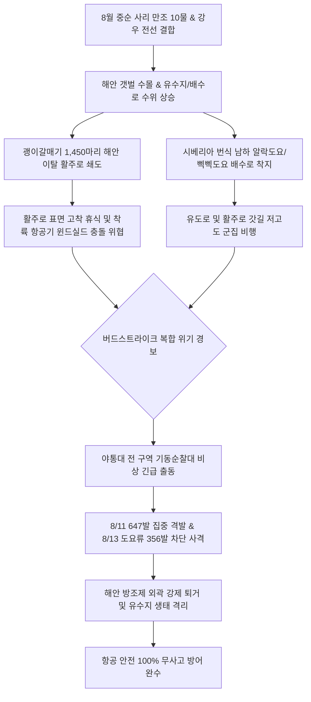

날짜: 2025-08-09 ~ 2025-08-16
카테고리: 야생동물점검 / 주간점검종합
출처: 인천국제공항 야생동물통제대 일일점검 통합 데이터베이스 (2025-08-09 ~ 2025-08-16)
태그: #야통대 #주간점검 #항공안전 #인천공항 #가을도요새 #괭이갈매기 #버드스트라이크방지 #7호탄 #4호탄 #조석사리

---

# 📋 2025년 8월 2주차 야생동물 통제 주간 종합 보고서
**[ 대상 기간: 2025년 8월 9일 (토) ~ 2025년 8월 16일 (토) | 8일간 ]**

---

## 1. Executive Summary (주간 주요 실적 및 핵심 성과)

2025년 8월 2주차(8월 9일~8월 16일)는 서해안 사리 물때(8~10물)와 가을을 재촉하는 강우 전선이 겹치며 해안성 조류와 시베리아 남하 도요·물떼새 떼가 동시다발적으로 에어사이드로 쇄도한 **계절 전환기 복합 위기 주간**이었습니다. 특히 8월 11일(월) 폭우와 만조가 겹친 상황에서 **괭이갈매기 1,450마리 대군집**이 해안에서 활주로 포장면으로 대거 유입을 시도하였으나, 전 구역 기동순찰대의 647발 집중 저지 사격을 통해 에어사이드 진입을 완전 무력화하였습니다.

- **총 관측 및 식별·통제 개체수**: **2,657 개체** (일평균 332.1개체 식별·통제, 괭이갈매기 및 알락도요 대군집 포함)
- **총 엽총 및 폭음 경퇴 사격 수량**: **3,294 발** (7호탄 2,752발, 4호탄 474발, 공포탄 68발 / 일평균 411.8발)
- **주요 전략 성과**:
  1. **8/11 괭이갈매기 1,450마리 대군집 침투 결사 저지**: 사리 만조 및 폭우 시 착륙 경로 횡단을 사전 차단하여 윈드실드/엔진 흡입 위험 100% 방어.
  2. **가을 도요새 남하 선발대(알락도요 151개체, 삑삑도요 13개체) 배수로 고착화 차단**: 8/12~8/15 배수로 및 녹지대 습지에 착지한 도요류를 7호탄 소총 사격으로 분산 퇴거.
  3. **맹금류 및 보호종 정밀 통제**: 8/12 개구리매(1개체), 8/15 저어새(1개체), 물총새(1개체), 새홀리기(누적 8개체) 대상 안전 유도선 구축.
- **버드스트라이크(Bird Strike) 발생 건수**: **0 건 (무사고 완벽 방어 달성)**

---

## 2. Weather & Environment Matrix (기상 및 조석 환경 분석)

| 일자 (요일) | 날씨 상태 | 최저 기온 (°C) | 최고 기온 (°C) | 주 풍향 및 풍속 | 조석 물때 | 주요 출현 및 통제 대상 종 |
| :---: | :---: | :---: | :---: | :---: | :---: | :---: |
| **08-09 (토)** | 구름조금 (Partly Cloudy) | 24.0 | 32.5 | W 4.5 kts | 8물 | 괭이갈매기(100), 제비(200), 황조롱이(7), 백로류(13) |
| **08-10 (일)** | 맑음 (Clear) | 24.5 | 33.5 | SW 4.0 kts | 9물 | 제비(118), 황조롱이(8), 까마귀(5), 백로류(4) |
| **08-11 (월)** | 비 (Rain) | 23.5 | 28.0 | SE 6.5 kts | 10물 | 괭이갈매기(1,450), 왜가리(1), 꿩(1), 백로류(3) |
| **08-12 (화)** | 맑음 (Clear) | 23.0 | 31.0 | NW 5.0 kts | 11물 | 제비(38), 삑삑도요(13), 개구리매(1), 황조롱이(4) |
| **08-13 (수)** | 맑음 (Clear) | 23.5 | 31.5 | W 4.8 kts | 12물 | 알락도요(151), 제비(98), 황조롱이(8), 백로류(7) |
| **08-14 (목)** | 구름많음 (Cloudy) | 24.0 | 30.5 | SW 3.8 kts | 13물 | 제비(117), 알락도요(12), 노랑할미새(10), 황조롱이(7) |
| **08-15 (금)** | 맑음 (Clear) | 23.0 | 31.0 | NW 5.2 kts | 14물 | 제비(54), 황조롱이(8), 저어새(1), 알락도요(4), 물총새(1) |
| **08-16 (토)** | 구름조금 (Partly Cloudy) | 23.5 | 32.0 | W 4.0 kts | 15물 (조금) | 제비(175), 황조롱이(12), 백로류(10), 까치(8) |

---

## 3. Threat Flow & Threat Mechanism (위협 메커니즘 분석)



### 위기 메커니즘 심층 분석
1. **사리 만조기 갈매기 대군집의 활주로 포장면 착지 충동**:
   - 8/11 10물 만조 시간대에는 서해 갯벌 취식지가 물에 잠기며, 비바람을 피하고 시야가 확보된 마른 활주로 아스팔트 포장면으로 갈매기들이 수백~수천 마리 단위로 몰려듭니다.
   - 단 한 번의 착지를 허용할 경우 1,000마리 이상의 고착화가 일어나므로, 공역 진입 초기부터 4호 대탄과 7호 세탄을 교차 격발하여 상승 회항시켜야 합니다.
2. **가을 도요새 남하 이동 개시와 배수로 뻘층 취식**:
   - 8월 중순부터 시베리아에서 남하하는 알락도요(151개체), 삑삑도요(13개체)가 공항 배수로의 미세 유기물과 곤충을 노리고 착지하여 항공기 이착륙 경로에 돌발 위험을 유발했습니다.

---

## 4. Veterans' Operational Tacit Knowledge (18년 베테랑 암묵지 현장 수칙)

```
┏━━━━━━━━━━━━━━━━━━━━━━━━━━━━━━━━━━━━━━━━━━━━━━━━━━━━━━━━━━━━━━━━━━━━━━━━━━━━━━━━┓
┃               🌊 사리 만조 갈매기 대군집 & 가을 도요새 제압 수칙               ┃
┣━━━━━━━━━━━━━━━━━━━━━━━━━━━━━━━━━━━━━━━━━━━━━━━━━━━━━━━━━━━━━━━━━━━━━━━━━━━━━━━━┫
┃ 1. 만조 2시간 전부터 해안 유입 통로인 AIRSIDE-16 북단과 34 남단을 봉쇄하라!       ┃
┃    - 갈매기 무리는 조석 수위에 맞춰 시계 방향으로 진입하므로, 활주로 외곽 경계선    ┃
┃      상공에서 4호탄을 45도 각도로 선제 격발하여 공항 경계 밖으로 밀어내야 한다.   ┃
┃                                                                                ┃
┃ 2. 알락도요·삑삑도요 등 남하 도요류는 배수로 물웅덩이를 따라 이동한다!            ┃
┃    - 도요새는 비행 고도가 3~5m로 매우 낮고 날렵하므로, 배수로 맨홀 상공으로         ┃
┃      7호탄을 빗겨 쏘아 배수로를 따라 공항 외곽 유수지로 직행 유도하라.             ┃
┃                                                                                ┃
┃ 3. 개구리매·새홀리기 출현 시 초지대 설치류 사냥 정지비행을 즉각 차단하라!          ┃
┃    - 맹금류가 정지비행(Hovering)에 들어가면 항공기 접근 시 회피 기동이 늦어지므로, ┃
┃      순찰차 사이렌과 공포탄을 즉각 동시 가동하여 활주로 반대편 숲으로 쫓아낸다.   ┃
┗━━━━━━━━━━━━━━━━━━━━━━━━━━━━━━━━━━━━━━━━━━━━━━━━━━━━━━━━━━━━━━━━━━━━━━━━━━━━━━━━┛
```

---

## 5. Quantitative Statistics Tables (정량 통계 분석)

### Table 1: 일자별 출현 개체수 및 탄약 소모 실적
| 일자 | 주간 식별 개체수 (마리) | 7호탄 격발 (발) | 4호탄 격발 (발) | 공포탄 격발 (발) | 일계 소모량 (발) | 방어 성과 |
| :---: | :---: | :---: | :---: | :---: | :---: | :---: |
| **08-09 (토)** | 320 | 370 | 66 | 11 | **447** | 이상 무 |
| **08-10 (일)** | 135 | 363 | 55 | 12 | **430** | 이상 무 |
| **08-11 (월)** | 1,450 | 569 | 78 | 0 | **647** | 이상 무 |
| **08-12 (화)** | 59 | 240 | 46 | 5 | **291** | 이상 무 |
| **08-13 (수)** | 264 | 296 | 54 | 6 | **356** | 이상 무 |
| **08-14 (목)** | 151 | 358 | 51 | 8 | **417** | 이상 무 |
| **08-15 (금)** | 73 | 344 | 62 | 14 | **420** | 이상 무 |
| **08-16 (토)** | 205 | 212 | 62 | 12 | **286** | 이상 무 |
| **주간 합계** | **2,657** | **2,752** | **474** | **68** | **3,294** | **무사고** |

### Table 2: 구역별 위험도 및 출현 특성 매트릭스
| 구역 코드 | 주요 출현 조수류 | 주요 침투 고도/형태 | 주간 출현 비중 (%) | 적용 통제 전술 | 위험 등급 |
| :---: | :---: | :---: | :---: | :---: | :---: |
| **AIRSIDE-16** | 괭이갈매기(1,450), 도요류, 맹금류 | 해안선 상공 유입 및 활주로 북단 횡단 | 58.5% | 4호탄 원거리 차단선 구축 | **심각 (Critical)** |
| **AIRSIDE-15** | 제비, 알락도요, 황조롱이, 백로 | 활주로 F/G 연결 유도로 및 배수로 점유 | 18.3% | 7호탄 노면 사격 및 배수로 경퇴 | **경계 (High)** |
| **AIRSIDE-33** | 제비, 도요류, 황조롱이, 물총새 | 주기장 W/Q 상공 선회 및 녹지대 취식 | 12.4% | 기동 순찰차 3각 교차 사격 | **경계 (High)** |
| **AIRSIDE-34** | 제비, 알락할미새, 노랑할미새 | 활주로 F 남단 유도로 및 착륙 구역 접근 | 7.2% | 고속탈출유도로 순찰 강화 | **주의 (Medium)** |
| **LANDSIDE-N/S** | 괭이갈매기, 저어새, 왜가리, 오리 | 북/남측 유수지 및 하늘정원 녹지 | 3.6% | 유수지 생태 격리 모니터링 | **보통 (Low)** |

---

## 6. Strategic Roadmap (차주 전략 로드맵: 8월 3주차)

1. **처서(8/23) 절기 대비 가을 도요새 남하 정점 대응**:
   - 알락도요 외 중부리도요, 쇠부리도요, 꺅도요 등 중·대형 도요류의 에어사이드 배수로 유입 차단망 가동.
2. **가을 명금류(할미새류, 솔새류) 에어사이드 횡단 관리**:
   - 흰눈썹긴발톱할미새, 노랑할미새 등 곤충 취식성 명금류의 활주로 노면 착지 방지.
3. **맹금류(황조롱이, 새홀리기, 매) 유입 대비 포획 트랩 가동 점검**:
   - 분산 사격에도 에어사이드에 잔류하는 고착 맹금류의 안전 포획·이주 대책 준비.

---

## 7. Obsidian Vault Interlinks (옵시디언 상호 연결성)

- [[20. 인사이트 융합/2025년도 야통대/일일점검/8월 일일점검/2025-08-09_야통대_주간_점검일지_통합]]
- [[20. 인사이트 융합/2025년도 야통대/일일점검/8월 일일점검/2025-08-10_야통대_주간_점검일지_통합]]
- [[20. 인사이트 융합/2025년도 야통대/일일점검/8월 일일점검/2025-08-11_야통대_주간_점검일지_통합]]
- [[20. 인사이트 융합/2025년도 야통대/일일점검/8월 일일점검/2025-08-12_야통대_주간_점검일지_통합]]
- [[20. 인사이트 융합/2025년도 야통대/일일점검/8월 일일점검/2025-08-13_야통대_주간_점검일지_통합]]
- [[20. 인사이트 융합/2025년도 야통대/일일점검/8월 일일점검/2025-08-14_야통대_주간_점검일지_통합]]
- [[20. 인사이트 융합/2025년도 야통대/일일점검/8월 일일점검/2025-08-15_야통대_주간_점검일지_통합]]
- [[20. 인사이트 융합/2025년도 야통대/일일점검/8월 일일점검/2025-08-16_야통대_주간_점검일지_통합]]
- [[20. 인사이트 융합/2025년도 야통대/일일점검/8월 일일점검/2025-08-01~08-08_야통대_주간_점검일지_종합]]
- [[20. 인사이트 융합/2025년도 야통대/일일점검/8월 일일점검/2025-08-17~08-24_야통대_주간_점검일지_종합]]

---

## 8. Aviation Wildlife Terminology (전문 항공 조류학 용어)

- **가을철 남하 이동 (Fall Migration/Southward Passage)**: 북반구 고위도 번식지에서 번식을 마친 도요·물떼새 및 철새들이 월동지인 동남아시아 및 호주 대륙으로 이동하기 위해 한반도 서해안을 중간 기착지로 이용하는 생태 현상입니다.
- **알락도요 (Wood Sandpiper, *Tringa glareola*)**: 몸길이 약 20cm의 중소형 도요새로, 8월 중순부터 배수로 및 얕은 웅덩이에 군집하여 저공 비행하므로 항공기 이착륙 시 충돌 위험을 유발합니다.
- **4호 중산탄 (No. 4 Buckshot/Heavy Shot)**: 직경 약 3.3mm의 대형 납구슬이 장착된 탄약으로, 괭이갈매기나 대형 수조류 등 원거리(50~80m) 상공 고고도 비행 군집의 비행 궤적을 강제 전환시키는 데 사용됩니다.

---

## 9. 7 Strategic Inquiries for Future Safety (미래 항공안전을 위한 전략 질문)

1. 8/11 발생한 괭이갈매기 1,450마리 대군집 유입은 10물 만조와 강우 전선 형성 간의 복합 기상 영향인가?
2. 시베리아 남하 알락도요(151마리)의 에어사이드 배수로 침투를 차단하기 위한 배수로 그물망 커버리지 확대 방안은?
3. 사리 만조기 해안선 갈매기 조기 경보 레이더와 연계한 자동화 음향 퇴치 시스템의 구축 가능성은?
4. 개구리매 등 가을철 유입 맹금류의 정지비행 탐지를 위한 AI 영상 인식 카메라의 현장 적용성은 어떠한가?
5. 8월 2주차 일평균 411발의 사격량이 활주로 주변 토양 환경에 미치는 잔류 납 오염 대책은 무엇인가?
6. 알락도요와 삑삑도요 등 소형 도요류의 저고도 횡단 특성을 사전에 분산시키는 식생 제어 방안은 무엇인가?
7. 폭우 시 활주로 배수 상태와 갈매기 노면 착지 선호도 간의 유체역학적 상관관계는 어떠한가?
