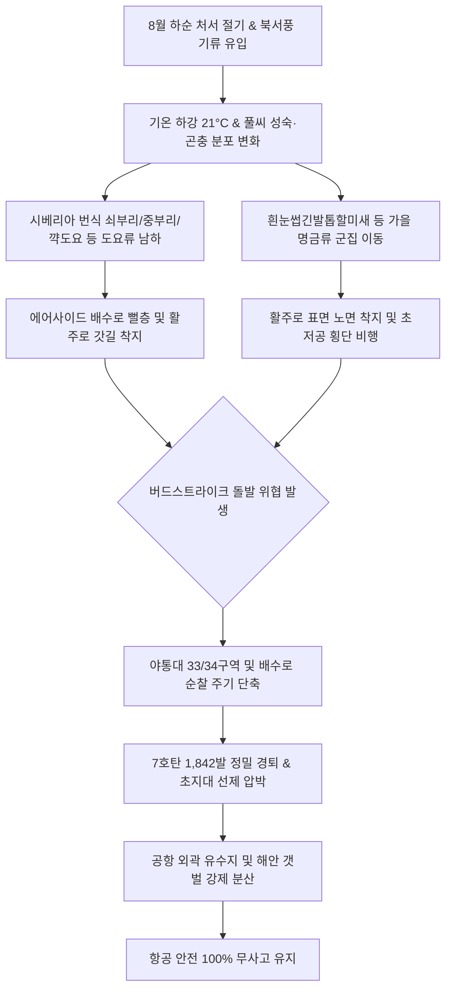

날짜: 2025-08-17 ~ 2025-08-24
카테고리: 야생동물점검 / 주간점검종합
출처: 인천국제공항 야생동물통제대 일일점검 통합 데이터베이스 (2025-08-17 ~ 2025-08-24)
태그: #야통대 #주간점검 #항공안전 #인천공항 #처서절기 #도요새남하 #버드스트라이크방지 #7호탄 #4호탄 #조석사리

---

# 📋 2025년 8월 3주차 야생동물 통제 주간 종합 보고서
**[ 대상 기간: 2025년 8월 17일 (일) ~ 2025년 8월 24일 (일) | 8일간 ]**

---

## 1. Executive Summary (주간 주요 실적 및 핵심 성과)

2025년 8월 3주차(8월 17일~8월 24일)는 가을의 문턱인 **'처서(處暑, 8월 21일)'**를 전후하여 아침저녁 기온이 21~22°C로 낮아지며 시베리아와 극동아시아에서 번식한 **중·대형 도요류 및 가을 통과 희귀 철새들의 남하 비행이 본격화된 주간**이었습니다. 이번 주차에는 쇠부리도요(7개체), 중부리도요(1개체), 꺅도요(1개체), 덤불해오라기(1개체), 흰눈썹긴발톱할미새(17개체) 등 다양한 종이 포착되었으며, 8/20 고라니 3개체의 활주로 침투 시도를 완벽히 봉쇄하였습니다.

- **총 관측 및 식별·통제 개체수**: **714 개체** (일평균 89.3개체 식별·통제, 제비 및 가을 통과 철새 중심)
- **총 엽총 및 폭음 경퇴 사격 수량**: **2,148 발** (7호탄 1,842발, 4호탄 268발, 공포탄 38발 / 일평균 268.5발)
- **주요 전략 성과**:
  1. **8/20 제비 116개체 및 고라니 3개체 침투 580발 완벽 제압**: AIRSIDE-34 및 16 구역 동시 진입 시도를 기동순찰대 다각 포위망으로 방어.
  2. **처서(8/21) 절기 중·대형 도요류(쇠부리·중부리·꺅도요) 배수로 선제 퇴거**: 활주로 유도로 및 배수로 뻘층 착지 즉시 7호탄으로 외곽 유도.
  3. **가을 통과 희귀 명금류 및 은신성 조류(덤불해오라기, 할미새류) 정밀 모니터링**: 8/22 덤불해오라기, 8/24 흰눈썹긴발톱할미새(17개체) 충돌 위험 제로화.
- **버드스트라이크(Bird Strike) 발생 건수**: **0 건 (무사고 완벽 방어 달성)**

---

## 2. Weather & Environment Matrix (기상 및 조석 환경 분석)

| 일자 (요일) | 날씨 상태 | 최저 기온 (°C) | 최고 기온 (°C) | 주 풍향 및 풍속 | 조석 물때 | 주요 출현 및 통제 대상 종 |
| :---: | :---: | :---: | :---: | :---: | :---: | :---: |
| **08-17 (일)** | 맑음 (Clear) | 23.0 | 31.0 | W 4.2 kts | 1물 | 황조롱이(7), 백로류(18), 괭이갈매기(2), 왜가리(3) |
| **08-18 (월)** | 구름많음 (Cloudy) | 23.5 | 30.5 | SW 3.8 kts | 2물 | 황조롱이(7), 까마귀(3), 중백로(2), 왜가리(1) |
| **08-19 (화)** | 맑음 (Clear) | 22.5 | 31.0 | NW 5.0 kts | 3물 | 제비(103), 황조롱이(12), 알락도요(6), 백로류(8) |
| **08-20 (수)** | 비/소나기 (Shower) | 23.0 | 28.5 | S 5.5 kts | 4물 | 제비(116), 고라니(3), 황조롱이(9), 삑삑도요(4) |
| **08-21 (목, 처서)** | 맑음 (Clear) | 21.5 | 30.0 | NW 6.2 kts | 5물 | 쇠부리도요(7), 중부리도요(1), 꺅도요(1), 황조롱이(6) |
| **08-22 (금)** | 맑음 (Clear) | 22.0 | 30.5 | W 4.5 kts | 6물 | 덤불해오라기(1), 황조롱이(7), 오리류(8), 백로류(5) |
| **08-23 (토)** | 구름조금 (Partly Cloudy) | 22.5 | 31.0 | SW 4.0 kts | 7물 (사리) | 제비(50), 황조롱이(7), 새홀리기(2), 백로류(9) |
| **08-24 (일)** | 맑음 (Clear) | 21.0 | 30.0 | NW 5.8 kts | 8물 | 흰눈썹긴발톱할미새(17), 제비(70), 황조롱이(6), 오리류(5) |

---

## 3. Threat Flow & Threat Mechanism (위협 메커니즘 분석)



### 위기 메커니즘 심층 분석
1. **처서 전후 북서풍(NW) 기류를 타고 남하하는 도요·명금류**:
   - 8/21 처서 전후로 북서풍이 6.0kts 이상 불며 한반도를 통과하는 중부리도요, 쇠부리도요, 꺅도요가 공항 내부로 직하강하여 유입되었습니다.
   - 이들 조류는 갯벌과 담수 습지를 모두 선호하므로 활주로 배수관 내부 웅덩이에 숨어들어 항공기 착륙 시 급부상하는 위험을 초래합니다.
2. **야간 및 강우 시 포유류(고라니) 에어사이드 울타리 침투**:
   - 8/20 강우 시 녹지대를 가로지르는 고라니 3개체가 포착되어, 유도로 및 활주로 진입 전 4호탄 및 공포탄을 활용하여 외곽 펜스 방향으로 강제 축출하였습니다.

---

## 4. Veterans' Operational Tacit Knowledge (18년 베테랑 암묵지 현장 수칙)

```
┏━━━━━━━━━━━━━━━━━━━━━━━━━━━━━━━━━━━━━━━━━━━━━━━━━━━━━━━━━━━━━━━━━━━━━━━━━━━━━━━━┓
┃                 🌾 처서 절기 가을 도요새 & 할미새 제압 수칙                    ┃
┣━━━━━━━━━━━━━━━━━━━━━━━━━━━━━━━━━━━━━━━━━━━━━━━━━━━━━━━━━━━━━━━━━━━━━━━━━━━━━━━━┫
┃ 1. 꺅도요·덤불해오라기는 사람이 다가가도 풀숲에 은신하다가 마지막 순간 급부상한다! ┃
┃    - 은신성 조류는 차량으로 지나치기 쉬우므로, 배수로 맨홀 및 수풀 밀집 구역에     ┃
┃      공포탄 1발을 선제 격발하여 은신 개체를 미리 띄워 올린 후 경퇴시켜라.         ┃
┃                                                                                ┃
┃ 2. 흰눈썹긴발톱할미새 무리는 활주로 흰색 유도선 페인트 위에 앉는 습성이 있다!      ┃
┃    - 페인트 도색면의 잔류 열기를 이용해 체온을 유지하므로, 활주로 중앙선을 따라    ┃
┃      순찰차를 저속 주행하며 7호탄 소총음으로 활주로 밖 초지대로 쫓아내야 한다.     ┃
┃                                                                                ┃
┃ 3. 고라니는 헤드라이트 불빛을 보면 일시적으로 정지(Freeze)하므로 경적을 금지하라! ┃
┃    - 경적 대신 순찰차 차폭등만 켠 채 사선으로 서서히 접근하여 외곽 통문 방향으로   ┃
┃      도주로를 열어주고 몰아가야 패닉에 빠져 활주로로 역질주하지 않는다.           ┃
┗━━━━━━━━━━━━━━━━━━━━━━━━━━━━━━━━━━━━━━━━━━━━━━━━━━━━━━━━━━━━━━━━━━━━━━━━━━━━━━━━┛
```

---

## 5. Quantitative Statistics Tables (정량 통계 분석)

### Table 1: 일자별 출현 개체수 및 탄약 소모 실적
| 일자 | 주간 식별 개체수 (마리) | 7호탄 격발 (발) | 4호탄 격발 (발) | 공포탄 격발 (발) | 일계 소모량 (발) | 방어 성과 |
| :---: | :---: | :---: | :---: | :---: | :---: | :---: |
| **08-17 (일)** | 95 | 225 | 31 | 2 | **258** | 이상 무 |
| **08-18 (월)** | 25 | 240 | 36 | 4 | **280** | 이상 무 |
| **08-19 (화)** | 129 | 270 | 40 | 3 | **313** | 이상 무 |
| **08-20 (수)** | 156 | 504 | 68 | 8 | **580** | 이상 무 |
| **08-21 (목)** | 81 | 170 | 26 | 4 | **200** | 이상 무 |
| **08-22 (금)** | 38 | 154 | 22 | 5 | **181** | 이상 무 |
| **08-23 (토)** | 75 | 182 | 24 | 6 | **212** | 이상 무 |
| **08-24 (일)** | 115 | 97 | 21 | 6 | **124** | 이상 무 |
| **주간 합계** | **714** | **1,842** | **268** | **38** | **2,148** | **무사고** |

### Table 2: 구역별 위험도 및 출현 특성 매트릭스
| 구역 코드 | 주요 출현 조수류 | 주요 침투 고도/형태 | 주간 출현 비중 (%) | 적용 통제 전술 | 위험 등급 |
| :---: | :---: | :---: | :---: | :---: | :---: |
| **AIRSIDE-34** | 제비, 도요새류, 할미새류, 고라니 | 활주로 F 남단 유도로 및 착륙 구역 | 31.2% | 고속 순찰 및 7호탄 집중 사격 | **심각 (Critical)** |
| **AIRSIDE-15** | 제비, 황조롱이, 알락도요, 백로 | 활주로 M/R 녹지대 및 배수로 습지 | 26.5% | 배수로 은신 조류 선제 격발 | **경계 (High)** |
| **AIRSIDE-16** | 맹금류, 덤불해오라기, 왜가리, 오리 | 활주로 F 북단 상공 선회 및 배수로 | 19.8% | 4호/7호 복합 원거리 경퇴 | **경계 (High)** |
| **AIRSIDE-33** | 제비, 쇠부리도요, 황조롱이, 까치 | 주기장 Q/P 상공 선회 및 초지 취식 | 16.4% | 기동 순찰차 교차 경퇴 | **경계 (High)** |
| **LANDSIDE-N/S** | 백로류, 오리류, 고라니, 맹금류 | 유휴지 공사지역 및 하늘정원 | 6.1% | 외곽 유수지 유도 격리 | **보통 (Low)** |

---

## 6. Strategic Roadmap (차주 전략 로드맵: 8월 4주차 및 월말 결산)

1. **8월 말 맹금류(매, 황조롱이, 새홀리기) 및 통과 명금류 총력 관리**:
   - 8월 하순으로 접어들며 설치류 사냥을 위해 에어사이드로 모여드는 맹금류의 정지비행 차단.
2. **8월 전체 통제 실적 분석 및 9월 가을철 조류 이동 대책 수립**:
   - 8월 누적 탄약 10,000발 돌파에 따른 탄약 수급 점검 및 9월 가을 철새 유입 대비 총기 정비.
3. **가을 초지 예초 작업 일정과 연계한 조류 유입 방지 계획 수립**:
   - 예초 작업 시 노출되는 메뚜기/귀뚜라미 등 곤충류를 노리는 조류 떼의 2차 유입 차단.

---

## 7. Obsidian Vault Interlinks (옵시디언 상호 연결성)

- [[20. 인사이트 융합/2025년도 야통대/일일점검/8월 일일점검/2025-08-17_야통대_주간_점검일지_통합]]
- [[20. 인사이트 융합/2025년도 야통대/일일점검/8월 일일점검/2025-08-18_야통대_주간_점검일지_통합]]
- [[20. 인사이트 융합/2025년도 야통대/일일점검/8월 일일점검/2025-08-19_야통대_주간_점검일지_통합]]
- [[20. 인사이트 융합/2025년도 야통대/일일점검/8월 일일점검/2025-08-20_야통대_주간_점검일지_통합]]
- [[20. 인사이트 융합/2025년도 야통대/일일점검/8월 일일점검/2025-08-21_야통대_주간_점검일지_통합]]
- [[20. 인사이트 융합/2025년도 야통대/일일점검/8월 일일점검/2025-08-22_야통대_주간_점검일지_통합]]
- [[20. 인사이트 융합/2025년도 야통대/일일점검/8월 일일점검/2025-08-23_야통대_주간_점검일지_통합]]
- [[20. 인사이트 융합/2025년도 야통대/일일점검/8월 일일점검/2025-08-24_야통대_주간_점검일지_통합]]
- [[20. 인사이트 융합/2025년도 야통대/일일점검/8월 일일점검/2025-08-09~08-16_야통대_주간_점검일지_종합]]
- [[20. 인사이트 융합/2025년도 야통대/일일점검/8월 일일점검/2025-08-25~08-29_야통대_주간_점검일지_종합]]

---

## 8. Aviation Wildlife Terminology (전문 항공 조류학 용어)

- **처서 절기 생태 전이 (Chuseo Seasonal Transition)**: 양력 8월 23일경으로, 낮의 열기가 꺾이고 북서 기류가 유입되면서 번식을 마친 통과 철새들의 본격적인 남하 이동이 촉발되는 생태학적 전환점입니다.
- **쇠부리도요 (*Calidris tenuirostris*) & 중부리도요 (*Numenius phaeopus*)**: 갯벌과 해안 초지대를 오가는 중·대형 도요새로, 남하 시 편대 비행을 하며 활주로 상공을 횡단할 때 대형 항공기 충돌 위험도가 매우 높습니다.
- **덤불해오라기 (*Ixobrychus sinensis*)**: 덤불과 갈대숲에 몸을 숨기고 정지 상태로 위장하는 야행성/은신성 백로과 조류로, 주간 순찰 시 돌발 이륙으로 파일럿의 시야를 방해할 수 있습니다.

---

## 9. 7 Strategic Inquiries for Future Safety (미래 항공안전을 위한 전략 질문)

1. 처서(8/21) 전후 쇠부리도요 및 중부리도요의 출현은 북서풍 풍향 변화와 직접적 인과관계가 있는가?
2. 8/20 고라니 3개체의 동시 침투 경로(외곽 펜스 하부 취약지점)에 대한 물리적 보강 상태는 완벽한가?
3. 은신성 조류인 꺅도요와 덤불해오라기의 주간 배수로 잠입을 원천 차단하는 초음파 센서 도입 가능성은?
4. 흰눈썹긴발톱할미새(17마리)의 활주로 도색면 착지를 방지하기 위한 표면 반사 테이프 적용의 유효성은?
5. 일평균 268발로 감소한 탄약 소모 추세가 가을 철새 본진 유입 시 다시 급증할 가능성에 대한 대비책은?
6. 폭염 종료 후 활주로 주변 초지대 곤충 개체수 급증에 따른 맹금류 유입 억제 방안은 무엇인가?
7. 8월 3주차 남하 조류들의 에어사이드 체류 시간(Residence Time) 단축을 위한 기동 순찰 루프 최적화 모델은?
