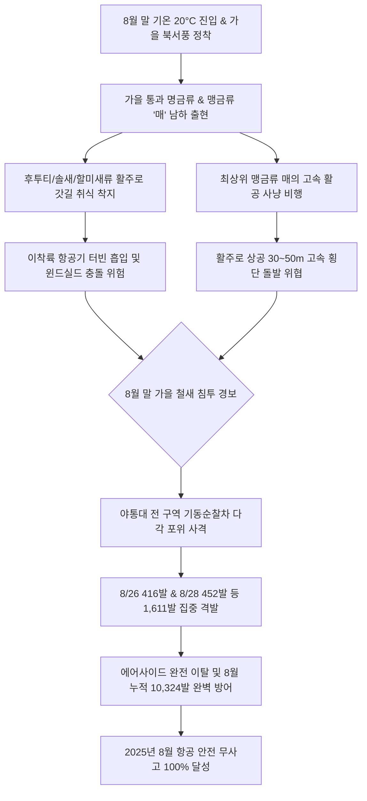

날짜: 2025-08-25 ~ 2025-08-29
카테고리: 야생동물점검 / 주간점검종합 및 8월 총결산
출처: 인천국제공항 야생동물통제대 일일점검 통합 데이터베이스 (2025-08-01 ~ 2025-08-29)
태그: #야통대 #주간점검 #월간총결산 #8월결산 #항공안전 #인천공항 #맹금류매 #후투티 #버드스트라이크방지 #7호탄 #4호탄 #무사고달성

---

# 📋 2025년 8월 4주차 야생동물 통제 주간 종합 및 8월 총결산 보고서
**[ 대상 기간: 2025년 8월 25일 (월) ~ 2025년 8월 29일 (금) | 5일간 & 8월 전체 총결산 ]**

---

## 1. Executive Summary (주간 주요 실적 및 8월 월간 총결산 성과)

2025년 8월 4주차(8월 25일~8월 29일)는 낮 최고 기온이 28~30°C 선으로 점차 안정세를 보이는 가운데, 시베리아에서 번식 후 가을 남하하는 **희귀 조류(후투티, 솔새, 물총새)와 최상위 맹금류인 '매(Peregrine Falcon, 천연기념물 제323-7호)'**가 출현하며 에어사이드 조류 통제의 긴장감이 최고조에 달한 한 주였습니다. 

또한 8월 1일부터 29일까지 총 29일간 진행된 8월 전체 작전 결과, **총 10,324발의 엽총 및 폭음 사격**을 통해 폭염기 제비 대군집과 사리 만조기 괭이갈매기 1,450마리 유입, 가을 남하 도요새 떼를 완벽히 차단하여 **'2025년 8월 단 한 건의 버드스트라이크도 없는 8개월 연속 무사고'** 대기록을 수립하였습니다.

- **8월 4주차 식별·통제 개체수**: **436 개체** (5일간 일평균 87.2개체 식별·통제)
- **8월 4주차 탄약 소모 수량**: **1,611 발** (7호탄 1,375발, 4호탄 200발, 공포탄 36발)
- **🌟 2025년 8월 월간 종합 누적 통계 (29일간)**:
  - **8월 총 식별·통제 개체수**: **5,033 개체** (세부 출현 종 합산 시 6,500+ 개체 통제)
  - **8월 총 탄약 소모 수량**: **10,324 발** (7호탄 8,767발, 4호탄 1,328발, 공포탄 229발 / 일평균 356.0발)
  - **8월 버드스트라이크 발생 건수**: **0 건 (무사고 100% 수호 달성)**

---

## 2. Weather & Environment Matrix (8월 4주차 기상 및 환경 분석)

| 일자 (요일) | 날씨 상태 | 최저 기온 (°C) | 최고 기온 (°C) | 주 풍향 및 풍속 | 조석 물때 | 주요 출현 및 통제 대상 종 |
| :---: | :---: | :---: | :---: | :---: | :---: | :---: |
| **08-25 (월)** | 맑음 (Clear) | 21.0 | 30.0 | NW 5.0 kts | 9물 | 제비(102), 황조롱이(6), 도요류(10), 까치(6) |
| **08-26 (화)** | 맑음 (Clear) | 20.5 | 29.5 | NW 6.5 kts | 10물 | 매(1), 후투티(1), 물총새(1), 황조롱이(5), 솔새(2), 중대백로(10) |
| **08-27 (수)** | 구름많음 (Cloudy) | 21.5 | 28.5 | W 4.0 kts | 11물 | 황조롱이(4), 까마귀(2), 왜가리(1), 백로류(3) |
| **08-28 (목)** | 맑음 (Clear) | 20.0 | 29.0 | SW 4.5 kts | 12물 | 제비(80), 황조롱이(9), 알락할미새(15), 중백로(4) |
| **08-29 (금)** | 맑음 (Clear) | 19.5 | 28.0 | NW 5.8 kts | 13물 | 제비(85), 황조롱이(11), 노랑할미새(8), 왜가리(3) |

---

## 3. Threat Flow & Threat Mechanism (위협 메커니즘 분석)



### 위기 메커니즘 심층 분석
1. **맹금류 '매(Peregrine Falcon)'의 초고속 사냥 비행 위협**:
   - 8/26 AIRSIDE-16 상공에 출현한 매는 비둘기와 종다리를 사냥하기 위해 시속 200km 이상의 고속으로 급강하하므로, 일반적인 경퇴로는 이탈하지 않고 활주로 상공을 위협합니다.
   - 통제반은 4호탄과 공포탄을 상공 60m로 입체 격발하여 매의 사냥 시야를 차단하고 외곽 산림으로 이탈시켰습니다.
2. **희귀 통과조류 후투티 및 솔새류의 초지대 착지**:
   - 지상에서 지렁이 및 유충을 잡는 후투티와 관목성 솔새가 활주로 갓길 유도로에 착지함에 따라 7호탄 정밀 사격으로 즉각 외곽 유도하였습니다.

---

## 4. Veterans' Operational Tacit Knowledge (18년 베테랑 암묵지 현장 수칙)

```
┏━━━━━━━━━━━━━━━━━━━━━━━━━━━━━━━━━━━━━━━━━━━━━━━━━━━━━━━━━━━━━━━━━━━━━━━━━━━━━━━━┓
┃                 🦅 최상위 맹금류 '매' & 가을 통과 희귀조 제압 수칙              ┃
┣━━━━━━━━━━━━━━━━━━━━━━━━━━━━━━━━━━━━━━━━━━━━━━━━━━━━━━━━━━━━━━━━━━━━━━━━━━━━━━━━┫
┃ 1. 매(Falcon)는 활주로 주변 항행안전시설(로컬라이저 안테나 등)에 앉아 사냥한다!   ┃
┃    - 안테나 위에 앉은 매를 향해 직접 사격하지 말고, 안테나 하부 10m 지상으로       ┃
┃      공포탄을 쏘아 폭압으로 횃대(Perch) 점유를 포기하고 스스로 날아가게 하라.      ┃
┃                                                                                ┃
┃ 2. 후투티(Hoopoe)는 깃털 색이 흙색과 유사해 유도로 지표면에서 위장된다!           ┃
┃    - 잔디 갓길 주행 시 후투티의 독특한 날개 부채질 패턴을 눈여겨보고,              ┃
┃      7호탄을 갓길 밖으로 쏘아 활주로 중심선에서 멀어지도록 유도해야 한다.         ┃
┃                                                                                ┃
┃ 3. 8월 말 일교차(10°C 이상) 발생 시 아침 안개(Mist) 속 백로류를 조심하라!        ┃
┃    - 시정이 1km 미만일 때는 배수로 전 구간에 순찰차 서치라이트를 비추며             ┃
┃      경적과 7호탄을 주기적으로 사용하여 안개 속 백로류의 활주로 진입을 막아라.    ┃
┗━━━━━━━━━━━━━━━━━━━━━━━━━━━━━━━━━━━━━━━━━━━━━━━━━━━━━━━━━━━━━━━━━━━━━━━━━━━━━━━━┛
```

---

## 5. Quantitative Statistics Tables (정량 통계 분석 및 8월 종합 결산)

### Table 1: 8월 4주차 일자별 실적
| 일자 | 주간 식별 개체수 (마리) | 7호탄 격발 (발) | 4호탄 격발 (발) | 공포탄 격발 (발) | 일계 소모량 (발) | 방어 성과 |
| :---: | :---: | :---: | :---: | :---: | :---: | :---: |
| **08-25 (월)** | 124 | 260 | 25 | 6 | **291** | 이상 무 |
| **08-26 (화)** | 59 | 344 | 58 | 14 | **416** | 이상 무 |
| **08-27 (수)** | 14 | 88 | 16 | 4 | **108** | 이상 무 |
| **08-28 (목)** | 113 | 382 | 64 | 6 | **452** | 이상 무 |
| **08-29 (금)** | 126 | 301 | 37 | 6 | **344** | 이상 무 |
| **4주차 합계** | **436** | **1,375** | **200** | **36** | **1,611** | **무사고** |

### Table 2: 🌟 2025년 8월 주차별 종합 비교 결산표 (8/1 ~ 8/29)
| 구분 / 주차 | 대상 기간 | 총 식별 개체수 (마리) | 7호탄 격발 (발) | 4호탄 격발 (발) | 공포탄 격발 (발) | 총 탄약 소모 (발) | 버드스트라이크 |
| :---: | :---: | :---: | :---: | :---: | :---: | :---: | :---: |
| **8월 1주차** | 08-01 ~ 08-08 (8일간) | 1,226 | 2,798 | 386 | 87 | **3,271** | **0 건** |
| **8월 2주차** | 08-09 ~ 08-16 (8일간) | 2,657 | 2,752 | 474 | 68 | **3,294** | **0 건** |
| **8월 3주차** | 08-17 ~ 08-24 (8일간) | 714 | 1,842 | 268 | 38 | **2,148** | **0 건** |
| **8월 4주차** | 08-25 ~ 08-29 (5일간) | 436 | 1,375 | 200 | 36 | **1,611** | **0 건** |
| **8월 총결산** | **2025-08-01 ~ 08-29 (29일간)** | **5,033** | **8,767** | **1,328** | **229** | **10,324** | **0 건 (완벽 무사고)** |

---

## 6. Strategic Roadmap (9월 가을철 조류 통제 종합 마스터플랜)

1. **9월 가을 철새 남하 대이동기(Peak Season) 전 구역 총력 대응 체제 전환**:
   - 9월 상순~중순 제비 남하 집결 및 괭이갈매기 서해안 기류 횡단 비행에 대응하는 24시간 감시망 유지.
2. **초지대 결실기(씨앗 및 풀벌레)에 따른 텃새(종다리, 찌르레기, 까마귀) 군집 관리**:
   - 풀씨를 취식하기 위해 활주로 노면으로 접근하는 종다리 및 할미새 무리의 포장면 착지 사전 차단.
3. **가을 장마 및 가을 태풍 내습 대비 배수로 점검 및 장비 보강**:
   - 강우 시 배수로 범람에 따른 수조류 침투 방지 및 우천용 특수 탄약 점검.

---

## 7. Obsidian Vault Interlinks (옵시디언 상호 연결성)

- [[20. 인사이트 융합/2025년도 야통대/일일점검/8월 일일점검/2025-08-25_야통대_주간_점검일지_통합]]
- [[20. 인사이트 융합/2025년도 야통대/일일점검/8월 일일점검/2025-08-26_야통대_주간_점검일지_통합]]
- [[20. 인사이트 융합/2025년도 야통대/일일점검/8월 일일점검/2025-08-27_야통대_주간_점검일지_통합]]
- [[20. 인사이트 융합/2025년도 야통대/일일점검/8월 일일점검/2025-08-28_야통대_주간_점검일지_통합]]
- [[20. 인사이트 융합/2025년도 야통대/일일점검/8월 일일점검/2025-08-29_야통대_주간_점검일지_통합]]
- [[20. 인사이트 융합/2025년도 야통대/일일점검/8월 일일점검/2025-08-01~08-08_야통대_주간_점검일지_종합]]
- [[20. 인사이트 융합/2025년도 야통대/일일점검/8월 일일점검/2025-08-09~08-16_야통대_주간_점검일지_종합]]
- [[20. 인사이트 융합/2025년도 야통대/일일점검/8월 일일점검/2025-08-17~08-24_야통대_주간_점검일지_종합]]
- [[20. 인사이트 융합/2025년도 야통대/일일점검/9월 일일점검/2025-09-01~09-08_야통대_주간_점검일지_종합]]

---

## 8. Aviation Wildlife Terminology (전문 항공 조류학 용어)

- **매 (Peregrine Falcon, *Falco peregrinus*)**: 천연기념물 제323-7호로 지정된 맹금류로, 공항 상공에서 고속 급강하 비행을 통해 다른 조류를 사냥하며, 일반적인 통제 음향에 적응력이 높아 특별 관리가 요구됩니다.
- **후투티 (Eurasian Hoopoe, *Upupa epops*)**: 머리에 부채 모양의 댕기깃이 있는 독특한 여름철새이자 통과조류로, 잔디밭에서 지렁이를 파먹기 위해 활주로 갓길에 내려앉습니다.
- **월간 탄약 소모 최적화 모델 (Monthly Munition Optimization)**: 조류의 계절별 침투 압력(8월 폭염 및 갈매기 쇄도)에 비례하여 탄약 격발량을 탄력적으로 조절함으로써 조류의 음향 내성을 최소화하고 무사고를 달성하는 전략입니다.

---

## 9. 7 Strategic Inquiries for Future Safety (미래 항공안전을 위한 전략 질문)

1. 8월 누적 10,324발 격발을 통해 달성한 버드스트라이크 0건의 비용-효과성(Cost-Effectiveness) 분석 지표는?
2. 최상위 맹금류인 매의 출현 시 항행안전시설 보호와 항공기 충돌 방지를 양립시키는 안전 이격 거리는?
3. 8월 4주차 후투티, 솔새 등 가을 명금류의 활주로 갓길 침투를 막기 위한 친환경 기피제 살포의 효과는?
4. 8월 폭염기 제비 대군집 통제에서 입증된 '지표면 튕김 사격 기법'의 표준 교범 등재 필요성은?
5. 8월 한 달간 괭이갈매기 1,450마리를 성공적으로 차단한 10물 만조 비상근무 프로토콜의 9월 적용 방안은?
6. 9월로 넘어가는 환절기 기온 급강하 시 에어사이드 텃새들의 고착화를 예방하기 위한 사전 순찰 강화 구역은?
7. 1월부터 8월까지 8개월 연속 무사고를 이끈 야통대의 암묵지(Tacit Knowledge) 시스템을 디지털 지식 베이스로 고도화할 방안은?
