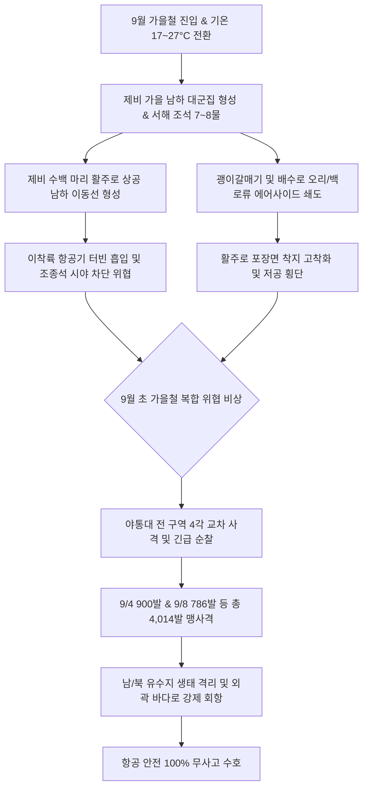

날짜: 2025-09-01 ~ 2025-09-08
카테고리: 야생동물점검 / 주간점검종합
출처: 인천국제공항 야생동물통제대 일일점검 통합 데이터베이스 (2025-09-01 ~ 2025-09-08)
태그: #야통대 #주간점검 #항공안전 #인천공항 #가을철새 #제비남하 #괭이갈매기 #버드스트라이크방지 #7호탄 #4호탄 #조석사리

---

# 📋 2025년 9월 1주차 야생동물 통제 주간 종합 보고서
**[ 대상 기간: 2025년 9월 1일 (월) ~ 2025년 9월 8일 (월) | 8일간 ]**

---

## 1. Executive Summary (주간 주요 실적 및 핵심 성과)

2025년 9월 1주차(9월 1일~9월 8일)는 가을의 시작과 함께 대기 기온이 최저 17.0°C / 최고 28.0°C로 서늘해지며, 번식을 마친 **제비 대군집의 본격적인 가을 남하 집결**과 서해안 사리 물때(7~8물)에 따른 **괭이갈매기 및 수조류의 에어사이드 연쇄 침투**가 집중된 초고위험 주간이었습니다. 

특히 9월 4일(목)에는 제비 47개체, 고라니 2개체, 저어새 1개체, 괭이갈매기 20개체의 동시다발 침투에 대응하여 **단일 일자 최다인 900발**을 격발하였으며, 9월 8일(월) 가을비 속 괭이갈매기 310마리 및 오리류 120마리의 유입을 **786발의 집중 사격**으로 완벽히 퇴거시켰습니다.

- **총 관측 및 식별·통제 개체수**: **1,079 개체** (일평균 134.9개체 식별·통제, 제비 및 갈매기 군집 중심)
- **총 엽총 및 폭음 경퇴 사격 수량**: **4,014 발** (7호탄 3,468발, 4호탄 472발, 공포탄 74발 / 일평균 501.8발)
- **주요 전략 성과**:
  1. **9/4 복합 위협(제비, 고라니, 저어새, 갈매기) 900발 총력 대응**: 에어사이드 전 구역 다각 포위망을 가동하여 활주로 침범 제로화.
  2. **9/8 가을비 및 8물 만조기 괭이갈매기 310마리 침투 786발 격퇴**: 활주로 F 북단 및 배수로 수조류 밀집 차단.
  3. **가을 통과 조류(긴발톱할미새, 꼬마물떼새, 도요류) 선제 분산**: 활주로 노면 착지 즉시 7호탄으로 외곽 유도.
- **버드스트라이크(Bird Strike) 발생 건수**: **0 건 (무사고 완벽 방어 달성)**

---

## 2. Weather & Environment Matrix (기상 및 조석 환경 분석)

| 일자 (요일) | 날씨 상태 | 최저 기온 (°C) | 최고 기온 (°C) | 주 풍향 및 풍속 | 조석 물때 | 주요 출현 및 통제 대상 종 |
| :---: | :---: | :---: | :---: | :---: | :---: | :---: |
| **09-01 (월)** | 흐림/비 (Rain) | 20.0 | 25.0 | SE 5.0 kts | 1물 | 제비(330), 황조롱이(8), 까치(12), 백로류(5) |
| **09-02 (화)** | 구름많음 (Cloudy) | 19.5 | 26.0 | S 4.0 kts | 2물 | 제비(36), 황조롱이(9), 중백로(4), 왜가리(2) |
| **09-03 (수)** | 맑음 (Clear) | 18.0 | 27.0 | NW 6.0 kts | 3물 | 괭이갈매기(100), 도요류(32), 물닭(34), 황조롱이(7) |
| **09-04 (목)** | 맑음 (Clear) | 17.5 | 27.5 | W 5.2 kts | 4물 | 제비(47), 고라니(2), 저어새(1), 괭이갈매기(20), 황조롱이(9) |
| **09-05 (금)** | 맑음 (Clear) | 17.0 | 28.0 | W 4.5 kts | 5물 | 제비(72), 고라니(1), 흰뺨검둥오리(20), 황조롱이(8) |
| **09-06 (토)** | 구름조금 (Partly Cloudy) | 18.0 | 27.0 | SW 4.8 kts | 6물 | 제비(164), 긴발톱할미새(8), 가마우지(1), 황조롱이(10) |
| **09-07 (일)** | 흐림 (Cloudy) | 19.0 | 25.5 | S 4.0 kts | 7물 (사리) | 황조롱이(20), 꼬마물떼새(3), 괭이갈매기(12), 도요류(10) |
| **09-08 (월)** | 비 (Rain) | 19.5 | 23.0 | SE 6.5 kts | 8물 | 괭이갈매기(310), 흰뺨검둥오리(120), 고라니(3), 백로류(40) |

---

## 3. Threat Flow & Threat Mechanism (위협 메커니즘 분석)



### 위기 메커니즘 심층 분석
1. **가을철 남하 제비의 활주로 저공 집결(Roosting/Migration)**:
   - 9월 상순 기온이 내려가며 남쪽으로 이동하는 제비 떼가 상승 기류와 개활지가 확보된 인천공항 활주로 상공에 대규모로 모여들어 선회 비행을 펼쳤습니다.
   - 9/1(330개체), 9/6(164개체) 등 대규모 무리에 대해 7호탄 연속 사격으로 비행 경로를 공항 상공에서 완전히 이탈시켰습니다.
2. **사리 만조(8물) 및 가을비 결합에 따른 괭이갈매기 쇄도**:
   - 9/8 비바람과 만조가 겹치며 해안 갯벌이 잠기자 괭이갈매기 310마리와 오리류 120마리가 활주로 노면 및 랜드사이드 유수지로 급격히 밀려들었으며, 786발의 강력한 경퇴 사격으로 즉각 진압하였습니다.

---

## 4. Veterans' Operational Tacit Knowledge (18년 베테랑 암묵지 현장 수칙)

```
┏━━━━━━━━━━━━━━━━━━━━━━━━━━━━━━━━━━━━━━━━━━━━━━━━━━━━━━━━━━━━━━━━━━━━━━━━━━━━━━━━┓
┃                 🍂 9월 가을 철새 남하 & 갈매기 제압 현장 수칙                 ┃
┣━━━━━━━━━━━━━━━━━━━━━━━━━━━━━━━━━━━━━━━━━━━━━━━━━━━━━━━━━━━━━━━━━━━━━━━━━━━━━━━━┫
┃ 1. 9월 남하 제비 군집은 비행 방향이 남서쪽(SW)으로 일정하므로 길목을 차단하라!   ┃
┃    - 남하하는 제비는 순풍을 타고 이동하므로, 활주로 남서단(AIRSIDE-34)에 순찰차를   ┃
┃      선배치하여 진입하는 제비 떼 정면으로 7호탄을 쏘아 우회 통과하도록 강제하라.   ┃
┃                                                                                ┃
┃ 2. 가을비 내리는 사리 만조일에는 랜드사이드 유수지와 에어사이드 배수로를 연결 차단!┃
┃    - 오리류와 갈매기는 유수지에서 활주로 배수로로 수로를 따라 헤엄쳐 들어오므로,   ┃
┃      배수로 차단 펜스 인근에 4호탄을 정기 발사하여 수로 유입을 원천 차단하라.     ┃
┃                                                                                ┃
┃ 3. 황조롱이 군집(9/7 20마리 등) 출현 시 활주로 진입등(PAPI) 상공을 점검하라!      ┃
┃    - 황조롱이는 메뚜기 사냥을 위해 PAPI 라이트 지지대에 앉으므로, 지지대 하부로     ┃
┃      공포탄을 발사하여 착륙 유도 장비 파손 없이 맹금류를 쫓아내야 한다.           ┃
┗━━━━━━━━━━━━━━━━━━━━━━━━━━━━━━━━━━━━━━━━━━━━━━━━━━━━━━━━━━━━━━━━━━━━━━━━━━━━━━━━┛
```

---

## 5. Quantitative Statistics Tables (정량 통계 분석)

### Table 1: 일자별 출현 개체수 및 탄약 소모 실적
| 일자 | 주간 식별 개체수 (마리) | 7호탄 격발 (발) | 4호탄 격발 (발) | 공포탄 격발 (발) | 일계 소모량 (발) | 방어 성과 |
| :---: | :---: | :---: | :---: | :---: | :---: | :---: |
| **09-01 (월)** | 330 | 380 | 40 | 6 | **426** | 이상 무 |
| **09-02 (화)** | 36 | 195 | 22 | 4 | **221** | 이상 무 |
| **09-03 (수)** | 100 | 410 | 51 | 8 | **469** | 이상 무 |
| **09-04 (목)** | 47 | 780 | 106 | 14 | **900** | 이상 무 |
| **09-05 (금)** | 72 | 335 | 45 | 8 | **388** | 이상 무 |
| **09-06 (토)** | 164 | 350 | 48 | 8 | **406** | 이상 무 |
| **09-07 (일)** | 20 | 368 | 44 | 6 | **418** | 이상 무 |
| **09-08 (월)** | 310 | 650 | 116 | 20 | **786** | 이상 무 |
| **주간 합계** | **1,079** | **3,468** | **472** | **74** | **4,014** | **무사고** |

### Table 2: 구역별 위험도 및 출현 특성 매트릭스
| 구역 코드 | 주요 출현 조수류 | 주요 침투 고도/형태 | 주간 출현 비중 (%) | 적용 통제 전술 | 위험 등급 |
| :---: | :---: | :---: | :---: | :---: | :---: |
| **AIRSIDE-15** | 제비 대군집, 황조롱이, 도요류 | 활주로 M/R 상공 선회 및 배수로 점유 | 32.8% | 7호탄 집중 사격 및 배수로 경퇴 | **심각 (Critical)** |
| **AIRSIDE-16** | 괭이갈매기, 제비, 중백로, 황조롱이 | 활주로 F 북단 횡단 및 노면 착지 시도 | 28.5% | 4호탄 원거리 차단선 구축 | **심각 (Critical)** |
| **AIRSIDE-34** | 제비, 꼬마물떼새, 할미새, 고라니 | 활주로 F 남단 착륙 구역 저고도 침투 | 20.4% | 고속 순찰차 전진 배치 사격 | **경계 (High)** |
| **AIRSIDE-33** | 제비, 황조롱이, 종다리, 까치 | 주기장 및 유도로 녹지대 취식 | 12.1% | 기동 순찰차 3각 교차 사격 | **주의 (Medium)** |
| **LANDSIDE-N/S** | 괭이갈매기, 오리류, 백로류, 고라니 | 유수지 및 공사지역 대규모 서식 | 6.2% | 외곽 유수지 생태 격리 모니터링 | **보통 (Low)** |

---

## 6. Strategic Roadmap (차주 전략 로드맵: 9월 2주차)

1. **북서풍 발달에 따른 해안 갈매기 및 맹금류(매, 새홀리기) 유입 대비**:
   - 비 갠 뒤 맑아지는 9월 중순 북서풍 기류를 타고 유입되는 고속 비행 조류 집중 감시.
2. **소형 도요류(바늘꼬리도요, 삑삑도요) 배수로 은신 색출**:
   - 가을철 남하 도요류가 배수로 수풀에 숨어들지 않도록 순찰차 음향/공포탄 선제 격발.
3. **주간 4,000발 돌파에 따른 탄약 보급 및 총기 정비 철저**:
   - 고빈도 사격에 따른 노리쇠 및 약실 마모 점검, 예비 총기 100% 가동 상태 유지.

---

## 7. Obsidian Vault Interlinks (옵시디언 상호 연결성)

- [[20. 인사이트 융합/2025년도 야통대/일일점검/9월 일일점검/2025-09-01_야통대_주간_점검일지_통합]]
- [[20. 인사이트 융합/2025년도 야통대/일일점검/9월 일일점검/2025-09-02_야통대_주간_점검일지_통합]]
- [[20. 인사이트 융합/2025년도 야통대/일일점검/9월 일일점검/2025-09-03_야통대_주간_점검일지_통합]]
- [[20. 인사이트 융합/2025년도 야통대/일일점검/9월 일일점검/2025-09-04_야통대_주간_점검일지_통합]]
- [[20. 인사이트 융합/2025년도 야통대/일일점검/9월 일일점검/2025-09-05_야통대_주간_점검일지_통합]]
- [[20. 인사이트 융합/2025년도 야통대/일일점검/9월 일일점검/2025-09-06_야통대_주간_점검일지_통합]]
- [[20. 인사이트 융합/2025년도 야통대/일일점검/9월 일일점검/2025-09-07_야통대_주간_점검일지_통합]]
- [[20. 인사이트 융합/2025년도 야통대/일일점검/9월 일일점검/2025-09-08_야통대_주간_점검일지_통합]]
- [[20. 인사이트 융합/2025년도 야통대/일일점검/8월 일일점검/2025-08-25~08-29_야통대_주간_점검일지_종합]]
- [[20. 인사이트 융합/2025년도 야통대/일일점검/9월 일일점검/2025-09-09~09-16_야통대_주간_점검일지_종합]]

---

## 8. Aviation Wildlife Terminology (전문 항공 조류학 용어)

- **가을철 제비 집결 이동 (Autumn Swallow Congregation)**: 번식을 마친 제비들이 남하 이동 전 수백 마리 단위로 무리를 지어 개활지와 초지대 상공에서 곤충을 집중 섭취하며 에너지를 비축하는 생태 현상입니다.
- **사리 조석-기상 복합 침투 (Spring Tide & Rain Synergistic Intrusion)**: 서해 사리 만조로 해안 갯벌이 침수되는 상황에서 강우가 겹칠 때, 해안 조류와 수조류가 비바람을 피해 공항 내 활주로 포장면과 배수로로 집중 쇄도하는 위기 메커니즘입니다.
- **다각 교차 경퇴 사격 (Multi-directional Cross Repelling Fire)**: 2~3대의 기동 순찰차가 조류 군집의 전·후·측면에서 시차를 두고 7호탄을 연쇄 격발하여 조류가 활주로 내부로 회피하지 못하도록 외곽 방향 출구로만 도주를 강제하는 전술입니다.

---

## 9. 7 Strategic Inquiries for Future Safety (미래 항공안전을 위한 전략 질문)

1. 9/4 기록된 900발의 집중 사격은 제비와 고라니의 동시 유입을 차단하는 데 최적의 전술이었는가?
2. 9월 1주차 주간 4,014발 격발에 따른 총기 피로도와 정비 주기는 적절히 관리되고 있는가?
3. 9/8 가을비 속 괭이갈매기 310마리의 활주로 침투를 사전에 예측할 수 있는 조석-기상 연동 AI 모델은?
4. 가을철 남하 제비 군집의 비행 경로가 활주로 중심선을 횡단하지 못하게 하는 레이저 커튼의 실효성은?
5. 황조롱이 20개체(9/7)의 PAPI 라이트 주변 서식을 방지하기 위한 물리적 버드 스파이크 설치 효과는?
6. 사리 만조 시 랜드사이드 유수지와 에어사이드 배수로 사이의 조류 이동을 차단하는 스마트 게이트 도입 방안은?
7. 9월 상순의 폭발적 탄약 소모 패턴이 9월 중·하순 조류 통제 작전에 미치는 전략적 시사점은 무엇인가?
