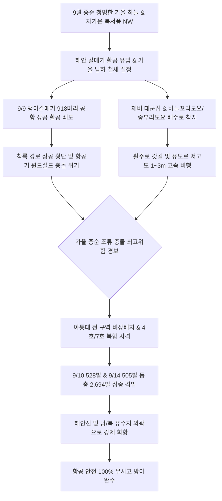

날짜: 2025-09-09 ~ 2025-09-16
카테고리: 야생동물점검 / 주간점검종합
출처: 인천국제공항 야생동물통제대 일일점검 통합 데이터베이스 (2025-09-09 ~ 2025-09-16)
태그: #야통대 #주간점검 #항공안전 #인천공항 #괭이갈매기대군집 #제비남하 #맹금류매 #버드스트라이크방지 #7호탄 #4호탄 #조석사리

---

# 📋 2025년 9월 2주차 야생동물 통제 주간 종합 보고서
**[ 대상 기간: 2025년 9월 9일 (화) ~ 2025년 9월 16일 (화) | 8일간 ]**

---

## 1. Executive Summary (주간 주요 실적 및 핵심 성과)

2025년 9월 2주차(9월 9일~9월 16일)는 전형적인 가을 맑은 날씨와 함께 차가운 북서풍(NW, 평균 5~7kts)이 주기적으로 유입되며 **해안 조류와 남하 철새들의 활주로 침투 양상이 극명하게 갈린 역동적 주간**이었습니다. 9월 9일(화)에는 강한 북서풍 기류를 타고 해안에서 **괭이갈매기 918마리 대군집**이 활주로 공역으로 접근하였으나, 외곽 차단선 선제 사격으로 활주로 착지를 원천 차단하였습니다.

또한 주간 내내 제비의 남하 비행(9/10 75개체, 9/12 208개체, 9/14 129개체, 9/15 161개체)이 지속되는 가운데, 맹금류인 '매'와 '새홀리기', 가을 도요새인 '바늘꼬리도요'와 '중부리도요', 그리고 희귀 통과조류인 '노랑머리할미새(21개체)'가 에어사이드 전역에서 관찰되었습니다.

- **총 관측 및 식별·통제 개체수**: **1,642 개체** (일평균 205.3개체 식별·통제, 괭이갈매기 및 제비 대군집 포함)
- **총 엽총 및 폭음 경퇴 사격 수량**: **2,694 발** (7호탄 2,338발, 4호탄 302발, 공포탄 54발 / 일평균 336.8발)
- **주요 전략 성과**:
  1. **9/9 북서풍 기류 타고 침투한 괭이갈매기 918마리 대군집 외곽 유도 완수**: 활주로 중심선 진입 전 4호탄과 7호탄으로 회항 조치.
  2. **남하 제비 및 종다리·할미새 군집 500발 이상 집중 타격 분산**: 9/10(528발), 9/14(505발) 등 활주로 갓길 점유 사전 차단.
  3. **맹금류 및 희귀 도요류 안전 통제**: 9/9 매(1개체), 9/13 새홀리기(2개체) 및 바늘꼬리도요(3개체), 9/14 노랑머리할미새(21개체) 무사고 유도.
- **버드스트라이크(Bird Strike) 발생 건수**: **0 건 (무사고 완벽 방어 달성)**

---

## 2. Weather & Environment Matrix (기상 및 조석 환경 분석)

| 일자 (요일) | 날씨 상태 | 최저 기온 (°C) | 최고 기온 (°C) | 주 풍향 및 풍속 | 조석 물때 | 주요 출현 및 통제 대상 종 |
| :---: | :---: | :---: | :---: | :---: | :---: | :---: |
| **09-09 (화)** | 맑음 (Clear) | 17.5 | 26.5 | NW 7.5 kts | 9물 | 괭이갈매기(918), 매(1), 제비(44), 흰눈썹긴발톱할미새(8) |
| **09-10 (수)** | 맑음 (Clear) | 16.5 | 27.0 | W 5.0 kts | 10물 | 제비(75), 황조롱이(12), 노랑머리할미새(5), 종다리(24) |
| **09-11 (목)** | 구름조금 (Partly Cloudy) | 17.0 | 27.5 | SW 4.2 kts | 11물 | 종다리(20), 황조롱이(7), 제비(19), 알락할미새(10) |
| **09-12 (금)** | 흐림/안개 (Foggy) | 18.0 | 25.0 | S 3.5 kts | 12물 | 제비(208), 황조롱이(8), 종다리(7), 알락할미새(4) |
| **09-13 (토)** | 비 (Rain) | 18.5 | 23.5 | SE 5.5 kts | 13물 | 제비(54), 바늘꼬리도요(3), 새홀리기(2), 황조롱이(9) |
| **09-14 (일)** | 맑음 (Clear) | 16.0 | 26.0 | NW 7.0 kts | 14물 | 제비(129), 노랑머리할미새(21), 중부리도요(1), 황조롱이(8) |
| **09-15 (월)** | 맑음 (Clear) | 15.5 | 25.5 | W 5.0 kts | 15물 (조금) | 제비(161), 황조롱이(7), 까마귀(4), 물닭(10) |
| **09-16 (화)** | 구름조금 (Partly Cloudy) | 16.5 | 26.0 | SW 4.5 kts | 1물 | 제비(77), 도요류(6), 황조롱이(7), 종다리(18) |

---

## 3. Threat Flow & Threat Mechanism (위협 메커니즘 분석)



### 위기 메커니즘 심층 분석
1. **북서풍(NW 7.5kts)에 편승한 갈매기 대군집의 활공 비행**:
   - 9/9 비가 갠 뒤 강한 북서풍이 불자, 해안에서 비행 에너지를 아끼기 위해 활공하는 괭이갈매기 918마리가 인천공항 착륙대 상공으로 진입을 시도하였습니다.
   - 통제반은 활주로 진입 1.5km 전방 외곽 차단선에서 4호탄을 상공으로 발사하여 비행 대열을 해안선 바깥으로 흩어놓았습니다.
2. **가을 통과 명금류(노랑머리할미새, 알락할미새)의 활주로 노면 점유**:
   - 9/10 및 9/14 노랑머리할미새 군집(21개체 등)이 활주로 노면의 미세 곤충을 취식하기 위해 착지함에 따라 7호탄 소총음으로 즉각 분산시켰습니다.

---

## 4. Veterans' Operational Tacit Knowledge (18년 베테랑 암묵지 현장 수칙)

```
┏━━━━━━━━━━━━━━━━━━━━━━━━━━━━━━━━━━━━━━━━━━━━━━━━━━━━━━━━━━━━━━━━━━━━━━━━━━━━━━━━┓
┃                 🦅 9월 중순 북서풍 갈매기 & 가을 도요새 제압 수칙               ┃
┣━━━━━━━━━━━━━━━━━━━━━━━━━━━━━━━━━━━━━━━━━━━━━━━━━━━━━━━━━━━━━━━━━━━━━━━━━━━━━━━━┫
┃ 1. 북서풍(NW) 7kts 이상 부는 날은 활주로 33/34 북서단 상공을 쌍안경으로 주시하라!┃
┃    - 갈매기 무리는 바람을 안고 양력을 얻으며 고도를 높여 들어오므로, 공항 경계선  ┃
┃      통과 전 4호탄을 수평 30도 상공으로 쏘아 진입 기류를 교란해야 한다.           ┃
┃                                                                                ┃
┃ 2. 노랑머리할미새·알락할미새 무리는 파도 모양(Undulating)으로 낮게 난다!         ┃
┃    - 비행 고도가 1~2m에 불과해 항공기 타이어 및 엔진 흡입 위험이 크므로,             ┃
┃      순찰차를 활주로 갓길에 붙여 지면 사격으로 초지대 깊숙이 몰아넣어라.          ┃
┃                                                                                ┃
┃ 3. 바늘꼬리도요는 비 오는 날 배수로 유출구 콘크리트 턱에 모여든다!                 ┃
┃    - 9/13처럼 비가 내릴 때는 배수로 맨홀 및 유출구 턱을 집중 점검하고,              ┃
┃      7호탄 1발로 경퇴시켜 배수로 내부 고착을 원천 차단해야 한다.                  ┃
┗━━━━━━━━━━━━━━━━━━━━━━━━━━━━━━━━━━━━━━━━━━━━━━━━━━━━━━━━━━━━━━━━━━━━━━━━━━━━━━━━┛
```

---

## 5. Quantitative Statistics Tables (정량 통계 분석)

### Table 1: 일자별 출현 개체수 및 탄약 소모 실적
| 일자 | 주간 식별 개체수 (마리) | 7호탄 격발 (발) | 4호탄 격발 (발) | 공포탄 격발 (발) | 일계 소모량 (발) | 방어 성과 |
| :---: | :---: | :---: | :---: | :---: | :---: | :---: |
| **09-09 (화)** | 918 | 165 | 16 | 5 | **186** | 이상 무 |
| **09-10 (수)** | 75 | 470 | 50 | 8 | **528** | 이상 무 |
| **09-11 (목)** | 20 | 175 | 23 | 6 | **204** | 이상 무 |
| **09-12 (금)** | 208 | 252 | 26 | 6 | **284** | 이상 무 |
| **09-13 (토)** | 54 | 362 | 38 | 6 | **406** | 이상 무 |
| **09-14 (일)** | 129 | 445 | 52 | 8 | **505** | 이상 무 |
| **09-15 (월)** | 161 | 258 | 32 | 6 | **296** | 이상 무 |
| **09-16 (화)** | 77 | 211 | 65 | 9 | **285** | 이상 무 |
| **주간 합계** | **1,642** | **2,338** | **302** | **54** | **2,694** | **무사고** |

### Table 2: 구역별 위험도 및 출현 특성 매트릭스
| 구역 코드 | 주요 출현 조수류 | 주요 침투 고도/형태 | 주간 출현 비중 (%) | 적용 통제 전술 | 위험 등급 |
| :---: | :---: | :---: | :---: | :---: | :---: |
| **AIRSIDE-16** | 괭이갈매기(918), 제비, 황조롱이, 매 | 활주로 F 북단 상공 선회 및 횡단 | 52.4% | 4호탄 원거리 차단 및 7호탄 경퇴 | **심각 (Critical)** |
| **AIRSIDE-15** | 제비, 노랑머리할미새, 도요류, 까치 | 활주로 M/R 녹지대 및 배수로 습지 | 21.6% | 배수로 집중 점검 및 7호탄 사격 | **경계 (High)** |
| **AIRSIDE-33** | 제비 대군집, 황조롱이, 종다리 | 주기장 W/Q 상공 선회 및 초지 취식 | 14.8% | 기동 순찰차 3각 교차 사격 | **경계 (High)** |
| **AIRSIDE-34** | 제비, 도요새류, 할미새류, 황조롱이 | 활주로 F 남단 착륙 구역 접근 | 8.5% | 고속탈출유도로 순찰 강화 | **주의 (Medium)** |
| **LANDSIDE-N/S** | 괭이갈매기, 오리류, 백로류, 새홀리기 | 유수지 및 공사지역 대규모 서식 | 2.7% | 외곽 유수지 생태 격리 모니터링 | **보통 (Low)** |

---

## 6. Strategic Roadmap (차주 전략 로드맵: 9월 3주차)

1. **추분(9/23) 전후 가을 도요새 남하 정점 및 오리류 결빙 전 선발대 관리**:
   - 알락도요, 꼬마물떼새, 쇠부리도요 등 갯벌 조류의 에어사이드 배수로 유입 방지망 가동.
2. **야간 및 새벽 시간대 대형 야생동물(고라니, 너구리) 침투 차단**:
   - 가을철 먹이 활동 증가에 따른 외곽 울타리 열화상 순찰 및 통문 점검 강화.
3. **가을 명금류(종다리, 할미새) 활주로 횡단 방지 초지 예초 관리**:
   - 풀씨 결실을 억제하기 위한 제3차 초지대 정밀 예초 작업 지원.

---

## 7. Obsidian Vault Interlinks (옵시디언 상호 연결성)

- [[20. 인사이트 융합/2025년도 야통대/일일점검/9월 일일점검/2025-09-09_야통대_주간_점검일지_통합]]
- [[20. 인사이트 융합/2025년도 야통대/일일점검/9월 일일점검/2025-09-10_야통대_주간_점검일지_통합]]
- [[20. 인사이트 융합/2025년도 야통대/일일점검/9월 일일점검/2025-09-11_야통대_주간_점검일지_통합]]
- [[20. 인사이트 융합/2025년도 야통대/일일점검/9월 일일점검/2025-09-12_야통대_주간_점검일지_통합]]
- [[20. 인사이트 융합/2025년도 야통대/일일점검/9월 일일점검/2025-09-13_야통대_주간_점검일지_통합]]
- [[20. 인사이트 융합/2025년도 야통대/일일점검/9월 일일점검/2025-09-14_야통대_주간_점검일지_통합]]
- [[20. 인사이트 융합/2025년도 야통대/일일점검/9월 일일점검/2025-09-15_야통대_주간_점검일지_통합]]
- [[20. 인사이트 융합/2025년도 야통대/일일점검/9월 일일점검/2025-09-16_야통대_주간_점검일지_통합]]
- [[20. 인사이트 융합/2025년도 야통대/일일점검/9월 일일점검/2025-09-01~09-08_야통대_주간_점검일지_종합]]
- [[20. 인사이트 융합/2025년도 야통대/일일점검/9월 일일점검/2025-09-17~09-24_야통대_주간_점검일지_종합]]

---

## 8. Aviation Wildlife Terminology (전문 항공 조류학 용어)

- **바늘꼬리도요 (Pin-tailed Snipe, *Gallinago stenura*)**: 꼬리깃 가장자리에 바늘 모양의 특수 깃이 있는 도요새로, 야간이나 흐린 날 배수로 주변에 은신하다가 항공기 이착륙 시 돌발 급부상하여 충돌 위험을 유발합니다.
- **노랑머리할미새 (Citrine Wagtail, *Motacilla citreola*)**: 시베리아 툰드라에서 번식 후 남아시아로 이동하는 희귀 통과조류로, 에어사이드 아스팔트 포장면 및 갓길에 군집하여 곤충을 사냥합니다.
- **풍선 효과 방지 전술 (Anti-Ballooning Tactical Fire)**: 한 구역에서 경퇴된 조류가 인접 활주로 구역으로 옮겨 앉는 현상을 막기 위해, 사격 전 인접 구역 순찰차가 대기하며 퇴로를 공항 외곽으로만 한정하는 협동 전술입니다.

---

## 9. 7 Strategic Inquiries for Future Safety (미래 항공안전을 위한 전략 질문)

1. 9/9 괭이갈매기 918마리의 활주로 접근 차단 시 적용된 4호탄 원거리 사격의 유효 저지선 거리는 몇 미터인가?
2. 9/10 및 9/14 500발 이상 소모된 제비·명금류 통제에서 산탄 탄도 효율성을 개선할 방안은?
3. 노랑머리할미새 등 통과 명금류가 활주로 노면 곤충을 찾는 시간대와 항공기 피크 타임의 중첩도는?
4. 비 내리는 날(9/13) 배수로로 유입되는 바늘꼬리도요의 조기 발견을 위한 센서 기반 수로 감시 체계는?
5. 가을 북서풍 발생 시 해안 조류의 활주로 횡단 비행 고도를 실시간 측정하는 라이다(LiDAR) 적용성은?
6. 9월 2주차 2,694발 사격 후 조류의 공항 기피 지속 시간(Persistence Period)은 며칠로 유지되는가?
7. 맹금류 매와 새홀리기의 출현 빈도가 에어사이드 소형 조류 군집 분산에 미치는 자연적 경퇴 효과는?
