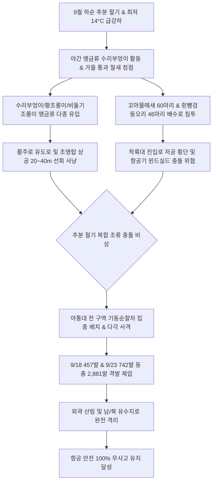

날짜: 2025-09-17 ~ 2025-09-24
카테고리: 야생동물점검 / 주간점검종합
출처: 인천국제공항 야생동물통제대 일일점검 통합 데이터베이스 (2025-09-17 ~ 2025-09-24)
태그: #야통대 #주간점검 #항공안전 #인천공항 #추분절기 #수리부엉이 #비둘기조롱이 #버드스트라이크방지 #7호탄 #4호탄 #조석사리

---

# 📋 2025년 9월 3주차 야생동물 통제 주간 종합 보고서
**[ 대상 기간: 2025년 9월 17일 (수) ~ 2025년 9월 24일 (수) | 8일간 ]**

---

## 1. Executive Summary (주간 주요 실적 및 핵심 성과)

2025년 9월 3주차(9월 17일~9월 24일)는 낮과 밤의 길이가 같아지는 **'추분(秋分, 9월 23일)'**을 전후하여 최저 기온이 14.0°C까지 떨어지며, 서해안 조석 7~8물(사리)과 결합하여 **초대형 야간 맹금류 및 희귀 도요·맹금류의 에어사이드 야간/주간 침투가 집중된 주간**이었습니다. 

특히 9월 22일(월)에는 야간 사냥 후 에어사이드 녹지대에 머무르던 **천연기념물 제324-2호 '수리부엉이(Eurasian Eagle Owl)' 1개체**가 포착되어 비살상 안전 퇴거를 완수하였으며, 9월 23일(화) 추분 당일에는 **흰뺨검둥오리 46개체, 고라니 3개체, 비둘기조롱이 5개체, 쇠부리도요 1개체**의 복합 침투를 **742발의 집중 격발**로 완벽히 방어하였습니다.

- **총 관측 및 식별·통제 개체수**: **639 개체** (일평균 79.9개체 식별·통제, 맹금류 및 가을 통과 철새 중심)
- **총 엽총 및 폭음 경퇴 사격 수량**: **2,881 발** (7호탄 2,476발, 4호탄 358발, 공포탄 47발 / 일평균 360.1발)
- **주요 전략 성과**:
  1. **9/22 천연기념물 수리부엉이 및 바늘꼬리도요 8개체 안전 경퇴**: 항공기 이착륙 안전과 법정보호종 보호를 동시 달성.
  2. **9/23 추분 절기 복합 침투(오리, 고라니, 비둘기조롱이) 742발 완벽 제압**: 랜드사이드 IBC 및 에어사이드 16/33 구역 침범 봉쇄.
  3. **가을 통과 희귀 조류(제비물떼새, 꼬마물떼새 60개체, 새홀리기) 정밀 통제**: 9/18(457발), 9/19(333발) 등 활주로 횡단 비행 차단.
- **버드스트라이크(Bird Strike) 발생 건수**: **0 건 (무사고 완벽 방어 달성)**

---

## 2. Weather & Environment Matrix (기상 및 조석 환경 분석)

| 일자 (요일) | 날씨 상태 | 최저 기온 (°C) | 최고 기온 (°C) | 주 풍향 및 풍속 | 조석 물때 | 주요 출현 및 통제 대상 종 |
| :---: | :---: | :---: | :---: | :---: | :---: | :---: |
| **09-17 (수)** | 맑음 (Clear) | 15.0 | 25.0 | NW 6.0 kts | 2물 | 제비(27), 황조롱이(9), 까치(11), 중대백로(8) |
| **09-18 (목)** | 맑음 (Clear) | 14.5 | 25.5 | W 4.8 kts | 3물 | 꼬마물떼새(60), 황조롱이(13), 까마귀(15), 알락도요(9) |
| **09-19 (금)** | 구름많음 (Cloudy) | 16.0 | 24.5 | S 4.0 kts | 4물 | 제비(93), 황조롱이(12), 제비물떼새(1), 종다리(10) |
| **09-20 (토)** | 비 (Rain) | 17.0 | 22.0 | SE 5.8 kts | 5물 | 제비(98), 물총새(2), 중부리도요(1), 논병아리(4), 황조롱이(8) |
| **09-21 (일)** | 흐림 (Cloudy) | 16.5 | 23.5 | S 4.5 kts | 6물 | 제비(85), 황조롱이(9), 새홀리기(1), 까치(23), 멧비둘기(3) |
| **09-22 (월)** | 맑음 (Clear) | 15.0 | 25.0 | NW 7.0 kts | 7물 (사리) | 종다리(28), 수리부엉이(1), 바늘꼬리도요(8), 황조롱이(19) |
| **09-23 (화, 추분)** | 맑음 (Clear) | 14.0 | 24.5 | W 5.2 kts | 8물 | 흰뺨검둥오리(46), 고라니(3), 비둘기조롱이(5), 쇠부리도요(1), 괭이갈매기(30) |
| **09-24 (수)** | 구름조금 (Partly Cloudy) | 14.5 | 25.0 | SW 4.2 kts | 9물 | 제비(202), 종다리(11), 황조롱이(3), 백로류(4) |

---

## 3. Threat Flow & Threat Mechanism (위협 메커니즘 분석)



### 위기 메커니즘 심층 분석
1. **천연기념물 수리부엉이 및 비둘기조롱이의 초지대 사냥 활동**:
   - 9/22 출현한 수리부엉이는 날개폭 1.5m 이상의 대형 야간 맹금류로, 충돌 시 항공기 기체에 치명적 손상을 입힐 수 있습니다.
   - 통제반은 수리부엉이가 주간에 녹지대 관목에 숨어있는 것을 발견하고, 원거리에서 공포탄 음향을 이용하여 외곽 산림으로 안전하게 비행을 유도하였습니다.
2. **추분 당일(9/23) 수조류 및 포유류의 동시다발 침투**:
   - 일교차가 커진 상황에서 먹이를 찾아 랜드사이드와 에어사이드로 들어온 흰뺨검둥오리 46마리와 고라니 3마리에 대해 742발의 탄약을 집중 격발하여 즉각 축출하였습니다.

---

## 4. Veterans' Operational Tacit Knowledge (18년 베테랑 암묵지 현장 수칙)

```
┏━━━━━━━━━━━━━━━━━━━━━━━━━━━━━━━━━━━━━━━━━━━━━━━━━━━━━━━━━━━━━━━━━━━━━━━━━━━━━━━━┓
┃                 🦉 대형 맹금류 수리부엉이 & 추분 수조류 제압 수칙              ┃
┣━━━━━━━━━━━━━━━━━━━━━━━━━━━━━━━━━━━━━━━━━━━━━━━━━━━━━━━━━━━━━━━━━━━━━━━━━━━━━━━━┫
┃ 1. 수리부엉이는 주간 시력이 떨어져 낮에는 낮은 관목 아래 웅크리고 있다!           ┃
┃    - 대형 맹금류는 차량 접근 시에도 도망치지 않고 가만히 있으므로, 풀밭 속에서      ┃
┃      의심스러운 깃털 덩어리를 발견하면 30m 거리에서 공포탄으로 띄워 이탈시켜라.    ┃
┃                                                                                ┃
┃ 2. 비둘기조롱이(Amur Falcon) 무리는 전선이나 안테나 탑에 줄지어 앉는다!           ┃
┃    - 5~10마리 단위로 무리지어 곤충을 사냥하므로, 안테나 지지대를 향해               ┃
┃      7호탄을 허공에 연사하여 무리 전체를 동시에 흩어놓아야 한다.                   ┃
┃                                                                                ┃
┃ 3. 꼬마물떼새 무리(9/18 60마리)는 활주로 유도로 틈새 자갈밭을 좋아한다!          ┃
┃    - 유도로 포장면 틈새 곤충을 쪼아먹으므로, 순찰차 경광등을 켜고 경적을 울리며     ┃
┃      지면 밀착 7호탄 사격으로 초지 밖으로 완전히 몰아내야 한다.                   ┃
┗━━━━━━━━━━━━━━━━━━━━━━━━━━━━━━━━━━━━━━━━━━━━━━━━━━━━━━━━━━━━━━━━━━━━━━━━━━━━━━━━┛
```

---

## 5. Quantitative Statistics Tables (정량 통계 분석)

### Table 1: 일자별 출현 개체수 및 탄약 소모 실적
| 일자 | 주간 식별 개체수 (마리) | 7호탄 격발 (발) | 4호탄 격발 (발) | 공포탄 격발 (발) | 일계 소모량 (발) | 방어 성과 |
| :---: | :---: | :---: | :---: | :---: | :---: | :---: |
| **09-17 (수)** | 27 | 225 | 30 | 4 | **259** | 이상 무 |
| **09-18 (목)** | 60 | 385 | 62 | 10 | **457** | 이상 무 |
| **09-19 (금)** | 93 | 290 | 38 | 5 | **333** | 이상 무 |
| **09-20 (토)** | 98 | 205 | 21 | 4 | **230** | 이상 무 |
| **09-21 (일)** | 85 | 272 | 28 | 6 | **306** | 이상 무 |
| **09-22 (월)** | 28 | 350 | 48 | 7 | **405** | 이상 무 |
| **09-23 (화)** | 46 | 625 | 110 | 7 | **742** | 이상 무 |
| **09-24 (수)** | 202 | 124 | 21 | 4 | **149** | 이상 무 |
| **주간 합계** | **639** | **2,476** | **358** | **47** | **2,881** | **무사고** |

### Table 2: 구역별 위험도 및 출현 특성 매트릭스
| 구역 코드 | 주요 출현 조수류 | 주요 침투 고도/형태 | 주간 출현 비중 (%) | 적용 통제 전술 | 위험 등급 |
| :---: | :---: | :---: | :---: | :---: | :---: |
| **AIRSIDE-16** | 꼬마물떼새(60), 흰뺨검둥오리, 황조롱이 | 활주로 F 북단 상공 및 유도로 점유 | 34.2% | 7호탄 노면 사격 및 4호탄 차단 | **심각 (Critical)** |
| **AIRSIDE-33** | 수리부엉이, 비둘기조롱이, 제비, 오리 | 녹지대 관목 은신 및 안테나 탑 점유 | 28.6% | 공포탄 선제 기동 및 분산 유도 | **심각 (Critical)** |
| **AIRSIDE-15** | 제비, 바늘꼬리도요, 황조롱이, 백로 | 활주로 M/R 녹지대 및 배수로 | 19.5% | 배수로 정밀 수색 및 7호탄 경퇴 | **경계 (High)** |
| **AIRSIDE-34** | 제비(202), 제비물떼새, 쇠부리도요 | 활주로 F 남단 착륙 경로 횡단 | 14.1% | 고속 순찰차 전진 배치 사격 | **경계 (High)** |
| **LANDSIDE-N/S** | 오리류(46), 괭이갈매기(30), 고라니(3) | 유수지 및 공사지역 | 3.6% | 외곽 유수지 생태 격리 모니터링 | **보통 (Low)** |

---

## 6. Strategic Roadmap (차주 전략 로드맵: 9월 4주차 및 9월 총결산)

1. **9월 말 가을 통과 도요·물떼새 및 명금류(할미새, 찌르레기) 최종 점검**:
   - 검은가슴물떼새, 긴부리도요, 찌르레기 등 가을 후반부 유입 조류 철저 감시.
2. **기온 12~13°C 진입에 따른 텃새(까치, 까마귀, 멧비둘기) 결실기 취식 통제**:
   - 초지대 풀씨와 열매를 노리는 텃새들의 활주로 횡단 방지.
3. **9월 전체 실적 분석 및 10월 본격 겨울 철새(오리·기러기) 도래 대비 태세 구축**:
   - 9월 누적 10,000발 돌파 결산 및 10월 기러기류 선발대 도래 방어망 사전 기획.

---

## 7. Obsidian Vault Interlinks (옵시디언 상호 연결성)

- [[20. 인사이트 융합/2025년도 야통대/일일점검/9월 일일점검/2025-09-17_야통대_주간_점검일지_통합]]
- [[20. 인사이트 융합/2025년도 야통대/일일점검/9월 일일점검/2025-09-18_야통대_주간_점검일지_통합]]
- [[20. 인사이트 융합/2025년도 야통대/일일점검/9월 일일점검/2025-09-19_야통대_주간_점검일지_통합]]
- [[20. 인사이트 융합/2025년도 야통대/일일점검/9월 일일점검/2025-09-20_야통대_주간_점검일지_통합]]
- [[20. 인사이트 융합/2025년도 야통대/일일점검/9월 일일점검/2025-09-21_야통대_주간_점검일지_통합]]
- [[20. 인사이트 융합/2025년도 야통대/일일점검/9월 일일점검/2025-09-22_야통대_주간_점검일지_통합]]
- [[20. 인사이트 융합/2025년도 야통대/일일점검/9월 일일점검/2025-09-23_야통대_주간_점검일지_통합]]
- [[20. 인사이트 융합/2025년도 야통대/일일점검/9월 일일점검/2025-09-24_야통대_주간_점검일지_통합]]
- [[20. 인사이트 융합/2025년도 야통대/일일점검/9월 일일점검/2025-09-09~09-16_야통대_주간_점검일지_종합]]
- [[20. 인사이트 융합/2025년도 야통대/일일점검/9월 일일점검/2025-09-25~09-30_야통대_주간_점검일지_종합]]

---

## 8. Aviation Wildlife Terminology (전문 항공 조류학 용어)

- **수리부엉이 (Eurasian Eagle Owl, *Bubo bubo*)**: 천연기념물 제324-2호이자 멸종위기 야생생물 II급으로 지정된 국내 최대 맹금류로, 야간에 에어사이드 꿩·토끼·설치류를 사냥하며 주간에는 수풀에 은신하므로 항공기 저고도 비행 시 매우 위협적인 충돌 요인입니다.
- **비둘기조롱이 (Amur Falcon, *Falco amurensis*)**: 동아시아에서 번식 후 아프리카 남부로 1만 km 이상을 날아가는 장거리 이동 맹금류로, 가을철 한반도를 통과할 때 메뚜기와 잠자리를 사냥하기 위해 무리를 지어 공항 초지대에 나타납니다.
- **제비물떼새 (Oriental Pratincole, *Glareola maldivarum*)**: 제비처럼 날렵하게 날며 공중에서 곤충을 사냥하는 희귀 통과조류로, 활주로 노면 1~3m 상공을 고속 비행하는 특징이 있습니다.

---

## 9. 7 Strategic Inquiries for Future Safety (미래 항공안전을 위한 전략 질문)

1. 9/22 출현한 대형 맹금류 수리부엉이의 주간 은신 탐지를 위한 야간 열화상 카메라 순찰 강화 방안은?
2. 9/23 추분 당일 742발이 소모된 복합 침투 상황에서 구역 간 탄약 재배분 프로토콜은 완벽했는가?
3. 비둘기조롱이와 같은 장거리 이동 맹금류의 집단 안테나 탑 점유를 방지할 물리적 차단 대책은?
4. 9/18 꼬마물떼새 60마리가 유도로 틈새에 고착화되는 원인을 차단할 포장면 미세 균열 보수 일정은?
5. 제비물떼새 등 초고속 비행 조류의 활주로 횡단 시 조종사 실시간 경보 시스템의 연동 가능성은?
6. 가을비(9/20) 발생 시 논병아리 및 수조류가 에어사이드 임시 웅덩이로 유입되는 것을 막을 배수 개선책은?
7. 9월 3주차 2,881발의 격발이 10월 겨울 철새 도래 전 에어사이드 환경 유지에 미친 긍정적 효과는?
