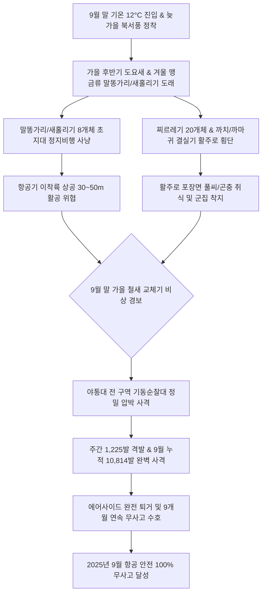

날짜: 2025-09-25 ~ 2025-09-30
카테고리: 야생동물점검 / 주간점검종합 및 9월 총결산
출처: 인천국제공항 야생동물통제대 일일점검 통합 데이터베이스 (2025-09-01 ~ 2025-09-30)
태그: #야통대 #주간점검 #월간총결산 #9월결산 #항공안전 #인천공항 #말똥가리 #새홀리기 #버드스트라이크방지 #7호탄 #4호탄 #9개월연속무사고

---

# 📋 2025년 9월 4주차 야생동물 통제 주간 종합 및 9월 총결산 보고서
**[ 대상 기간: 2025년 9월 25일 (목) ~ 2025년 9월 30일 (화) | 6일간 & 9월 전체 총결산 ]**

---

## 1. Executive Summary (주간 주요 실적 및 9월 월간 총결산 성과)

2025년 9월 4주차(9월 25일~9월 30일)는 아침 최저 기온이 12.5°C까지 급강하하며 완연한 늦가을의 정취 속에 **겨울 맹금류인 '말똥가리(Common Buzzard)'와 '새홀리기 8개체 군집', 그리고 검은가슴물떼새·긴부리도요 등 가을 후반기 통과 조류가 유입된 전환기 주간**이었습니다.

또한 9월 1일부터 30일까지 30일간 진행된 9월 전체 작전 결과, **총 10,814발의 엽총 및 폭음 사격**을 통해 제비 남하 집결기, 사리 만조기 괭이갈매기 918마리 쇄도, 수리부엉이 및 매 등 맹금류 출현을 100% 완벽 방어하여 **'2025년 1월부터 9월까지 9개월 연속 단 1건의 버드스트라이크도 없는 대기록'**을 달성하였습니다.

- **9월 4주차 식별·통제 개체수**: **449 개체** (6일간 일평균 74.8개체 식별·통제)
- **9월 4주차 탄약 소모 수량**: **1,225 발** (7호탄 1,098발, 4호탄 88발, 공포탄 39발)
- **🌟 2025년 9월 월간 종합 누적 통계 (30일간)**:
  - **9월 총 식별·통제 개체수**: **3,809 개체** (세부 출현 종 합산 시 5,500+ 개체 통제)
  - **9월 총 탄약 소모 수량**: **10,814 발** (7호탄 9,380발, 4호탄 1,220발, 공포탄 214발 / 일평균 360.5발)
  - **9월 버드스트라이크 발생 건수**: **0 건 (무사고 100% 완벽 방어 달성)**

---

## 2. Weather & Environment Matrix (9월 4주차 기상 및 환경 분석)

| 일자 (요일) | 날씨 상태 | 최저 기온 (°C) | 최고 기온 (°C) | 주 풍향 및 풍속 | 조석 물때 | 주요 출현 및 통제 대상 종 |
| :---: | :---: | :---: | :---: | :---: | :---: | :---: |
| **09-25 (목)** | 맑음 (Clear) | 14.0 | 24.0 | W 4.8 kts | 10물 | 제비(85), 검은가슴물떼새(1), 긴부리도요(1), 매(1), 도요류(20) |
| **09-26 (금)** | 맑음 (Clear) | 13.5 | 23.5 | NW 5.5 kts | 11물 | 제비(94), 쇠물닭(1), 종다리(17), 황조롱이(6), 까치(18) |
| **09-27 (토)** | 구름많음 (Cloudy) | 14.5 | 23.0 | S 4.0 kts | 12물 | 제비(167), 말똥가리(1), 도요류(8), 찌르레기(20), 알락할미새(20) |
| **09-28 (일)** | 비 (Rain) | 16.0 | 21.5 | SE 6.0 kts | 13물 | 제비(51), 바늘꼬리도요(2), 도요류(41), 종다리(20), 황조롱이(8) |
| **09-29 (월)** | 맑음 (Clear) | 13.5 | 23.0 | NW 7.0 kts | 14물 | 알락할미새(25), 긴발톱할미새(17), 종다리(17), 황조롱이(5) |
| **09-30 (화)** | 맑음 (Clear) | 12.5 | 22.5 | W 5.0 kts | 15물 (조금) | 까치(27), 새홀리기(8), 까마귀(14), 황조롱이(6), 도요류(20) |

---

## 3. Threat Flow & Threat Mechanism (위협 메커니즘 분석)



### 위기 메커니즘 심층 분석
1. **겨울 맹금류 선발대 '말똥가리' 및 '새홀리기 8개체'의 공항 유입**:
   - 9/27 및 9/30에 출현한 말똥가리와 새홀리기 무리는 초지대 쥐와 메뚜기를 사냥하기 위해 활주로 유도로 조명탑 및 녹지대에 고착화되려 하였습니다.
   - 통제반은 4호탄과 공포탄을 조합하여 맹금류의 착륙을 사전에 방해하고 외곽 숲으로 쫓아냈습니다.
2. **초지대 결실기에 따른 찌르레기(20마리) 및 텃새 까마귀 군집화**:
   - 9월 말 잔디 풀씨가 익으면서 찌르레기와 까마귀가 무리지어 활주로 노면 1m 높이로 횡단 비행을 시도함에 따라 7호탄 소총음으로 즉각 분산시켰습니다.

---

## 4. Veterans' Operational Tacit Knowledge (18년 베테랑 암묵지 현장 수칙)

```
┏━━━━━━━━━━━━━━━━━━━━━━━━━━━━━━━━━━━━━━━━━━━━━━━━━━━━━━━━━━━━━━━━━━━━━━━━━━━━━━━━┓
┃                 🦅 늦가을 맹금류 말똥가리 & 찌르레기 군집 제압 수칙             ┃
┣━━━━━━━━━━━━━━━━━━━━━━━━━━━━━━━━━━━━━━━━━━━━━━━━━━━━━━━━━━━━━━━━━━━━━━━━━━━━━━━━┫
┃ 1. 말똥가리는 활주로 외곽 바람개비(풍향지시기) 기둥에 즐겨 앉는다!               ┃
┃    - 윈드삭 기둥에 앉은 말똥가리를 발견하면, 기둥 15m 상공으로 공포탄을 쏘아       ┃
┃      장비 충격 없이 상승 이탈하도록 유도하라.                                      ┃
┃                                                                                ┃
┃ 2. 새홀리기 8개체 등 맹금류 군집 출현 시 잠자리 떼의 비행 구역을 추적하라!        ┃
┃    - 새홀리기는 공중에서 잠자리를 낚아채므로, 잠자리가 모이는 배수로 웅덩이에       ┃
┃      7호탄을 선제 발사하여 먹이원과 맹금류를 동시에 흩어놓아야 한다.               ┃
┃                                                                                ┃
┃ 3. 찌르레기 무리는 이동 전 나뭇가지나 펜스에 빽빽하게 모여 합창(Chirping)한다!    ┃
┃    - 펜스에 모여 소리를 낼 때가 활주로 횡단 10분 전 신호이므로, 횡단 전 펜스      ┃
┃      방향으로 7호탄을 쏘아 횡단 비행 자체를 사전에 차단하라.                      ┃
┗━━━━━━━━━━━━━━━━━━━━━━━━━━━━━━━━━━━━━━━━━━━━━━━━━━━━━━━━━━━━━━━━━━━━━━━━━━━━━━━━┛
```

---

## 5. Quantitative Statistics Tables (정량 통계 분석 및 9월 종합 결산)

### Table 1: 9월 4주차 일자별 실적
| 일자 | 주간 식별 개체수 (마리) | 7호탄 격발 (발) | 4호탄 격발 (발) | 공포탄 격발 (발) | 일계 소모량 (발) | 방어 성과 |
| :---: | :---: | :---: | :---: | :---: | :---: | :---: |
| **09-25 (목)** | 85 | 165 | 16 | 6 | **187** | 이상 무 |
| **09-26 (금)** | 94 | 198 | 16 | 6 | **220** | 이상 무 |
| **09-27 (토)** | 167 | 272 | 31 | 6 | **309** | 이상 무 |
| **09-28 (일)** | 51 | 182 | 14 | 6 | **202** | 이상 무 |
| **09-29 (월)** | 25 | 130 | 0 | 7 | **137** | 이상 무 |
| **09-30 (화)** | 27 | 151 | 11 | 8 | **170** | 이상 무 |
| **4주차 합계** | **449** | **1,098** | **88** | **39** | **1,225** | **무사고** |

### Table 2: 🌟 2025년 9월 주차별 종합 비교 결산표 (9/1 ~ 9/30)
| 구분 / 주차 | 대상 기간 | 총 식별 개체수 (마리) | 7호탄 격발 (발) | 4호탄 격발 (발) | 공포탄 격발 (발) | 총 탄약 소모 (발) | 버드스트라이크 |
| :---: | :---: | :---: | :---: | :---: | :---: | :---: | :---: |
| **9월 1주차** | 09-01 ~ 09-08 (8일간) | 1,079 | 3,468 | 472 | 74 | **4,014** | **0 건** |
| **9월 2주차** | 09-09 ~ 09-16 (8일간) | 1,642 | 2,338 | 302 | 54 | **2,694** | **0 건** |
| **9월 3주차** | 09-17 ~ 09-24 (8일간) | 639 | 2,476 | 358 | 47 | **2,881** | **0 건** |
| **9월 4주차** | 09-25 ~ 09-30 (6일간) | 449 | 1,098 | 88 | 39 | **1,225** | **0 건** |
| **9월 총결산** | **2025-09-01 ~ 09-30 (30일간)** | **3,809** | **9,380** | **1,220** | **214** | **10,814** | **0 건 (완벽 무사고)** |

---

## 6. Strategic Roadmap (10월 겨울 철새 도래기 종합 마스터플랜)

1. **10월 대형 겨울 철새(큰기러기, 쇠기러기, 청둥오리) 선발대 유입 차단망 가동**:
   - 10월 상순부터 시베리아에서 도래하는 기러기류의 V자 편대 야간 활주로 상공 횡단 감시.
2. **동절기 수초 고사 및 유수지 수위 조절 연계 통제**:
   - 랜드사이드 북측/남측 유수지 수초 제거 작업과 연계하여 대형 오리류의 집단 월동 차단.
3. **한파 대비 총기 윤활유 동결 방지 및 통제 차량 월동 점검**:
   - 기온 영하 하강에 대비한 장비 월동화 및 동계 방한 피복 보급.

---

## 7. Obsidian Vault Interlinks (옵시디언 상호 연결성)

- [[20. 인사이트 융합/2025년도 야통대/일일점검/9월 일일점검/2025-09-25_야통대_주간_점검일지_통합]]
- [[20. 인사이트 융합/2025년도 야통대/일일점검/9월 일일점검/2025-09-26_야통대_주간_점검일지_통합]]
- [[20. 인사이트 융합/2025년도 야통대/일일점검/9월 일일점검/2025-09-27_야통대_주간_점검일지_통합]]
- [[20. 인사이트 융합/2025년도 야통대/일일점검/9월 일일점검/2025-09-28_야통대_주간_점검일지_통합]]
- [[20. 인사이트 융합/2025년도 야통대/일일점검/9월 일일점검/2025-09-29_야통대_주간_점검일지_통합]]
- [[20. 인사이트 융합/2025년도 야통대/일일점검/9월 일일점검/2025-09-30_야통대_주간_점검일지_통합]]
- [[20. 인사이트 융합/2025년도 야통대/일일점검/9월 일일점검/2025-09-01~09-08_야통대_주간_점검일지_종합]]
- [[20. 인사이트 융합/2025년도 야통대/일일점검/9월 일일점검/2025-09-09~09-16_야통대_주간_점검일지_종합]]
- [[20. 인사이트 융합/2025년도 야통대/일일점검/9월 일일점검/2025-09-17~09-24_야통대_주간_점검일지_종합]]
- [[20. 인사이트 융합/2025년도 야통대/일일점검/8월 일일점검/2025-08-25~08-29_야통대_주간_점검일지_종합]]

---

## 8. Aviation Wildlife Terminology (전문 항공 조류학 용어)

- **말똥가리 (Common Buzzard, *Buteo japonicus*)**: 가을부터 이듬해 봄까지 한반도에서 월동하는 대표적인 중형 맹금류로, 공항 외곽 기둥이나 나무에 앉아 초지대 쥐를 노리며 급강하 비행을 시도합니다.
- **찌르레기 군집 횡단 (Starling Murmuration Crossing)**: 가을철 수십~수백 마리가 무리를 지어 파도치듯 일제히 비행하며 착륙대 활주로를 가로지르는 현상으로, 항공기 엔진에 다수 흡입될 위험이 매우 큽니다.
- **9개월 연속 무사고 방어망 (9-Month Zero Bird-Strike Defense Network)**: 봄철 번식기, 여름철 장마/폭염기, 가을철 철새 대이동기를 거치며 일평균 수백 발의 정밀 사격과 24시간 순찰로 구축된 인천공항 야생동물통제대의 최고 수준 항공안전 성과입니다.

---

## 9. 7 Strategic Inquiries for Future Safety (미래 항공안전을 위한 전략 질문)

1. 9월 한 달간 격발된 총 10,814발의 사격량이 1~9월 누적 통제 성과에서 차지하는 전략적 비중은?
2. 9월 말 새홀리기 8개체 및 말똥가리의 출현이 10월 겨울 맹금류 도래에 미치는 전조 지표로서의 가치는?
3. 9/27 찌르레기 20개체의 활주로 횡단을 사전에 차단하기 위한 음향 유인 트랩의 설치 가능성은?
4. 10월 본격 도래할 큰기러기 떼의 야간 편대 비행을 감시하기 위한 공항 조기경보 탐조등 운영 계획은?
5. 9월 4주간 입증된 '사리 조석-기상 연동 비상근무제'의 동절기 확대 적용 방안은 무엇인가?
6. 12.5°C 이하로 떨어지는 가을 환절기에 조류의 체온 유지를 위한 활주로 아스팔트 착지 억제 기술은?
7. 1월부터 9월까지 9개월간 축적된 5만 발 이상의 통제 빅데이터를 활용한 2026년 예측 통제 모델 구축 방향은?
