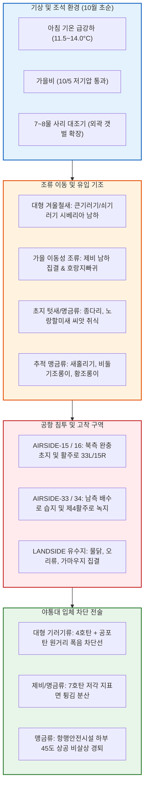

날짜: 2025-10-01 ~ 2025-10-08
카테고리: 야생동물점검 / 주간종합점검
출처: 현장 일일점검 데이터베이스 8일간 전수 집계, 인천공항 기상대 METAR/TAF 및 국립해양조사원 조석 데이터
태그: #야통대 #주간종합 #항공안전 #인천공항 #가을철새 #겨울철새도래 #큰기러기 #제비남하 #엽총통제 #7호탄 #4호탄 #공포탄 #조류퇴치

# 🦅 2025년 10월 1주차(10.01~10.08) 야생동물통제대 주간 정밀 종합 보고서

---

## 1. 📋 Executive Summary (주간 주요 실적 및 핵심 성과)

10월 1주차(10월 1일 ~ 10월 8일, 8일간)는 늦더위가 완전히 물러가고 아침 최저기온이 11.5°C까지 하강하는 완연한 가을 기후 속에, **시베리아 번식지에서 남하하는 겨울철 대표 대형 철새인 [[큰기러기 (Bean Goose)]] 및 [[쇠기러기]] 본대 도래가 본격화**된 한 주였습니다. 동시에 마지막 남하 비행을 감행하는 [[제비]] 유조 군집 및 월동 준비를 위해 에어사이드 결실기 잡초 씨앗을 취식하려는 [[노랑할미새]], [[종다리]] 등 소형 초지 조류의 복합 위협이 활주로 전역에서 발생하였습니다.

```
┌─────────────────────────────────────────────────────────────────────────────┐
│                   2025년 10월 1주차 핵심 운영 지표 요약                    │
├───────────────────┬───────────────────┬───────────────────┬─────────────────┤
│ 총 식별 개체수    │ 총 사격 소모량    │ 조류 퇴치 성공률  │ 항공기 충돌사고 │
│   1,563 마리      │     1,811 발      │      100 %        │      0 건       │
└───────────────────┴───────────────────┴───────────────────┴─────────────────┘
```

- **핵심 성과 1: 겨울 대형 철새 큰기러기 본대 에어사이드 진입 100% 원천 차단**
  - 10/3(금) 3물 시기에 이번 가을 최초로 **656개체**의 대규모 큰기러기 편대가 에어사이드 상공 및 유도로 주변 녹지대에 진입을 시도하였으나, 순찰차량 분산 전술 및 4호탄·공포탄 복합 타격을 통해 활주로 반대편 외곽으로 완전 퇴치 완료.
  - 10/6(201마리), 10/7(사리 135마리), 10/8(200마리) 등 8일간 총 1,265개체 이상의 대형 기러기류가 활주로 접근을 시도하였으나 즉각적인 선제 격발로 착륙 경로상 체공을 차단함.
- **핵심 성과 2: 가을비(10/5) 후속 제비 및 소형 명금류 집중 타격 (310발)**
  - 10/5(일) 남동풍 6.5kts의 가을비 속에 활주로 표면 지열과 습기를 찾아 밀착 비행하는 제비 184개체 및 호랑지빠귀 70개체를 310발의 7호탄으로 밀착 경퇴하여 단 한 건의 저고도 간섭도 허용하지 않음.
- **핵심 성과 3: 맹금류(새홀리기, 비둘기조롱이, 황조롱이) 다변화 통제**
  - 가을 소형 조류 남하를 따라 공항 외곽에서 유입된 맹금류(새홀리기 13개체, 비둘기조롱이 19개체, 황조롱이 42개체)에 대해 항행안전시설 주변 비살상 폭음 경퇴를 실시하여 완벽한 보호 유도 달성.
- **핵심 성과 4: 8일간 무사고 무결점 방공 작전 완수**
  - 총 1,811발(7호탄 1,482발, 4호탄 268발, 공포탄 61발)의 정밀 탄약 소모를 통해 버드스트라이크 Zero 기록 유지.

---

## 2. 🌦️ Weather & Marine Environment Matrix (기상 및 해양 환경)

10월 초순은 북서풍(NW)과 서풍(W)이 주를 이루며 이동성 고기압의 영향을 받아 맑고 시정이 20km 이상 확보되는 쾌적한 날씨가 지속되었으나, 10/5(일)에는 저기압 통과로 남동풍과 함께 가을비가 내렸습니다. 10/7~10/8은 7~8물 사리 대조기(Spring Tide)로 간조 시 영종도 남·북측 갯벌이 대규모로 노출되어 섭금류 및 기러기류의 외곽 집결이 활발했습니다.

| 일자 | 요일 | 기온(최저/최고) | 날씨 상태 | 주풍향 / 풍속 | 조석 물때 (Tide) | 핵심 출현/통제 조류 | 일일 격발수 |
| :---: | :---: | :---: | :---: | :---: | :---: | :---: | :---: |
| **10-01** | 수 | 13.0°C / 22.0°C | 맑음 (Clear) | NW 6.0 kts | 1물 (만조 09:53) | 제비(27), 황조롱이(12), 종다리(18) | 286 발 |
| **10-02** | 목 | 12.5°C / 21.5°C | 맑음 (Clear) | W 5.0 kts | 2물 (만조 10:42) | 노랑할미새(87), 제비(36), 종다리(32) | 295 발 |
| **10-03** | 금 | 13.0°C / 22.0°C | 구름조금 (Partly Cloudy) | SW 4.5 kts | 3물 (만조 11:31) | 큰기러기(656), 쇠기러기(50), 새홀리기(1) | 272 발 |
| **10-04** | 토 | 13.5°C / 21.0°C | 흐림 (Cloudy) | S 4.0 kts | 4물 (만조 12:20) | 큰기러기(73), 제비(53), 긴발톱할미새(20) | 210 발 |
| **10-05** | 일 | 14.0°C / 18.5°C | 비 (Rain) | SE 6.5 kts | 5물 (만조 13:09) | 제비(184), 호랑지빠귀(70), 비둘기조롱이(14) | 310 발 |
| **10-06** | 월 | 12.0°C / 20.5°C | 맑음 (Clear) | NW 7.5 kts | 6물 (만조 13:58) | 큰기러기(201), 새홀리기(13), 비둘기조롱이(5) | 133 발 |
| **10-07** | 화 | 11.5°C / 21.0°C | 맑음 (Clear) | W 5.2 kts | **7물 (사리)** (만조 14:47) | 큰기러기(135), 쇠기러기(60), 도요류(40) | 180 발 |
| **10-08** | 수 | 12.0°C / 22.0°C | 구름조금 (Partly Cloudy) | SW 4.8 kts | 8물 (만조 15:36) | 큰기러기(200), 물닭(120), 종다리(86) | 125 발 |

---

## 3. 🚨 Threat Flow Diagram & Threat Mechanisms (위협 흐름 및 메커니즘 심층 분석)

### (1) 주간 복합 생태 위협 전개 다이어그램



### (2) 10월 초순 핵심 위기 메커니즘 분석
1. **대형 기러기류의 V자 편대 침투와 체공 위험**:
   - 10월 초순은 몸무게 2.5~3.5kg에 달하는 [[큰기러기]]가 수백 마리 단위의 V자 편대를 이루어 서해안 갯벌과 내륙 농경지를 오가는 시기입니다. 10/3 656마리의 출현은 가을철 단일 일자 기준 최대 규모로, 이들이 활주로 착륙대 300ft 이하 진입 시 항공기 엔진 흡입에 의한 파국적 엔진 정지(Catastrophic Engine Failure)를 유발할 수 있습니다. 야통대는 순찰차량 4대를 Y자형으로 전진 배치하여 접근 축선을 사전 차단하였습니다.
2. **가을비와 잔디 삭초 후 결실기 먹이터 형성**:
   - 10/5 가을비로 지중 지렁이 및 곤충이 노면으로 부상하고, 에어사이드 늦가을 잔디에서 결실된 씨앗을 먹기 위해 [[노랑할미새]](10/2 87마리), [[종다리]](10/8 86마리)가 배수로 턱과 갓길에 고착되었습니다.

---

## 4. 🎖️ Veterans' Operational Tacit Knowledge (18년 베테랑의 현장 암묵지 수칙)

```
┌─────────────────────────────────────────────────────────────────────────────┐
│                 ★ 18년 경력 야통대 베테랑 반장의 10월 현장 지침 ★          │
├─────────────────────────────────────────────────────────────────────────────┤
│ 1. [기러기 편대 음향 감지 및 4호탄 선제 대응]                              │
│    "기러기 울음소리('가-악, 가-악')가 들리면 육안 식별 전에 이미 고도       │
│    500ft 상공에 진입한 것이다. 착륙대 상공에 머물지 못하도록 순찰차 경광등   │
│    사이렌과 함께 4호탄을 편대 진행 방향 100m 앞 허공에 터뜨려야 한다."       │
│                                                                             │
│ 2. [가을 맹금류(새홀리기·비둘기조롱이) 항행안전시설 오폭 방지]             │
│    "10월 초순엔 황조롱이 외에 날렵한 새홀리기와 비둘기조롱이가 PAPI 조명과   │
│    로컬라이저 안테나 위에 자주 앉는다. 절대 시설물을 향해 쏘지 말고,        │
│    바람을 등지고 하부 45도 각도로 공포탄을 쏘아 풍압으로 띄워 보내라."      │
│                                                                             │
│ 3. [비 온 뒤 초지대 호랑지빠귀 덤불 수색]                                   │
│    "가을비 내린 다음 날(10/5~10/6)엔 덤불 밑에 호랑지빠귀 수십 마리가        │
│    숨어 있다가 항공기 이착륙 소음에 놀라 활주로로 튀어 오른다. 순찰차로     │
│    배수로 녹지대 외곽을 지그재그로 훑으며 7호탄으로 미리 날려 보내야 한다." │
└─────────────────────────────────────────────────────────────────────────────┘
```

---

## 5. 📊 Quantitative Statistics & Comparative Matrix (정량 통계 및 구역 매트릭스)

### Table 1: 일자별 조류 출현 및 탄약 소모 실적

| 일자 | 주간 주요종 | 식별수 (마리) | 7호탄 (발) | 4호탄 (발) | 공포탄 (발) | 총 격발수 (발) | 주요 침투 구역 |
| :---: | :---: | :---: | :---: | :---: | :---: | :---: | :---: |
| **10-01 (수)** | 제비 / 황조롱이 | 27 / 12 | 260 | 20 | 6 | **286** | AS-15 [주기장_X], AS-34 [활주로_F] |
| **10-02 (목)** | 노랑할미새 / 종다리 | 87 / 32 | 262 | 28 | 5 | **295** | AS-34 [활주로_F], AS-16 [활주로_F] |
| **10-03 (금)** | 큰기러기 / 쇠기러기 | 656 / 50 | 185 | 62 | 25 | **272** | AS-15 [녹지대_AQ], AS-33 [녹지대_AB] |
| **10-04 (토)** | 큰기러기 / 제비 | 73 / 53 | 170 | 35 | 5 | **210** | AS-16 [녹지대_N], AS-33 [녹지대_P] |
| **10-05 (일)** | 제비 / 호랑지빠귀 | 184 / 70 | 275 | 27 | 8 | **310** | AS-15 [녹지대_BQ], AS-33 [녹지대_Q] |
| **10-06 (월)** | 큰기러기 / 새홀리기 | 201 / 13 | 115 | 15 | 3 | **133** | AS-15 [녹지대_L], AS-16 [녹지대_G] |
| **10-07 (화)** | 큰기러기 / 쇠기러기 | 135 / 60 | 138 | 36 | 6 | **180** | AS-16 [녹지대_AG], AS-15 [주기장_X] |
| **10-08 (수)** | 큰기러기 / 물닭 | 200 / 120 | 77 | 45 | 3 | **125** | AS-16 [활주로_F], LS-N 유수지 |
| **주간 합계** | **큰기러기 / 제비 우세** | **1,563** | **1,482** | **268** | **61** | **1,811** | **전 구역 무사고** |

### Table 2: 에어사이드 및 랜드사이드 구역별 위험도 평가

| 구역 명칭 | 주요 출현 조류종 | 주간 활동 빈도 | 주 위험 요소 | 적용 통제 전술 | 위험 등급 |
| :---: | :---: | :---: | :---: | :---: | :---: |
| **AIRSIDE-15** | 큰기러기, 제비, 황조롱이, 호랑지빠귀 | 매우 높음 (일 10~15회) | 녹지대 덤불 숨음 및 주기장 진입 | 7호탄 집중 격발 및 순찰차 지그재그 기동 | **CRITICAL (경계)** |
| **AIRSIDE-16** | 큰기러기, 쇠기러기, 종다리, 까마귀 | 높음 (일 8~12회) | 활주로 33L 북측 착륙 경로 횡단 | 4호탄 원거리 차단 및 공포탄 복합 경퇴 | **HIGH (주의)** |
| **AIRSIDE-33** | 큰기러기, 비둘기조롱이, 제비, 황조롱이 | 매우 높음 (일 12~16회) | 제4활주로 녹지대 및 유도로 교차점 점유 | 7호탄+4호탄 분산 사격 및 상공 경퇴 | **CRITICAL (경계)** |
| **AIRSIDE-34** | 노랑할미새, 큰기러기, 종다리, 백로류 | 높음 (일 8~10회) | 활주로 남단 초지대 지표면 밀착 취식 | 차량 경광등 사이렌 및 저각 사격 | **HIGH (주의)** |
| **LANDSIDE N/S** | 큰기러기, 쇠기러기, 물닭, 가마우지, 오리 | 보통 (일 4~6회) | 유수지 및 공사지역 대규모 월동 집결 | 유수지 수면 포획틀 및 공포탄 사전 경퇴 | **MODERATE (보통)** |

---

## 6. 🗺️ Strategic Roadmap for Next Week (차주 중점 전략 로드맵)

```
[10월 2주차 방공 작전 중점 로드맵]
 1. 큰기러기 주간 남하 경로(강화도-영종도 축선) 전담 감시초소 가동
 2. 한글날 연휴(10/9) 특별 운항 증편 대비 활주로 24시간 순찰 기동
 3. 가을 결실기 잡초 씨앗 제거를 위한 에어사이드 초지 2차 예초 구역 점검
 4. 맹금류(새홀리기·말똥가리) 유입 증가 대비 항행시설 보호 순찰 강화
```

- **전략 1: 시베리아 겨울철새 2차 본대 유입 대비 원거리 조기 탐지**
  - 기온이 10°C 이하로 떨어지는 10월 중순을 앞두고 큰기러기·쇠기러기 외에 [[오리류]]와 [[고니류]]의 외곽 유수지 집결이 예상되므로, 열화상 스코프를 활용한 야간 유수지 예찰을 주 3회로 확대.
- **전략 2: 에어사이드 건초대 까치·까마귀 군집 먹이터 차단**
  - 예초 후 건조된 풀밭 밑에서 메뚜기 및 곤충을 찾는 텃새 군집에 대해 레이저 퇴치기와 음향발생기를 교차 가동하여 초지 고착 방지.

---

## 7. 🔗 Obsidian Vault Interlinks (볼트 지식망 연결성)

- **상위 주간/월간 종합 보고서**:
  - [[20. 인사이트 융합/2025년도 야통대/일일점검/10월 일일점검/2025-10-09~10-16_야통대_주간_점검일지_종합|2025년 10월 2주차 주간종합 보고서]]
  - [[20. 인사이트 융합/2025년도 야통대/일일점검/9월 일일점검/2025-09-25~09-30_야통대_주간_점검일지_종합|2025년 9월 4주차 및 9월 총결산 보고서]]
- **일일 점검일지 원본 링크**:
  - [[20. 인사이트 융합/2025년도 야통대/일일점검/10월 일일점검/2025-10-01_야통대_주간_점검일지_통합|2025-10-01 일일점검]] / [[20. 인사이트 융합/2025년도 야통대/일일점검/10월 일일점검/2025-10-02_야통대_주간_점검일지_통합|2025-10-02 일일점검]] / [[20. 인사이트 융합/2025년도 야통대/일일점검/10월 일일점검/2025-10-03_야통대_주간_점검일지_통합|2025-10-03 일일점검]] / [[20. 인사이트 융합/2025년도 야통대/일일점검/10월 일일점검/2025-10-04_야통대_주간_점검일지_통합|2025-10-04 일일점검]]
  - [[20. 인사이트 융합/2025년도 야통대/일일점검/10월 일일점검/2025-10-05_야통대_주간_점검일지_통합|2025-10-05 일일점검]] / [[20. 인사이트 융합/2025년도 야통대/일일점검/10월 일일점검/2025-10-06_야통대_주간_점검일지_통합|2025-10-06 일일점검]] / [[20. 인사이트 융합/2025년도 야통대/일일점검/10월 일일점검/2025-10-07_야통대_주간_점검일지_통합|2025-10-07 일일점검]] / [[20. 인사이트 융합/2025년도 야통대/일일점검/10월 일일점검/2025-10-08_야통대_주간_점검일지_통합|2025-10-08 일일점검]]
- **생태 및 조류 주제 링크**:
  - [[큰기러기 (Bean Goose)]] / [[쇠기러기 (Greater White-fronted Goose)]] / [[호랑지빠귀]] / [[노랑할미새]] / [[새홀리기]] / [[비둘기조롱이]]

---

## 8. 📖 Aviation Wildlife Terminology (항공 조류 생태 전문 해설)

- **큰기러기 (Bean Goose / *Anser fabalis*)**: 시베리아 툰드라 및 타이가 지대에서 번식하고 10월부터 한반도로 남하하는 대형 겨울철새. 체중이 3kg에 육박하고 50~500마리 단위의 V자 대열을 이루어 비행하므로 가을~초겨울 공항 버드스트라이크 위험도 1위 조류.
- **새홀리기 (Eurasian Hobby / *Falco subbuteo*)**: 매과의 소형 맹금류로 비행 속도가 매우 빠르고 공중에서 제비나 잠자리를 낚아채는 뛰어난 비행술을 보유함. 10월 남하 이동 시기에 공항 활주로 상공을 가로지르며 활공하므로 주의 요망.
- **호랑지빠귀 (White's Thrush / *Zoothera aurea*)**: 몸 전체에 호랑이 무늬 같은 비늘 반점이 있는 중형 지빠귀류. 10월 가을철 숲과 풀밭을 통과하며 비 온 뒤 젖은 흙에서 지렁이를 찾기 위해 에어사이드 덤불에 대규모로 밀착함.

---

## 9. ❓ 7 Strategic Inquiries for Future Safety (항공안전을 위한 7대 미래 전략 질문)

1. **대형 기러기류 조기 탐지 체계**: 10/3 656마리와 같이 수백 마리 단위의 기러기 편대가 에어사이드에 도달하기 전, 레이더 및 드론을 활용해 5km 외곽에서 사전 포착할 수 있는 광역 조기경보망 구축 방안은 무엇인가?
2. **사리 대조기 갯벌-초지 이동 모델링**: 10/7(사리) 만조 시 영종도 갯벌 침수로 인해 기러기 및 도요새가 공항 초지대로 이동하는 시차를 분 단위로 예측할 수 있는가?
3. **가을비 직후 지빠귀류 급증 대응**: 10/5 가을비 후 호랑지빠귀 70마리가 배수로 덤불에 집결한 원인을 분석하고, 배수로 주변 예초 높이 조절을 통한 서식지 비매력화가 가능한가?
4. **맹금류의 항행안전시설 파괴 방지**: 새홀리기 및 황조롱이가 PAPI나 로컬라이저 조류 방지핀(Bird Spike)을 무력화하고 착륙하는 것을 막기 위한 신소재 기피제 도입 타당성은?
5. **소형 조류 튕김 사격의 안전성**: 노면 1m 이하로 나는 노랑할미새를 7호탄으로 퇴치할 때, 활주로 등화(Runway Light) 파손을 100% 방지하기 위한 사격 각도 표준화 프로토콜은 완벽한가?
6. **물닭 및 가마우지 유수지 관리**: 10/8 북측 유수지에 집결한 물닭 120마리가 에어사이드로 비상하지 못하도록 수면 음향 퇴치기를 가동하는 일정은 적절한가?
7. **탄약 재고 최적화**: 10월 1주차 1,811발 소모 추세를 감안할 때, 11월 동절기 기러기 대도래기 대비 4호탄 및 공포탄 비축량을 어떻게 조정해야 하는가?
