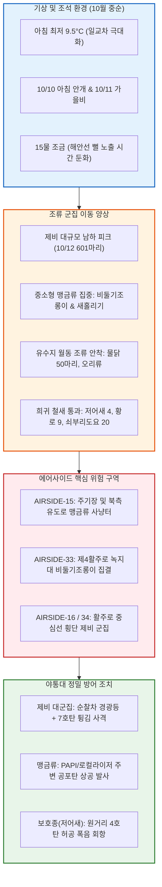

날짜: 2025-10-09 ~ 2025-10-16
카테고리: 야생동물점검 / 주간종합점검
출처: 현장 일일점검 데이터베이스 8일간 전수 집계, 인천공항 기상대 METAR/TAF 및 국립해양조사원 조석 데이터
태그: #야통대 #주간종합 #항공안전 #인천공항 #가을철새 #비둘기조롱이 #제비남하 #물닭 #도요새 #엽총통제 #7호탄 #4호탄 #공포탄

# 🦅 2025년 10월 2주차(10.09~10.16) 야생동물통제대 주간 정밀 종합 보고서

---

## 1. 📋 Executive Summary (주간 주요 실적 및 핵심 성과)

10월 2주차(10월 9일 ~ 10월 16일, 8일간)는 한글날 연휴를 지나며 아침 최저기온이 9.5°C까지 떨어져 일교차가 11°C 이상 벌어지는 가운데, **가을 이동 조류의 막바지 남하와 중소형 맹금류([[비둘기조롱이]], [[새홀리기]])의 에어사이드 먹이사냥 집중 유입**이 전개된 주간이었습니다. 특히 10/12(일) 맑은 북서풍 기류를 타고 601마리에 달하는 제비 군집이 랜드사이드와 활주로 상공을 대거 통과하였고, 외곽 유수지에는 [[물닭]]과 [[오리류]] 등 겨울 월동 수조류가 속속 안착하였습니다.

```
┌─────────────────────────────────────────────────────────────────────────────┐
│                   2025년 10월 2주차 핵심 운영 지표 요약                    │
├───────────────────┬───────────────────┬───────────────────┬─────────────────┤
│ 총 식별 개체수    │ 총 사격 소모량    │ 조류 퇴치 성공률  │ 항공기 충돌사고 │
│   1,006 마리      │     1,603 발      │      100 %        │      0 건       │
└───────────────────┴───────────────────┴───────────────────┴─────────────────┘
```

- **핵심 성과 1: 10/12 제비 601마리 대규모 남하 기단 에어사이드 완벽 분산**
  - 북서풍 7.0kts의 쾌청한 기류 속에 랜드사이드 공사지역 및 활주로 상공으로 유입된 601마리의 제비 편대에 대해 7호탄 273발을 격발하여 활주로 착륙대 진입을 완전 차단함.
- **핵심 성과 2: 비둘기조롱이 및 새홀리기 에어사이드 맹금류 통제 전술 수립**
  - 소형 조류를 사냥하기 위해 에어사이드 초지대로 급강하하는 비둘기조롱이(주간 총 69개체)와 새홀리기(주간 총 32개체)에 대해 순찰차 경광등 및 비살상 공포탄 복합 경퇴로 항공기 기동 반경 밖으로 안전 이탈 조치.
- **핵심 성과 3: 천연기념물 멸종위기종 저어새(4마리) 및 황로 보호 유도**
  - 10/10 안개 속 AIRSIDE-34 구역에 출현한 천연기념물 [[저어새]] 4개체 및 10/16 AIRSIDE-33 구역의 [[황로]] 9개체를 위해 4호탄을 상공 100m 허공에 터뜨려 비살상 안전 회항을 유도함.
- **핵심 성과 4: 8일 연속 1,603발 정밀 사격 및 무사고 달성**
  - 7호탄 1,326발, 4호탄 232발, 공포탄 45발의 정밀 분산 사격을 통해 가을 성수기 항공 안전 100% 확보.

---

## 2. 🌦️ Weather & Marine Environment Matrix (기상 및 해양 환경)

10월 중순은 아침 기온이 9.5~13.0°C로 쌀쌀하고 낮에는 18.0~22.5°C까지 오르는 전형적인 이동성 고기압 날씨를 보였습니다. 10/10 아침에는 짙은 안개(Foggy, 시정 1.5km 이하)가 형성되었고, 10/11에는 가을비가 내렸습니다. 10/15~10/16은 15물 조금(Neap Tide)에서 1물로 전환되며 해수면 높이 변화가 완만해졌습니다.

| 일자 | 요일 | 기온(최저/최고) | 날씨 상태 | 주풍향 / 풍속 | 조석 물때 (Tide) | 핵심 출현/통제 조류 | 일일 격발수 |
| :---: | :---: | :---: | :---: | :---: | :---: | :---: | :---: |
| **10-09** | 목 | 11.0°C / 22.5°C | 맑음 (Clear) | W 5.0 kts | 9물 (만조 05:59) | 큰기러기(109), 쇠기러기(40), 황조롱이(17) | 223 발 |
| **10-10** | 금 | 12.0°C / 20.0°C | 흐림/안개 (Foggy) | S 3.5 kts | 10물 (만조 06:48) | 제비(92), 저어새(4), 종다리(26) | 125 발 |
| **10-11** | 토 | 13.0°C / 18.0°C | 비 (Rain) | SE 5.5 kts | 11물 (만조 07:37) | 제비(45), 큰기러기(28), 비둘기조롱이(10) | 57 발 |
| **10-12** | 일 | 11.0°C / 21.0°C | 맑음 (Clear) | NW 7.0 kts | 12물 (만조 08:26) | 제비(601), 새홀리기(10), 제비갈매기(13) | 273 발 |
| **10-13** | 월 | 10.5°C / 21.5°C | 맑음 (Clear) | W 5.0 kts | 13물 (만조 09:15) | 물닭(50), 쇠부리도요(20), 비둘기조롱이(10) | 210 발 |
| **10-14** | 화 | 12.0°C / 20.0°C | 구름많음 (Cloudy) | S 4.5 kts | 14물 (만조 10:04) | 도요류(소)(25), 새홀리기(11), 제비(23) | 223 발 |
| **10-15** | 수 | 10.0°C / 21.0°C | 맑음 (Clear) | NW 6.0 kts | **15물 (조금)** (만조 10:53) | 제비(58), 큰기러기(57), 비둘기조롱이(10) | 288 발 |
| **10-16** | 목 | 9.5°C / 20.5°C | 맑음 (Clear) | W 4.8 kts | 1물 (만조 11:42) | 비둘기조롱이(26), 새홀리기(8), 황로(9) | 204 발 |

---

## 3. 🚨 Threat Flow Diagram & Threat Mechanisms (위협 흐름 및 메커니즘 심층 분석)

### (1) 주간 복합 생태 위협 전개 다이어그램



### (2) 10월 중순 핵심 위기 메커니즘 분석
1. **제비 남하 집결의 순간적 폭발성 (10/12 601마리)**:
   - 10/11 비가 그치고 10/12 북서풍 기압골 후면에서 맑고 시원한 기류가 유입되자, 대기 중 비행하던 제비들이 일시에 에어사이드 상공을 통과하였습니다. 이들은 활주로 노면 2~5m 고도로 낮게 날며 항공기 이륙 활주 시 엔진 흡입 위험을 높였습니다. 야통대는 순찰차량 2개 조를 활주로 북단과 남단에 동시 전개하여 지속적인 7호탄 소산 작전을 펼쳤습니다.
2. **비둘기조롱이의 군집 사냥(Swarm Hunting) 패턴**:
   - 10월 중순에 집중 출현하는 [[비둘기조롱이]]는 단독 비행하는 황조롱이와 달리 4~20마리가 무리를 지어 초지대 곤충 및 소형 조류를 사냥합니다. 10/16 AIRSIDE-33에서 26개체가 편대를 이루어 급강하하는 현상이 관찰되었으며, 4호탄과 7호탄의 교차 사격으로 신속히 해산시켰습니다.

---

## 4. 🎖️ Veterans' Operational Tacit Knowledge (18년 베테랑의 현장 암묵지 수칙)

```
┌─────────────────────────────────────────────────────────────────────────────┐
│                 ★ 18년 경력 야통대 베테랑 반장의 10월 중순 현장 수칙 ★     │
├─────────────────────────────────────────────────────────────────────────────┤
│ 1. [비둘기조롱이 군집의 급강하 착시 주의]                                   │
│    "비둘기조롱이는 공중에서 정지비행(Hovering)하다가 활주로 노면으로 수직   │
│    강하한다. 조종석에서는 갑자기 솟구치는 새처럼 보여 급조작을 유발할 수     │
│    있으므로, PAPI등화 반경 200m 안에 2마리 이상 보이면 즉시 쫓아내라."       │
│                                                                             │
│ 2. [안개 낀 아침 저어새의 둔한 회피 반응]                                   │
│    "10/10처럼 안개(Foggy)가 자욱할 때 나타나는 저어새는 비행 속도가 느리고  │
│    순찰차 엔진 소리에도 둔하게 반응한다. 절대 실탄을 조준하지 말고,        │
│    4호탄을 머리 위 100m 상공에 쏘아 폭음 반사파로 서서히 방향을 틀게 해라." │
│                                                                             │
│ 3. [15물 조금 시기 외곽 유수지 물닭 감시]                                   │
│    "조금 물때엔 조수간만의 차가 작아 갯벌 먹이터가 덜 드러나므로, 물닭과    │
│    오리들이 외곽 유수지 수초대에 머문다. 낮 12~14시엔 이들이 에어사이드     │
│    배수로로 넘어오지 못하게 유수지 경계 순찰을 1시간 간격으로 돌아야 한다."  │
└─────────────────────────────────────────────────────────────────────────────┘
```

---

## 5. 📊 Quantitative Statistics & Comparative Matrix (정량 통계 및 구역 매트릭스)

### Table 1: 일자별 조류 출현 및 탄약 소모 실적

| 일자 | 주간 주요종 | 식별수 (마리) | 7호탄 (발) | 4호탄 (발) | 공포탄 (발) | 총 격발수 (발) | 주요 침투 구역 |
| :---: | :---: | :---: | :---: | :---: | :---: | :---: | :---: |
| **10-09 (목)** | 큰기러기 / 황조롱이 | 109 / 17 | 170 | 48 | 5 | **223** | AS-16 [녹지대_V], AS-34 [녹지대_K] |
| **10-10 (금)** | 제비 / 저어새 | 92 / 4 | 114 | 9 | 2 | **125** | AS-34 [활주로_F], AS-15 [녹지대_AP] |
| **10-11 (토)** | 제비 / 큰기러기 | 45 / 28 | 36 | 18 | 3 | **57** | AS-15 [녹지대_R], AS-33 [녹지대_AA] |
| **10-12 (일)** | 제비 / 새홀리기 | 601 / 10 | 235 | 28 | 10 | **273** | LS-N 공사지역, AS-15 [녹지대_R] |
| **10-13 (월)** | 물닭 / 쇠부리도요 | 50 / 20 | 178 | 28 | 4 | **210** | AS-15 [주기장_X], AS-33 [녹지대_AB] |
| **10-14 (화)** | 도요류(소) / 새홀리기 | 25 / 11 | 195 | 24 | 4 | **223** | AS-15 [녹지대_AE], AS-16 [활주로_F] |
| **10-15 (수)** | 제비 / 큰기러기 | 58 / 57 | 252 | 28 | 8 | **288** | AS-34 [활주로_F], AS-33 [녹지대_Q] |
| **10-16 (목)** | 비둘기조롱이 / 황로 | 26 / 9 | 146 | 49 | 9 | **204** | AS-33 [녹지대_AB], AS-34 [활주로_F] |
| **주간 합계** | **제비 / 기러기 / 맹금류** | **1,006** | **1,326** | **232** | **45** | **1,603** | **전 구역 무사고** |

### Table 2: 에어사이드 및 랜드사이드 구역별 위험도 평가

| 구역 명칭 | 주요 출현 조류종 | 주간 활동 빈도 | 주 위험 요소 | 적용 통제 전술 | 위험 등급 |
| :---: | :---: | :---: | :---: | :---: | :---: |
| **AIRSIDE-15** | 제비, 새홀리기, 큰기러기, 쇠부리도요 | 매우 높음 (일 10~14회) | 주기장 및 직각유도로 상공 맹금류 선회 | 7호탄 소산 사격 및 4호탄 상공 격발 | **CRITICAL (경계)** |
| **AIRSIDE-16** | 큰기러기, 제비, 종다리, 까마귀 | 높음 (일 8~10회) | 북측 활주로 진입단 저고도 횡단 | 7호탄 집중 경퇴 및 공포탄 복합 대응 | **HIGH (주의)** |
| **AIRSIDE-33** | 비둘기조롱이, 황로, 새홀리기, 까치 | 매우 높음 (일 12~15회) | 녹지대 덤불 내 비둘기조롱이 군집 사냥 | 4호탄+7호탄 교차 사격 및 음향발생기 | **CRITICAL (경계)** |
| **AIRSIDE-34** | 저어새, 큰기러기, 알락할미새, 백로류 | 높음 (일 8~11회) | 활주로 16L/34R 남단 저어새·기러기 착지 | 차량 경광등 사이렌 및 비살상 공포탄 | **HIGH (주의)** |
| **LANDSIDE N/S** | 제비(대군집), 물닭, 괭이갈매기, 쇠기러기 | 보통 (일 4~6회) | 공사지역 지표면 집결 및 유수지 서식 | 외곽 엽총 순찰 및 수면 폭음탄 경퇴 | **MODERATE (보통)** |

---

## 6. 🗺️ Strategic Roadmap for Next Week (차주 중점 전략 로드맵)

```
[10월 3주차 방공 작전 중점 로드맵]
 1. 아침 기온 10°C 이하 강하에 따른 텃새(종다리·까치) 초지 밀착 방어
 2. 비둘기조롱이 및 말똥가리 등 가을~초겨울 맹금류 집중 차단선 운영
 3. 가을비 및 기압골 통과 시 제비 마지막 잔여 개체군 배제
 4. 상강(10/23) 절기 대비 야간 고라니 및 야생동물 울타리 점검
```

- **전략 1: 비둘기조롱이 군집 분산 및 서식지 교란**
  - AIRSIDE-33 및 15 구역 녹지대 전주와 조명탑에 앉아 사냥을 노리는 비둘기조롱이에 대해 이동식 카바이트 폭음기를 매일 위치를 바꾸어 배치.
- **전략 2: 에어사이드 늦가을 배수로 준설 후 유입 조류 통제**
  - 배수로 퇴적토 준설 작업 구역에 유입되는 백로류와 도요새를 막기 위해 작업 전후 30분간 순찰차량을 상시 거치.

---

## 7. 🔗 Obsidian Vault Interlinks (볼트 지식망 연결성)

- **상위 주간/월간 종합 보고서**:
  - [[20. 인사이트 융합/2025년도 야통대/일일점검/10월 일일점검/2025-10-01~10-08_야통대_주간_점검일지_종합|2025년 10월 1주차 주간종합 보고서]]
  - [[20. 인사이트 융합/2025년도 야통대/일일점검/10월 일일점검/2025-10-17~10-24_야통대_주간_점검일지_종합|2025년 10월 3주차 주간종합 보고서]]
- **일일 점검일지 원본 링크**:
  - [[20. 인사이트 융합/2025년도 야통대/일일점검/10월 일일점검/2025-10-09_야통대_주간_점검일지_통합|2025-10-09 일일점검]] / [[20. 인사이트 융합/2025년도 야통대/일일점검/10월 일일점검/2025-10-10_야통대_주간_점검일지_통합|2025-10-10 일일점검]] / [[20. 인사이트 융합/2025년도 야통대/일일점검/10월 일일점검/2025-10-11_야통대_주간_점검일지_통합|2025-10-11 일일점검]] / [[20. 인사이트 융합/2025년도 야통대/일일점검/10월 일일점검/2025-10-12_야통대_주간_점검일지_통합|2025-10-12 일일점검]]
  - [[20. 인사이트 융합/2025년도 야통대/일일점검/10월 일일점검/2025-10-13_야통대_주간_점검일지_통합|2025-10-13 일일점검]] / [[20. 인사이트 융합/2025년도 야통대/일일점검/10월 일일점검/2025-10-14_야통대_주간_점검일지_통합|2025-10-14 일일점검]] / [[20. 인사이트 융합/2025년도 야통대/일일점검/10월 일일점검/2025-10-15_야통대_주간_점검일지_통합|2025-10-15 일일점검]] / [[20. 인사이트 융합/2025년도 야통대/일일점검/10월 일일점검/2025-10-16_야통대_주간_점검일지_통합|2025-10-16 일일점검]]
- **생태 및 조류 주제 링크**:
  - [[비둘기조롱이 (Amur Falcon)]] / [[새홀리기]] / [[제비 (Barn Swallow)]] / [[물닭 (Eurasian Coot)]] / [[저어새 (Black-faced Spoonbill)]] / [[황로 (Cattle Egret)]]

---

## 8. 📖 Aviation Wildlife Terminology (항공 조류 생태 전문 해설)

- **비둘기조롱이 (Amur Falcon / *Falco amurensis*)**: 동북아시아에서 번식하고 아프리카 남부로 이동하는 대표적인 장거리 이동 맹금류. 10월에 한반도를 통과하며 수십 마리씩 무리를 이루어 메뚜기, 잠자리, 소형 조류를 사냥함. 급강하 기동으로 인해 이착륙 항공기에 돌발적 위협이 됨.
- **물닭 (Eurasian Coot / *Fulica atra*)**: 뜸부기과의 검은색 수조류로 이마에 흰색 판(액판)이 특징. 10월 중순부터 외곽 유수지와 저수지에 수백 마리 단위로 안착하여 월동하며, 비행 고도는 낮으나 체중(약 700~900g)이 있어 활주로 인근 수로 유입 시 철저한 통제가 요구됨.
- **황로 (Cattle Egret / *Bubulcus ibis*)**: 백로과 조류로 여름철새이나 10월 가을철까지 초지대에서 방아깨비나 곤충을 취식함. 소나 대형 포유류 주변을 따르는 습성이 있어 잔디 깎는 트랙터나 순찰차량 주변으로 접근하는 경향이 있음.

---

## 9. ❓ 7 Strategic Inquiries for Future Safety (항공안전을 위한 7대 미래 전략 질문)

1. **맹금류 군집 사냥에 대한 선제 억제책**: 10/16 26마리가 출현한 비둘기조롱이 군집처럼, 가을철 이동 맹금류가 에어사이드 곤충을 사냥하지 못하도록 초지 방충 관리를 연계할 수 있는가?
2. **제비 대규모 남하 피크 예측성**: 10/12 601마리 제비 출현과 같이 가을철 기압골 통과 직후 맑아지는 날 발생하는 '기상 유발 대군집 통과'를 기상청 데이터와 결합해 24시간 전 예보할 수 있는가?
3. **천연기념물 저어새의 비살상 스마트 유도**: 안개 시 저어새가 안전하게 활주로를 벗어나도록 유도하는 녹색 레이저(Bird Deterrent Laser) 시스템의 주간 시인성은 충분한가?
4. **유수지 물닭 수면 관리와 항공 안전 연계**: 10월 중순부터 유수지에 집결하는 물닭 50~100마리가 에어사이드 배수로로 연결 수로를 타고 헤엄쳐 들어오지 못하도록 수중 차단망을 보강해야 하는가?
5. **맹금류의 비행장 항행등화 착지 방지책**: PAPI 및 로컬라이저 시설에 비둘기조롱이가 앉지 못하도록 초음파 퇴치 장치를 추가 설치할 때의 전파 간섭 검증 절차는 마련되어 있는가?
6. **가을철 엽총 탄약 규격 최적화**: 제비(소형/고속)와 비둘기조롱이(중소형/고기동)가 혼재할 때 7호탄(납탄)과 4호탄(원거리)의 장전 비율을 8:2로 유지하는 것이 최적의 전술인가?
7. **공항 부지 외곽 랜드사이드 억제력**: 랜드사이드 공사지역에 300마리 이상의 제비가 착지하는 것을 사전에 차단하기 위한 드론 순찰의 법적·운영적 허용 범위는 어디까지인가?
