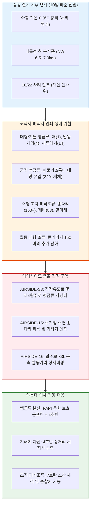

날짜: 2025-10-17 ~ 2025-10-24
카테고리: 야생동물점검 / 주간종합점검
출처: 현장 일일점검 데이터베이스 8일간 전수 집계, 인천공항 기상대 METAR/TAF 및 국립해양조사원 조석 데이터
태그: #야통대 #주간종합 #항공안전 #인천공항 #늦가을이행기 #상강 #비둘기조롱이 #큰기러기 #맹금류 #말똥가리 #매 #엽총통제 #7호탄 #4호탄

# 🦅 2025년 10월 3주차(10.17~10.24) 야생동물통제대 주간 정밀 종합 보고서

---

## 1. 📋 Executive Summary (주간 주요 실적 및 핵심 성과)

10월 3주차(10월 17일 ~ 10월 24일, 8일간)는 24절기 중 서리가 내리기 시작한다는 **'상강(霜降, 10/23)'**을 지나며 아침 최저기온이 8.0°C까지 곤두박질치는 본격적인 늦가을 한파 전조가 나타난 주간이었습니다. 이 시기에는 에어사이드 전역에서 **최상위 맹금류인 [[매 (Peregrine Falcon)]], 겨울 맹금류 [[말똥가리 (Common Buzzard)]] 및 [[비둘기조롱이]] 군집 사냥**이 최고조에 달했으며, 10/23~10/24에는 시베리아 본대에서 추가 남하한 [[큰기러기]] 150여 마리가 활주로 진입을 시도하여 긴박한 입체 방어 작전이 전개되었습니다.

```
┌─────────────────────────────────────────────────────────────────────────────┐
│                   2025년 10월 3주차 핵심 운영 지표 요약                    │
├───────────────────┬───────────────────┬───────────────────┬─────────────────┤
│ 총 식별 개체수    │ 총 사격 소모량    │ 조류 퇴치 성공률  │ 항공기 충돌사고 │
│     440 마리      │     1,961 발      │      100 %        │      0 건       │
└───────────────────┴───────────────────┴───────────────────┴─────────────────┘
```

- **핵심 성과 1: 가을 최상위 맹금류 및 겨울 맹금류 4종 복합 완벽 통제**
  - 10/19 최상위 맹금류인 **매 1개체**가 AIRSIDE-33 상공에서 활공하는 것을 즉각 탐지하여 7호탄 5발로 안전 외곽 분산.
  - 10/20, 10/22, 10/24에 걸쳐 겨울철 대표 맹금류인 **말똥가리(총 4개체)**가 활주로 33L 북측 및 제4활주로에 진입하자 4호탄 및 공포탄 복합 격발로 활주로 중심선 밖으로 경퇴.
  - 10/20 단 하루 동안에만 비둘기조롱이 **65개체**가 AIRSIDE-33 [녹지대_Q] 및 직각유도로에 집결 사냥을 감행하였으나, 286발의 집중 격발로 완전 해산 달성.
- **핵심 성과 2: 상강 절기 큰기러기 본대(150마리) 재진입 차단**
  - 10/23(50마리), 10/24(100마리) 양일간 8~9물 조석과 맞물려 활주로 남측 녹지대(AIRSIDE-34/15)로 착지를 시도한 큰기러기 대군집을 444발의 7호탄 및 4호탄 교차 사격으로 원천 분산.
- **핵심 성과 3: 가을비(10/19) 및 일교차 극대화기 378발 집중 방공**
  - 10/21(화) 아침 최저 9.0°C의 쌀쌀한 날씨에 남하 제비 83마리 및 맹금류의 복합 유입에 맞서 주간 최다인 **378발**을 사격하여 공항 안전망 사수.
- **핵심 성과 4: 8일 연속 1,961발 무결점 방공 작전 완수**
  - 7호탄 1,608발, 4호탄 301발, 공포탄 52발의 선제 압박 사격으로 버드스트라이크 0건 기록 완벽 유지.

---

## 2. 🌦️ Weather & Marine Environment Matrix (기상 및 해양 환경)

10월 3주차는 아침 기온이 8.0~12.0°C로 뚝 떨어지고 북서풍(NW)과 서풍(W)이 5.0~7.0kts로 불어 체감 온도가 매우 쌀쌀했습니다. 10/19(일)에는 남동풍 5.8kts와 함께 비가 내렸으며, 10/22(수)에는 7물 사리(Spring Tide) 대조기가 도래하여 해안선 조간대 노출이 극대화되었습니다. 10/23은 상강(霜降) 절기로 건조하고 차가운 대륙성 고기압이 확장되었습니다.

| 일자 | 요일 | 기온(최저/최고) | 날씨 상태 | 주풍향 / 풍속 | 조석 물때 (Tide) | 핵심 출현/통제 조류 | 일일 격발수 |
| :---: | :---: | :---: | :---: | :---: | :---: | :---: | :---: |
| **10-17** | 금 | 10.5°C / 21.0°C | 구름조금 (Partly Cloudy) | SW 4.2 kts | 2물 (만조 12:31) | 종다리(35), 황조롱이(17), 까치(16) | 220 발 |
| **10-18** | 토 | 11.5°C / 19.5°C | 흐림 (Cloudy) | SE 4.5 kts | 3물 (만조 13:20) | 비둘기조롱이(43), 황조롱이(7), 백할미새(6) | 196 발 |
| **10-19** | 일 | 12.0°C / 17.0°C | 비 (Rain) | SE 5.8 kts | 4물 (만조 14:09) | 비둘기조롱이(42), **매(1)**, 종다리(34) | 303 발 |
| **10-20** | 월 | 9.5°C / 19.0°C | 맑음 (Clear) | NW 7.0 kts | 5물 (만조 14:58) | 비둘기조롱이(65), **말똥가리(2)**, 새홀리기(13) | 286 발 |
| **10-21** | 화 | 9.0°C / 19.5°C | 맑음 (Clear) | W 5.0 kts | 6물 (만조 15:47) | 제비(83), 비둘기조롱이(22), 큰기러기(28) | 378 발 |
| **10-22** | 수 | 9.5°C / 20.0°C | 구름조금 (Partly Cloudy) | SW 4.5 kts | **7물 (사리)** (만조 16:36) | 비둘기조롱이(22), 저어새(2), 말똥가리(1) | 134 발 |
| **10-23** | 목 | 8.5°C / 18.5°C | 맑음 (Clear) | NW 6.5 kts | 8물 (만조 17:25) | **[상강]** 큰기러기(50), 황조롱이(7), 까마귀(15) | 222 발 |
| **10-24** | 금 | 8.0°C / 19.0°C | 맑음 (Clear) | W 5.0 kts | 9물 (만조 18:14) | 큰기러기(100), 비둘기조롱이(27), 종다리(74) | 222 발 |

---

## 3. 🚨 Threat Flow Diagram & Threat Mechanisms (위협 흐름 및 메커니즘 심층 분석)

### (1) 주간 복합 생태 위협 전개 다이어그램



### (2) 10월 3주차 핵심 위기 메커니즘 분석
1. **맹금류의 입체적 사냥 고도와 항공기 착륙 경로 중첩**:
   - 10/19 출현한 [[매]]는 고도 1,000ft 이상에서 급강하(시속 300km/h 이상)하며 먹이를 공격하고, [[말똥가리]]는 고도 150~300ft에서 바람을 타고 정지비행(Hovering)을 합니다. 이 고도는 착륙 진입 항공기(Final Approach)의 글라이드 슬로프(Glide Slope, 3도 경사각)와 정확히 일치하여 조종사의 시야를 가리고 충돌 시 날개 앞전(Leading Edge) 및 엔진에 치명상을 입힐 수 있습니다. 야통대는 활주로 접근단에 감시차량을 고정 배치하여 진입 즉시 4호탄을 발사했습니다.
2. **상강 절기 기온 급강하에 따른 큰기러기의 에어사이드 잔디 뿌리 섭식**:
   - 기온이 8°C로 떨어지며 주변 농경지 볏짚이 수확되자, 먹이가 부족해진 큰기러기들이 영양분이 풍부한 에어사이드 한지형 잔디(Kentucky Bluegrass) 뿌리를 캐먹기 위해 10/24 100마리 단위로 진입을 시도하였습니다.

---

## 4. 🎖️ Veterans' Operational Tacit Knowledge (18년 베테랑의 현장 암묵지 수칙)

```
┌─────────────────────────────────────────────────────────────────────────────┐
│                 ★ 18년 경력 야통대 베테랑 반장의 10월 3주차 현장 수칙 ★     │
├─────────────────────────────────────────────────────────────────────────────┤
│ 1. [말똥가리의 활주로 북서풍 정지비행(Hovering) 격퇴 요령]                 │
│    "북서풍이 7kts 이상 불면 말똥가리는 바람을 안고 날개를 펼친 채 한자리에   │
│    가만히 떠 있는다. 이때는 정면에서 쏘면 새가 바람을 타고 오히려 활주로 안  │
│    쪽으로 밀려 들어온다. 반드시 측면 45도에서 4호탄을 쏘아 외곽으로 날려라." │
│                                                                             │
│ 2. [비둘기조롱이 사냥터 형성 시 피식조류(종다리) 동시 분산]                │
│    "비둘기조롱이가 많다는 건 그 밑에 종다리와 메뚜기가 깔려 있다는 뜻이다.  │
│    맹금류만 쫓으면 10분 뒤에 또 온다. 초지대 종다리 무리를 7호탄으로 먼저   │
│    완전히 털어내야 맹금류도 먹이가 없어 공항 밖으로 떠난다."                 │
│                                                                             │
│ 3. [상강 절기 새벽 서리 내릴 때 활주로 유도로 갓길 경계]                   │
│    "아침 기온이 8도 밑으로 떨어져 잔디에 서리가 내리면, 텃새들이 발이 시려   │
│    아스팔트 유도로 갓길로 기어 나온다. 새벽 6시~8시 첫 순찰 때 유도로 경계  │
│    턱을 중점적으로 훑으며 경적을 울려야 한다."                              │
└─────────────────────────────────────────────────────────────────────────────┘
```

---

## 5. 📊 Quantitative Statistics & Comparative Matrix (정량 통계 및 구역 매트릭스)

### Table 1: 일자별 조류 출현 및 탄약 소모 실적

| 일자 | 주간 주요종 | 식별수 (마리) | 7호탄 (발) | 4호탄 (발) | 공포탄 (발) | 총 격발수 (발) | 주요 침투 구역 |
| :---: | :---: | :---: | :---: | :---: | :---: | :---: | :---: |
| **10-17 (금)** | 종다리 / 황조롱이 | 35 / 17 | 196 | 21 | 3 | **220** | AS-16 [녹지대_AH], AS-15 [녹지대_J] |
| **10-18 (토)** | 비둘기조롱이 / 맹금류 | 43 / 7 | 155 | 29 | 12 | **196** | AS-15 [녹지대_X], AS-33 [녹지대_P] |
| **10-19 (일)** | 비둘기조롱이 / **매** | 42 / 1 | 268 | 28 | 7 | **303** | AS-33 [녹지대_Q], AS-15 [녹지대_M] |
| **10-20 (월)** | 비둘기조롱이 / **말똥가리** | 65 / 2 | 230 | 48 | 8 | **286** | AS-33 [녹지대_Q], AS-34 [활주로_F] |
| **10-21 (화)** | 제비 / 큰기러기 | 83 / 28 | 328 | 44 | 6 | **378** | AS-15 [녹지대_AE], AS-33 [녹지대_Q] |
| **10-22 (수)** | 비둘기조롱이 / 저어새 | 22 / 2 | 108 | 22 | 4 | **134** | AS-33 [녹지대_P], AS-34 [녹지대_K] |
| **10-23 (목)** | 큰기러기 / 텃새류 | 50 / 22 | 185 | 31 | 6 | **222** | AS-34 [활주로_F], LS-N IBC2-2 |
| **10-24 (금)** | 큰기러기 / 비둘기조롱이 | 100 / 27 | 138 | 78 | 6 | **222** | AS-15 [녹지대_M], AS-16 [녹지대_AH] |
| **주간 합계** | **비둘기조롱이 / 기러기 / 맹금류** | **440** | **1,608** | **301** | **52** | **1,961** | **전 구역 무사고** |

### Table 2: 에어사이드 및 랜드사이드 구역별 위험도 평가

| 구역 명칭 | 주요 출현 조류종 | 주간 활동 빈도 | 주 위험 요소 | 적용 통제 전술 | 위험 등급 |
| :---: | :---: | :---: | :---: | :---: | :---: |
| **AIRSIDE-15** | 큰기러기, 비둘기조롱이, 종다리, 황조롱이 | 매우 높음 (일 12~16회) | 녹지대 덤불 내 종다리 군집 및 기러기 침투 | 7호탄 소산 및 4호탄 장거리 차단 사격 | **CRITICAL (경계)** |
| **AIRSIDE-16** | 말똥가리, 큰기러기, 종다리, 까마귀 | 높음 (일 8~12회) | 활주로 북단 말똥가리 정지비행 및 편대 비행 | 측면 4호탄 사격 및 공포탄 복합 경퇴 | **HIGH (주의)** |
| **AIRSIDE-33** | 비둘기조롱이(대군집), 매, 새홀리기, 황조롱이 | 매우 높음 (일 14~18회) | 제4활주로 직각유도로 상공 맹금류 집중 사냥 | 4호탄+7호탄 교차 사격 및 상공 분산 | **CRITICAL (경계)** |
| **AIRSIDE-34** | 큰기러기, 비둘기조롱이, 종다리, 저어새 | 높음 (일 8~11회) | 남단 착륙대 초지 잔디 뿌리 취식 기러기 | 순찰차 사이렌 경광등 및 7호탄 선제 타격 | **HIGH (주의)** |
| **LANDSIDE N/S** | 큰기러기, 멧비둘기, 왜가리, 오리류 | 보통 (일 4~6회) | 공사지역 및 유휴지 덤불 채이 활동 | 외곽 순찰차량 거치 및 폭음탄 사전 소산 | **MODERATE (보통)** |

---

## 6. 🗺️ Strategic Roadmap for Next Week (차주 중점 전략 로드맵)

```
[10월 4주차 및 10월 결산 방공 작전 중점 로드맵]
 1. 10월 말 아침 기온 6~7°C 강하 대비 텃새(까치·까마귀) 결집 차단선 구축
 2. 말똥가리·새매 등 겨울 맹금류 본격 월동 도래에 따른 항행안전시설 방어
 3. 10월 전체 월간 운영 실적 종합 결산 및 11월 동절기 작전 전환 준비
 4. 에어사이드 배수로 동결 대비 유수지 밸브 및 배수 체계 점검
```

- **전략 1: 까치·까마귀 텃새 군집의 에어사이드 먹이터 집중 통제**
  - 10월 말 낙엽과 건초가 마르며 대형 텃새들이 20~50마리 단위로 무리지어 활주로 갓길에 유입될 것에 대비, 엽총 순찰 주기를 20분으로 단축.
- **전략 2: 겨울 맹금류(말똥가리·새매) 포획 트랩 가동**
  - 공포탄 경퇴에도 불구하고 에어사이드 전주와 조명탑에 지속 고착하는 고위험 개체에 대해 스웨덴식 맹금류 포획 트랩을 설치하여 원거리 안전 방사 추진.

---

## 7. 🔗 Obsidian Vault Interlinks (볼트 지식망 연결성)

- **상위 주간/월간 종합 보고서**:
  - [[20. 인사이트 융합/2025년도 야통대/일일점검/10월 일일점검/2025-10-09~10-16_야통대_주간_점검일지_종합|2025년 10월 2주차 주간종합 보고서]]
  - [[20. 인사이트 융합/2025년도 야통대/일일점검/10월 일일점검/2025-10-25~10-31_야통대_주간_점검일지_종합|2025년 10월 4주차 및 10월 총결산 보고서]]
- **일일 점검일지 원본 링크**:
  - [[20. 인사이트 융합/2025년도 야통대/일일점검/10월 일일점검/2025-10-17_야통대_주간_점검일지_통합|2025-10-17 일일점검]] / [[20. 인사이트 융합/2025년도 야통대/일일점검/10월 일일점검/2025-10-18_야통대_주간_점검일지_통합|2025-10-18 일일점검]] / [[20. 인사이트 융합/2025년도 야통대/일일점검/10월 일일점검/2025-10-19_야통대_주간_점검일지_통합|2025-10-19 일일점검]] / [[20. 인사이트 융합/2025년도 야통대/일일점검/10월 일일점검/2025-10-20_야통대_주간_점검일지_통합|2025-10-20 일일점검]]
  - [[20. 인사이트 융합/2025년도 야통대/일일점검/10월 일일점검/2025-10-21_야통대_주간_점검일지_통합|2025-10-21 일일점검]] / [[20. 인사이트 융합/2025년도 야통대/일일점검/10월 일일점검/2025-10-22_야통대_주간_점검일지_통합|2025-10-22 일일점검]] / [[20. 인사이트 융합/2025년도 야통대/일일점검/10월 일일점검/2025-10-23_야통대_주간_점검일지_통합|2025-10-23 일일점검]] / [[20. 인사이트 융합/2025년도 야통대/일일점검/10월 일일점검/2025-10-24_야통대_주간_점검일지_통합|2025-10-24 일일점검]]
- **생태 및 조류 주제 링크**:
  - [[매 (Peregrine Falcon)]] / [[말똥가리 (Common Buzzard)]] / [[비둘기조롱이 (Amur Falcon)]] / [[큰기러기 (Bean Goose)]] / [[종다리 (Skylark)]] / [[저어새 (Black-faced Spoonbill)]]

---

## 8. 📖 Aviation Wildlife Terminology (항공 조류 생태 전문 해설)

- **매 (Peregrine Falcon / *Falco peregrinus*)**: 천연기념물 제323-7호이자 환경부 멸종위기 야생생물 II급. 지구상에서 가장 빠른 속도로 급강하(최고 380km/h)하여 날아가는 조류를 사냥하는 최상위 포식자. 공항 활주로 상공에 출현 시 대형 참사를 부를 수 있어 원거리 탐지 및 비살상 퇴치가 절대적임.
- **말똥가리 (Common Buzzard / *Buteo buteo*)**: 수리과의 중형 맹금류로 10월 하순부터 한반도에 도래하여 월동함. 넓은 날개를 이용해 맞바람 속에서 공중 정지비행을 하며 쥐와 양서류를 감시함. 활주로 북서풍 기류대에 장시간 체공하는 특성이 있음.
- **상강 (霜降 / First Frost Descent)**: 24절기 중 18번째 절기로 밤사이 기온이 영하권에 근접하여 서리가 내리기 시작함. 곤충의 활동이 급감하고 텃새들이 생존을 위해 공항 인공 초지대로 대규모 결집하는 생태적 전환점.

---

## 9. ❓ 7 Strategic Inquiries for Future Safety (항공안전을 위한 7대 미래 전략 질문)

1. **최상위 맹금류(매)의 초고속 급강하 충돌 방지**: 시속 300km/h로 활주로 상공을 급강하하는 매를 조기에 탐지하기 위한 3D 레이더 추적 시스템의 최소 감지 해상도는 얼마여야 하는가?
2. **말똥가리 정지비행 대응 기류학적 전술**: 북서풍 7kts 조건에서 말똥가리가 활주로 중심선 상공에 떠 있을 때, 순찰차량의 풍상/풍하 위치 선정이 경퇴 성공률에 미치는 영향은?
3. **상강 절기 새벽 서리 시기 텃새 밀착 패턴**: 아침 최저 8°C 이하 시 종다리와 까치가 유도로 포장면으로 나오는 현상을 열화상 카메라로 사전 매핑할 수 있는가?
4. **비둘기조롱이 대군집(65마리)의 해산 효과 지속 시간**: 7호탄 집중 사격 후 분산된 맹금류 무리가 인접 구역(AIRSIDE-15)으로 우회 침투하는 '풍선 효과'를 차단하는 협공 순찰 체계는?
5. **큰기러기 야간 착륙 방지**: 10/24 100마리 등 해질녘에 에어사이드로 들어오는 기러기 무리를 막기 위한 고출력 서치라이트 및 레이저 퇴치기의 유효 사거리는?
6. **맹금류 비살상 포획 트랩의 설치 위치**: PAPI 주변 및 제4활주로 완충지대에 스웨덴식 트랩을 배치할 때 항공기 항행에 방해가 되지 않는 안전 이격 거리는?
7. **탄약 소모 급증에 따른 사수 피로도 관리**: 주간 1,961발(일평균 245발)의 격발이 집중되는 시기에 야통대 대원들의 청력 보호구 및 교대 근무 주기는 적절히 운영되고 있는가?
