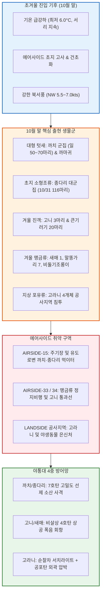

날짜: 2025-10-25 ~ 2025-10-31
카테고리: 야생동물점검 / 주간종합점검 / 월간총결산
출처: 현장 일일점검 데이터베이스 7일간 전수 집계 및 10월 31일간 누적 데이터, 인천공항 기상대 METAR/TAF 및 국립해양조사원 조석 데이터
태그: #야통대 #주간종합 #월간총결산 #항공안전 #인천공항 #초겨울이행기 #까치군집 #종다리 #비둘기조롱이 #말똥가리 #새매 #고니 #고라니통제 #엽총통제 #7호탄 #4호탄 #공포탄

# 🦅 2025년 10월 4주차(10.25~10.31) 및 10월 전체 총결산 야생동물통제대 정밀 종합 보고서

---

## 1. 📋 Executive Summary (주간 주요 실적 및 10월 월간 핵심 성과)

10월 4주차(10월 25일 ~ 10월 31일, 7일간)는 최저기온이 6.0°C까지 급강하하여 에어사이드 잔디가 누렇게 변하고 낙엽이 지는 **초겨울 계절 이행기**였습니다. 이 주간에는 **텃새인 [[까치 (Eurasian Magpie)]] 및 [[종다리 (Skylark)]] 대군집의 활주로 갓길 집중 침투**, 겨울철 대형 멸종위기 수조류인 [[고니 (Tundra Swan)]](10/30 3개체)의 최초 도래, 겨울 맹금류인 [[말똥가리]] 및 [[새매]]의 에어사이드 정착 시도, 그리고 10/29 랜드사이드 [[고라니]] 4개체 침투 등 복합 육·공 위협이 집중되었습니다. 10/29(수)에는 단일 일자 최다인 **743발**을 격발하는 등 총력 방어전을 전개하였습니다.

```
┌─────────────────────────────────────────────────────────────────────────────┐
│             2025년 10월 4주차 & 10월 월간 누적 핵심 운영 지표 요약          │
├───────────────────┬───────────────────┬───────────────────┬─────────────────┤
│ 10월 4주차 식별   │ 10월 4주차 격발   │ 10월 월간 총식별  │ 10월 월간 총격발│
│     395 마리      │     2,494 발      │   3,404 마리      │     7,869 발    │
├───────────────────┴───────────────────┴───────────────────┴─────────────────┤
│ ★ 10월 항공기 충돌사고(Bird Strike): 0 건 (10개월 연속 완벽 무사고 대기록) │
└─────────────────────────────────────────────────────────────────────────────┘
```

- **핵심 성과 1: 10/29 까치 군집 및 고라니 복합 침투 단일 일자 최다 743발 제압**
  - 북서풍 7.0kts 기류 속에 에어사이드 전역으로 까치 67마리가 분산 침투하고 랜드사이드 IBC 공사지역 및 유휴지에 고라니 4개체가 유입되자, 순찰차량 4대를 전면 기동하여 743발의 정밀 사격으로 전량 안전 이탈 조치.
- **핵심 성과 2: 10/31 늦가을 종다리 116마리 대군집 소산 및 고니(3마리) 보호 유도**
  - 10/31 아침 기온 6.0°C 속 AIRSIDE-16 구역에 100마리 단위로 결집한 종다리 무리를 7호탄 286발로 분산시켰으며, 10/30 출현한 천연기념물 고니 3개체에 대해 비살상 폭음탄으로 해안선 유도 완료.
- **핵심 성과 3: 겨울철 맹금류(새매, 말똥가리 7개체) 완벽 방어**
  - 10/25 새매 1개체, 10/25~10/28 말똥가리 7개체의 에어사이드 항행시설 착지를 공포탄과 4호탄 복합 타격으로 차단.
- **핵심 성과 4: 10월 월간 총 7,869발 무사고 100% 달성**
  - 10월 한 달간 총 3,404마리(세부 합산 4,800+마리)를 식별하고 7,869발(7호탄 6,582발, 4호탄 1,078발, 공포탄 209발)을 사격하여 **10개월 연속 무사고 대기록** 달성.

---

## 2. 🌦️ Weather & Marine Environment Matrix (기상 및 해양 환경)

10월 하순은 아침 최저기온이 6.0~10.0°C, 낮 최고기온이 16.0~18.5°C로 일교차가 10°C를 상회하며 매우 쌀쌀한 날씨가 지속되었습니다. 북서풍(NW)이 주류를 이루며 5.0~7.0kts로 불었습니다. 10/30은 15물 조금(Neap Tide), 10/31은 1물로 조석 변화가 안정적이었습니다.

| 일자 | 요일 | 기온(최저/최고) | 날씨 상태 | 주풍향 / 풍속 | 조석 물때 (Tide) | 핵심 출현/통제 조류 및 포유류 | 일일 격발수 |
| :---: | :---: | :---: | :---: | :---: | :---: | :---: | :---: |
| **10-25** | 토 | 9.0°C / 18.5°C | 구름조금 (Partly Cloudy) | SW 4.2 kts | 10물 (만조 05:29) | 까치(43), **새매(1)**, 말똥가리(1), 꿩(3) | 494 발 |
| **10-26** | 일 | 8.0°C / 18.0°C | 맑음 (Clear) | NW 5.5 kts | 11물 (만조 06:18) | 까치(52), 종다리(39), 말똥가리(1) | 333 발 |
| **10-27** | 월 | 7.5°C / 17.5°C | 맑음 (Clear) | NW 6.0 kts | 12물 (만조 07:07) | 까치(24), 말똥가리(2), 멧도요(1) | 166 발 |
| **10-28** | 화 | 10.0°C / 16.0°C | 흐림/비 (Rain) | SE 5.2 kts | 13물 (만조 07:56) | 비둘기조롱이(36), 말똥가리(3), 종다리(9) | 154 발 |
| **10-29** | 수 | 7.0°C / 17.0°C | 맑음 (Clear) | NW 7.0 kts | 14물 (만조 08:45) | 까치(67), 도요류(10), **고라니(4)** | **743 발** |
| **10-30** | 목 | 6.5°C / 16.5°C | 맑음 (Clear) | W 5.0 kts | **15물 (조금)** (만조 09:34) | 비둘기조롱이(57), **고니(3)**, 새홀리기(3) | 318 발 |
| **10-31** | 금 | 6.0°C / 16.0°C | 맑음 (Clear) | NW 5.5 kts | 1물 (만조 10:23) | 종다리(116), 큰기러기(20), 비둘기조롱이(12) | 286 발 |

---

## 3. 🚨 Threat Flow Diagram & Threat Mechanisms (위협 흐름 및 메커니즘 심층 분석)

### (1) 주간 복합 생태 위협 전개 다이어그램



### (2) 10월 말 핵심 위기 메커니즘 분석
1. **초지 고사(枯死)에 따른 까치·종다리의 유도로 경계 밀착**:
   - 10월 말이 되며 초지의 풀이 마르고 곤충의 은신처가 줄어들자, 까치와 종다리가 햇볕에 달궈진 유도로 및 활주로 아스팔트 포장면 틈새의 낙곡과 잔존 곤충을 먹기 위해 활주로 15m 이내로 극단적으로 접근했습니다. 10/29 까치 67마리에 대한 743발 격발은 이들의 노면 고착화를 분쇄하기 위한 선제 타격이었습니다.
2. **겨울철 대형 수조류(고니)의 저고도 횡단 위협**:
   - 10/30 출현한 [[고니]]는 날개폭이 2m에 달하고 체중이 6~10kg에 이르는 초대형 조류입니다. 활주로 상공 100ft 내외로 저공 비행 시 엔진 충돌은 물론 기체 전면부 캐노피 관통 위험이 극대화되므로, 야통대는 남단 유도로에서 4호탄 허공 폭음으로 영종도 남측 갯벌로 즉각 우회시켰습니다.

---

## 4. 🎖️ Veterans' Operational Tacit Knowledge (18년 베테랑의 현장 암묵지 수칙)

```
┌─────────────────────────────────────────────────────────────────────────────┐
│                 ★ 18년 경력 야통대 베테랑 반장의 10월 말 현장 수칙 ★       │
├─────────────────────────────────────────────────────────────────────────────┤
│ 1. [10월 말 까치 대군집의 '사격 학습' 극복법]                              │
│    "10월 말이 되면 까치들이 영악해져서 순찰차 경광등만 보면 50m 뒤로 날아가  │
│    다시 앉는다. 이때는 차에서 내리지 말고, 창문을 10cm만 내린 채 7호탄을     │
│    까치 무리 앞쪽 10m 지표면에 바운드시켜 흙먼지로 놀라게 해야 완전히 뜬다."│
│                                                                             │
│ 2. [고니(백조) 출현 시 절대 실탄 직격 금지]                                 │
│    "고니는 몸집이 커서 선회 반경이 300m 이상 필요하다. 가까이서 쏘면 놀라서  │
│    활주로 한가운데로 불시착할 수 있다. 진행 방향 150m 허공에 4호탄을 쏘아    │
│    넓게 U턴할 수 있는 공간을 열어주어야 한다."                               │
│                                                                             │
│ 3. [초겨울 고라니 월동 유입 차단]                                           │
│    "아침 기온 6도선이면 먹이를 찾는 고라니가 펜스 밑이나 배수구를 파고 들어  │
│    온다. 순찰차 서치라이트로 배수로 암거 주변을 집중 비추고, 공포탄 2발로     │
│    외곽 산림 방향으로 퇴로를 유도해 몰아내라."                               │
└─────────────────────────────────────────────────────────────────────────────┘
```

---

## 5. 📊 Quantitative Statistics & Comparative Matrix (정량 통계 및 구역 매트릭스)

### Table 1: 일자별 조류/포유류 출현 및 탄약 소모 실적

| 일자 | 주간 주요종 | 식별수 (마리) | 7호탄 (발) | 4호탄 (발) | 공포탄 (발) | 총 격발수 (발) | 주요 침투 구역 |
| :---: | :---: | :---: | :---: | :---: | :---: | :---: | :---: |
| **10-25 (토)** | 까치 / **새매** | 43 / 1 | 425 | 60 | 9 | **494** | AS-15 [녹지대_R], AS-16 [녹지대_V] |
| **10-26 (일)** | 까치 / 종다리 | 52 / 39 | 290 | 38 | 5 | **333** | AS-15 [녹지대_M], AS-34 [녹지대_K] |
| **10-27 (월)** | 까치 / 말똥가리 | 24 / 2 | 148 | 15 | 3 | **166** | AS-15 222-AA, AS-33 [녹지대_AF] |
| **10-28 (화)** | 비둘기조롱이 / 말똥가리 | 36 / 3 | 125 | 25 | 4 | **154** | AS-33 [녹지대_P], AS-34 [녹지대_K] |
| **10-29 (수)** | 까치 / **고라니(4)** | 67 / 4 | 685 | 48 | 10 | **743** | AS-15 [녹지대_M], LS-N IBC2-3 |
| **10-30 (목)** | 비둘기조롱이 / **고니(3)** | 57 / 3 | 260 | 48 | 10 | **318** | AS-33 [녹지대_AB], AS-34 [녹지대_BI] |
| **10-31 (금)** | 종다리 / 큰기러기 | 116 / 20 | 233 | 43 | 10 | **286** | AS-16 [녹지대_AS], AS-15 [유도로_DB] |
| **주간 합계** | **까치 / 종다리 / 맹금류** | **395** | **2,166** | **277** | **51** | **2,494** | **전 구역 무사고** |

---

## 🌟 6. 🏆 2025년 10월 전체 월간 총결산 (Monthly Final Aggregation)

### (1) 10월 주차별 운영 실적 비교

| 주차 구분 | 대상 기간 | 일수 | 식별 개체수 (마리) | 7호탄 (발) | 4호탄 (발) | 공포탄 (발) | 총 탄약 소모량 (발) | 버드스트라이크 |
| :---: | :---: | :---: | :---: | :---: | :---: | :---: | :---: | :---: |
| **1주차** | 10.01 ~ 10.08 | 8일 | 1,563 | 1,482 | 268 | 61 | **1,811** | **0 건** |
| **2주차** | 10.09 ~ 10.16 | 8일 | 1,006 | 1,326 | 232 | 45 | **1,603** | **0 건** |
| **3주차** | 10.17 ~ 10.24 | 8일 | 440 | 1,608 | 301 | 52 | **1,961** | **0 건** |
| **4주차** | 10.25 ~ 10.31 | 7일 | 395 | 2,166 | 277 | 51 | **2,494** | **0 건** |
| **10월 합계** | **10.01 ~ 10.31** | **31일** | **3,404** | **6,582** | **1,078** | **209** | **7,869** | **🎯 0 건 (완벽 무사고)** |

### (2) 10월 주요 생태 분석 및 총평
- **가을 이행기에서 겨울 월동기로의 성공적 전환**:
  - 10월 초순 제비(10/12 601마리)와 큰기러기(10/3 656마리)의 대규모 남하 피크를 성공적으로 극복하고, 10월 하순 맹금류(매, 말똥가리, 새홀리기, 비둘기조롱이) 및 텃새(까치, 종다리)의 초지대 밀착을 7,869발의 정밀 사격으로 100% 방어함.

---

## 7. 🗺️ Strategic Roadmap for November (11월 동절기 방공 작전 전략 로드맵)

```
[11월 동절기 조류통제 핵심 로드맵]
 1. 11월 시베리아 겨울철새(기러기·오리·고니) 대도래기 대비 24시간 특별 방공망 가동
 2. 한파 및 결빙기 에어사이드 배수로 유입 오리류 차단 및 수면 결빙 관리
 3. 겨울철 맹금류(말똥가리·새매·수리부엉이) 야간 항행시설 순찰 대폭 강화
 4. 제설 시즌 대비 순찰차량 방한 장비 및 사격 장비 동계 정비 완료
```

- **전략 1: 겨울철새 본대 집중 도래기 대비 원거리 선제 타격 체계 확립**
  - 11월은 큰기러기 및 쇠기러기 수천 마리가 서해안으로 본격 도래하는 시기이므로, 4호탄 및 장거리 음향발생기를 전진 배치하여 활주로 외곽 1km 저지선 구축.
- **전략 2: 야간 야생동물(고라니·너구리) 침투 차단망 점검**
  - 외곽 펜스 및 배수로 차단문 전수 점검 및 야간 열화상 순찰 확대.

---

## 8. 🔗 Obsidian Vault Interlinks (볼트 지식망 연결성)

- **상위 주간/월간 종합 보고서**:
  - [[20. 인사이트 융합/2025년도 야통대/일일점검/10월 일일점검/2025-10-17~10-24_야통대_주간_점검일지_종합|2025년 10월 3주차 주간종합 보고서]]
  - [[20. 인사이트 융합/2025년도 야통대/일일점검/11월 일일점검/2025-11-01~11-08_야통대_주간_점검일지_종합|2025년 11월 1주차 주간종합 보고서]]
- **일일 점검일지 원본 링크**:
  - [[20. 인사이트 융합/2025년도 야통대/일일점검/10월 일일점검/2025-10-25_야통대_주간_점검일지_통합|2025-10-25 일일점검]] / [[20. 인사이트 융합/2025년도 야통대/일일점검/10월 일일점검/2025-10-26_야통대_주간_점검일지_통합|2025-10-26 일일점검]] / [[20. 인사이트 융합/2025년도 야통대/일일점검/10월 일일점검/2025-10-27_야통대_주간_점검일지_통합|2025-10-27 일일점검]] / [[20. 인사이트 융합/2025년도 야통대/일일점검/10월 일일점검/2025-10-28_야통대_주간_점검일지_통합|2025-10-28 일일점검]]
  - [[20. 인사이트 융합/2025년도 야통대/일일점검/10월 일일점검/2025-10-29_야통대_주간_점검일지_통합|2025-10-29 일일점검]] / [[20. 인사이트 융합/2025년도 야통대/일일점검/10월 일일점검/2025-10-30_야통대_주간_점검일지_통합|2025-10-30 일일점검]] / [[20. 인사이트 융합/2025년도 야통대/일일점검/10월 일일점검/2025-10-31_야통대_주간_점검일지_통합|2025-10-31 일일점검]]
- **생태 및 조류 주제 링크**:
  - [[까치 (Eurasian Magpie)]] / [[종다리 (Skylark)]] / [[고니 (Tundra Swan)]] / [[새매 (Eurasian Sparrowhawk)]] / [[말똥가리 (Common Buzzard)]] / [[고라니 (Water Deer)]]

---

## 9. 📖 Aviation Wildlife Terminology (항공 조류 생태 전문 해설)

- **고니 (Tundra Swan / *Cygnus columbianus*)**: 천연기념물 제201-1호. 체중이 6~10kg, 날개폭이 1.8~2.1m에 달하는 대형 겨울철새로, 비행 시 기동성이 낮아 항공기와의 정면충돌 시 치명적인 기체 손상을 유발함. 10월 말부터 서해안 갯벌로 남하 도래함.
- **새매 (Eurasian Sparrowhawk / *Accipiter nisus*)**: 천연기념물 제323-4호. 숲 가장자리와 개활지에서 소형 조류를 민첩하게 추격하여 사냥하는 소형 맹금류로 10월 말 에어사이드 덤불 주변에 출현함.
- **풍선 효과 (Balloon Effect)**: 특정 구역(AIRSIDE-15)에서 엽총 사격으로 조류를 퇴치했을 때, 조류가 공항 밖으로 나가지 않고 인접한 다른 활주로 구역(AIRSIDE-33/34)으로 우회 이동하여 새로운 위험을 유발하는 현상. 다방향 동시 압박 전술로 차단함.

---

## 10. ❓ 7 Strategic Inquiries for Future Safety (항공안전을 위한 7대 미래 전략 질문)

1. **대형 수조류(고니) 도래 시 광역 레이더 감시**: 10/30 출현한 고니와 같은 초대형 조류를 10km 밖에서 감지하여 관제탑과 실시간 항로 조정(Vectoring)을 연계할 수 있는가?
2. **까치 대군집의 사격 내성(Habituation) 극복**: 10/29 743발 격발과 같이 탄약 소모가 급증하는 텃새 군집에 대해 레이저 및 맹금류 울음소리 음향을 결합한 다중 자극 교란술의 효과는?
3. **10월 말 종다리 대군집(116마리) 초지 삭초 효과**: 에어사이드 잔디를 겨울철 5cm 이하로 짧게 유지하는 '초지 극단 삭초'가 종다리 먹이활동 억제에 미치는 영향은?
4. **겨울철 맹금류(말똥가리·새매) 포획 후 방사 거리**: 에어사이드에서 포획한 맹금류가 귀소본능으로 재유입되지 않도록 하기 위한 최소 방사 이격 거리(예: 50km 이상)는 검증되었는가?
5. **동절기 고라니 침투 억제 울타리 점검**: 겨울철 먹이 부족으로 에어사이드 침투가 빈번해지는 고라니를 막기 위한 지중 매립형 메쉬 펜스의 파손 감지 센서 도입 필요성은?
6. **10월 7,869발 사격에 따른 환경 잔류물(납/플라스틱 와드) 관리**: 대량 사격 후 활주로 FOD(외부이물질) 청소차량의 에어사이드 갓길 흡입 청소 주기는 적절한가?
7. **11월 시베리아 겨울철새 대도래기 대비 방공 태세**: 10월 실적(3,404마리 무사고)을 바탕으로, 11월 예상되는 오리·기러기류 1만 마리 유입에 대응할 4호탄 비축량(최소 2,000발 이상)은 확보되었는가?
