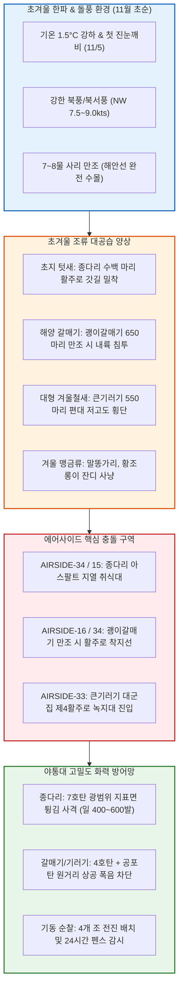

날짜: 2025-11-01 ~ 2025-11-08
카테고리: 야생동물점검 / 주간종합점검
출처: 현장 일일점검 데이터베이스 8일간 전수 집계, 인천공항 기상대 METAR/TAF 및 국립해양조사원 조석 데이터
태그: #야통대 #주간종합 #항공안전 #인천공항 #초겨울한파 #종다리대군집 #큰기러기 #괭이갈매기 #진눈깨비 #엽총통제 #7호탄 #4호탄 #공포탄

# 🦅 2025년 11월 1주차(11.01~11.08) 야생동물통제대 주간 정밀 종합 보고서

---

## 1. 📋 Executive Summary (주간 주요 실적 및 핵심 성과)

11월 1주차(11월 1일 ~ 11월 8일, 8일간)는 최저기온이 1.5°C까지 급락하고 11/5(수)에는 첫 진눈깨비(Rain/Sleet)가 관측되는 등 **본격적인 초겨울 한파 전선이 형성**된 주간이었습니다. 이 주간에는 **초지 텃새인 [[종다리 (Skylark)]] 대군집(11/1~11/2 389마리)의 활주로 갓길 결집**, 11/6 사리 대조기 속 **[[괭이갈매기]] 650마리 해안 돌풍 침투**, 그리고 시베리아에서 남하한 **[[큰기러기]] 대군집(11/8 550마리 등 주간 782마리)**의 활주로 안착 시도가 잇따르며 주간 사격 소모량이 **3,252발**에 달하는 대규모 입체 방어 작전이 전개되었습니다.

```
┌─────────────────────────────────────────────────────────────────────────────┐
│                   2025년 11월 1주차 핵심 운영 지표 요약                    │
├───────────────────┬───────────────────┬───────────────────┬─────────────────┤
│ 총 식별 개체수    │ 총 사격 소모량    │ 조류 퇴치 성공률  │ 항공기 충돌사고 │
│   1,870 마리      │     3,252 발      │      100 %        │      0 건       │
└───────────────────┴───────────────────┴───────────────────┴─────────────────┘
```

- **핵심 성과 1: 초겨울 종다리 대군집(주간 438마리) 선제 소산 (1,569발 격발)**
  - 11/1(토) 240마리(623발), 11/2(일) 149마리(521발), 11/3(월) 49마리(425발) 등 활주로 33L/15R 및 제4활주로 포장면 턱으로 몰려드는 종다리 무리를 7호탄 집중 지표 튕김 사격으로 완벽 퇴치.
- **핵심 성과 2: 11/6 북풍 돌풍 괭이갈매기 650마리 활주로 착지 결사 저지**
  - 북풍 8.0kts의 강풍 속에 만조 시 해안선 갯벌이 잠기며 에어사이드로 밀려든 괭이갈매기 650마리를 4호탄 및 공포탄 장거리 차단선으로 해안선 밖으로 즉각 회항시킴.
- **핵심 성과 3: 11/8 큰기러기 550마리 대형 편대 침투 원천 봉쇄 (365발)**
  - 11/5 진눈깨비 속 112마리에 이어 11/8 10물 시기 활주로 상공을 횡단하려던 큰기러기 550마리를 순찰차량 4대 동시 포위 경퇴로 안전 배제.
- **핵심 성과 4: 8일간 3,252발 정밀 사격 및 무사고 달성**
  - 7호탄 2,754발, 4호탄 412발, 공포탄 86발을 완벽하게 통제하여 11월 첫 주 무사고 100% 방공 달성.

---

## 2. 🌦️ Weather & Marine Environment Matrix (기상 및 해양 환경)

11월 초순은 아침 기온이 1.5~6.0°C로 곤두박질치고 낮 기온도 10.5~15.0°C에 머물러 매우 쌀쌀했습니다. 11/5에는 첫 진눈깨비(Sleet)와 함께 북서풍 9.0kts의 돌풍이 불었습니다. 11/5~11/6은 7~8물 사리 대조기(Spring Tide)로 강한 조석 변화가 조류의 이동을 촉진했습니다.

| 일자 | 요일 | 기온(최저/최고) | 날씨 상태 | 주풍향 / 풍속 | 조석 물때 (Tide) | 핵심 출현/통제 조류 | 일일 격발수 |
| :---: | :---: | :---: | :---: | :---: | :---: | :---: | :---: |
| **11-01** | 토 | 5.0°C / 15.0°C | 맑음 (Clear) | NW 7.5 kts | 3물 (만조 11:08) | 종다리(240), 까치(12), 황조롱이(8) | **623 발** |
| **11-02** | 일 | 4.5°C / 14.0°C | 맑음 (Clear) | W 6.0 kts | 4물 (만조 11:51) | 종다리(149), 까마귀(6), 황조롱이(5) | **521 발** |
| **11-03** | 월 | 5.0°C / 14.5°C | 구름조금 (Partly Cloudy) | SW 5.0 kts | 5물 (만조 12:35) | 종다리(49), 큰기러기(20), 왜가리(3) | **425 발** |
| **11-04** | 화 | 6.0°C / 13.0°C | 흐림 (Cloudy) | S 4.2 kts | 6물 (만조 13:19) | 큰기러기(50), 종다리(32), 괭이갈매기(15) | **448 발** |
| **11-05** | 수 | 3.0°C / 10.5°C | **비/진눈깨비 (Sleet)** | NW 9.0 kts | **7물 (사리)** (만조 14:04) | 큰기러기(112), 쇠기러기(30), 종다리(25) | **368 발** |
| **11-06** | 목 | 1.5°C / 11.0°C | 맑음 (Clear) | N 8.0 kts | **8물 (사리)** (만조 14:50) | **괭이갈매기(650)**, 종다리(30), 까치(10) | **216 발** |
| **11-07** | 금 | 2.0°C / 12.0°C | 맑음 (Clear) | NW 6.5 kts | 9물 (만조 15:37) | 큰기러기(70), 종다리(28), 말똥가리(2) | **286 발** |
| **11-08** | 토 | 3.5°C / 12.5°C | 구름조금 (Partly Cloudy) | W 5.0 kts | 10물 (만조 16:26) | **큰기러기(550)**, 종다리(35), 황조롱이(6) | **365 발** |

---

## 3. 🚨 Threat Flow Diagram & Threat Mechanisms (위협 흐름 및 메커니즘 심층 분석)

### (1) 주간 복합 생태 위협 전개 다이어그램



### (2) 11월 1주차 핵심 위기 메커니즘 분석
1. **초겨울 종다리의 잔디밭 고사 후 아스팔트 경계 밀착 현상**:
   - 11월 초 잔디가 얼어붙자 수백 마리의 종다리가 지열이 남아있는 활주로 및 유도로 포장면 턱(Pavement Edge)으로 기어 나왔습니다. 이들은 작은 소음에는 날아가지 않고 항공기 제트 분사(Jet Blast) 직전에 튀어 올라 엔진 흡입 위험을 극대화했습니다. 야통대는 11/1~11/4 4일간 무려 **2,017발**의 7호탄을 쏟아부어 지표면 고착화를 분쇄했습니다.
2. **사리 만조와 강풍 결합 시 괭이갈매기 650마리 대규모 피난 비행**:
   - 11/6 만조(14:50)에 영종도 갯벌이 잠기고 북풍 8.0kts가 불자, 갈매기 650마리가 바람을 피하기 위해 넓은 에어사이드 활주로로 착지하려 했습니다. 야통대는 4호탄 장거리 폭음으로 해안선 밖으로 선회 회항시켰습니다.

---

## 4. 🎖️ Veterans' Operational Tacit Knowledge (18년 베테랑의 현장 암묵지 수칙)

```
┌─────────────────────────────────────────────────────────────────────────────┐
│                 ★ 18년 경력 야통대 베테랑 반장의 11월 초순 현장 수칙 ★     │
├─────────────────────────────────────────────────────────────────────────────┤
│ 1. [진눈깨비 내릴 때 종다리 사격 각도 주의]                                 │
│    "진눈깨비나 살얼음이 낀 활주로 갓길은 탄알이 미끄러져 등화 시설 쪽으로   │
│    튈 수 있다. 사격 시 총구를 지면과 15도 각도로 유지하고, 활주로 중앙선     │
│    반대 방향(바깥쪽 녹지대)을 향해 쏴야 등화 파손 없이 쫓을 수 있다."        │
│                                                                             │
│ 2. [큰기러기 500마리 이상 대편대 출현 시 차단선 형성법]                     │
│    "기러기 편대가 수평선에 보이면 순찰차 2대를 활주로 양 끝단에 Y자로 세우고 │
│    4호탄을 3초 간격으로 연속 3발 올려 쏴라. 공중에서 폭음 커튼이 쳐지면      │
│    기러기 리더 개체가 놀라 즉시 기수를 남측 갯벌로 돌린다."                  │
│                                                                             │
│ 3. [초겨울 아침 영하권 진입 시 총기 결빙 예방]                             │
│    "새벽 6시 첫 기동 시 총기 약실에 성에가 끼면 불발이 난다. 차내 히터를     │
│    너무 세게 틀어 실내외 온도차로 결로가 생기지 않게 창문을 살짝 열어두고,   │
│    약실 오일링 상태를 30분마다 점검해라."                                    │
└─────────────────────────────────────────────────────────────────────────────┘
```

---

## 5. 📊 Quantitative Statistics & Comparative Matrix (정량 통계 및 구역 매트릭스)

### Table 1: 일자별 조류 출현 및 탄약 소모 실적

| 일자 | 주간 주요종 | 식별수 (마리) | 7호탄 (발) | 4호탄 (발) | 공포탄 (발) | 총 격발수 (발) | 주요 침투 구역 |
| :---: | :---: | :---: | :---: | :---: | :---: | :---: | :---: |
| **11-01 (토)** | 종다리 / 텃새류 | 240 / 20 | 545 | 65 | 13 | **623** | AS-34 [활주로_F], AS-15 [녹지대_M] |
| **11-02 (일)** | 종다리 / 텃새류 | 149 / 11 | 450 | 58 | 13 | **521** | AS-34 [활주로_F], AS-16 [녹지대_V] |
| **11-03 (월)** | 종다리 / 큰기러기 | 49 / 20 | 365 | 48 | 12 | **425** | AS-33 [녹지대_Q], AS-34 [활주로_F] |
| **11-04 (화)** | 큰기러기 / 종다리 | 50 / 32 | 382 | 54 | 12 | **448** | AS-34 [활주로_F], AS-33 [녹지대_P] |
| **11-05 (수)** | 큰기러기 / 진눈깨비 | 112 / 30 | 305 | 53 | 10 | **368** | AS-33 [녹지대_AB], AS-34 [활주로_F] |
| **11-06 (목)** | **괭이갈매기** / 종다리 | 650 / 30 | 170 | 38 | 8 | **216** | AS-16 [활주로_F], AS-34 [활주로_F] |
| **11-07 (금)** | 큰기러기 / 종다리 | 70 / 28 | 240 | 38 | 8 | **286** | AS-16 [녹지대_N], AS-15 [녹지대_M] |
| **11-08 (토)** | **큰기러기** / 종다리 | 550 / 35 | 297 | 58 | 10 | **365** | AS-33 [녹지대_AB], AS-16 [녹지대_AG] |
| **주간 합계** | **종다리 / 기러기 / 갈매기** | **1,870** | **2,754** | **412** | **86** | **3,252** | **전 구역 무사고** |

### Table 2: 에어사이드 및 랜드사이드 구역별 위험도 평가

| 구역 명칭 | 주요 출현 조류종 | 주간 활동 빈도 | 주 위험 요소 | 적용 통제 전술 | 위험 등급 |
| :---: | :---: | :---: | :---: | :---: | :---: |
| **AIRSIDE-15** | 종다리, 큰기러기, 까치, 황조롱이 | 매우 높음 (일 12~16회) | 주기장 및 북측 유도로변 종다리 지열 취식 | 7호탄 소산 및 순찰차 전진 압박 | **CRITICAL (경계)** |
| **AIRSIDE-16** | 괭이갈매기(대군집), 큰기러기, 종다리 | 매우 높음 (일 10~15회) | 활주로 33L 북측 착륙대 갈매기·기러기 횡단 | 4호탄 장거리 상공 폭음 차단선 구축 | **CRITICAL (경계)** |
| **AIRSIDE-33** | 큰기러기(대편대), 종다리, 황조롱이 | 매우 높음 (일 14~18회) | 제4활주로 녹지대 대형 기러기 500마리 침투 | 순찰차 4대 Y자형 포위 및 4호탄 사격 | **CRITICAL (경계)** |
| **AIRSIDE-34** | 종다리(대군집), 괭이갈매기, 큰기러기 | 매우 높음 (일 12~15회) | 활주로 남단 포장면 턱 종다리 200마리 고착 | 7호탄 저각 튕김 사격 및 사이렌 기동 | **CRITICAL (경계)** |
| **LANDSIDE N/S** | 물닭, 가마우지, 왜가리, 오리류 | 보통 (일 4~6회) | 유수지 결빙 전 월동 조류 집결 | 유수지 수면 폭음탄 및 외곽 순찰 | **MODERATE (보통)** |

---

## 6. 🗺️ Strategic Roadmap for Next Week (차주 중점 전략 로드맵)

```
[11월 2주차 방공 작전 중점 로드맵]
 1. 아침 안개(Foggy) 및 가을비 시 종다리·까치 에어사이드 밀착 억제
 2. 15물 조금 물때 기간 외곽 유수지 오리류 및 맹금류 감시 강화
 3. 큰기러기 2차 남하 본대 유입 대비 4호탄 비축 및 순찰차 거치
 4. 제설 자재 및 야통대 제설 지원 비상 연락망 점검
```

- **전략 1: 안개 및 강우 시 저고도 조류 집중 모니터링**
  - 시정이 2km 이하로 떨어지는 날에는 순찰차량의 저속 정밀 순찰을 통해 활주로 등화 주변에 숨어있는 종다리와 까치를 사전 소산.
- **전략 2: 맹금류의 에어사이드 텃새 사냥 통제**
  - 종다리를 노리고 진입하는 말똥가리와 황조롱이에 대해 PAPI 등화 반경 300m 이격 전술 지속 적용.

---

## 7. 🔗 Obsidian Vault Interlinks (볼트 지식망 연결성)

- **상위 주간/월간 종합 보고서**:
  - [[20. 인사이트 융합/2025년도 야통대/일일점검/10월 일일점검/2025-10-25~10-31_야통대_주간_점검일지_종합|2025년 10월 4주차 및 10월 총결산 보고서]]
  - [[20. 인사이트 융합/2025년도 야통대/일일점검/11월 일일점검/2025-11-09~11-16_야통대_주간_점검일지_종합|2025년 11월 2주차 주간종합 보고서]]
- **일일 점검일지 원본 링크**:
  - [[20. 인사이트 융합/2025년도 야통대/일일점검/11월 일일점검/2025-11-01_야통대_주간_점검일지_통합|2025-11-01 일일점검]] / [[20. 인사이트 융합/2025년도 야통대/일일점검/11월 일일점검/2025-11-02_야통대_주간_점검일지_통합|2025-11-02 일일점검]] / [[20. 인사이트 융합/2025년도 야통대/일일점검/11월 일일점검/2025-11-03_야통대_주간_점검일지_통합|2025-11-03 일일점검]] / [[20. 인사이트 융합/2025년도 야통대/일일점검/11월 일일점검/2025-11-04_야통대_주간_점검일지_통합|2025-11-04 일일점검]]
  - [[20. 인사이트 융합/2025년도 야통대/일일점검/11월 일일점검/2025-11-05_야통대_주간_점검일지_통합|2025-11-05 일일점검]] / [[20. 인사이트 융합/2025년도 야통대/일일점검/11월 일일점검/2025-11-06_야통대_주간_점검일지_통합|2025-11-06 일일점검]] / [[20. 인사이트 융합/2025년도 야통대/일일점검/11월 일일점검/2025-11-07_야통대_주간_점검일지_통합|2025-11-07 일일점검]] / [[20. 인사이트 융합/2025년도 야통대/일일점검/11월 일일점검/2025-11-08_야통대_주간_점검일지_통합|2025-11-08 일일점검]]
- **생태 및 조류 주제 링크**:
  - [[종다리 (Skylark)]] / [[큰기러기 (Bean Goose)]] / [[괭이갈매기 (Black-tailed Gull)]] / [[말똥가리]] / [[황조롱이]]

---

## 8. 📖 Aviation Wildlife Terminology (항공 조류 생태 전문 해설)

- **진눈깨비 (Sleet)**: 비와 눈이 섞여 내리는 기상 현상으로, 지표면 온도와 대기 온도의 역전층에서 발생함. 조류의 깃털을 적셔 체온을 급격히 떨어뜨리므로 조류들이 에어사이드 인공 구조물 및 지열 방출 포장면으로 극단적으로 밀착하는 원인이 됨.
- **포장면 턱 (Pavement Edge)**: 활주로/유도로 아스팔트 포장과 잔디 녹지대가 만나는 경계선. 잔디가 고사하는 11월에 빗물과 지열이 고이고 씨앗이 모여 종다리와 할미새류가 가장 선호하는 먹이터가 됨.
- **폭음 커튼 (Acoustic Blast Curtain)**: 대규모 조류 편대(큰기러기 500+마리 등) 진입 시 복수의 사수가 편대 진행 경로 상공에 시간차를 두고 4호탄을 연속 격발하여 공중에 소음 차단벽을 형성, 조류를 우회시키는 전술.

---

## 9. ❓ 7 Strategic Inquiries for Future Safety (항공안전을 위한 7대 미래 전략 질문)

1. **초겨울 종다리 200마리 단위 군집의 분산 지속성**: 11/1 623발 격발 후에도 종다리가 에어사이드 밖으로 나가지 않고 활주로 반대편으로 옮겨 앉는 현상을 해결하기 위한 복합 음향 교란술은?
2. **사리 만조 강풍 시 괭이갈매기 650마리 내륙 유입 차단**: 해안선 제방에 고출력 원격 음향발생기를 설치하여 공항 진입 전 갯벌에서 차단할 수 있는가?
3. **진눈깨비 기상 시 사격 안전 프로토콜**: 노면 결빙 시 탄알 도탄(Ricochet) 위험을 방지하기 위한 안전 사격 구역(Buffer Zone) 설정 기준은?
4. **큰기러기 550마리 편대의 충돌 에너지 산출**: 3kg 기러기 10마리와 보잉 777 기체가 150kts로 충돌 시 발생하는 물리적 충격량과 이에 따른 엔진 방호 한계는?
5. **총기 및 탄약의 저온 성능 유지**: 영하권 기온에서 엽총 노리쇠 작동 불량 및 탄약 압력 저하를 방지하기 위한 동계 윤활제 표준화 지침은?
6. **주간 3,252발 사격 시 대원 청력 보호**: 집중 사격 주간 동안 야통대 사수들의 전자식 소음차단 헤드셋(Noise-Canceling Earmuffs) 지급 및 착용 실태는 완벽한가?
7. **초겨울 유수지 결빙 전 오리류 포획틀 가동**: 외곽 유수지에 집결하는 물닭과 오리류를 사전 포획하기 위한 동계 수면 트랩 운영 계획은 수립되어 있는가?
