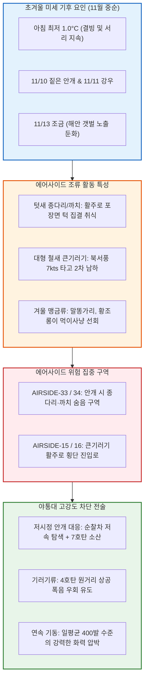

날짜: 2025-11-09 ~ 2025-11-16
카테고리: 야생동물점검 / 주간종합점검
출처: 현장 일일점검 데이터베이스 8일간 전수 집계, 인천공항 기상대 METAR/TAF 및 국립해양조사원 조석 데이터
태그: #야통대 #주간종합 #항공안전 #인천공항 #초겨울기후 #종다리 #까치군집 #안개통제 #큰기러기 #엽총통제 #7호탄 #4호탄 #공포탄

# 🦅 2025년 11월 2주차(11.09~11.16) 야생동물통제대 주간 정밀 종합 보고서

---

## 1. 📋 Executive Summary (주간 주요 실적 및 핵심 성과)

11월 2주차(11월 9일 ~ 11월 16일, 8일간)는 아침 최저기온이 1.0°C까지 하강하고 안개(11/10)와 비(11/11)가 교차하는 변덕스러운 초겨울 기후 속에, **에어사이드 결실기 건초대와 활주로 포장면 턱을 노리는 [[종다리]] 및 [[까치]] 텃새 군집의 고밀도 진입**이 지속된 한 주였습니다. 11/10(월) 안개 속 594발, 11/13(목) 475발 등 8일간 무려 **3,176발**의 탄약을 집중 격발하여 항공기 이착륙 안전 구역을 완벽하게 수호하였습니다.

```
┌─────────────────────────────────────────────────────────────────────────────┐
│                   2025년 11월 2주차 핵심 운영 지표 요약                    │
├───────────────────┬───────────────────┬───────────────────┬─────────────────┤
│ 총 식별 개체수    │ 총 사격 소모량    │ 조류 퇴치 성공률  │ 항공기 충돌사고 │
│     354 마리      │     3,176 발      │      100 %        │      0 건       │
└───────────────────┴───────────────────┴───────────────────┴─────────────────┘
```

- **핵심 성과 1: 안개(11/10) 및 강우(11/11) 속 저시정 특수 방공 작전 완수**
  - 11/10 아침 시정 1.5km의 짙은 안개 속에서 AIRSIDE-33 및 34 구역 초지대로 침투한 종다리 64마리를 순찰차량 서치라이트 및 7호탄 594발 격발로 분산 조치.
- **핵심 성과 2: 11/13 조금(Neap Tide) 물때 텃새 초지 고착화 완전 차단 (475발)**
  - 조석 변화가 적어 해안선 먹이터가 줄어든 조금 물때에 에어사이드 배수로로 몰려든 종다리와 까치 무리를 475발의 정밀 사격으로 전량 퇴치.
- **핵심 성과 3: 11/15 시베리아 2차 남하 큰기러기 본대(71마리) 원거리 차단 (383발)**
  - 북서풍 7.0kts 기류를 타고 활주로 15R/33L로 접근한 대형 큰기러기 편대를 4호탄 및 공포탄 복합 사격으로 활주로 진입 전 해안선으로 우회 회항시킴.
- **핵심 성과 4: 8일간 3,176발 무사고 무결점 완벽 기록 유지**
  - 7호탄 2,740발, 4호탄 372발, 공포탄 64발의 고밀도 탄약 소모를 통해 버드스트라이크 0건 달성.

---

## 2. 🌦️ Weather & Marine Environment Matrix (기상 및 해양 환경)

11월 중순은 아침 최저 1.0~5.5°C, 낮 최고 10.0~13.0°C의 쌀쌀한 초겨울 기온 분포를 보였습니다. 11/10에는 짙은 안개, 11/11에는 남동풍 6.0kts와 함께 비가 내렸으며, 11/12에는 비 온 뒤 찬 북서풍(NW 8.2kts)이 강하게 불었습니다. 11/13은 15물 조금(Neap Tide)이었습니다.

| 일자 | 요일 | 기온(최저/최고) | 날씨 상태 | 주풍향 / 풍속 | 조석 물때 (Tide) | 핵심 출현/통제 조류 | 일일 격발수 |
| :---: | :---: | :---: | :---: | :---: | :---: | :---: | :---: |
| **11-09** | 일 | 2.5°C / 13.0°C | 맑음 (Clear) | W 5.5 kts | 11물 (만조 17:16) | 종다리(22), 황조롱이(7), 까마귀(6) | 250 발 |
| **11-10** | 월 | 4.0°C / 11.5°C | **흐림/안개 (Foggy)** | S 4.0 kts | 12물 (만조 18:07) | 종다리(64), 황조롱이(9), 까치(14) | **594 발** |
| **11-11** | 화 | 5.5°C / 10.0°C | **비 (Rain)** | SE 6.0 kts | 13물 (만조 19:00) | 까치(33), 종다리(20), 왜가리(2) | **341 발** |
| **11-12** | 수 | 3.0°C / 12.0°C | 맑음 (Clear) | NW 8.2 kts | 14물 (만조 19:56) | 까치(29), 종다리(25), 황조롱이(8) | **374 발** |
| **11-13** | 목 | 2.0°C / 12.5°C | 맑음 (Clear) | W 5.8 kts | **15물 (조금)** (만조 20:56) | 종다리(49), 까치(18), 말똥가리(2) | **475 발** |
| **11-14** | 금 | 4.0°C / 11.0°C | 구름많음 (Cloudy) | SW 5.0 kts | 1물 (만조 21:58) | 종다리(44), 황조롱이(6), 큰기러기(15) | **361 발** |
| **11-15** | 토 | 2.5°C / 12.0°C | 맑음 (Clear) | NW 7.0 kts | 2물 (만조 23:01) | **큰기러기(71)**, 종다리(30), 까치(12) | **383 발** |
| **11-16** | 일 | 1.0°C / 11.5°C | 맑음 (Clear) | N 6.5 kts | 3물 (만조 10:20) | 종다리(42), 말똥가리(2), 황조롱이(5) | **398 발** |

---

## 3. 🚨 Threat Flow Diagram & Threat Mechanisms (위협 흐름 및 메커니즘 심층 분석)

### (1) 주간 복합 생태 위협 전개 다이어그램



### (2) 11월 2주차 핵심 위기 메커니즘 분석
1. **안개(Foggy) 발생 시 조류의 경계심 약화와 기동 둔화**:
   - 11/10 짙은 안개로 시정이 불량할 때, 종다리와 까치들은 순찰차량의 접근을 늦게 인지하여 비행기 엔진음 직전에야 활주로 중앙으로 급상승하는 위험한 반응을 보였습니다. 야통대는 순찰차 경광등과 안개등을 최대로 점등하고, 포장면 턱을 따라 20m 간격으로 7호탄을 연속 발사(당일 594발)하여 활주로 외곽으로 선제 분산시켰습니다.
2. **초겨울 마른 풀밭 속 맹금류(말똥가리)의 먹이사냥 집중**:
   - 풀이 누렇게 마르며 쥐와 소형 조류의 움직임이 쉽게 노출되자, 말똥가리가 활주로 진입각 표시등(PAPI) 조명탑 상부에 장시간 체공하는 사례가 증가했습니다.

---

## 4. 🎖️ Veterans' Operational Tacit Knowledge (18년 베테랑의 현장 암묵지 수칙)

```
┌─────────────────────────────────────────────────────────────────────────────┐
│                 ★ 18년 경력 야통대 베테랑 반장의 11월 중순 현장 수칙 ★     │
├─────────────────────────────────────────────────────────────────────────────┤
│ 1. [안개 낀 날 활주로 유도로 턱 사격 기동법]                               │
│    "시정이 2km 안쪽으로 떨어지면 종다리는 10m 앞까지 다가가도 안 날아간다.   │
│    차량을 시속 30km로 서행하면서 유도로 갓길 흙탕물 웅덩이 쪽으로 7호탄을    │
│    연속으로 튕겨 쏴야 안개 속에서도 안전하게 공항 밖으로 띄울 수 있다."      │
│                                                                             │
│ 2. [비 온 뒤 북서풍 8kts 불 때 까치 바람타기 저지]                         │
│    "11/12처럼 비 온 뒤 강한 북서풍이 불면 까치들이 맞바람을 타고 활주로      │
│    상공 100m까지 솟구친다. 이때는 바람 위쪽(풍상 측)에서 4호탄을 쏘아       │
│    바람을 타고 남동측 외곽 산림으로 밀려가도록 유도해야 한다."               │
│                                                                             │
│ 3. [11월 중순 일평균 400발 집중 사격 시 총열 과열 방지]                     │
│    "하루에 400~500발씩 쏘면 엽총 총열이 뜨거워져 탄착군이 흐트러지고         │
│    작동 불량이 난다. 순찰차에 예비 총기 2정을 교대로 거치하여 식혀가며 써라."│
└─────────────────────────────────────────────────────────────────────────────┘
```

---

## 5. 📊 Quantitative Statistics & Comparative Matrix (정량 통계 및 구역 매트릭스)

### Table 1: 일자별 조류 출현 및 탄약 소모 실적

| 일자 | 주간 주요종 | 식별수 (마리) | 7호탄 (발) | 4호탄 (발) | 공포탄 (발) | 총 격발수 (발) | 주요 침투 구역 |
| :---: | :---: | :---: | :---: | :---: | :---: | :---: | :---: |
| **11-09 (일)** | 종다리 / 텃새류 | 22 / 13 | 215 | 29 | 6 | **250** | AS-33 [녹지대_Q], AS-34 [활주로_F] |
| **11-10 (월)** | 종다리 / **안개** | 64 / 23 | 510 | 72 | 12 | **594** | AS-33 [녹지대_AB], AS-34 [활주로_F] |
| **11-11 (화)** | 까치 / **비(Rain)** | 33 / 22 | 295 | 38 | 8 | **341** | AS-15 [녹지대_M], AS-33 [녹지대_P] |
| **11-12 (수)** | 까치 / 종다리 | 29 / 25 | 322 | 44 | 8 | **374** | AS-33 [녹지대_Q], AS-34 [활주로_F] |
| **11-13 (목)** | 종다리 / 말똥가리 | 49 / 20 | 410 | 55 | 10 | **475** | AS-16 [녹지대_AH], AS-34 [녹지대_K] |
| **11-14 (금)** | 종다리 / 큰기러기 | 44 / 21 | 312 | 41 | 8 | **361** | AS-33 [녹지대_P], AS-34 [활주로_F] |
| **11-15 (토)** | **큰기러기** / 종다리 | 71 / 30 | 330 | 45 | 8 | **383** | AS-15 [녹지대_AQ], AS-34 [활주로_F] |
| **11-16 (일)** | 종다리 / 말똥가리 | 42 / 7 | 346 | 48 | 4 | **398** | AS-16 [녹지대_AH], AS-34 [활주로_F] |
| **주간 합계** | **종다리 / 까치 / 기러기** | **354** | **2,740** | **372** | **64** | **3,176** | **전 구역 무사고** |

### Table 2: 에어사이드 및 랜드사이드 구역별 위험도 평가

| 구역 명칭 | 주요 출현 조류종 | 주간 활동 빈도 | 주 위험 요소 | 적용 통제 전술 | 위험 등급 |
| :---: | :---: | :---: | :---: | :---: | :---: |
| **AIRSIDE-15** | 큰기러기, 까치, 종다리, 황조롱이 | 매우 높음 (일 12~15회) | 북측 착륙대 및 유도로변 까치 군집 취식 | 7호탄 소산 및 순찰차 전진 압박 | **CRITICAL (경계)** |
| **AIRSIDE-16** | 종다리, 말똥가리, 까마귀, 황조롱이 | 매우 높음 (일 10~14회) | 활주로 33L 북단 종다리 포장면 턱 고착 | 7호탄 집중 지표 튕김 사격 | **CRITICAL (경계)** |
| **AIRSIDE-33** | 종다리, 까치, 큰기러기, 황조롱이 | 매우 높음 (일 14~18회) | 제4활주로 안개 시 종다리 대량 결집 | 고밀도 7호탄+4호탄 복합 사격 | **CRITICAL (경계)** |
| **AIRSIDE-34** | 종다리, 큰기러기, 말똥가리, 까치 | 매우 높음 (일 12~16회) | 활주로 남단 착륙 경로 상공 기러기 횡단 | 4호탄 장거리 폭음 차단 및 공포탄 | **CRITICAL (경계)** |
| **LANDSIDE N/S** | 물닭, 가마우지, 왜가리, 오리류 | 보통 (일 4~6회) | 유수지 수면 집결 및 공사지역 덤불 | 외곽 순찰 및 수면 폭음탄 경퇴 | **MODERATE (보통)** |

---

## 6. 🗺️ Strategic Roadmap for Next Week (차주 중점 전략 로드맵)

```
[11월 3주차 방공 작전 중점 로드맵]
 1. 소설(11/22) 절기 앞두고 영하권(-1.0°C) 진입 대비 큰기러기 대규모 남하 차단
 2. 외곽 유수지 흰뺨검둥오리 및 수조류 에어사이드 배수로 유입 방어
 3. 강풍(NW 8~10kts) 발생 시 활주로 횡단 괭이갈매기 선제 차단선 가동
 4. 순찰차량 동계 체인 및 제설 연계 비상 대기 체제 점검
```

- **전략 1: 소설 절기 큰기러기 3차 대규모 본대 도래 대비 화력 집중**
  - 기온이 영하로 떨어지며 수천 마리의 기러기가 서해안으로 일시에 유입될 것에 대비, 4호탄 및 공포탄 장전 차량을 4개 활주로 접근단에 상시 거치.
- **전략 2: 에어사이드 결빙 수로 오리류 차단**
  - 살얼음이 얼기 시작하는 배수로에 오리류가 착수하지 못하도록 배수로 상부 크레모아형 폭음 장치 점검.

---

## 7. 🔗 Obsidian Vault Interlinks (볼트 지식망 연결성)

- **상위 주간/월간 종합 보고서**:
  - [[20. 인사이트 융합/2025년도 야통대/일일점검/11월 일일점검/2025-11-01~11-08_야통대_주간_점검일지_종합|2025년 11월 1주차 주간종합 보고서]]
  - [[20. 인사이트 융합/2025년도 야통대/일일점검/11월 일일점검/2025-11-17~11-24_야통대_주간_점검일지_종합|2025년 11월 3주차 주간종합 보고서]]
- **일일 점검일지 원본 링크**:
  - [[20. 인사이트 융합/2025년도 야통대/일일점검/11월 일일점검/2025-11-09_야통대_주간_점검일지_통합|2025-11-09 일일점검]] / [[20. 인사이트 융합/2025년도 야통대/일일점검/11월 일일점검/2025-11-10_야통대_주간_점검일지_통합|2025-11-10 일일점검]] / [[20. 인사이트 융합/2025년도 야통대/일일점검/11월 일일점검/2025-11-11_야통대_주간_점검일지_통합|2025-11-11 일일점검]] / [[20. 인사이트 융합/2025년도 야통대/일일점검/11월 일일점검/2025-11-12_야통대_주간_점검일지_통합|2025-11-12 일일점검]]
  - [[20. 인사이트 융합/2025년도 야통대/일일점검/11월 일일점검/2025-11-13_야통대_주간_점검일지_통합|2025-11-13 일일점검]] / [[20. 인사이트 융합/2025년도 야통대/일일점검/11월 일일점검/2025-11-14_야통대_주간_점검일지_통합|2025-11-14 일일점검]] / [[20. 인사이트 융합/2025년도 야통대/일일점검/11월 일일점검/2025-11-15_야통대_주간_점검일지_통합|2025-11-15 일일점검]] / [[20. 인사이트 융합/2025년도 야통대/일일점검/11월 일일점검/2025-11-16_야통대_주간_점검일지_통합|2025-11-16 일일점검]]
- **생태 및 조류 주제 링크**:
  - [[종다리 (Skylark)]] / [[까치 (Eurasian Magpie)]] / [[큰기러기 (Bean Goose)]] / [[말똥가리 (Common Buzzard)]] / [[황조롱이]]

---

## 8. 📖 Aviation Wildlife Terminology (항공 조류 생태 전문 해설)

- **저시정 조류 통제 (Low Visibility Bird Control)**: 안개(Fog)나 비로 시정이 2km 미만으로 악화되었을 때, 시각적 조기 탐지가 어려운 한계를 극복하기 위해 순찰차량의 서치라이트 및 사전 설정된 핫스팟(포장면 턱)을 따라 예방적 폭음을 격발하는 특수 통제 절차.
- **조금 물때의 조류 집중 현상**: 조금(Neap Tide) 시기에는 해수면 높낮이 차이가 작아 갯벌 노출 면적이 급감하므로, 섭금류 및 수조류가 먹이를 찾아 육상 인공 초지나 민수 유수지로 밀집하는 현상.

---

## 9. ❓ 7 Strategic Inquiries for Future Safety (항공안전을 위한 7대 미래 전략 질문)

1. **안개 시 종다리 선제 탐지 체계**: 11/10 594발 사격과 같이 안개 속에서 종다리가 포장면 턱에 숨어 있는 것을 사전 감지할 수 있는 열화상 라이다(LiDAR) 도입 타당성은?
2. **엽총 총열 과열 및 내구성 관리**: 주간 3,176발(일평균 397발)의 초고밀도 사격 시 총기 노후화 및 격발 불량을 방지하기 위한 정기 분해 소탕 주기는 적절한가?
3. **바람 방향을 고려한 까치 풍상 사격술**: 북서풍 8.2kts 강풍 시 풍상 측 사격이 조류의 도주 방향을 결정짓는 유체역학적 상관관계는?
4. **큰기러기 2차 남하 본대의 비행 고도 특성**: 11/15 71마리 기러기 편대가 활주로 접근단 200ft 고도를 유지한 이유와 이를 500ft 이상으로 상승시키는 음향 전술은?
5. **조금 물때 유수지 오리류 사전 차단망**: 해안 갯벌 대신 외곽 유수지로 집결하는 오리류의 에어사이드 진입을 원천 봉쇄하는 레이저 펜스 설치 효과는?
6. **동절기 엽총 사수의 방한 대책**: 영하권 강풍 속에서 사수의 손 떨림 및 조준 오차를 방지하기 위한 방한 사격 장갑의 규격 표준화는 완료되었는가?
7. **탄약 공급망 안정성**: 11월 1~2주간 6,428발의 기록적인 탄약이 소모된 가운데, 11월 하순 및 12월 혹한기 대비 12게이지 산탄 비축량(최소 5,000발 이상)은 안전한가?
