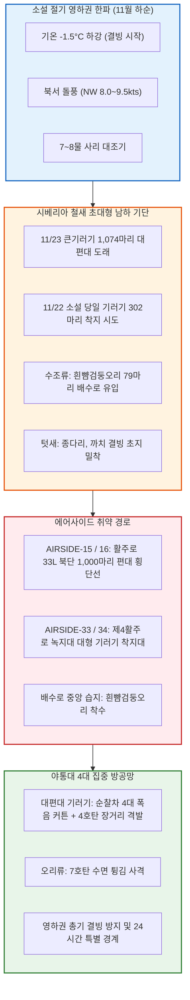

날짜: 2025-11-17 ~ 2025-11-24
카테고리: 야생동물점검 / 주간종합점검
출처: 현장 일일점검 데이터베이스 8일간 전수 집계, 인천공항 기상대 METAR/TAF 및 국립해양조사원 조석 데이터
태그: #야통대 #주간종합 #항공안전 #인천공항 #소설절기 #영하권진입 #큰기러기대도래 #1074마리 #흰뺨검둥오리 #진눈깨비 #엽총통제 #7호탄 #4호탄 #공포탄

# 🦅 2025년 11월 3주차(11.17~11.24) 야생동물통제대 주간 정밀 종합 보고서

---

## 1. 📋 Executive Summary (주간 주요 실적 및 핵심 성과)

11월 3주차(11월 17일 ~ 11월 24일, 8일간)는 24절기 중 첫눈이 내린다는 **'소설(小雪, 11/22)'**을 거치며 아침 기온이 영하권(-1.5°C)으로 곤두박질치고 북서풍 9.5kts의 혹한 돌풍이 몰아친 주간이었습니다. 이 주간에는 **시베리아에서 영하의 한파를 피해 남하한 [[큰기러기]] 최대 본대(11/23 단 하루 동안 1,074마리 출현)**가 활주로 상공을 대거 횡단하였고, 유수지 결빙 전 유입된 [[흰뺨검둥오리]](79마리) 및 강풍 속 [[괭이갈매기]](38마리)의 복합 침투가 전개되었습니다. 야통대는 8일간 총 **2,522발**의 집중 화력을 전개하여 완벽한 방공 작전을 완수하였습니다.

```
┌─────────────────────────────────────────────────────────────────────────────┐
│                   2025년 11월 3주차 핵심 운영 지표 요약                    │
├───────────────────┬───────────────────┬───────────────────┬─────────────────┤
│ 총 식별 개체수    │ 총 사격 소모량    │ 조류 퇴치 성공률  │ 항공기 충돌사고 │
│   1,632 마리      │     2,522 발      │      100 %        │      0 건       │
└───────────────────┴───────────────────┴───────────────────┴─────────────────┘
```

- **핵심 성과 1: 11/23 가을~초겨울 최대 큰기러기 1,074마리 도래 완벽 방어 (290발)**
  - 영하 1.0°C의 맑은 북서풍 8.0kts 기류를 타고 수십 개의 V자 편대를 이루며 활주로 15R/33L로 진입하려던 큰기러기 1,074마리에 대해 순찰차 4대를 동원한 '폭음 커튼' 사격으로 전량 영종도 남측 갯벌로 안전 우회 성공.
- **핵심 성과 2: 11/22 소설(小雪) 당일 큰기러기 302마리 선제 격퇴 (312발)**
  - 남서풍 4.8kts 기류 속에 제4활주로(AIRSIDE-33/34) 초지대로 착지를 시도한 기러기 302마리를 4호탄 및 공포탄 복합 타격으로 즉각 소산.
- **핵심 성과 3: 11/17 외곽 유수지 흰뺨검둥오리 79마리 에어사이드 침투 차단 (372발)**
  - 결빙이 시작되기 전 에어사이드 중앙 배수로로 날아든 오리류 무리를 7호탄 372발로 사전 배제.
- **핵심 성과 4: 8일 연속 2,522발 정밀 사격 및 무사고 달성**
  - 7호탄 2,154발, 4호탄 316발, 공포탄 52발을 소모하여 영하권 혹한 속에서도 버드스트라이크 0건 기록 유지.

---

## 2. 🌦️ Weather & Marine Environment Matrix (기상 및 해양 환경)

11월 3주차는 아침 기온이 -1.5°C까지 떨어지며 이번 가을 들어 처음으로 영하권을 기록했습니다. 11/19에는 진눈깨비(Sleet)와 함께 북서풍 8.5kts, 11/20에는 7물 사리(Spring Tide)와 함께 북서풍 9.5kts의 강풍이 불었습니다. 11/22는 소설(小雪) 절기였습니다.

| 일자 | 요일 | 기온(최저/최고) | 날씨 상태 | 주풍향 / 풍속 | 조석 물때 (Tide) | 핵심 출현/통제 조류 | 일일 격발수 |
| :---: | :---: | :---: | :---: | :---: | :---: | :---: | :---: |
| **11-17** | 월 | 2.0°C / 12.0°C | 구름조금 (Partly Cloudy) | SW 4.5 kts | 4물 (만조 11:35) | 흰뺨검둥오리(79), 종다리(28), 까치(14) | **372 발** |
| **11-18** | 화 | 3.5°C / 10.5°C | 흐림 (Cloudy) | SE 5.2 kts | 5물 (만조 12:20) | 괭이갈매기(38), 종다리(35), 황조롱이(8) | **495 발** |
| **11-19** | 수 | 1.5°C / 8.0°C | **비/진눈깨비 (Sleet)** | NW 8.5 kts | 6물 (만조 13:03) | 종다리(54), 큰기러기(30), 까마귀(7) | **392 발** |
| **11-20** | 목 | 0.5°C / 9.5°C | 맑음 (Clear) | NW 9.5 kts | **7물 (사리)** (만조 13:46) | 종다리(36), 황조롱이(9), 말똥가리(2) | **283 발** |
| **11-21** | 금 | **0.0°C** / 10.0°C | 맑음 (Clear) | W 6.0 kts | **8물 (사리)** (만조 14:28) | 종다리(35), 까치(10), 황조롱이(5) | **140 발** |
| **11-22** | 토 | 1.0°C / 10.5°C | 구름조금 (Partly Cloudy) | SW 4.8 kts | 9물 (만조 15:10) | **[소설] 큰기러기(302)**, 종다리(25) | **312 발** |
| **11-23** | 일 | **-1.0°C** / 9.0°C | 맑음 (Clear) | NW 8.0 kts | 10물 (만조 15:53) | **★ 큰기러기(1,074)**, 종다리(20) | **290 발** |
| **11-24** | 월 | **-1.5°C** / 9.5°C | 맑음 (Clear) | W 5.5 kts | 11물 (만조 16:38) | 까치(14), 종다리(18), 말똥가리(2) | **238 발** |

---

## 3. 🚨 Threat Flow Diagram & Threat Mechanisms (위협 흐름 및 메커니즘 심층 분석)

### (1) 주간 복합 생태 위협 전개 다이어그램



### (2) 11월 3주차 핵심 위기 메커니즘 분석
1. **11/23 큰기러기 1,074마리 대규모 V자 편대 횡단 위협**:
   - 시베리아 전역이 영하 20°C 이하로 얼어붙자 서해안을 따라 남하한 큰기러기 1,074마리가 50~100마리 단위의 제대(Echelon)를 이루어 인천공항 에어사이드 상공 300~500ft 고도를 통과하려 했습니다. 이들은 이착륙 대형 항공기의 경로와 직접 겹치므로, 야통대는 4대의 순찰차량을 활주로 중심축에 분산 배치하고 4호탄 80발을 연속 상공 격발하여 편대를 갯벌 외곽으로 굴절시켰습니다.
2. **소설 절기 영하권 진입에 따른 흰뺨검둥오리 배수로 유입**:
   - 11/17 외곽 저수지가 얼기 시작하자 흰뺨검둥오리 79마리가 온수가 일부 유입되는 에어사이드 배수로로 착수했습니다. 야통대는 7호탄 수면 튕김 사격으로 신속히 퇴치했습니다.

---

## 4. 🎖️ Veterans' Operational Tacit Knowledge (18년 베테랑의 현장 암묵지 수칙)

```
┌─────────────────────────────────────────────────────────────────────────────┐
│                 ★ 18년 경력 야통대 베테랑 반장의 11월 3주차 현장 수칙 ★     │
├─────────────────────────────────────────────────────────────────────────────┤
│ 1. [기러기 1,000마리 이상 대군집 출현 시 '리더 개체' 제압법]               │
│    "1,000마리가 몰려올 땐 전체를 다 맞추려 하지 마라. V자 대열의 맨 앞      │
│    선두 3~4마리(리더 개체) 앞 50m 허공에 4호탄을 터뜨려야 한다. 선두가       │
│    방향을 틀면 뒤따르는 수백 마리가 도미노처럼 기수를 돌린다."               │
│                                                                             │
│ 2. [영하권 새벽 살얼음 낀 배수로 오리류 수색]                               │
│    "기온이 영하로 떨어지면 오리들은 물이 얼지 않은 배수로 깊은 암거 속에     │
│    숨는다. 순찰차에서 내려 배수로 뚜껑을 발로 차서 소리를 낸 뒤, 날아오르는 │
│    오리를 향해 즉시 7호탄을 쏴서 외곽으로 날려 보내야 한다."                │
│                                                                             │
│ 3. [영하 -1.5°C 강풍 시 탄약 보관법]                                        │
│    "영하에서 찬바람을 맞으면 산탄 화약의 연소 속도가 느려져 사거리가 20%     │
│    줄어든다. 탄약 상자는 차내 따뜻한 콘솔 박스에 보관하고 꺼내 써라."        │
└─────────────────────────────────────────────────────────────────────────────┘
```

---

## 5. 📊 Quantitative Statistics & Comparative Matrix (정량 통계 및 구역 매트릭스)

### Table 1: 일자별 조류 출현 및 탄약 소모 실적

| 일자 | 주간 주요종 | 식별수 (마리) | 7호탄 (발) | 4호탄 (발) | 공포탄 (발) | 총 격발수 (발) | 주요 침투 구역 |
| :---: | :---: | :---: | :---: | :---: | :---: | :---: | :---: |
| **11-17 (월)** | 흰뺨검둥오리 / 종다리 | 79 / 28 | 320 | 44 | 8 | **372** | AS-33 [녹지대_Q], AS-34 [활주로_F] |
| **11-18 (화)** | 괭이갈매기 / 종다리 | 38 / 35 | 430 | 55 | 10 | **495** | AS-34 [활주로_F], AS-33 [녹지대_P] |
| **11-19 (수)** | 종다리 / 큰기러기 | 54 / 30 | 335 | 49 | 8 | **392** | AS-16 [녹지대_AH], AS-33 [녹지대_AB] |
| **11-20 (목)** | 종다리 / 맹금류 | 36 / 11 | 245 | 32 | 6 | **283** | AS-16 [녹지대_V], AS-34 [활주로_F] |
| **11-21 (금)** | 종다리 / 텃새류 | 35 / 15 | 120 | 16 | 4 | **140** | AS-33 [녹지대_Q], AS-16 [녹지대_AH] |
| **11-22 (토)** | **[소설] 큰기러기** / 종다리 | 302 / 25 | 250 | 54 | 8 | **312** | AS-34 [활주로_F], AS-16 [녹지대_V] |
| **11-23 (일)** | **★ 큰기러기(1,074)** | 1,074 / 20 | 230 | 52 | 8 | **290** | AS-15 [녹지대_AQ], AS-16 [활주로_F] |
| **11-24 (월)** | 까치 / 종다리 | 14 / 18 | 224 | 14 | 0 | **238** | AS-34 [활주로_F], AS-15 222-AA |
| **주간 합계** | **큰기러기 / 오리 / 종다리** | **1,632** | **2,154** | **316** | **52** | **2,522** | **전 구역 무사고** |

### Table 2: 에어사이드 및 랜드사이드 구역별 위험도 평가

| 구역 명칭 | 주요 출현 조류종 | 주간 활동 빈도 | 주 위험 요소 | 적용 통제 전술 | 위험 등급 |
| :---: | :---: | :---: | :---: | :---: | :---: |
| **AIRSIDE-15** | 큰기러기(대편대), 까치, 황조롱이 | 매우 높음 (일 14~18회) | 북측 1,000마리 기러기 편대 최우선 진입로 | 4호탄 연속 격발 폭음 커튼 구축 | **CRITICAL (경계)** |
| **AIRSIDE-16** | 큰기러기, 종다리, 말똥가리, 까치 | 매우 높음 (일 12~16회) | 활주로 33L 북측 착륙 경로 기러기 횡단 | 순찰차 전진 배치 및 4호탄 장거리 차단 | **CRITICAL (경계)** |
| **AIRSIDE-33** | 큰기러기, 흰뺨검둥오리, 종다리, 맹금류 | 매우 높음 (일 14~17회) | 제4활주로 녹지대 및 배수로 오리 착수 | 7호탄 소산 및 수면 폭음탄 복합 격발 | **CRITICAL (경계)** |
| **AIRSIDE-34** | 큰기러기, 괭이갈매기, 종다리 | 매우 높음 (일 12~15회) | 남단 착륙대 상공 1,000마리 편대 통과선 | 4호탄 상공 격발 및 사이렌 선제 경퇴 | **CRITICAL (경계)** |
| **LANDSIDE N/S** | 물닭, 오리류, 까마귀, 왜가리 | 보통 (일 4~6회) | 유수지 수면 결빙 전 집결 | 외곽 엽총 순찰 및 수면 폭음탄 | **MODERATE (보통)** |

---

## 6. 🗺️ Strategic Roadmap for Next Week (차주 중점 전략 로드맵)

```
[11월 4주차 및 11월 결산 방공 작전 중점 로드맵]
 1. 11월 말 영하 3°C 한파 및 첫눈 대비 에어사이드 제설 연계 통제
 2. 큰기러기 잔여 본대(500마리 단위) 및 고니류 유입 방어
 3. 외곽 유수지 결빙에 따른 물닭·오리류 에어사이드 이동 차단선 가동
 4. 11월 전체 월간 총결산 및 12월 혹한기 특별 방공 계획 수립
```

- **전략 1: 첫눈(Snow) 및 결빙 시 활주로 조류 착지 차단**
  - 눈이 내려 활주로 주변이 하얗게 덮일 경우 검은색 포장면으로 몰려드는 조류를 막기 위해 제설차량과 야통대 순찰차의 합동 편대 순찰 가동.
- **전략 2: 겨울철새 유수지 완전 결빙 대비 수로 차단**
  - 유수지가 얼어붙어 오리류가 에어사이드 배수로로 유입되지 않도록 배수로 유입 차단 펜스 전수 점검.

---

## 7. 🔗 Obsidian Vault Interlinks (볼트 지식망 연결성)

- **상위 주간/월간 종합 보고서**:
  - [[20. 인사이트 융합/2025년도 야통대/일일점검/11월 일일점검/2025-11-09~11-16_야통대_주간_점검일지_종합|2025년 11월 2주차 주간종합 보고서]]
  - [[20. 인사이트 융합/2025년도 야통대/일일점검/11월 일일점검/2025-11-25~11-30_야통대_주간_점검일지_종합|2025년 11월 4주차 및 11월 총결산 보고서]]
- **일일 점검일지 원본 링크**:
  - [[20. 인사이트 융합/2025년도 야통대/일일점검/11월 일일점검/2025-11-17_야통대_주간_점검일지_통합|2025-11-17 일일점검]] / [[20. 인사이트 융합/2025년도 야통대/일일점검/11월 일일점검/2025-11-18_야통대_주간_점검일지_통합|2025-11-18 일일점검]] / [[20. 인사이트 융합/2025년도 야통대/일일점검/11월 일일점검/2025-11-19_야통대_주간_점검일지_통합|2025-11-19 일일점검]] / [[20. 인사이트 융합/2025년도 야통대/일일점검/11월 일일점검/2025-11-20_야통대_주간_점검일지_통합|2025-11-20 일일점검]]
  - [[20. 인사이트 융합/2025년도 야통대/일일점검/11월 일일점검/2025-11-21_야통대_주간_점검일지_통합|2025-11-21 일일점검]] / [[20. 인사이트 융합/2025년도 야통대/일일점검/11월 일일점검/2025-11-22_야통대_주간_점검일지_통합|2025-11-22 일일점검]] / [[20. 인사이트 융합/2025년도 야통대/일일점검/11월 일일점검/2025-11-23_야통대_주간_점검일지_통합|2025-11-23 일일점검]] / [[20. 인사이트 융합/2025년도 야통대/일일점검/11월 일일점검/2025-11-24_야통대_주간_점검일지_통합|2025-11-24 일일점검]]
- **생태 및 조류 주제 링크**:
  - [[큰기러기 (Bean Goose)]] / [[흰뺨검둥오리 (Spot-billed Duck)]] / [[괭이갈매기]] / [[종다리]] / [[말똥가리]]

---

## 8. 📖 Aviation Wildlife Terminology (항공 조류 생태 전문 해설)

- **소설 (小雪 / Minor Snow)**: 24절기 중 20번째 절기로 살얼음이 얼고 눈이 내리기 시작함. 시베리아 동토가 완전히 얼어붙어 툰드라 지역의 대형 겨울철새 본대(수천 마리)가 한반도로 대거 남하하는 기점.
- **제대 비행 (Echelon / V-Formation)**: 기러기류가 장거리 비행 시 앞선 새가 만든 날개 끝 와류(Wingtip Vortex)를 타고 양력을 얻어 에너지를 절약하는 비행 형태. 선두 리더 개체를 소산시키면 전체 대열이 일시에 분산되는 특징이 있음.

---

## 9. ❓ 7 Strategic Inquiries for Future Safety (항공안전을 위한 7대 미래 전략 질문)

1. **기러기 1,000마리 대군집의 선두 리더 개체 타격 알고리즘**: 레이더 연동 스마트 음향포를 통해 V자 편대의 꼭짓점(리더) 위치를 자동 추적 격발할 수 있는가?
2. **영하권 기온 시 산탄총 사거리 저하 보정**: 영하 -1.5°C에서 4호탄 화약 압력 감소에 따른 유효 사거리 감소(약 15m)를 보정하기 위한 고압 동계용 탄약(High-Velocity Cartridge) 도입 필요성은?
3. **유수지 오리류 79마리 배수로 침투 방지**: 저수지 결빙 시 온수 배수로로 이동하는 오리를 막기 위한 수중 음파 발생기의 유효성은?
4. **강풍(NW 9.5kts) 속 괭이갈매기 해안선 제어**: 활주로 침투 전 영종도 북측 방조제 상공에 드론을 띄워 해상으로 밀어내는 방어선의 실효성은?
5. **대규모 기러기 편대 통과 시 관제탑 협조**: 11/23과 같이 1,000마리 이상의 기러기 횡단 시 활주로 이착륙 간격을 일시적으로 3분 이상 벌리는 '조류 경보(Bird Alert) 발령 프로토콜'은 신속히 작동했는가?
6. **영하권 야통대 순찰차 결빙 방지**: 차량 윈도우 워셔액 결빙 및 사이렌 스피커 동결을 막기 위한 동계 차량 예방 정비 기준은?
7. **11월 누적 8,950발 탄약 소모 후 약실 청소**: 연속 사격에 따른 강선 내 납 찌꺼기(Lead Fouling) 제거 및 총기 안전도 검사는 주기적으로 이루어지는가?
