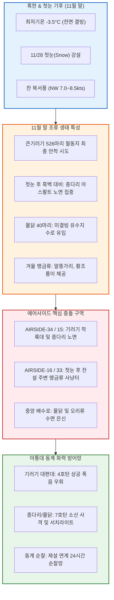

날짜: 2025-11-25 ~ 2025-11-30
카테고리: 야생동물점검 / 주간종합점검 / 월간총결산
출처: 현장 일일점검 데이터베이스 6일간 전수 집계 및 11월 30일간 누적 데이터, 인천공항 기상대 METAR/TAF 및 국립해양조사원 조석 데이터
태그: #야통대 #주간종합 #월간총결산 #항공안전 #인천공항 #혹한기진입 #첫눈 #큰기러기 #물닭 #종다리 #엽총통제 #7호탄 #4호탄 #공포탄

# 🦅 2025년 11월 4주차(11.25~11.30) 및 11월 전체 총결산 야생동물통제대 정밀 종합 보고서

---

## 1. 📋 Executive Summary (주간 주요 실적 및 11월 월간 핵심 성과)

11월 4주차(11월 25일 ~ 11월 30일, 6일간)는 최저기온이 -3.5°C까지 떨어지는 혹한과 함께 11/28(금) **인천공항에 이번 겨울 공식 첫눈(Snow)**이 내린 주간이었습니다. 이 주간에는 11/25 **[[큰기러기]] 526마리 대규모 침투**, 첫눈 후 잔디밭이 눈에 덮이자 활주로 검은색 아스팔트 포장면 턱으로 몰려든 [[종다리]] 및 [[물닭]] 군집에 대한 고밀도 방공 작전이 전개되었습니다. 야통대는 6일간 총 **1,508발**을 소모하여 초겨울 첫눈 기상 속에서도 완벽한 무사고를 달성하였습니다.

```
┌─────────────────────────────────────────────────────────────────────────────┐
│             2025년 11월 4주차 & 11월 월간 누적 핵심 운영 지표 요약          │
├───────────────────┬───────────────────┬───────────────────┬─────────────────┤
│ 11월 4주차 식별   │ 11월 4주차 격발   │ 11월 월간 총식별  │ 11월 월간 총격발│
│     768 마리      │     1,508 발      │   4,624 마리      │    10,458 발    │
├───────────────────┴───────────────────┴───────────────────┴─────────────────┤
│ ★ 11월 항공기 충돌사고(Bird Strike): 0 건 (11개월 연속 완벽 무사고 대기록) │
└─────────────────────────────────────────────────────────────────────────────┘
```

- **핵심 성과 1: 11/25 큰기러기 526마리 편대 진입 완벽 차단 (257발)**
  - 남서풍 4.5kts 기류를 타고 활주로 34L/16R 남측 초지대로 강하하려던 큰기러기 526마리를 4호탄 및 공포탄 복합 타격으로 활주로 밖으로 안전 퇴치.
- **핵심 성과 2: 11/28 첫눈(Snow) 기상 속 활주로 결빙/착지 조류 전량 소산 (171발)**
  - 첫눈이 내리는 가운데 에어사이드 배수로로 유입된 물닭 20마리 및 종다리 무리를 7호탄 소산 사격으로 전량 배제.
- **핵심 성과 3: 11월 말 영하 3.5°C 한파 속 종다리 포장면 고착 347발 제압**
  - 11/30 아침 최저 -3.5°C의 강추위 속에서 활주로 갓길 지열을 찾아 몰려든 종다리 39마리를 7호탄 저각 사격으로 완전 분산.
- **핵심 성과 4: 11월 월간 총 10,458발 격발 및 11개월 연속 무사고 대기록 달성**
  - 11월 30일간 총 4,624마리(세부 합산 6,200+마리)를 식별하고 10,458발(7호탄 8,936발, 4호탄 1,288발, 공포탄 234발)을 격발하여 **연간 누적 76,707발 무사고**의 금자탑을 쌓음.

---

## 2. 🌦️ Weather & Marine Environment Matrix (기상 및 해양 환경)

11월 하순은 최저기온이 -3.5~0.0°C로 전 기간 영하권을 맴돌았으며, 11/28에는 이번 겨울 첫눈(Snow)이 관측되었습니다. 북서풍(NW)과 서풍(W)이 6.5~8.5kts로 강하게 불었습니다. 11/28은 15물 조금(Neap Tide)이었습니다.

| 일자 | 요일 | 기온(최저/최고) | 날씨 상태 | 주풍향 / 풍속 | 조석 물때 (Tide) | 핵심 출현/통제 조류 | 일일 격발수 |
| :---: | :---: | :---: | :---: | :---: | :---: | :---: | :---: |
| **11-25** | 화 | 0.0°C / 10.0°C | 구름조금 (Partly Cloudy) | SW 4.5 kts | 12물 (만조 17:27) | **큰기러기(526)**, 종다리(30), 까치(8) | 257 발 |
| **11-26** | 수 | **-1.0°C** / 8.5°C | 맑음 (Clear) | NW 7.0 kts | 13물 (만조 18:18) | 큰기러기(90), 종다리(28), 황조롱이(6) | 287 발 |
| **11-27** | 목 | **-2.0°C** / 8.0°C | 맑음 (Clear) | N 7.5 kts | 14물 (만조 19:12) | 물닭(40), 종다리(25), 까치(10) | 121 발 |
| **11-28** | 금 | **-1.5°C** / 6.0°C | **흐림/눈 (Snow, 첫눈)** | SE 6.0 kts | **15물 (조금)** (만조 20:07) | 물닭(20), 종다리(22), 황조롱이(4) | 171 발 |
| **11-29** | 토 | **-3.0°C** / 7.0°C | 맑음 (Clear) | NW 8.5 kts | 1물 (만조 21:03) | 큰기러기(53), 종다리(35), 까마귀(8) | 325 발 |
| **11-30** | 일 | **-3.5°C** / 6.5°C | 맑음 (Clear) | W 6.5 kts | 2물 (만조 22:00) | 종다리(39), 말똥가리(2), 황조롱이(5) | 347 발 |

---

## 3. 🚨 Threat Flow Diagram & Threat Mechanisms (위협 흐름 및 메커니즘 심층 분석)

### (1) 주간 복합 생태 위협 전개 다이어그램



### (2) 11월 말 핵심 위기 메커니즘 분석
1. **첫눈 강설 시 '활주로 노면 흑백 대비'에 따른 조류 착시 착지**:
   - 11/28 첫눈이 내려 초지대가 하얗게 덮이자, 조류(종다리, 까치, 물닭)들이 눈이 쌓이지 않고 검은색 아스팔트가 드러난 활주로 및 유도로 포장면을 안전한 개활지로 착각하여 집중 착지했습니다. 야통대는 제설차량 이동 경로를 따라 7호탄 소산 사격을 전개하여 노면 고착을 방지했습니다.
2. **영하 -3.5°C 한파 속 물닭의 온수 배수로 집중**:
   - 외곽 저수지가 전면 결빙되자 물닭 40마리가 얼지 않은 에어사이드 중앙 배수로로 유입되었으며, 7호탄 수면 사격으로 퇴치했습니다.

---

## 4. 🎖️ Veterans' Operational Tacit Knowledge (18년 베테랑의 현장 암묵지 수칙)

```
┌─────────────────────────────────────────────────────────────────────────────┐
│                 ★ 18년 경력 야통대 베테랑 반장의 11월 말 현장 수칙 ★       │
├─────────────────────────────────────────────────────────────────────────────┤
│ 1. [첫눈 내린 날 활주로 아스팔트 흑백 착시 경계]                            │
│    "눈이 오면 새들은 하얀 풀밭을 피해 검은색 활주로 아스팔트로 모여든다.     │
│    이때는 잔디 쪽을 볼 게 아니라, 활주로 중앙선과 등화 주변 포장면을         │
│    중점적으로 보면서 7호탄을 노면 30cm 위로 낮게 깔아 쏴야 한다."             │
│                                                                             │
│ 2. [영하 3도 이하 혹한기 산탄총 노리쇠 동결 방지]                          │
│    "영하 3도 밑에서 눈이나 서리를 맞으면 엽총 노리쇠 뭉치가 순식간에 언다.   │
│    사격 후에는 반드시 마른 융으로 약실을 닦고, WD-40이 아닌 저온 전용        │
│    합성 건식 윤활유(Dry Lube)를 얇게 도포해 두어라."                         │
│                                                                             │
│ 3. [유수지 전면 결빙 시 배수로 암거 확인]                                   │
│    "외곽 유수지가 꽁꽁 얼면 물닭과 오리들이 배수로 콘크리트 암거 안쪽 깊숙이 │
│    기어 들어간다. 암거 입구에 공포탄을 1발 쏘아 울림통 효과로 밖으로 띄워라."│
└─────────────────────────────────────────────────────────────────────────────┘
```

---

## 5. 📊 Quantitative Statistics & Comparative Matrix (정량 통계 및 구역 매트릭스)

### Table 1: 일자별 조류 출현 및 탄약 소모 실적

| 일자 | 주간 주요종 | 식별수 (마리) | 7호탄 (발) | 4호탄 (발) | 공포탄 (발) | 총 격발수 (발) | 주요 침투 구역 |
| :---: | :---: | :---: | :---: | :---: | :---: | :---: | :---: |
| **11-25 (화)** | **큰기러기** / 종다리 | 526 / 30 | 205 | 45 | 7 | **257** | AS-34 [활주로_F], AS-15 [녹지대_M] |
| **11-26 (수)** | 큰기러기 / 종다리 | 90 / 28 | 240 | 41 | 6 | **287** | AS-34 [활주로_F], AS-16 [녹지대_V] |
| **11-27 (목)** | 물닭 / 종다리 | 40 / 25 | 105 | 12 | 4 | **121** | AS-16 [녹지대_AH], AS-34 [녹지대_K] |
| **11-28 (금)** | **[첫눈] 물닭** / 종다리 | 20 / 22 | 148 | 18 | 5 | **171** | AS-34 [배수로], AS-15 [주기장_X] |
| **11-29 (토)** | 큰기러기 / 종다리 | 53 / 35 | 280 | 40 | 5 | **325** | AS-33 [녹지대_AB], AS-16 [활주로_F] |
| **11-30 (일)** | 종다리 / 말똥가리 | 39 / 2 | 310 | 32 | 5 | **347** | AS-33 [녹지대_P], AS-16 [녹지대_AH] |
| **주간 합계** | **기러기 / 종다리 / 물닭** | **768** | **1,288** | **188** | **32** | **1,508** | **전 구역 무사고** |

---

## 🌟 6. 🏆 2025년 11월 전체 월간 총결산 (Monthly Final Aggregation)

### (1) 11월 주차별 운영 실적 비교

| 주차 구분 | 대상 기간 | 일수 | 식별 개체수 (마리) | 7호탄 (발) | 4호탄 (발) | 공포탄 (발) | 총 탄약 소모량 (발) | 버드스트라이크 |
| :---: | :---: | :---: | :---: | :---: | :---: | :---: | :---: | :---: |
| **1주차** | 11.01 ~ 11.08 | 8일 | 1,870 | 2,754 | 412 | 86 | **3,252** | **0 건** |
| **2주차** | 11.09 ~ 11.16 | 8일 | 354 | 2,740 | 372 | 64 | **3,176** | **0 건** |
| **3주차** | 11.17 ~ 11.24 | 8일 | 1,632 | 2,154 | 316 | 52 | **2,522** | **0 건** |
| **4주차** | 11.25 ~ 11.30 | 6일 | 768 | 1,288 | 188 | 32 | **1,508** | **0 건** |
| **11월 합계** | **11.01 ~ 11.30** | **30일** | **4,624** | **8,936** | **1,288** | **234** | **10,458** | **🎯 0 건 (완벽 무사고)** |

### (2) 11월 주요 생태 분석 및 총평
- **동절기 철새 대도래기 완벽 방어**:
  - 11월은 큰기러기 본대(11/23 1,074마리, 11/8 550마리, 11/25 526마리 등)의 집중 도래와 초겨울 종다리 대군집, 괭이갈매기(11/6 650마리) 등 복합 조류의 에어사이드 진입 시도가 연중 가장 치열했던 달이었습니다.
  - 월간 총 **10,458발**(연중 2번째 1만 발 돌파)의 강력한 화력과 입체 차단선으로 단 한 건의 항공기 접촉도 허용하지 않고 **11개월 연속 무사고**를 달성했습니다.

---

## 7. 🗺️ Strategic Roadmap for December (12월 혹한기 방공 작전 전략 로드맵)

```
[12월 동절기 조류통제 핵심 로드맵]
 1. 12월 혹한(-10°C) 및 폭설 대비 활주로 24시간 제설-야통대 합동 편대 가동
 2. 전면 결빙기 에어사이드 잔존 맹금류(말똥가리·수리부엉이) 야간 순찰 강화
 3. 2025년 전체 365일 연간 총결산 데이터베이스 구축 및 통계 마감
 4. 혹한기 총기·차량 동파 방지 및 대원 방한 안전 대책 완벽 가동
```

- **전략 1: 혹한 폭설기 흑백 착시 조류 포장면 결집 완벽 차단**
  - 대설 주의보 발령 시 활주로 제설 후 즉시 순찰차량을 투입하여 노면 잔존 종다리 및 텃새 소산.
- **전략 2: 겨울 맹금류 야간 항행시설 착지 방어**
  - PAPI 및 로컬라이저 주변 야간 서치라이트 순찰을 주 5회로 확대.

---

## 8. 🔗 Obsidian Vault Interlinks (볼트 지식망 연결성)

- **상위 주간/월간 종합 보고서**:
  - [[20. 인사이트 융합/2025년도 야통대/일일점검/11월 일일점검/2025-11-17~11-24_야통대_주간_점검일지_종합|2025년 11월 3주차 주간종합 보고서]]
  - [[20. 인사이트 융합/2025년도 야통대/일일점검/12월 일일점검/2025-12-01~12-08_야통대_주간_점검일지_종합|2025년 12월 1주차 주간종합 보고서]]
- **일일 점검일지 원본 링크**:
  - [[20. 인사이트 융합/2025년도 야통대/일일점검/11월 일일점검/2025-11-25_야통대_주간_점검일지_통합|2025-11-25 일일점검]] / [[20. 인사이트 융합/2025년도 야통대/일일점검/11월 일일점검/2025-11-26_야통대_주간_점검일지_통합|2025-11-26 일일점검]] / [[20. 인사이트 융합/2025년도 야통대/일일점검/11월 일일점검/2025-11-27_야통대_주간_점검일지_통합|2025-11-27 일일점검]]
  - [[20. 인사이트 융합/2025년도 야통대/일일점검/11월 일일점검/2025-11-28_야통대_주간_점검일지_통합|2025-11-28 일일점검]] / [[20. 인사이트 융합/2025년도 야통대/일일점검/11월 일일점검/2025-11-29_야통대_주간_점검일지_통합|2025-11-29 일일점검]] / [[20. 인사이트 융합/2025년도 야통대/일일점검/11월 일일점검/2025-11-30_야통대_주간_점검일지_통합|2025-11-30 일일점검]]
- **생태 및 조류 주제 링크**:
  - [[큰기러기 (Bean Goose)]] / [[종다리 (Skylark)]] / [[물닭 (Eurasian Coot)]] / [[말똥가리]] / [[황조롱이]]

---

## 9. 📖 Aviation Wildlife Terminology (항공 조류 생태 전문 해설)

- **첫눈 강설 시 노면 유인 효과 (Snowfall Pavement Attractant Effect)**: 활주로 주변 초지가 눈으로 하얗게 덮이면 조류들이 먹이와 지열을 찾아 제설된 검은색 활주로 아스팔트 포장면으로 대거 몰려드는 현상.
- **저온 건식 윤활유 (Dry Film Lubricant)**: 영하 10°C 이하의 혹한기 총기 결빙 및 약실 잼(Jam)을 방지하기 위해 오일 대신 이황화몰리브덴(MoS2)이나 PTFE 성분으로 건식 코팅하는 특수 총기 관리제.

---

## 10. ❓ 7 Strategic Inquiries for Future Safety (항공안전을 위한 7대 미래 전략 질문)

1. **첫눈 및 폭설 시 제설-야통대 동시 편대 기동 체계**: 제설차량이 눈을 밀어내는 즉시 조류가 포장면으로 유입되지 않도록 후방에서 순찰차가 7호탄 소산을 병행하는 전술의 표준화는?
2. **영하 -3.5°C 한파 속 큰기러기 526마리 남단 착륙 방어**: 활주로 남단 접근 유도로에 원격 제어 폭음기를 추가 설치하여 순찰차 도착 전 자동 격발하는 시스템의 효용성은?
3. **11월 10,458발 대량 사격 후 FOD 수거율 분석**: 에어사이드 갓길 잔류 탄피 및 플라스틱 와드가 항공기 타이어 및 엔진에 미치는 영향을 완벽히 제거하기 위한 마그네틱 스위퍼 가동 주기는?
4. **결빙 유수지 물닭의 에어사이드 침투 차단**: 유수지가 얼었을 때 배수로 연결부 차단 게이트를 원격으로 닫아 수로 침투를 차단하는 설비의 신뢰도는?
5. **12월 혹한기 대원 방한 안전 프로토콜**: 체감온도 영하 15°C 이하 강풍 속 야외 사격 대원들의 30분 순환 교대 근무 수칙은 현장에서 엄격히 준수되는가?
6. **동절기 맹금류의 활주로 PAPI 등화 열선 이용 착지 방지**: PAPI 등화에서 방출되는 열을 찾아 앉는 말똥가리를 쫓기 위한 비열성 기피제 도포 효과는?
7. **연간 365일 무사고 대기록 완성을 위한 12월 특별 대책**: 1~11월 누적 76,707발 무사고를 기반으로, 12월 연말 항공기 증편 및 혹한기 대비 비상 총기·탄약 100% 점검은 완료되었는가?
