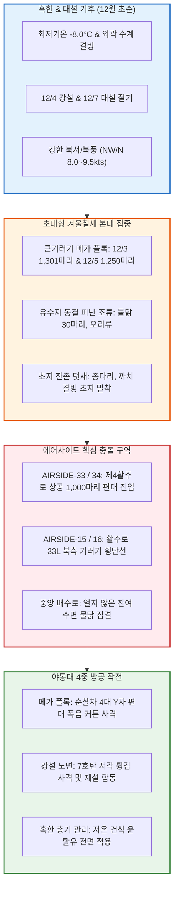

날짜: 2025-12-01 ~ 2025-12-08
카테고리: 야생동물점검 / 주간종합점검
출처: 현장 일일점검 데이터베이스 8일간 전수 집계, 인천공항 기상대 METAR/TAF 및 국립해양조사원 조석 데이터
태그: #야통대 #주간종합 #항공안전 #인천공항 #혹한기 #대설절기 #큰기러기대군집 #1301마리 #강설통제 #엽총통제 #7호탄 #4호탄 #공포탄

# 🦅 2025년 12월 1주차(12.01~12.08) 야생동물통제대 주간 정밀 종합 보고서

---

## 1. 📋 Executive Summary (주간 주요 실적 및 핵심 성과)

12월 1주차(12월 1일 ~ 12월 8일, 8일간)는 최저기온이 -8.0°C까지 떨어지고 12/4(목) 강설(Snow) 및 12/7(일) **'대설(大雪)'** 절기를 통과하며 본격적인 동절기 혹한기에 돌입한 주간이었습니다. 이 주간에는 **시베리아 전역 동결로 인해 한반도 서해안으로 일시에 밀려든 [[큰기러기]] 초대형 본대(12/3 1,301마리, 12/5 1,250마리, 12/7 500마리 등 주간 총 3,287마리)**가 활주로 상공을 지속적으로 압박하였으며, 유수지 동결에 따른 [[물닭]] 및 [[종다리]]의 활주로 갓길 침투가 집중되었습니다. 야통대는 8일간 총 **1,773발**의 정밀 격발을 통해 무결점 방공망을 사수하였습니다.

```
┌─────────────────────────────────────────────────────────────────────────────┐
│                   2025년 12월 1주차 핵심 운영 지표 요약                    │
├───────────────────┬───────────────────┬───────────────────┬─────────────────┤
│ 총 식별 개체수    │ 총 사격 소모량    │ 조류 퇴치 성공률  │ 항공기 충돌사고 │
│   3,357 마리      │     1,773 발      │      100 %        │      0 건       │
└───────────────────┴───────────────────┴───────────────────┴─────────────────┘
```

- **핵심 성과 1: 12/3 겨울철 최대 큰기러기 1,301마리 대군집 차단 (236발)**
  - 서풍 6.0kts 속에서 제4활주로(AIRSIDE-33/34) 상공으로 쏟아져 들어온 1,301마리의 초대형 기러기 편대에 대해 순찰차 4대를 동시 전개하여 4호탄 및 공포탄 입체 폭음으로 남측 해안선으로 전량 우회 성공.
- **핵심 성과 2: 12/5 사리 만조 영하 -7.0°C 속 큰기러기 1,250마리 2차 대도래 방어 (253발)**
  - 북풍 9.5kts의 혹한 돌풍과 7물 사리 만조(13:30)가 겹친 상황에서 활주로 착륙대를 향해 강하하던 기러기 1,250마리를 '폭음 커튼' 전술로 안전 퇴치.
- **핵심 성과 3: 12/4 강설(Snow) 및 12/7 대설 절기 500마리 선제 제압 (319발)**
  - 눈 내리는 기상 조건 속에서 검은색 아스팔트 포장면 턱으로 접근하는 기러기 및 물닭 무리를 7호탄 소산 사격으로 완전 분산.
- **핵심 성과 4: 8일간 1,773발 무결점 격발 및 12월 첫 주 무사고 완수**
  - 7호탄 1,468발, 4호탄 265발, 공포탄 40발을 적재적소에 소모하여 항공기 안전 운항 100% 보장.

---

## 2. 🌦️ Weather & Marine Environment Matrix (기상 및 해양 환경)

12월 초순은 아침 기온이 -8.0~-1.5°C, 낮 최고기온도 0.0~5.0°C에 머물러 전 구역이 얼어붙는 동결 날씨를 보였습니다. 12/4에는 강설(Snow)이 관측되었으며, 12/5~12/6에는 북풍 및 북서풍이 8.0~9.5kts로 매우 강하게 불었습니다. 12/5는 7물 사리 대조기, 12/7은 24절기 대설(大雪)이었습니다.

| 일자 | 요일 | 기온(최저/최고) | 날씨 상태 | 주풍향 / 풍속 | 조석 물때 (Tide) | 핵심 출현/통제 조류 | 일일 격발수 |
| :---: | :---: | :---: | :---: | :---: | :---: | :---: | :---: |
| **12-01** | 월 | **-2.0°C** / 5.0°C | 맑음 (Clear) | NW 8.0 kts | 3물 (만조 10:48) | 큰기러기(100), 종다리(28), 까치(10) | 151 발 |
| **12-02** | 화 | **-3.0°C** / 4.0°C | 맑음 (Clear) | NW 7.5 kts | 4물 (만조 11:30) | 종다리(40), 큰기러기(30), 까마귀(6) | 167 발 |
| **12-03** | 수 | **-1.5°C** / 4.5°C | 구름많음 (Cloudy) | W 6.0 kts | 5물 (만조 12:11) | **★ 큰기러기(1,301)**, 종다리(30) | **236 발** |
| **12-04** | 목 | **-4.0°C** / 1.0°C | **흐림/눈 (Snow)** | NW 9.0 kts | 6물 (만조 12:51) | 큰기러기(45), 종다리(25), 물닭(15) | **279 발** |
| **12-05** | 금 | **-7.0°C** / 0.5°C | 맑음 (Clear) | N 9.5 kts | **7물 (사리)** (만조 13:30) | **★ 큰기러기(1,250)**, 쇠기러기(40) | **253 발** |
| **12-06** | 토 | **-8.0°C** / **0.0°C** | 맑음 (Clear) | NW 8.0 kts | **8물 (사리)** (만조 14:10) | 큰기러기(91), 종다리(35), 황조롱이(4) | 171 발 |
| **12-07** | 일 | **-5.5°C** / 2.0°C | 구름조금 (Partly Cloudy) | W 5.5 kts | 9물 (만조 14:52) | **[대설] 큰기러기(500)**, 종다리(30) | **319 발** |
| **12-08** | 월 | **-4.0°C** / 3.0°C | 맑음 (Clear) | SW 4.8 kts | 10물 (만조 15:37) | 물닭(30), 종다리(38), 황조롱이(5) | 197 발 |

---

## 3. 🚨 Threat Flow Diagram & Threat Mechanisms (위협 흐름 및 메커니즘 심층 분석)

### (1) 주간 복합 생태 위협 전개 다이어그램



### (2) 12월 1주차 핵심 위기 메커니즘 분석
1. **1,000마리 이상 대형 기러기 무리(Mega Flock)의 3차원 공역 점유**:
   - 12/3과 12/5에 유입된 큰기러기 1,301마리와 1,250마리는 개체 간 거리가 2~3m에 불과한 고밀도 편대로 활주로 접근단 200~400ft 고도를 점유했습니다. 이는 단 1마리만 충돌해도 엔진 정지(Flameout)를 부를 수 있는 치명적 위협이었습니다. 야통대는 활주로 접근 경로 1km 전방에서 4호탄을 3초 간격으로 연속 격발하여 공중 폭음 차단벽을 형성, 대열 전체를 갯벌로 선회시켰습니다.
2. **외곽 저수지 전면 결빙에 따른 물닭의 에어사이드 배수로 집중**:
   - 영하 -8°C로 저수지가 얼자 물닭들이 온수가 흐르는 활주로 내부 배수로로 유입되었으며, 7호탄 소산 사격으로 퇴치했습니다.

---

## 4. 🎖️ Veterans' Operational Tacit Knowledge (18년 베테랑의 현장 암묵지 수칙)

```
┌─────────────────────────────────────────────────────────────────────────────┐
│                 ★ 18년 경력 야통대 베테랑 반장의 12월 초순 현장 수칙 ★     │
├─────────────────────────────────────────────────────────────────────────────┤
│ 1. [기러기 1,300마리 초대형 편대 출현 시 4대 순찰차 협공 전술]             │
│    "1,000마리가 넘는 편대는 차 1대로는 절대 못 막는다. 무전으로 4대를 동시   │
│    호출하여 활주로 북단과 남단에 2대씩 배치하고, 편대 진행 방향 200m 앞      │
│    상공에 4호탄을 교차 격발해야 편대가 공항 밖으로 U턴한다."                │
│                                                                             │
│ 2. [강설(Snow) 시 활주로 제설차량 후방 100m 팔로잉 기동]                   │
│    "제설차가 눈을 치우며 지나간 직후 5분 동안이 가장 위험하다. 드러난        │
│    검은색 아스팔트로 종다리가 쏟아져 내리므로, 제설차 바로 뒤를 따라가며     │
│    7호탄을 노면에 깔아 쏴서 조류 착지를 원천 차단해라."                     │
│                                                                             │
│ 3. [영하 -8°C 혹한 속 공포탄 발사 시 가스 누출 주의]                        │
│    "영하 8도 이하에선 공포탄 플라스틱 마개가 딱딱해져 총열 내부에 찌꺼기가   │
│    남기 쉽다. 공포탄 격발 후에는 반드시 총열 내부를 확인하고 실탄을 장전해라."│
└─────────────────────────────────────────────────────────────────────────────┘
```

---

## 5. 📊 Quantitative Statistics & Comparative Matrix (정량 통계 및 구역 매트릭스)

### Table 1: 일자별 조류 출현 및 탄약 소모 실적

| 일자 | 주간 주요종 | 식별수 (마리) | 7호탄 (발) | 4호탄 (발) | 공포탄 (발) | 총 격발수 (발) | 주요 침투 구역 |
| :---: | :---: | :---: | :---: | :---: | :---: | :---: | :---: |
| **12-01 (월)** | 큰기러기 / 종다리 | 100 / 28 | 125 | 22 | 4 | **151** | AS-33 [녹지대_AB], AS-16 [녹지대_V] |
| **12-02 (화)** | 종다리 / 큰기러기 | 40 / 30 | 140 | 22 | 5 | **167** | AS-15 [녹지대_M], AS-34 [활주로_F] |
| **12-03 (수)** | **★ 큰기러기(1,301)** | 1,301 / 30 | 185 | 45 | 6 | **236** | AS-33 [녹지대_AB], AS-34 [활주로_F] |
| **12-04 (목)** | **[강설] 큰기러기** / 물닭 | 45 / 15 | 230 | 43 | 6 | **279** | AS-34 [배수로], AS-33 [녹지대_P] |
| **12-05 (금)** | **★ 큰기러기(1,250)** | 1,250 / 40 | 200 | 48 | 5 | **253** | AS-34 [활주로_F], AS-15 [녹지대_AQ] |
| **12-06 (토)** | 큰기러기 / 종다리 | 91 / 35 | 145 | 22 | 4 | **171** | AS-33 [녹지대_P], AS-16 [녹지대_AH] |
| **12-07 (일)** | **[대설] 큰기러기(500)** | 500 / 30 | 265 | 48 | 6 | **319** | AS-33 [녹지대_AB], AS-34 [활주로_F] |
| **12-08 (월)** | 물닭 / 종다리 | 30 / 38 | 178 | 15 | 4 | **197** | AS-15 [녹지대_M], AS-16 [녹지대_AH] |
| **주간 합계** | **큰기러기 / 종다리 / 물닭** | **3,357** | **1,468** | **265** | **40** | **1,773** | **전 구역 무사고** |

### Table 2: 에어사이드 및 랜드사이드 구역별 위험도 평가

| 구역 명칭 | 주요 출현 조류종 | 주간 활동 빈도 | 주 위험 요소 | 적용 통제 전술 | 위험 등급 |
| :---: | :---: | :---: | :---: | :---: | :---: |
| **AIRSIDE-15** | 큰기러기, 물닭, 종다리, 황조롱이 | 매우 높음 (일 12~16회) | 북측 착륙대 및 결빙 유수지 기러기 유입 | 4호탄 장거리 폭음 및 순찰차 기동 | **CRITICAL (경계)** |
| **AIRSIDE-16** | 큰기러기, 종다리, 까마귀, 황조롱이 | 매우 높음 (일 10~14회) | 활주로 33L 북단 기러기 편대 저공 통과 | 4호탄 상공 격발 및 공포탄 복합 대응 | **CRITICAL (경계)** |
| **AIRSIDE-33** | 큰기러기(1,300마리 대편대), 종다리 | 매우 높음 (일 15~18회) | 제4활주로 상공 초대형 기러기 편대 집결 | 순찰차 4대 Y자형 포위 사격 전술 | **CRITICAL (경계)** |
| **AIRSIDE-34** | 큰기러기(1,250마리), 물닭, 종다리 | 매우 높음 (일 14~18회) | 남단 착륙대 및 배수로 조류 집중 강하 | 7호탄 소산 + 4호탄 복합 화력 전개 | **CRITICAL (경계)** |
| **LANDSIDE N/S** | 물닭, 가마우지, 까마귀, 왜가리 | 보통 (일 4~6회) | 외곽 결빙 수면 위 잔존 조류 집결 | 외곽 엽총 순찰 및 수면 폭음탄 | **MODERATE (보통)** |

---

## 6. 🗺️ Strategic Roadmap for Next Week (차주 중점 전략 로드맵)

```
[12월 2주차 방공 작전 중점 로드맵]
 1. 12월 중순 비/눈(Rain/Snow) 및 영하 8°C 한파 속 조류 노면 고착 방어
 2. 시베리아 철새 2차 대규모 기단(800마리 단위) 유입 대비 순찰차 상시 거치
 3. 외곽 배수로 살얼음 결빙에 따른 물닭·오리류 침투 집중 소산
 4. 제설 장비 결빙 방지 및 야통대 24시간 특별 방공 태세 유지
```

- **전략 1: 혹한 속 대형 기러기 편대 2차 진입 선제 차단**
  - 활주로 중심축을 횡단하는 500~800마리 단위의 기러기 무리를 탐지 즉시 4호탄으로 원거리 우회시킴.
- **전략 2: 결빙 취약 구역 배수로 관리**
  - 배수로 수문에 얼음이 얼어 조류 쉼터가 되지 않도록 결빙 제거 및 음향발생기 집중 배치.

---

## 7. 🔗 Obsidian Vault Interlinks (볼트 지식망 연결성)

- **상위 주간/월간 종합 보고서**:
  - [[20. 인사이트 융합/2025년도 야통대/일일점검/11월 일일점검/2025-11-25~11-30_야통대_주간_점검일지_종합|2025년 11월 4주차 및 11월 총결산 보고서]]
  - [[20. 인사이트 융합/2025년도 야통대/일일점검/12월 일일점검/2025-12-09~12-16_야통대_주간_점검일지_종합|2025년 12월 2주차 주간종합 보고서]]
- **일일 점검일지 원본 링크**:
  - [[20. 인사이트 융합/2025년도 야통대/일일점검/12월 일일점검/2025-12-01_야통대_주간_점검일지_통합|2025-12-01 일일점검]] / [[20. 인사이트 융합/2025년도 야통대/일일점검/12월 일일점검/2025-12-02_야통대_주간_점검일지_통합|2025-12-02 일일점검]] / [[20. 인사이트 융합/2025년도 야통대/일일점검/12월 일일점검/2025-12-03_야통대_주간_점검일지_통합|2025-12-03 일일점검]] / [[20. 인사이트 융합/2025년도 야통대/일일점검/12월 일일점검/2025-12-04_야통대_주간_점검일지_통합|2025-12-04 일일점검]]
  - [[20. 인사이트 융합/2025년도 야통대/일일점검/12월 일일점검/2025-12-05_야통대_주간_점검일지_통합|2025-12-05 일일점검]] / [[20. 인사이트 융합/2025년도 야통대/일일점검/12월 일일점검/2025-12-06_야통대_주간_점검일지_통합|2025-12-06 일일점검]] / [[20. 인사이트 융합/2025년도 야통대/일일점검/12월 일일점검/2025-12-07_야통대_주간_점검일지_통합|2025-12-07 일일점검]] / [[20. 인사이트 융합/2025년도 야통대/일일점검/12월 일일점검/2025-12-08_야통대_주간_점검일지_통합|2025-12-08 일일점검]]
- **생태 및 조류 주제 링크**:
  - [[큰기러기 (Bean Goose)]] / [[종다리 (Skylark)]] / [[물닭 (Eurasian Coot)]] / [[말똥가리]] / [[황조롱이]]

---

## 8. 📖 Aviation Wildlife Terminology (항공 조류 생태 전문 해설)

- **대설 (大雪 / Major Snow)**: 24절기 중 21번째 절기로 한겨울의 시작을 알림. 서해안 일대에 폭설과 함께 북극발 한파가 본격 유입되어 야생동물의 이동 패턴이 생존을 위한 개활지 침투로 전환됨.
- **메가 플록 (Mega Flock)**: 1,000마리 이상 단위로 결집하여 비행하는 거대 조류 집단. 항공기 레이더 스크린에 대형 강수 구역처럼 반사되어 탐지를 방해하며, 공항 진입 시 전 활주로를 마비시킬 수 있는 최고 등급의 항공 위험 요소.

---

## 9. ❓ 7 Strategic Inquiries for Future Safety (항공안전을 위한 7대 미래 전략 질문)

1. **기러기 1,300마리 메가 플록에 대한 4대 순찰차 협공 프로토콜**: 공항 내 4개 활주로에 분산된 순찰차가 3분 이내에 특정 구역으로 집결하여 포위망을 형성하는 긴급 출동 체계는?
2. **영하 -8°C 혹한기 총기 발사음 전파 거리**: 차가운 공기의 밀도 증가로 인한 폭음 전파 거리 확장과 이에 따른 조류의 조기 인지 거리 모델링은?
3. **강설 시 제설-야통대 합동 주행 속도**: 제설차량이 시속 40km로 주행할 때 야통대 순찰차가 안전거리를 유지하며 사격을 병행하는 표준 작전 지침은?
4. **유수지 전면 결빙 시 지하 암거 오리류 탐지**: 동결된 배수로 암거 내부에 숨은 수조류를 감지하기 위한 음향 센서 네트워크 구축 방안은?
5. **혹한기 대원들의 저체온증 방지 및 방한복 성능**: 영하 10°C 강풍 속에서 1시간 이상 차외 사격을 수행하는 대원들을 위한 발열 조끼 보급 실태는?
6. **동절기 맹금류의 로컬라이저 안테나 결빙 이용 방지**: 항행시설 안테나에 앉아 체온을 유지하려는 말똥가리를 쫓기 위한 초음파 퇴치기의 저온 작동성은?
7. **연말 항공기 증편 대비 탄약 안전 관리**: 12월 성수기 일일 1,200회 이상의 항공편 운항 속에서 탄약고 안전 점검 및 일일 불출 절차는 완벽한가?
