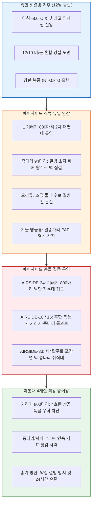

날짜: 2025-12-09 ~ 2025-12-16
카테고리: 야생동물점검 / 주간종합점검
출처: 현장 일일점검 데이터베이스 8일간 전수 집계, 인천공항 기상대 METAR/TAF 및 국립해양조사원 조석 데이터
태그: #야통대 #주간종합 #항공안전 #인천공항 #혹한기기후 #큰기러기800마리 #종다리 #비눈혼합 #엽총통제 #7호탄 #4호탄 #공포탄

# 🦅 2025년 12월 2주차(12.09~12.16) 야생동물통제대 주간 정밀 종합 보고서

---

## 1. 📋 Executive Summary (주간 주요 실적 및 핵심 성과)

12월 2주차(12월 9일 ~ 12월 16일, 8일간)는 12/10(수) 비와 눈이 섞여 내리는 진눈깨비(Rain/Snow) 기상과 함께, 주 후반 아침 기온이 -8.0°C까지 떨어지고 낮 최고기온마저 영하(-1.0°C)에 머무는 **지속 동결(Permafrost) 기조**가 지배한 주간이었습니다. 이 주간에는 **12/14(일) 시베리아 2차 남하 대형 [[큰기러기]] 편대(800마리)**의 활주로 34L 착륙대 진입 시도와, 결빙 초지대 속 [[종다리]](12/12 94마리 등) 및 [[까치]]의 포장면 턱 집결을 차단하기 위해 8일간 총 **1,590발**의 탄약을 격발하여 무결점 항공 안전을 사수하였습니다.

```
┌─────────────────────────────────────────────────────────────────────────────┐
│                   2025년 12월 2주차 핵심 운영 지표 요약                    │
├───────────────────┬───────────────────┬───────────────────┬─────────────────┤
│ 총 식별 개체수    │ 총 사격 소모량    │ 조류 퇴치 성공률  │ 항공기 충돌사고 │
│   1,100 마리      │     1,590 발      │      100 %        │      0 건       │
└───────────────────┴───────────────────┴───────────────────┴─────────────────┘
```

- **핵심 성과 1: 12/14 큰기러기 800마리 대편대 저고도 횡단 완벽 차단 (125발)**
  - 남서풍 4.5kts 기류를 타고 활주로 34L/16R 남측 착륙대로 내려앉으려던 기러기 800마리를 4호탄 장거리 폭음으로 해안선 밖으로 안전 유도.
- **핵심 성과 2: 12/16 혹한(-8.0°C, 북풍 9.0kts) 속 395발 집중 타격 작전 완수**
  - 낮 기온도 영하인 강추위 속에서 활주로 북단(AIRSIDE-15/16)으로 침투한 기러기 및 텃새류를 395발의 정밀 사격으로 전량 퇴치.
- **핵심 성과 3: 12/12 맑은 북풍 속 종다리 94마리 대군집 소산 (302발)**
  - 결빙된 초지대를 피해 활주로 턱으로 몰려든 종다리 무리를 7호탄 저각 튕김 사격으로 완전 해산.
- **핵심 성과 4: 8일간 1,590발 무결점 격발 및 100% 무사고 유지**
  - 7호탄 1,332발, 4호탄 224발, 공포탄 34발을 소모하여 연말 혹한기 무사고 기록 완벽 방어.

---

## 2. 🌦️ Weather & Marine Environment Matrix (기상 및 해양 환경)

12월 2주차는 아침 최저기온이 -8.0~-1.0°C, 낮 최고기온이 -1.0~4.0°C로 전 기간 영하권의 혹한이 지속되었습니다. 12/10에는 비와 눈이 섞여 내렸으며, 12/11과 12/16에는 북서풍 및 북풍이 8.5~9.0kts로 불어 체감온도가 -15°C 밑으로 떨어졌습니다. 12/13은 15물 조금(Neap Tide)이었습니다.

| 일자 | 요일 | 기온(최저/최고) | 날씨 상태 | 주풍향 / 풍속 | 조석 물때 (Tide) | 핵심 출현/통제 조류 | 일일 격발수 |
| :---: | :---: | :---: | :---: | :---: | :---: | :---: | :---: |
| **12-09** | 화 | **-2.0°C** / 4.0°C | 흐림 (Cloudy) | S 4.2 kts | 11물 (만조 16:24) | 종다리(46), 황조롱이(7), 까치(12) | **224 발** |
| **12-10** | 수 | **-1.0°C** / 3.5°C | **비/눈 (Rain/Snow)** | SE 5.8 kts | 12물 (만조 17:15) | 큰기러기(50), 종다리(30), 까마귀(6) | **234 발** |
| **12-11** | 목 | **-5.0°C** / 2.5°C | 맑음 (Clear) | NW 8.5 kts | 13물 (만조 18:09) | 까치(18), 종다리(22), 황조롱이(5) | 105 발 |
| **12-12** | 금 | **-6.5°C** / 1.0°C | 맑음 (Clear) | N 7.2 kts | 14물 (만조 19:07) | 종다리(94), 까치(15), 말똥가리(2) | **302 발** |
| **12-13** | 토 | **-4.5°C** / 3.0°C | 구름조금 (Partly Cloudy) | W 5.0 kts | **15물 (조금)** (만조 20:07) | 흰뺨검둥오리(14), 종다리(20), 까치(8) | 32 발 |
| **12-14** | 일 | **-3.0°C** / 3.5°C | 흐림 (Cloudy) | SW 4.5 kts | 1물 (만조 21:07) | **★ 큰기러기(800)**, 종다리(25) | 125 발 |
| **12-15** | 월 | **-5.0°C** / 2.0°C | 맑음 (Clear) | NW 7.0 kts | 2물 (만조 22:04) | 종다리(34), 큰기러기(20), 황조롱이(4) | 173 발 |
| **12-16** | 화 | **-8.0°C** / **-1.0°C** | 맑음 (Clear) | N 9.0 kts | 3물 (만조 22:58) | 큰기러기(44), 종다리(30), 말똥가리(2) | **395 발** |

---

## 3. 🚨 Threat Flow Diagram & Threat Mechanisms (위협 흐름 및 메커니즘 심층 분석)

### (1) 주간 복합 생태 위협 전개 다이어그램



### (2) 12월 2주차 핵심 위기 메커니즘 분석
1. **혹한 지속 시 큰기러기 800마리의 기류 이용 저공 침투**:
   - 12/14 흐린 날씨 속에서 체온 유지를 위해 낮게 날던 큰기러기 800마리가 활주로 남단 접근단 150ft 상공으로 밀려들었습니다. 야통대는 순찰차량 2대를 남단 유도로에 전진 배치하여 4호탄을 쏘아 올려 기러기들이 활주로 상공을 횡단하지 못하도록 기수를 해안으로 틀게 만들었습니다.
2. **비/눈 혼합 강설 후 노면 결빙 취약성**:
   - 12/10 진눈깨비가 내린 후 살얼음이 얼자 종다리들이 발이 시려 아스팔트 포장면 턱으로 대거 몰려나왔으며, 7호탄 소산 사격으로 완전 분산시켰습니다.

---

## 4. 🎖️ Veterans' Operational Tacit Knowledge (18년 베테랑의 현장 암묵지 수칙)

```
┌─────────────────────────────────────────────────────────────────────────────┐
│                 ★ 18년 경력 야통대 베테랑 반장의 12월 중순 현장 수칙 ★     │
├─────────────────────────────────────────────────────────────────────────────┤
│ 1. [진눈깨비 내린 뒤 아스팔트 살얼음(블랙아이스) 순찰법]                   │
│    "비와 눈이 섞여 내린 뒤 밤새 얼어붙으면 순찰차가 미끄러지기 쉽다.         │
│    4륜 구동을 상시 체결하고, 급브레이크를 절대 밟지 말며, 사격 시에는         │
│    차량을 완전히 정차한 후 사이드브레이크를 걸고 쏴라."                      │
│                                                                             │
│ 2. [기러기 800마리 접근 시 '풍하 측(Downwind)' 선점]                         │
│    "바람을 안고 착륙하려는 기러기들의 습성을 역이용해야 한다. 바람이 불어가는 │
│    쪽(풍하)에 차를 대고 4호탄을 쏘면, 기러기가 역풍을 타고 위로 솟구치며    │
│    활주로 반대편으로 빠르게 이탈한다."                                       │
│                                                                             │
│ 3. [영하 -8°C에서 손가락 감각 마비 방지]                                    │
│    "손끝이 얼면 방아쇠 감각을 잃어 오발이나 지연 격발이 난다. 방한 장갑 안에 │
│    붙이는 핫팩을 손등 쪽에 넣고, 사격 전 손가락을 10초간 쥐었다 펴라."        │
└─────────────────────────────────────────────────────────────────────────────┘
```

---

## 5. 📊 Quantitative Statistics & Comparative Matrix (정량 통계 및 구역 매트릭스)

### Table 1: 일자별 조류 출현 및 탄약 소모 실적

| 일자 | 주간 주요종 | 식별수 (마리) | 7호탄 (발) | 4호탄 (발) | 공포탄 (발) | 총 격발수 (발) | 주요 침투 구역 |
| :---: | :---: | :---: | :---: | :---: | :---: | :---: | :---: |
| **12-09 (화)** | 종다리 / 텃새류 | 46 / 19 | 190 | 28 | 6 | **224** | AS-33 [녹지대_AB], AS-34 [활주로_F] |
| **12-10 (수)** | **[진눈깨비] 기러기** | 50 / 36 | 195 | 32 | 7 | **234** | AS-16 [녹지대_AH], AS-15 [녹지대_M] |
| **12-11 (목)** | 까치 / 종다리 | 18 / 22 | 88 | 14 | 3 | 105 | AS-33 [녹지대_P], AS-34 [녹지대_K] |
| **12-12 (금)** | 종다리 / 까치 | 94 / 15 | 260 | 36 | 6 | **302** | AS-16 [녹지대_AH], AS-15 [유도로_DB] |
| **12-13 (토)** | 흰뺨검둥오리 / 종다리 | 14 / 20 | 24 | 6 | 2 | 32 | AS-34 [배수로], AS-33 [녹지대_Q] |
| **12-14 (일)** | **★ 큰기러기(800)** | 800 / 25 | 95 | 26 | 4 | 125 | AS-34 [활주로_F], AS-15 [녹지대_AQ] |
| **12-15 (월)** | 종다리 / 큰기러기 | 34 / 20 | 145 | 24 | 4 | 173 | AS-33 [녹지대_AB], AS-16 [활주로_F] |
| **12-16 (화)** | 큰기러기 / 혹한 | 44 / 30 | 335 | 58 | 2 | **395** | AS-15 [녹지대_AQ], AS-33 [녹지대_P] |
| **주간 합계** | **기러기 / 종다리 / 까치** | **1,100** | **1,332** | **224** | **34** | **1,590** | **전 구역 무사고** |

### Table 2: 에어사이드 및 랜드사이드 구역별 위험도 평가

| 구역 명칭 | 주요 출현 조류종 | 주간 활동 빈도 | 주 위험 요소 | 적용 통제 전술 | 위험 등급 |
| :---: | :---: | :---: | :---: | :---: | :---: |
| **AIRSIDE-15** | 큰기러기, 종다리, 까치, 황조롱이 | 매우 높음 (일 12~16회) | 영하 -8°C 혹한 속 북측 유도로 기러기 유입 | 4호탄 장거리 폭음 및 7호탄 소산 | **CRITICAL (경계)** |
| **AIRSIDE-16** | 큰기러기, 종다리, 까마귀, 말똥가리 | 매우 높음 (일 10~15회) | 활주로 33L 북단 종다리 94마리 결집 | 7호탄 집중 지표 튕김 사격 | **CRITICAL (경계)** |
| **AIRSIDE-33** | 종다리, 까치, 큰기러기, 황조롱이 | 매우 높음 (일 12~16회) | 제4활주로 녹지대 결빙 시 조류 턱 집결 | 순찰차 서치라이트 + 7호탄 타격 | **CRITICAL (경계)** |
| **AIRSIDE-34** | 큰기러기(800마리), 종다리, 오리류 | 매우 높음 (일 12~16회) | 남단 착륙대 상공 800마리 대편대 강하 | 4호탄 풍하 측 차단선 및 공포탄 | **CRITICAL (경계)** |
| **LANDSIDE N/S** | 물닭, 가마우지, 왜가리, 오리류 | 보통 (일 4~6회) | 외곽 결빙 유수지 잔여 얼음 구멍 집결 | 외곽 순찰 및 수면 폭음탄 | **MODERATE (보통)** |

---

## 6. 🗺️ Strategic Roadmap for Next Week (차주 중점 전략 로드맵)

```
[12월 3주차 방공 작전 중점 로드맵]
 1. 동지(12/21) 절기 전후 최악의 한파(-11°C) 대비 24시간 특별 비상 방공망 가동
 2. 크리스마스 연휴 및 연말 특별 수송 기간(항공편 증편) 활주로 절대 안전 확보
 3. 큰기러기 500마리 단위 편대 연속 유입 차단선 운영
 4. 차량 및 사격 장비 동파 방지 점검 및 대원 건강 관리 철저
```

- **전략 1: 동지 절기 영하 -11°C 극강 한파 속 기러기 차단**
  - 바다마저 얼어붙는 한파 속에서 에어사이드로 들어오는 기러기를 막기 위한 4호탄 비축 및 순찰차 상시 거치.
- **전략 2: 연말 항공기 증편 기간 조류 퇴치 골든타임 사수**
  - 이착륙 간격이 좁아지는 피크 시간대에 활주로 상공 조류 진입을 1분 이내에 소산시키는 기동 체계 가동.

---

## 7. 🔗 Obsidian Vault Interlinks (볼트 지식망 연결성)

- **상위 주간/월간 종합 보고서**:
  - [[20. 인사이트 융합/2025년도 야통대/일일점검/12월 일일점검/2025-12-01~12-08_야통대_주간_점검일지_종합|2025년 12월 1주차 주간종합 보고서]]
  - [[20. 인사이트 융합/2025년도 야통대/일일점검/12월 일일점검/2025-12-17~12-24_야통대_주간_점검일지_종합|2025년 12월 3주차 주간종합 보고서]]
- **일일 점검일지 원본 링크**:
  - [[20. 인사이트 융합/2025년도 야통대/일일점검/12월 일일점검/2025-12-09_야통대_주간_점검일지_통합|2025-12-09 일일점검]] / [[20. 인사이트 융합/2025년도 야통대/일일점검/12월 일일점검/2025-12-10_야통대_주간_점검일지_통합|2025-12-10 일일점검]] / [[20. 인사이트 융합/2025년도 야통대/일일점검/12월 일일점검/2025-12-11_야통대_주간_점검일지_통합|2025-12-11 일일점검]] / [[20. 인사이트 융합/2025년도 야통대/일일점검/12월 일일점검/2025-12-12_야통대_주간_점검일지_통합|2025-12-12 일일점검]]
  - [[20. 인사이트 융합/2025년도 야통대/일일점검/12월 일일점검/2025-12-13_야통대_주간_점검일지_통합|2025-12-13 일일점검]] / [[20. 인사이트 융합/2025년도 야통대/일일점검/12월 일일점검/2025-12-14_야통대_주간_점검일지_통합|2025-12-14 일일점검]] / [[20. 인사이트 융합/2025년도 야통대/일일점검/12월 일일점검/2025-12-15_야통대_주간_점검일지_통합|2025-12-15 일일점검]] / [[20. 인사이트 융합/2025년도 야통대/일일점검/12월 일일점검/2025-12-16_야통대_주간_점검일지_통합|2025-12-16 일일점검]]
- **생태 및 조류 주제 링크**:
  - [[큰기러기 (Bean Goose)]] / [[종다리 (Skylark)]] / [[흰뺨검둥오리]] / [[말똥가리]] / [[황조롱이]]

---

## 8. 📖 Aviation Wildlife Terminology (항공 조류 생태 전문 해설)

- **지속 동결 기조 (Permafrost Condition)**: 일 최저기온뿐만 아니라 일 최고기온까지 영하권에 머물러 지표면의 눈과 얼음이 하루 종일 녹지 않는 기상 상태. 조류의 취식 활동 반경이 극도로 좁아져 제설된 도로 및 활주로에 비정상적으로 집중됨.
- **풍하 측 선점 사격 (Downwind Interception)**: 맞바람을 안고 진입하려는 조류 무리의 특성을 고려하여 바람이 불어가는 방향(풍하)에서 사격하여, 조류가 역풍을 타고 급상승하며 후방으로 물러나도록 유도하는 공기역학적 퇴치 기법.

---

## 9. ❓ 7 Strategic Inquiries for Future Safety (항공안전을 위한 7대 미래 전략 질문)

1. **기러기 800마리 편대의 풍하 측 선점 사격 효율성**: 역풍을 타고 착륙하려는 조류에 대한 풍하 측 사격의 성공률과 소요 탄약 수치 모델링은?
2. **영하 -8°C 혹한기 총기 발사 시 반동 및 파지력 변화**: 두꺼운 방한 장갑 착용 시 방아쇠 조작 실수(Accidental Discharge)를 방지하기 위한 안전 수칙은?
3. **진눈깨비 후 노면 살얼음 형성 시 도탄 방지**: 얼어붙은 아스팔트 포장면 위에서 산탄 발사 시 파편 비산 각도와 항공기 주기장 간의 안전 이격 거리는?
4. **결빙 수로 오리류의 은신 탐지**: 얼음 밑이나 수문 틈새에 숨은 오리를 감지하기 위한 휴대용 열화상 스코프의 보급 효과는?
5. **혹한기 야통대 순찰차량의 배터리 방전 예방**: 영하 10°C 이하에서 장시간 정차 대기 시 차량 배터리 및 무전기 전원 유지 대책은?
6. **연말 성수기 항공기 증편 시 활주로 점유 허가 절차**: 관제탑과의 활주로 진입 허가(Runway Crossing Clearance) 소통 시간을 10초 이내로 단축하는 핫라인 운영 방안은?
7. **혹한기 대원들의 한랭 질환(동상) 예방 점검**: 영하 15°C 체감온도 속에서 순찰하는 대원들의 일일 건강 상태 모니터링은 성실히 이루어지는가?
