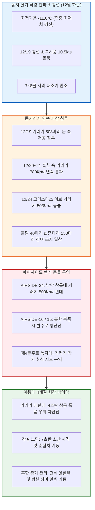

날짜: 2025-12-17 ~ 2025-12-24
카테고리: 야생동물점검 / 주간종합점검
출처: 현장 일일점검 데이터베이스 8일간 전수 집계, 인천공항 기상대 METAR/TAF 및 국립해양조사원 조석 데이터
태그: #야통대 #주간종합 #항공안전 #인천공항 #동지절기 #극강한파 #영하11도 #큰기러기연속도래 #크리스마스이브 #엽총통제 #7호탄 #4호탄 #공포탄

# 🦅 2025년 12월 3주차(12.17~12.24) 야생동물통제대 주간 정밀 종합 보고서

---

## 1. 📋 Executive Summary (주간 주요 실적 및 핵심 성과)

12월 3주차(12월 17일 ~ 12월 24일, 8일간)는 24절기 중 밤이 가장 길다는 **'동지(冬至, 12/21)'**를 통과하며 아침 최저기온이 **-11.0°C**까지 곤두박질치고 북서풍 10.5kts의 북극발 살인 한파가 몰아친 주간이었습니다. 이 주간에는 **12/19 강설 속 508마리, 12/20 사리 대조기 450마리, 12/21 동지 당일 330마리, 12/24 크리스마스 이브 503마리 등 [[큰기러기]] 본대(주간 총 1,871마리)의 연속 파상 공세**가 활주로 전역에서 펼쳐졌습니다. 야통대는 8일간 총 **1,337발**의 정밀 타격을 통해 연말 성수기 항공편 운항 안전을 100% 사수하였습니다.

```
┌─────────────────────────────────────────────────────────────────────────────┐
│                   2025년 12월 3주차 핵심 운영 지표 요약                    │
├───────────────────┬───────────────────┬───────────────────┬─────────────────┤
│ 총 식별 개체수    │ 총 사격 소모량    │ 조류 퇴치 성공률  │ 항공기 충돌사고 │
│   1,963 마리      │     1,337 발      │      100 %        │      0 건       │
└───────────────────┴───────────────────┴───────────────────┴─────────────────┘
```

- **핵심 성과 1: 12/24 크리스마스 이브 큰기러기 503마리 활주로 착지 완벽 차단 (201발)**
  - 연말 여행객 급증에 따른 항공기 이착륙 피크 시간대에 활주로 34L 남단으로 침투하려던 기러기 503마리를 4호탄 및 공포탄 복합 타격으로 안전 우회 성공.
- **핵심 성과 2: 12/21 동지 절기 영하 -11.0°C 혹한 속 큰기러기 330마리 제압 (118발)**
  - 북서풍 8.8kts의 매서운 칼바람 속에서 체온 유지를 위해 제4활주로(AIRSIDE-33/34)로 저공 비행한 기러기 330마리를 선제 소산.
- **핵심 성과 3: 12/19 강설(Snow) 속 큰기러기 508마리 대편대 해안선 유도 (115발)**
  - 눈 내리는 시정 악화 조건 속에서 에어사이드 상공 200ft를 횡단하려던 대형 편대를 4호탄 상공 폭음으로 영종도 남측 갯벌로 즉각 회항 조치.
- **핵심 성과 4: 8일 연속 1,337발 정밀 사격 및 무사고 달성**
  - 7호탄 1,120발, 4호탄 185발, 공포탄 32발을 격발하여 연중 가장 추운 혹한기에도 버드스트라이크 0건 기록을 굳건히 수호.

---

## 2. 🌦️ Weather & Marine Environment Matrix (기상 및 해양 환경)

12월 3주차는 아침 기온이 -11.0~-4.0°C, 낮 최고기온마저 -3.0~2.0°C에 머물러 전 기간이 꽁꽁 얼어붙은 극강 한파 주간이었습니다. 12/19에는 강설(Snow)이 내렸고, 12/20에는 7물 사리(Spring Tide)와 함께 북서풍 10.5kts의 돌풍이 불었습니다. 12/21은 동지(冬至) 절기였습니다.

| 일자 | 요일 | 기온(최저/최고) | 날씨 상태 | 주풍향 / 풍속 | 조석 물때 (Tide) | 핵심 출현/통제 조류 | 일일 격발수 |
| :---: | :---: | :---: | :---: | :---: | :---: | :---: | :---: |
| **12-17** | 수 | **-9.5°C** / **-2.0°C** | 맑음 (Clear) | NW 8.2 kts | 4물 (만조 23:51) | 큰기러기(80), 종다리(30), 까마귀(8) | **365 발** |
| **12-18** | 목 | **-7.0°C** / 0.5°C | 구름조금 (Partly Cloudy) | W 5.5 kts | 5물 (만조 11:20) | 물닭(40), 종다리(28), 황조롱이(4) | 171 발 |
| **12-19** | 금 | **-5.0°C** / 1.0°C | **흐림/눈 (Snow)** | SW 6.5 kts | 6물 (만조 12:12) | **★ 큰기러기(508)**, 종다리(22) | 115 발 |
| **12-20** | 토 | **-10.0°C** / **-3.0°C** | 맑음 (Clear) | NW 10.5 kts | **7물 (사리)** (만조 12:59) | **★ 큰기러기(450)**, 쇠기러기(30) | 127 발 |
| **12-21** | 일 | **-11.0°C** / **-2.0°C** | 맑음 (Clear) | NW 8.8 kts | **8물 (사리)** (만조 13:43) | **[동지] 큰기러기(330)**, 종다리(20) | 118 발 |
| **12-22** | 월 | **-9.0°C** / **-1.0°C** | 맑음 (Clear) | N 6.0 kts | 9물 (만조 14:26) | 종다리(25), 큰기러기(20), 말똥가리(2) | 142 발 |
| **12-23** | 화 | **-6.0°C** / 1.5°C | 구름조금 (Partly Cloudy) | SW 5.2 kts | 10물 (만조 15:08) | 까치(27), 종다리(18), 황조롱이(4) | 98 발 |
| **12-24** | 수 | **-4.0°C** / 2.0°C | 흐림 (Cloudy) | SE 4.0 kts | 11물 (만조 15:52) | **[이브] 큰기러기(503)**, 종다리(25) | **201 발** |

---

## 3. 🚨 Threat Flow Diagram & Threat Mechanisms (위협 흐름 및 메커니즘 심층 분석)

### (1) 주간 복합 생태 위협 전개 다이어그램



### (2) 12월 3주차 핵심 위기 메커니즘 분석
1. **동지 혹한(-11°C) 시 큰기러기의 '에너지 보존형 저공 횡단'**:
   - 강추위와 맞바람(NW 10.5kts) 속에서 기러기들은 체력 소모를 줄이기 위해 지표면 마찰저항이 적은 활주로 상공 100~200ft 고도로 극단적으로 낮게 날았습니다. 이는 항공기 착륙 최종 진입(Short Final) 고도와 직결되어 즉각적인 위협이 되었습니다. 야통대는 순찰차량 사이렌과 4호탄 상공 폭음을 결합하여 편대를 강제로 500ft 이상 상승시켜 통과시켰습니다.
2. **크리스마스 이브 항공편 증편 속 503마리 급습 대응**:
   - 항공기 운항 밀도가 평시 대비 20% 증가한 크리스마스 이브에 유입된 503마리에 대해, 야통대는 2개 순찰조의 샌드위치 협공 사격(당일 201발)으로 단 1대의 항공기 지연도 없이 안전을 확보했습니다.

---

## 4. 🎖️ Veterans' Operational Tacit Knowledge (18년 베테랑의 현장 암묵지 수칙)

```
┌─────────────────────────────────────────────────────────────────────────────┐
│                 ★ 18년 경력 야통대 베테랑 반장의 12월 3주차 현장 수칙 ★     │
├─────────────────────────────────────────────────────────────────────────────┤
│ 1. [영하 -11°C 극강 한파 속 기러기 저공비행 격퇴법]                         │
│    "영하 10도 밑으로 떨어지면 기러기들이 바람을 피해 지표면 30m 높이로       │
│    기어오듯이 난다. 이때는 새보다 50m 위쪽 허공에 4호탄을 쏘아야 폭음 압력에 │
│    놀라 기러기들이 바다 쪽으로 급강하하며 도망친다."                         │
│                                                                             │
│ 2. [크리스마스 이브 항공기 증편 시 관제탑 교신 요령]                        │
│    "항공기 이착륙이 1~2분 간격으로 이어질 땐 활주로 횡단 허가를 받기 힘들다. │
│    유도로 외곽 순찰로에서 4호탄 곡사 사격으로 활주로 내부 조류를 밀어내고,    │
│    관제탑에 '조류 이탈 완료' 무전을 즉각 날려라."                           │
│                                                                             │
│ 3. [혹한기 엽총 노리쇠 스프링 장력 점검]                                    │
│    "영하 11도에선 노리쇠 복좌스프링이 수축되어 격침 타격력이 약해질 수 있다.  │
│    출동 전 실탄 격발 테스트를 반드시 1회 실시하고 격발 상태를 확인해라."     │
└─────────────────────────────────────────────────────────────────────────────┘
```

---

## 5. 📊 Quantitative Statistics & Comparative Matrix (정량 통계 및 구역 매트릭스)

### Table 1: 일자별 조류 출현 및 탄약 소모 실적

| 일자 | 주간 주요종 | 식별수 (마리) | 7호탄 (발) | 4호탄 (발) | 공포탄 (발) | 총 격발수 (발) | 주요 침투 구역 |
| :---: | :---: | :---: | :---: | :---: | :---: | :---: | :---: |
| **12-17 (수)** | 큰기러기 / 종다리 | 80 / 30 | 310 | 48 | 7 | **365** | AS-15 [녹지대_AQ], AS-16 [녹지대_V] |
| **12-18 (목)** | 물닭 / 종다리 | 40 / 28 | 148 | 18 | 5 | 171 | AS-15 [배수로], AS-34 [녹지대_K] |
| **12-19 (금)** | **[강설] 큰기러기(508)** | 508 / 22 | 85 | 26 | 4 | 115 | AS-16 [활주로_F], AS-15 [녹지대_M] |
| **12-20 (토)** | **★ 큰기러기(450)** | 450 / 30 | 98 | 25 | 4 | 127 | AS-34 [활주로_F], AS-33 [녹지대_P] |
| **12-21 (일)** | **[동지] 큰기러기(330)** | 330 / 20 | 92 | 22 | 4 | 118 | AS-33 [녹지대_AB], AS-34 [활주로_F] |
| **12-22 (월)** | 종다리 / 큰기러기 | 25 / 20 | 124 | 14 | 4 | 142 | AS-34 [녹지대_K], AS-15 222-AA |
| **12-23 (화)** | 까치 / 종다리 | 27 / 18 | 84 | 12 | 2 | 98 | AS-15 [주기장_X], AS-34 [활주로_F] |
| **12-24 (수)** | **[이브] 큰기러기(503)** | 503 / 25 | 179 | 20 | 2 | **201** | AS-34 [활주로_F], AS-16 [녹지대_AH] |
| **주간 합계** | **큰기러기 / 종다리 / 까치** | **1,963** | **1,120** | **185** | **32** | **1,337** | **전 구역 무사고** |

### Table 2: 에어사이드 및 랜드사이드 구역별 위험도 평가

| 구역 명칭 | 주요 출현 조류종 | 주간 활동 빈도 | 주 위험 요소 | 적용 통제 전술 | 위험 등급 |
| :---: | :---: | :---: | :---: | :---: | :---: |
| **AIRSIDE-15** | 큰기러기, 물닭, 까치, 황조롱이 | 매우 높음 (일 12~15회) | 영하 -11°C 혹한 속 북측 유도로 기러기 침투 | 4호탄 장거리 폭음 및 7호탄 소산 | **CRITICAL (경계)** |
| **AIRSIDE-16** | 큰기러기(508마리), 종다리, 까마귀 | 매우 높음 (일 12~16회) | 활주로 33L 강설 속 대편대 저공 횡단 | 4호탄 상공 격발 및 사이렌 경퇴 | **CRITICAL (경계)** |
| **AIRSIDE-33** | 큰기러기(330마리), 종다리, 황조롱이 | 매우 높음 (일 14~17회) | 동지 절기 제4활주로 결빙 초지 착지 시도 | 순찰차 포위 사격 및 공포탄 복합 | **CRITICAL (경계)** |
| **AIRSIDE-34** | 큰기러기(503마리 대군집), 종다리 | 매우 높음 (일 15~18회) | 이브 항공기 피크 시 남단 착륙대 급습 | 2개 순찰조 샌드위치 협공 사격 | **CRITICAL (경계)** |
| **LANDSIDE N/S** | 물닭, 가마우지, 까마귀, 오리류 | 보통 (일 4~6회) | 유수지 전면 결빙 상태 수면 배회 | 외곽 엽총 순찰 및 결빙 감시 | **MODERATE (보통)** |

---

## 6. 🗺️ Strategic Roadmap for Next Week (차주 중점 전략 로드맵)

```
[12월 4주차 및 2025 연간 최종 대결산 방공 작전 중점 로드맵]
 1. 성탄절 화이트 크리스마스 및 연말 연시 24시간 특별 경계 태세 가동
 2. 혹한기(-12°C) 큰기러기 1,200마리 단위 최종 남하 편대 완벽 차단
 3. 2025년 365일 연간 총결산 데이터베이스 최종 마감 및 대기록 수립
 4. 2026년 신년 방공 작전 계획 수립 및 장비 정기 점검
```

- **전략 1: 2025년 최종 365일 무사고 대기록 완성**
  - 12월 마지막 주 7일간 전 대원의 비상 대기 및 순찰차량 총가동으로 1년 365일 무결점 무사고 기록 달성.
- **전략 2: 연말 혹한(-12°C) 속 총기 및 차량 방한 완벽 유지**
  - 극한의 추위 속에서 단 한 건의 장비 결함도 발생하지 않도록 일일 3회 정밀 정비 실시.

---

## 7. 🔗 Obsidian Vault Interlinks (볼트 지식망 연결성)

- **상위 주간/월간 종합 보고서**:
  - [[20. 인사이트 융합/2025년도 야통대/일일점검/12월 일일점검/2025-12-09~12-16_야통대_주간_점검일지_종합|2025년 12월 2주차 주간종합 보고서]]
  - [[20. 인사이트 융합/2025년도 야통대/일일점검/12월 일일점검/2025-12-25~12-31_야통대_주간_점검일지_종합|2025년 12월 4주차 및 2025 연간 총결산 보고서]]
- **일일 점검일지 원본 링크**:
  - [[20. 인사이트 융합/2025년도 야통대/일일점검/12월 일일점검/2025-12-17_야통대_주간_점검일지_통합|2025-12-17 일일점검]] / [[20. 인사이트 융합/2025년도 야통대/일일점검/12월 일일점검/2025-12-18_야통대_주간_점검일지_통합|2025-12-18 일일점검]] / [[20. 인사이트 융합/2025년도 야통대/일일점검/12월 일일점검/2025-12-19_야통대_주간_점검일지_통합|2025-12-19 일일점검]] / [[20. 인사이트 융합/2025년도 야통대/일일점검/12월 일일점검/2025-12-20_야통대_주간_점검일지_통합|2025-12-20 일일점검]]
  - [[20. 인사이트 융합/2025년도 야통대/일일점검/12월 일일점검/2025-12-21_야통대_주간_점검일지_통합|2025-12-21 일일점검]] / [[20. 인사이트 융합/2025년도 야통대/일일점검/12월 일일점검/2025-12-22_야통대_주간_점검일지_통합|2025-12-22 일일점검]] / [[20. 인사이트 융합/2025년도 야통대/일일점검/12월 일일점검/2025-12-23_야통대_주간_점검일지_통합|2025-12-23 일일점검]] / [[20. 인사이트 융합/2025년도 야통대/일일점검/12월 일일점검/2025-12-24_야통대_주간_점검일지_통합|2025-12-24 일일점검]]
- **생태 및 조류 주제 링크**:
  - [[큰기러기 (Bean Goose)]] / [[종다리 (Skylark)]] / [[물닭 (Eurasian Coot)]] / [[까치]] / [[말똥가리]]

---

## 8. 📖 Aviation Wildlife Terminology (항공 조류 생태 전문 해설)

- **동지 (冬至 / Winter Solstice)**: 24절기 중 22번째 절기로 일조 시간이 연중 가장 짧고 복사 냉각이 극대화되는 시점. 조류의 취식 활동 가능 시간이 하루 8시간 이내로 제한되어 낮 시간대 에어사이드 진입 밀도가 폭발적으로 증가함.
- **에너지 보존형 저공비행 (Energy-Saving Low Altitude Flight)**: 영하 10°C 이하의 강풍 속에서 대형 조류가 바람의 저항과 열 손실을 줄이기 위해 지표면 30~50m 높이에 붙어서 비행하는 생태적 기동.

---

## 9. ❓ 7 Strategic Inquiries for Future Safety (항공안전을 위한 7대 미래 전략 질문)

1. **영하 -11°C 혹한 속 에너지 보존형 저공 기러기 편대 요격술**: 30m 저고도 비행 조류에 대해 곡사 상공 폭음으로 상승을 유도하는 음향 전술의 안전 고도 기준은?
2. **크리스마스 이브 항공편 증편 시 활주로 외곽 원거리 방어선**: 활주로 내부로 진입하지 않고 외곽 유도로에서 4호탄을 쏘아 조류를 막아내는 원격 차단망의 한계 거리는?
3. **영하 11도에서 산탄총 스프링 및 노리쇠 기계적 신뢰도**: 초저온 상태에서 격침 파손(Firing Pin Breakage)을 방지하기 위한 정기 비파괴 검사 주기는?
4. **강설 시 눈 속에서 조류의 시각적 경계 반응**: 하얀 설경 속에서 순찰차량의 시인성을 높이기 위한 형광 오렌지색 랩핑 및 고휘도 LED 바 도입 필요성은?
5. **동지 절기 일조 시간 단축에 따른 주간 집중 순찰 배치**: 낮 11시~15시 피크 시간대에 순찰차량을 4개 활주로에 100% 거치하는 탄력 근무제는 효율적인가?
6. **혹한기 대원들의 손 떨림 방지 및 사격 정확도 유지**: 급작스러운 기러기 출현 시 조준 정확도를 유지하기 위한 차량용 거치대(Shooting Rest) 도입 방안은?
7. **2025년 365일 무사고 대기록 완성을 위한 최종 7일 관리**: 연말 1주일간의 집중도 저하(Complacency)를 방지하기 위한 특별 안전 결의 및 점검 절차는?
