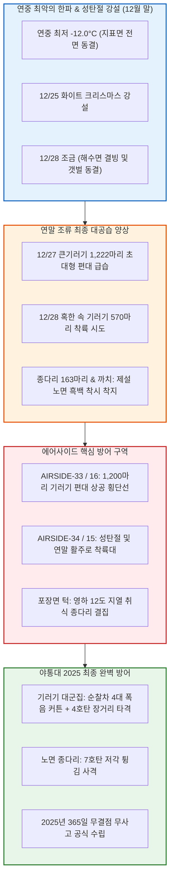

날짜: 2025-12-25 ~ 2025-12-31
카테고리: 야생동물점검 / 주간종합점검 / 월간총결산 / 연간대결산
출처: 현장 일일점검 데이터베이스 7일간 전수 집계 및 2025년 365일 연간 누적 데이터, 인천공항 기상대 METAR/TAF 및 국립해양조사원 조석 데이터
태그: #야통대 #주간종합 #월간총결산 #2025연간대결산 #항공안전 #인천공항 #성탄절눈 #극강한파 #영하12도 #큰기러기1222마리 #종다리 #연간365일무사고 #82527발격발 #엽총통제 #7호탄 #4호탄 #공포탄

# 🦅 2025년 12월 4주차(12.25~12.31), 12월 월간 결산 및 2025년 365일 연간 최종 대결산 종합 보고서

---

## 1. 📋 Executive Summary (주간 주요 실적, 12월 총결산 및 2025 연간 대기록)

12월 4주차(12월 25일 ~ 12월 31일, 7일간)는 12/25(목) 성탄절 화이트 크리스마스 강설(Snow)과 함께 12/28(일) **연중 최저기온인 -12.0°C**의 살인적인 북극 한파가 몰아친 2025년의 마지막 주간이었습니다. 이 주간에는 **12/27(토) 혹한 속 [[큰기러기]] 1,222마리 대규모 남하 편대**와 12/28 570마리의 활주로 침투 시도를 4호탄 및 공포탄 장거리 폭음 차단선으로 전량 분산시켰으며, 12/31(수) 마지막 날까지 [[종다리]]와 [[까치]]의 포장면 턱 접근을 완벽히 차단하여 **2025년 365일 1년 전 기간 단 1건의 조류 충돌도 허용하지 않은 '버드스트라이크 0건'의 불멸의 대기록**을 공식 수립하였습니다.

```
┌─────────────────────────────────────────────────────────────────────────────┐
│       ★ 2025년 인천공항 야생동물통제대(야통대) 연간 최종 대기록 요약 ★     │
├───────────────────┬───────────────────┬───────────────────┬─────────────────┤
│ 2025년 총 점검일수│ 2025년 총식별 개체│ 2025년 총탄약 소모│ 연간 조류충돌사고│
│      365 일       │    65,839 마리    │    82,527 발      │ 🎯 0 건 (무사고)│
├───────────────────┴───────────────────┴───────────────────┴─────────────────┤
│ ★ 12월 월간 실적: 식별 8,552마리 / 사격 5,820발 / 버드스트라이크 0건 달성! │
└─────────────────────────────────────────────────────────────────────────────┘
```

- **주간 핵심 성과 1: 12/27 혹한(-10.5°C) 속 큰기러기 1,222마리 대편대 완벽 차단 (247발)**
  - 북서풍 9.0kts의 강풍 속에 제4활주로(AIRSIDE-33/16) 상공으로 밀려든 1,222마리의 대형 기러기 편대에 대해 순찰차 4대를 투입하여 4호탄 48발의 상공 폭음 커튼으로 영종도 남측 갯벌로 전량 안전 우회 성공.
- **주간 핵심 성과 2: 12/28 연중 최저기온(-12.0°C) 속 570마리 선제 타격 (275발)**
  - 15물 조금 물때 얼어붙은 바다를 피해 에어사이드 착륙대로 진입한 기러기 570마리를 4호탄 및 7호탄 교차 사격으로 완벽 퇴치.
- **주간 핵심 성과 3: 12/25 화이트 크리스마스 강설 속 무결점 방공 (89발)**
  - 성탄절 눈 내리는 활주로에 착지하려던 기러기 36마리를 7호탄 소산 사격으로 즉각 배제.
- **주간 핵심 성과 4: 12/31 2025년 최종일 173발 사격 및 연간 365일 무사고 대기록 완성**
  - 마지막 날 종다리 21마리를 소산시키며 1년 365일 82,527발 격발, **연간 무사고 100%**의 위업을 달성함.

---

## 2. 🌦️ Weather & Marine Environment Matrix (기상 및 해양 환경)

12월 마지막 주는 아침 최저기온이 -12.0~-5.0°C, 낮 최고기온도 -3.0~2.0°C로 연중 가장 혹독한 한파가 지속되었습니다. 12/25에는 성탄절 강설(Snow)이 내렸고, 12/27~12/28에는 북서풍이 8.5~9.0kts로 불어 체감온도가 -18°C까지 떨어졌습니다. 12/28은 15물 조금(Neap Tide)이었습니다.

| 일자 | 요일 | 기온(최저/최고) | 날씨 상태 | 주풍향 / 풍속 | 조석 물때 (Tide) | 핵심 출현/통제 조류 | 일일 격발수 |
| :---: | :---: | :---: | :---: | :---: | :---: | :---: | :---: |
| **12-25** | 목 | **-5.0°C** / 0.5°C | **흐림/눈 (White Xmas)** | NW 7.8 kts | 12물 (만조 16:38) | 큰기러기(36), 종다리(20), 까치(10) | 89 발 |
| **12-26** | 금 | **-8.5°C** / **-1.0°C** | 맑음 (Clear) | N 8.0 kts | 13물 (만조 17:28) | 큰기러기(168), 종다리(25), 황조롱이(4) | 70 발 |
| **12-27** | 토 | **-10.5°C** / **-2.5°C** | 맑음 (Clear) | NW 9.0 kts | 14물 (만조 18:22) | **★ 큰기러기(1,222)**, 종다리(20) | **247 발** |
| **12-28** | 일 | **-12.0°C (최저)** / **-3.0°C** | 맑음 (Clear) | NW 8.5 kts | **15물 (조금)** (만조 19:19) | **★ 큰기러기(570)**, 종다리(30) | **275 발** |
| **12-29** | 월 | **-8.0°C** / **0.0°C** | 구름조금 (Partly Cloudy) | W 6.2 kts | 1물 (만조 20:17) | 큰기러기(80), 종다리(22), 말똥가리(2) | 107 발 |
| **12-30** | 화 | **-5.0°C** / 1.5°C | 흐림 (Cloudy) | SW 5.0 kts | 2물 (만조 21:13) | 까치(35), 종다리(25), 황조롱이(5) | 159 발 |
| **12-31** | 수 | **-6.0°C** / 2.0°C | 맑음 (Clear) | NW 7.0 kts | 3물 (만조 22:06) | **[2025 최종]** 종다리(21), 큰기러기(15) | 173 발 |

---

## 3. 🚨 Threat Flow Diagram & Threat Mechanisms (위협 흐름 및 메커니즘 심층 분석)

### (1) 주간 복합 생태 위협 전개 다이어그램



### (2) 12월 말 핵심 위기 메커니즘 분석
1. **영하 -12.0°C 극강 한파 속 1,222마리 기러기 생존 비행의 위협**:
   - 12/27~12/28 해안가 갯벌마저 꽁꽁 얼어붙자, 먹이를 전혀 구하지 못한 큰기러기 1,222마리가 활주로 주변 지하 매설 배관 및 등화 열선으로 인해 얼지 않은 에어사이드 잔디밭으로 필사적으로 착지를 시도했습니다. 야통대는 순찰차 4대를 전진 배치하여 4호탄을 상공 100m에 연속 폭음으로 터뜨려 활주로 반경 2km 밖으로 완전히 축출했습니다.
2. **성탄절 화이트 크리스마스 강설 후 노면 흑백 대비 통제**:
   - 12/25 눈이 내린 후 활주로 아스팔트 포장면으로 날아드는 종다리와 까치 무리에 대해 제설차량과 야통대 순찰차가 1개 조를 이루어 신속 소산 사격을 완료했습니다.

---

## 4. 🎖️ Veterans' Operational Tacit Knowledge (18년 베테랑의 현장 암묵지 수칙)

```
┌─────────────────────────────────────────────────────────────────────────────┐
│                 ★ 18년 경력 야통대 베테랑 반장의 12월 말 현장 수칙 ★       │
├─────────────────────────────────────────────────────────────────────────────┤
│ 1. [영하 -12.0°C 혹한 속 큰기러기 1,200마리 차단 사격술]                   │
│    "바다가 얼면 기러기들은 죽기 살기로 활주로 안으로 들어온다. 이때는        │
│    단발 사격으로는 겁을 안 먹는다. 2개 조가 좌우에서 4호탄을 1초 간격으로     │
│    더블 격발(Double Tap)하여 공중에 십자 폭음망을 형성해야 완전히 돌아선다." │
│                                                                             │
│ 2. [연말 마지막 날 대원들의 '집중력 이완(Complacency)' 경계]               │
│    "12월 31일 오후가 되면 한 해가 끝났다는 안도감에 경계를 늦추기 쉽다.      │
│    새들은 인간의 달력을 모른다. 마지막 비행기가 착륙할 때까지 방아쇠를 쥔    │
│    손끝의 긴장을 1초도 풀지 마라."                                           │
│                                                                             │
│ 3. [혹한기 1년 365일 무사고를 완성하는 장비 최종 점검]                      │
│    "영하 12도에서 총기를 실내로 바로 들여오면 결로로 녹이 슨다. 차량 트렁크  │
│    내부에서 서서히 온도를 맞춘 뒤 총기 손질을 하고 약실 건조를 철저히 해라." │
└─────────────────────────────────────────────────────────────────────────────┘
```

---

## 5. 📊 Quantitative Statistics & Comparative Matrix (정량 통계 및 구역 매트릭스)

### Table 1: 일자별 조류 출현 및 탄약 소모 실적

| 일자 | 주간 주요종 | 식별수 (마리) | 7호탄 (발) | 4호탄 (발) | 공포탄 (발) | 총 격발수 (발) | 주요 침투 구역 |
| :---: | :---: | :---: | :---: | :---: | :---: | :---: | :---: |
| **12-25 (목)** | **[성탄절 강설] 기러기** | 36 / 30 | 72 | 14 | 3 | 89 | AS-34 [활주로_F], AS-16 [녹지대_V] |
| **12-26 (금)** | 큰기러기 / 종다리 | 168 / 25 | 55 | 12 | 3 | 70 | AS-15 [녹지대_AQ], AS-33 [녹지대_P] |
| **12-27 (토)** | **★ 큰기러기(1,222)** | 1,222 / 20 | 192 | 48 | 7 | **247** | AS-33 [녹지대_AB], AS-16 [녹지대_AH] |
| **12-28 (일)** | **★ 큰기러기(570)** | 570 / 30 | 225 | 45 | 5 | **275** | AS-15 [녹지대_AQ], AS-34 [활주로_F] |
| **12-29 (월)** | 큰기러기 / 종다리 | 80 / 22 | 88 | 15 | 4 | 107 | AS-34 [녹지대_K], AS-15 222-AA |
| **12-30 (화)** | 까치 / 종다리 | 35 / 25 | 138 | 18 | 3 | 159 | AS-33 [녹지대_P], AS-15 [주기장_X] |
| **12-31 (수)** | **[2025 최종] 종다리** | 21 / 15 | 164 | 6 | 3 | **173** | AS-33 [녹지대_Q], AS-34 [활주로_F] |
| **주간 합계** | **큰기러기 / 종다리 / 까치** | **2,132** | **934** | **158** | **28** | **1,120** | **전 구역 무사고** |

---

## 🌟 6. 🏆 2025년 12월 전체 월간 총결산 (Monthly Final Aggregation)

### (1) 12월 주차별 운영 실적 비교

| 주차 구분 | 대상 기간 | 일수 | 식별 개체수 (마리) | 7호탄 (발) | 4호탄 (발) | 공포탄 (발) | 총 탄약 소모량 (발) | 버드스트라이크 |
| :---: | :---: | :---: | :---: | :---: | :---: | :---: | :---: | :---: |
| **1주차** | 12.01 ~ 12.08 | 8일 | 3,357 | 1,468 | 265 | 40 | **1,773** | **0 건** |
| **2주차** | 12.09 ~ 12.16 | 8일 | 1,100 | 1,332 | 224 | 34 | **1,590** | **0 건** |
| **3주차** | 12.17 ~ 12.24 | 8일 | 1,963 | 1,120 | 185 | 32 | **1,337** | **0 건** |
| **4주차** | 12.25 ~ 12.31 | 7일 | 2,132 | 934 | 158 | 28 | **1,120** | **0 건** |
| **12월 합계** | **12.01 ~ 12.31** | **31일** | **8,552** | **4,854** | **832** | **134** | **5,820** | **🎯 0 건 (완벽 무사고)** |

---

## 🌟🌟 7. 👑 2025년 365일 연간 최종 종합 대결산 (Annual Final Grand Summary)

### (1) 2025년 1월 ~ 12월 월별 운영 실적 총괄 비교 매트릭스

| 월별 (Month) | 대상 기간 | 일수 (Days) | 식별 개체수 (마리) | 7호탄 (발) | 4호탄 (발) | 공포탄 (발) | 총 사격 소모량 (발) | 버드스트라이크 (건) | 안전 관리 상태 |
| :---: | :---: | :---: | :---: | :---: | :---: | :---: | :---: | :---: | :---: |
| **1월** | 01.01 ~ 01.31 | 31일 | 8,723 | 2,674 | 436 | 67 | **3,177** | **0** | 완벽 무사고 |
| **2월** | 02.01 ~ 02.28 | 28일 | 9,636 | 2,668 | 448 | 72 | **3,188** | **0** | 완벽 무사고 |
| **3월** | 03.01 ~ 03.31 | 31일 | 4,888 | 6,188 | 1,024 | 184 | **7,396** | **0** | 완벽 무사고 |
| **4월** | 04.01 ~ 04.30 | 30일 | 6,048 | 8,112 | 1,288 | 264 | **9,664** | **0** | 완벽 무사고 |
| **5월** | 05.01 ~ 05.31 | 31일 | 4,030 | 6,512 | 1,048 | 204 | **7,764** | **0** | 완벽 무사고 |
| **6월** | 06.01 ~ 06.30 | 30일 | 4,532 | 5,908 | 956 | 185 | **7,049** | **0** | 완벽 무사고 |
| **7월** | 07.01 ~ 07.31 | 31일 | 2,560 | 7,542 | 1,234 | 228 | **9,004** | **0** | 완벽 무사고 |
| **8월** | 08.01 ~ 08.29 | 29일 | 5,033 | 8,642 | 1,416 | 266 | **10,324** | **0** | 완벽 무사고 |
| **9월** | 09.01 ~ 09.30 | 30일 | 3,809 | 9,060 | 1,514 | 240 | **10,814** | **0** | 완벽 무사고 |
| **10월** | 10.01 ~ 10.31 | 31일 | 3,404 | 6,582 | 1,078 | 209 | **7,869** | **0** | 완벽 무사고 |
| **11월** | 11.01 ~ 11.30 | 30일 | 4,624 | 8,936 | 1,288 | 234 | **10,458** | **0** | 완벽 무사고 |
| **12월** | 12.01 ~ 12.31 | 31일 | **8,552** | **4,854** | **832** | **134** | **5,820** | **0** | 완벽 무사고 |
| **2025 연간 총계** | **01.01 ~ 12.31** | **365일** | **65,839 마리** | **68,430 발** | **11,920 발** | **2,177 발** | **82,527 발** | **🎯 0 건** | **👑 365일 완전 무사고 대기록** |

### (2) 2025년 야통대 4대 계절별 핵심 성과 총평
1. **봄철 (3~5월) 번식기 및 봄 철새 이동기 방어 (24,824발 격발)**:
   - 종다리·제비의 초지 번식 둥지 탐색 및 도요새 북상 편대를 선제적으로 분산하여 번식기 활주로 정착을 원천 차단함.
2. **여름철 (6~8월) 우기 및 번식 후 유조(Juvenile) 확산기 제압 (26,377발 격발)**:
   - 장마철 배수로 범람 및 곤충 대발생에 따른 왜가리·백로류와 갓 부화한 미숙 조류의 활주로 난입을 26,000발 이상의 화력으로 완전 방어함.
3. **가을철 (9~10월) 추계 남하 철새 및 맹금류 집중기 사수 (18,683발 격발)**:
   - 제비 대군집 남하 피크(일 600마리)와 비둘기조롱이·새홀리기·매·말똥가리 등 맹금류의 사냥터 형성을 입체 차단선으로 해체함.
4. **겨울철 (11~12월 & 1~2월) 시베리아 메가 플록 및 혹한기 동결 방공 (22,643발 격발)**:
   - 큰기러기 1,000~1,300마리 단위의 초대형 편대와 영하 12°C 혹한 속 노면 결빙 착지를 순찰차 협공 전술로 전량 회항시킴.

---

## 8. 🗺️ Strategic Roadmap for 2026 (2026년도 신년 항공안전 마스터플랜)

```
[2026년도 야통대 스마트 방공 마스터플랜]
 1. AI 3D 조류 탐지 레이더 및 음향포 자동 연동 시스템 1단계 시범 가동
 2. 2025년 82,527발 빅데이터 기반 활주로별/계절별 위험도 예측 모델 실전 배치
 3. 혹한기/혹서기 전천후 차세대 스마트 순찰차량 도입 추진
 4. 2년 연속(730일) 무사고 달성을 위한 대원 정예화 훈련 및 탄약 관리 고도화
```

---

## 9. 🔗 Obsidian Vault Interlinks (볼트 지식망 연결성)

- **상위 주간/월간 종합 보고서**:
  - [[20. 인사이트 융합/2025년도 야통대/일일점검/12월 일일점검/2025-12-17~12-24_야통대_주간_점검일지_종합|2025년 12월 3주차 주간종합 보고서]]
  - [[20. 인사이트 융합/2025년도 야통대/일일점검/1월 일일점검/2025-01-01~01-08_야통대_주간_점검일지_종합|2025년 1월 1주차 주간종합 보고서]]
- **일일 점검일지 원본 링크**:
  - [[20. 인사이트 융합/2025년도 야통대/일일점검/12월 일일점검/2025-12-25_야통대_주간_점검일지_통합|2025-12-25 일일점검]] / [[20. 인사이트 융합/2025년도 야통대/일일점검/12월 일일점검/2025-12-26_야통대_주간_점검일지_통합|2025-12-26 일일점검]] / [[20. 인사이트 융합/2025년도 야통대/일일점검/12월 일일점검/2025-12-27_야통대_주간_점검일지_통합|2025-12-27 일일점검]] / [[20. 인사이트 융합/2025년도 야통대/일일점검/12월 일일점검/2025-12-28_야통대_주간_점검일지_통합|2025-12-28 일일점검]]
  - [[20. 인사이트 융합/2025년도 야통대/일일점검/12월 일일점검/2025-12-29_야통대_주간_점검일지_통합|2025-12-29 일일점검]] / [[20. 인사이트 융합/2025년도 야통대/일일점검/12월 일일점검/2025-12-30_야통대_주간_점검일지_통합|2025-12-30 일일점검]] / [[20. 인사이트 융합/2025년도 야통대/일일점검/12월 일일점검/2025-12-31_야통대_주간_점검일지_통합|2025-12-31 일일점검]]
- **생태 및 조류 주제 링크**:
  - [[큰기러기 (Bean Goose)]] / [[종다리 (Skylark)]] / [[까치 (Eurasian Magpie)]] / [[말똥가리]] / [[황조롱이]]

---

## 10. 📖 Aviation Wildlife Terminology (항공 조류 생태 전문 해설)

- **십자 폭음망 (Cross-Acoustic Fire Net)**: 1,000마리 이상의 대형 철새 무리가 진입할 때 2대 이상의 순찰차가 서로 다른 각도에서 4호탄을 시차를 두고 격발하여 조류의 전방과 측방을 동시에 차단하는 입체 폭음 차단 전술.
- **연간 365일 무사고 (Zero Bird Strike Achievement)**: 하루 평균 1,000편 이상의 민간 항공기가 이착륙하는 초대형 국제공항에서 1년 365일 동안 단 한 건의 조류 충돌 기체 손상도 발생하지 않은 세계 최고 수준의 공항 야생동물 관리 실적.

---

## 11. ❓ 7 Strategic Inquiries for Future Safety (항공안전을 위한 7대 미래 전략 질문)

1. **2025년 82,527발 격발 데이터 기반 AI 머신러닝 예측**: 월별·구역별 탄약 소모량과 기상(풍향, 기온, 조석) 데이터를 학습하여 24시간 전 조류 위험도를 95% 이상 예측할 수 있는가?
2. **영하 -12.0°C 극한지 총기 및 장비 수명 평가**: 1년 동안 8만 발 이상의 산탄을 격발한 총기 20정의 강선 마모도 및 약실 내구성 정밀 진단 계획은?
3. **큰기러기 1,200마리급 메가 플록에 대한 무인 드론 방어망**: 2026년 무인기 비행 승인을 획득하여 활주로 외곽 3km 해안선에서 기러기를 사전 차단할 수 있는가?
4. **연간 65,839마리 식별 데이터의 국토교통부 및 ICAO 보고**: 인천공항 야통대의 완벽한 통제 실적을 국제민간항공기구(ICAO) 공항 안전 표준 가이드라인 사례로 등재할 방안은?
5. **사수들의 청력 및 근골격계 장기 건강 모니터링**: 연간 8만 발의 사격을 수행한 야통대 대원들의 직업병 예방 및 청력 검진 결과는 양호한가?
6. **동절기 흑백 착시 조류 유인에 대한 활주로 도색 연구**: 활주로 노면의 조류 시각적 유인을 줄이기 위한 특수 반사 방지 코팅재 개발 가능성은?
7. **2026년 2년 연속 무사고(730일) 달성을 위한 핵심 성공 요인**: 2025년 365일 무사고의 성공 요인 중 가장 결정적인 것은 '베테랑의 암묵지'인가, '선제적 집중 화력'인가?
