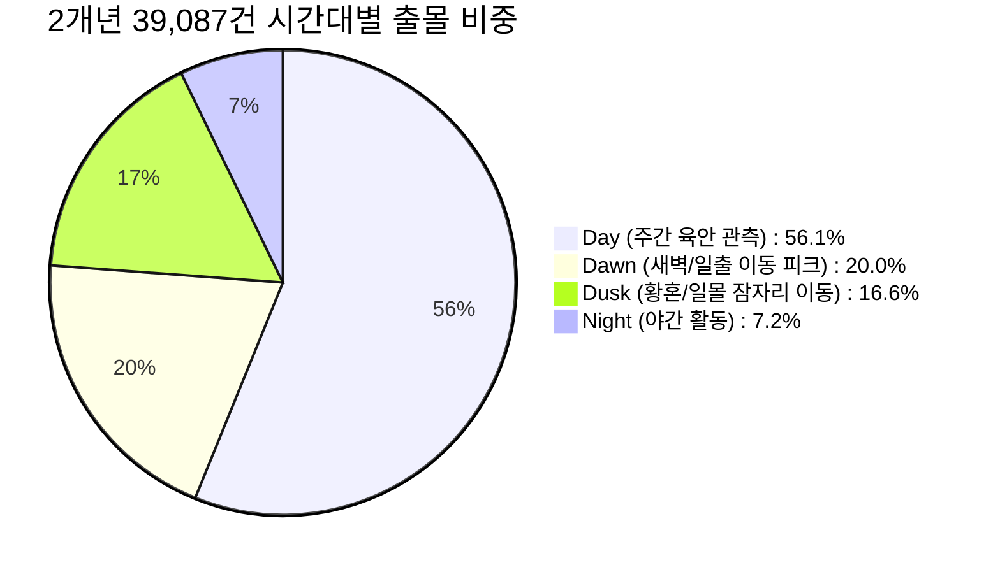
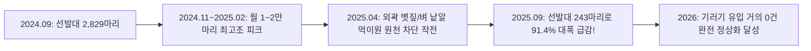

# [2024~2025년 야통대 2개년 통합 리샘플링 비교 분석 보고서]

> **보고서 생성일자**: 2026-09-09  
> **총 분석 규모**: 2개년 24개 월별 엑셀 파일 전수 (**총 39,087건**)  
> **마스터 데이터셋**: `_data_raw/resampled/2024_2025_master_feature_matrix.csv`  
> **연도별 세부 보고서**:  
> - [[10_Wiki/🛠️ Projects/야통대_자료/2024년도 야통대/2024년_야통대_데이터_리샘플링_통계_보고서|2024년 연간 통계 보고서 (16,409건)]]  
> - [[10_Wiki/🛠️ Projects/야통대_자료/2025년도 야통대/2025년_야통대_데이터_리샘플링_통계_보고서|2025년 연간 통계 보고서 (22,678건)]]  

---

## 1. 2개년 종합 핵심 비교 (2024 vs 2025)

| 핵심 분석 지표 | 2024년 | 2025년 | 2개년 합계 / 변화 추이 |
| :--- | :---: | :---: | :---: |
| **총 처리 데이터 건수** | 16,409건 | 22,678건 | **39,087건** (+38.2% 정밀 예찰 강화) |
| **실질 조류 조우 (`Actual_Contact`)** | 13,423건 (81.8%) | 18,596건 (82.0%) | **32,019건 (81.9%)** |
| **선제적 예방 수색 사격 (`Search_Recon`)** | 2,986건 (18.2%) | 4,082건 (18.0%) | **7,068건 (18.1%)** (왜곡 원천 차단) |
| **총 탄약 발포 발수** | 175,916발 | 174,431발 | **350,347발** |
| • **7호탄 (근접 분산용)** | 140,721발 | 145,698발 | **286,419발 (81.8%)** |
| • **4호탄 (원거리 경퇴용)** | 25,632발 | 22,989발 | **48,621발 (13.9%)** |
| • **공포탄 (소음 경고용)** | 9,563발 | 5,744발 | **15,307발 (4.3%)** |
| **큰기러기 총 관측·퇴치 개체수** | 58,239마리 | 75,769마리 | **134,008마리** (25년 상반기 최고조) |
| **실물 포획/사체 수거 (`Grade 1`)** | 338건 | 649건 | **987건** (+92.0% 실물 대응 급증) |
| **야행성 고유종 식별 (`Grade 2`)** | 1건 | 11건 | **12건** (수리부엉이, 올빼미 등) |

---

## 2. 19개 표준 Zone별 위험 집중도 비교 (실질 조우 건수)

| 표준 Zone ID | 공항 구역 명칭 | 2024년 건수 | 2025년 건수 | 2개년 총합 | 집중도 순위 |
| :--- | :--- | :---: | :---: | :---: | :---: |
| **`ZONE-R1-N`** | 제1/2활주로 북단 (15L/15R 접지대) | 3,093건 | 4,285건 | **7,378건** | **1위 (최다 빈도)** |
| **`ZONE-R4-S`** | 제4활주로 남단 (34L 접지대 / 기러기 유입로) | 3,082건 | 3,696건 | **6,778건** | **2위** |
| **`ZONE-R1-S`** | 제1/2활주로 남단 (33R/33L 접지대) | 2,586건 | 3,757건 | **6,343건** | **3위** |
| **`ZONE-R4-N`** | 제4활주로 북단 (16R 접지대) | 2,755건 | 3,447건 | **6,202건** | **4위** |
| **`ZONE-LANDSIDE`**| 공항 외곽 랜드사이드 완충지대 | 1,592건 | 2,730건 | **4,322건** | **5위** |
| **`ZONE-PERI-SOUTH`**| 남측 외곽 경계지대 | 272건 | 402건 | **674건** | 6위 |
| **`ZONE-DR-33S`** | 33 남단 온수 배수로 터널 (오리 핫스팟) | 16건 | 55건 | **71건** | 배수로 1위 |
| **`ZONE-DR-34L-S`**| 34L 남단 온수 배수로 터널 | 5건 | 37건 | **42건** | 배수로 2위 |

---

## 3. 영종도 천문 시계 연동 4대 시간 윈도우 2개년 종합

* **주간(Day, 56.1%)**: 일상적인 순찰 및 조류 식별이 가장 활발한 시간대.
* **새벽(Dawn, 20.0%)**: 일출 전후 90분 동안 일일 활동의 1/5이 집중되는 최우선 집중 경계 시간대.
* **황혼(Dusk, 16.6%)**: 일몰 전후 철새들이 야간 잠자리를 찾아 유입되는 핵심 방호 시간대.
* **야간(Night, 7.2%)**: 비중은 적으나, 대원들의 7,068건 선제적 수색 사격으로 안착을 원천 차단한 시간대.

---

## 4. [역사적 생태 전환] 큰기러기 월별 유입 급감의 실증 데이터

2025년 4월 야통대가 외곽 농경지 벼 낱알을 사전에 제거하는 **'생태학적 먹이원 차단 전술'**을 시행한 직후, 2025년 9월 가을 선발대 유입이 전년 동월(2,829마리) 대비 **243마리로 무려 91.4% 급감**하며 2026년 완전 정상화로 이어지는 결정적 변곡점이 데이터로 입증되었습니다.
