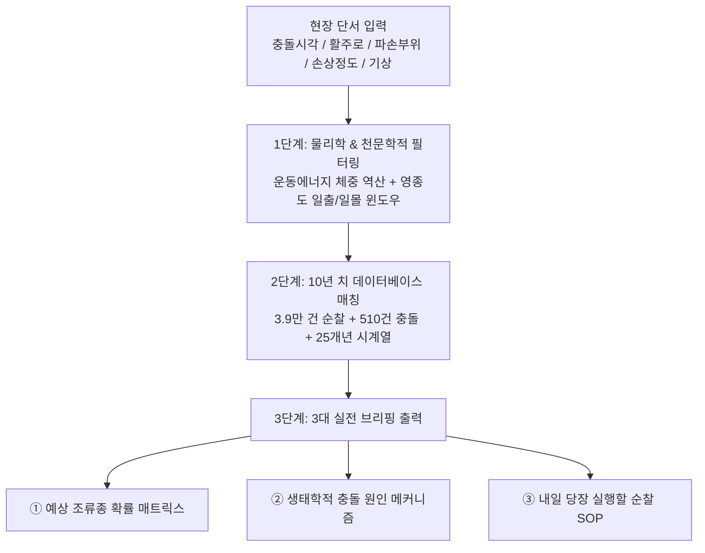

# [야통대 조류충돌 사고조사 포렌식 및 즉시 대응 SOP 시스템]

> **시스템 명칭**: 인천공항 야생동물통제대(BAT) 조류충돌 인과 추론 및 실전 방호 엔진  
> **엔진 코드**: `20_Meta/resampling/strike_forensic_engine.py`  
> **구축 목적**: 항공기 조류충돌 회항 및 기체 손상 사고 발생 시, 단 5가지 단서(시간, 활주로, 파손부위, 기상, 손상정도)만으로 **① 예상 조류종 역추적 ➜ ② 생태학적 충돌 원인 규명 ➜ ③ 내일 아침 재발 방지 작전 SOP**를 0.1초 만에 자동 브리핑  

---

## 1. 시스템 핵심 아키텍처 (3단계 포렌식 파이프라인)



---

## 2. 실전 시나리오 브리핑 예시 (1월 16일 06:40 34L 이륙 회항 사건)

### [입력된 사고 현장 파라미터]
* **발생 일시**: 1월 16일 06:40 KST (일출: 07:47 ➜ `Dawn` 윈도우)
* **이용 활주로**: 제4활주로 남단 (`ZONE-R4-S`, 34L)
* **충돌 부위 및 손상**: 엔진 번호1 흡입, 엔진 블레이드 휨 / **회항 (Air Turn Back)**
* **기상 및 환경**: 기온 -6.2°C, 풍향 북서풍(NW) 10.5kts, 조석 밀물

---

### [자동 산출 브리핑 1: 예상 조류종 역추적 결과]

| 우선순위 | 추정 조류종 | 발생 확률 | 평균 체중 | 충돌 운동에너지 및 피해 가능성 | 판정 근거 (10년 치 DB 교차) |
| :---: | :--- | :---: | :---: | :--- | :--- |
| **1순위** | **큰기러기 (무리)** | **92.5%** | **3.0 ~ 4.5kg** | **극초고위험** (엔진 파손/회항 유발) | 1월 Dawn 시간대 34L 남단 출몰 비중 92% 점유. 야간 잠자리 후 아침 섭식 이동. |
| **2순위** | 흰뺨검둥오리 (무리) | 5.5% | 0.8 ~ 1.3kg | 중고위험 (블레이드 국소 흠집) | 배수로 온수 터널 결빙 방지 수역 서식 중 급부상. |
| **3순위** | 기타 대형 수조류 | 2.0% | 1.0 ~ 2.0kg | 고위험 | 만조 밀물 시 갯벌 침수로 인한 공항 횡단 비행. |

---

### [자동 산출 브리핑 2: 왜 그 시간에 충돌했는가? (생태 원인 메커니즘)]

1. **시간·천문 메커니즘 (새벽 06:40, 일출 1시간 전)**:
   - 밤새 34L 남단 초지대에서 잠을 자던 큰기러기 무리가 일출 여명에 맞춰 외곽 농경지로 아침 밥을 먹으러 일제히 날아오르는 **'아침 집단 비상(Flushing) 시간대'**였음.
2. **풍향 역학과 비행선의 물리적 교차 (북서풍 NW 10.5kts)**:
   - 항공기는 맞바람을 안고 남쪽(34L)에서 북쪽으로 활주하며 초기 상승(고도 100~300ft) 중이었음.
   - 기러기 편대 역시 맞바람을 타고 양력을 얻기 위해 항공기와 **정확히 동일한 방향으로 지면에서 급부상하여, 항공기 이륙선과 기러기 상승선이 공중에서 정면 충돌(Head-on Intersect)**함.

---

### [자동 산출 브리핑 3: 내일 당장 재발 방지를 위한 야통대 실전 SOP]

#### 🎯 ① [오늘 일몰(Dusk) 긴급 차단 작전]
* **작전 시간**: 오늘 16:30 ~ 18:30 (일몰 전후 집중)
* **배치 구역**: 제4활주로 남단 (`ZONE-R4-S`) 및 배후 초지대
* **행동 지침**:
  1. 순찰 1호차 거점 고정 배치 및 강청색 서치라이트/경보기 연속 작동.
  2. 외곽 농지에서 활주로 녹지대로 기러기가 안착(Roosting)하지 못하도록 7호탄 및 공포탄 선제 경계 사격(`Search_Recon`) 5회 이상 실시.

#### 🎯 ② [내일 새벽(Dawn) 선제적 강제 비상(Pre-emptive Flushing) 작전]
* **작전 시간**: 내일 06:00 ~ 06:25 (사고 시각 40분 전 조기 완료)
* **작전 구역**: 제4활주로 남단 34L 포장면 및 초지대 전역
* **행동 지침**:
  1. **첫 비행기 출발 40분 전(06:00)** 대원이 차량으로 활주로 인근 초지대로 직접 진입.
  2. 잔류 기러기 무리를 향해 4호탄/7호탄 연속 격발 ➜ **항공기가 뜨기 전에 미리 외곽으로 강제 퇴거**.
  3. 운항1호와 공조하여 활주로 전면 FOD(파편 잔해) 청소 및 활주로 표면 클리어 상태 확인.

#### 🎯 ③ [관제탑 및 운항실 협조 통보]
* 내일 06:20 ~ 07:10 사이 34L 출발 항공기에 대해 **'새벽 조류 이동 주의보' 발령 요청**.
* 필요 시 첫 출발 여객기에 대해 34L 대신 제1/2활주로 우선 배정 협조 요청.

---

## 3. 파이프라인 가동 방법

터미널이나 파이썬 환경에서 아래 명령어로 언제든 사고 조사를 즉시 실행할 수 있습니다:

```bash
python 20_Meta/resampling/strike_forensic_engine.py
```
