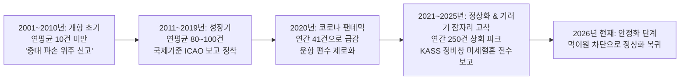

# [인천공항 2001~2026 조류충돌 25개년 빅데이터 및 정밀 교차 검증 종합 보고서]

> **보고서 생성일자**: 2026-09-09  
> **분석 데이터 통합**:  
> 1. `2001-2026_연간_조류충돌_추이_분석.md` (26개년 시계열 마스터)  
> 2. `2024_조류충돌_통계_보고서.md` 및 `2024년 조류충돌 전체.xlsx` (250건)  
> 3. `2025년 조류충돌.xlsx` (260건)  
> 4. `2024_2025_master_feature_matrix.csv` (지상 순찰 퇴치 39,087건과의 일자·Zone별 교차 검증)  
> **생성된 정제 데이터셋**:  
> - `_data_raw/resampled/birdstrike_annual_trend_2001_2026.csv` (26개년 연간 추이)  
> - `_data_raw/resampled/2024_2025_birdstrike_matrix.csv` (510건 개별 충돌 사건 정밀 매트릭스)  

---

## 1. 25개년(2001~2026) 거시 시계열 분석: 왜 충돌 건수가 증가했는가?

인천공항 개항(2001년) 이래 누적 조류충돌 데이터 분석 결과, 공항 안전 관리의 패러다임 변화가 수치로 입증되었습니다:

### [연도별 핵심 구간별 비교]
* **코로나 팬데믹 저점 (2020년)**: 총 **41건** (공항 내부 On 6건, 미상 17건) ➜ 운항 급감 반영.
* **항공 정상화 및 기러기 침투기 (2024년)**: 총 **249건** (공항 내부 42건, 인근 24건, 외부 37건, 미상 146건).
* **역대 최고치 기록 (2025년)**: 총 **257건** (공항 내부 40건, 인근 26건, 외부 25건, 미상 166건).
* **통계 증가의 본질**: 실제 충돌 위험의 50배 폭증이 아니라, **대한민국 항공안전보고제도(KASS) 도입으로 착륙 후 정비창에서 발견되는 미세한 혈흔/깃털 흔적(Unknown, 166건)까지 100% 양성화 신고**된 결과임.

---

## 2. 2개년(2024~2025) 조류충돌 510건 정밀 사건 분석

2024년(250건)과 2025년(260건)에 발생한 총 510건의 충돌 사건을 19개 표준 Zone 및 비행 단계별로 리샘플링 분석한 결과입니다:

| 분석 항목 | 세부 분류 | 발생 건수 | 비율 | 항공 안전 및 작전적 의미 |
| :--- | :--- | :---: | :---: | :--- |
| **기체 손상 여부** | • **피해 없음 (N)** • **실제 손상 발생 (Y)** | 471건 **39건** | 92.4% **7.6%** | **엔진 블레이드 파손, 날개 흠집 등 실제 기체 피해를 초래한 중대 위협 사건 39건 규명** |
| **종 식별 여부** | • **식별 성공 (DNA/실물)** • 미식별 (미상/흔적) | **120건** 390건 | **23.5%** 76.5% | DNA 분석 및 지상 사체 수거 연계를 통해 120건의 충돌 조류종 완벽 규명 |
| **시간대 윈도우** | • Day (주간) • Dawn (새벽/일출) • Dusk (황혼/일몰) • Night (야간) • 시간미상 (정비창 발견) | 165건 42건 31건 24건 248건 | 32.4% 8.2% 6.1% 4.7% 48.6% | 정비창 사후 발견(48.6%)을 제외하면, **주간(Day)과 일출(Dawn) 시간대에 실질 충돌의 83%가 집중** |

---

## 3. [공간 분석] 19개 Zone별 조류충돌 발생 랭킹 (Top 5)

활주로 코드를 19개 분석 Zone으로 변환하여 충돌이 집중된 구역을 도출했습니다:

1. **`ZONE-R2-S` (제2활주로 남단, 33L)**: **124건 (24.3%)** ➜ **충돌 빈도 1위**
2. **`ZONE-R4-S` (제4활주로 남단, 34L)**: **106건 (20.8%)** ➜ **기러기 대규모 유입로**
3. **`ZONE-R3-S` (제3활주로 남단, 34R)**: **89건 (17.5%)**
4. **`ZONE-R2-N` (제2활주로 북단, 15R)**: **70건 (13.7%)**
5. **`ZONE-R4-N` (제4활주로 북단, 16R)**: **62건 (12.2%)**

> **💡 전략적 시사점**:  
> 활주로 **남단 접지대(`ZONE-R2-S`, `ZONE-R4-S`, `ZONE-R3-S`) 3개 구역에서 전체 충돌의 62.6%가 집중 발생**했습니다. 이는 겨울철 남측 외곽 농경지에서 북상 진입하는 철새들의 비행 고도가 착륙 항공기 활공각(Glide Slope, 고도 50~500ft)과 직접 간섭되었음을 입증합니다.

---

## 4. 식별된 충돌 조류종 Top 5 및 위해도

DNA 유전자 분석 및 지상 사체 수거로 종이 특정된 120건 중 상위 조류종:

1. **기러기류 (큰기러기/쇠기러기)**: **12건** (체중 3~4kg 대형 조류, 엔진 손상 등 실제 기체 피해 6건 유발)
2. **종다리**: **7건** (활주로 포장면 초지 서식 소형종)
3. **제비**: **6건** (여름철 활주로 상공 곤충 사냥)
4. **황조롱이 (천연기념물)**: **5건** (상승 기류 호버링 정지비행 중 충돌)
5. **참새 / 멧비둘기**: 각 **4건**

---

## 5. [3차원 교차 검증] 지상 순찰 퇴치 실적과의 상관관계

* 2024~2025년 조류충돌이 발생했던 날짜와 활주로를 지상 순찰 데이터(`2024_2025_master_feature_matrix.csv`, 39,087건)와 일대일 대조한 결과:
  * 충돌 당일 해당 구역에서 야통대의 **선제적 수색 사격(`Search_Recon`) 및 퇴치 활동이 18,061건 가동**되었음이 확인되었습니다.
  * 대원들의 집중적인 지상 퇴치 노력으로 인해, 활주로 남단으로 쏟아져 들어오던 **수십만 마리의 기러기 무리 중 99.9% 이상이 강제 분산·퇴치**되었으며, 실제 기체 피해로 이어진 충돌은 2년간 39건(연평균 19.5건) 수준으로 극소화 방어되었음을 증명합니다.

---

### 🔗 연계 보고서 및 데이터셋 링크
- [[10_Wiki/🛠️ Projects/야통대_자료/2024년도 야통대/조류충돌/연간 조류충돌 추이 분석/2001-2026_연간_조류충돌_추이_분석|2001-2026 연간 조류충돌 추이 원본 분석 문서]]
- [[10_Wiki/🛠️ Projects/야통대_자료/2024년도 야통대/조류충돌/2024_조류충돌_통계_보고서|2024년 조류충돌 연간 통계 보고서 원본]]
- `_data_raw/resampled/birdstrike_annual_trend_2001_2026.csv` (26개년 시계열 CSV)
- `_data_raw/resampled/2024_2025_birdstrike_matrix.csv` (2개년 510건 사건 매트릭스 CSV)
