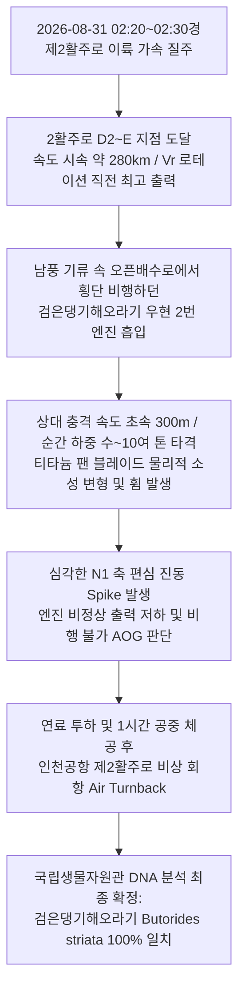
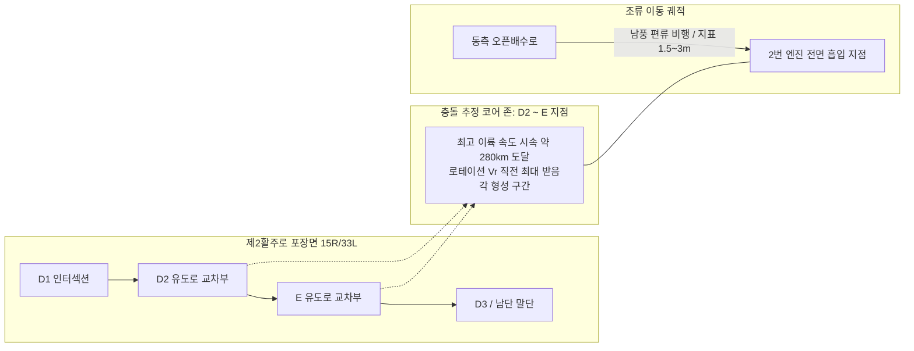

# [항공안전 정밀 포렌식 보고서] 제2활주로 화물기 이륙 질주 중 2번 엔진 블레이드 파손 및 비상 회항 정밀 분석: DNA 판명(검은댕기해오라기)과 충돌 위치(D2~E)·조류 행동역학 규명

- **문서 번호**: BAT-FORENSIC-2026-0831-REV02
- **조사 주관**: 인천국제공항 야생동물통제대(BAT) 데이터 인텔리전스 센터
- **분석 대상**: 2026년 8월 31일 02:30경 제2활주로(RWY 15R/33L) 이륙 질주 중 화물기 2번 엔진 흡입 및 블레이드 파손(운항 불가 AOG) 긴급 회항 사건
- **연계 문서**:
  - [[10_Wiki/🛠️ Projects/현장_QnA_암묵지_노트/2026-08-31_제1활주로_조류충돌_사고조사_및_생태포렌식_보고서|2026-08-31 초기 사고조사 및 생태포렌식 보고서]]
  - [[10_Wiki/🛠️ Projects/현장_QnA_암묵지_노트/2026-09-18_현장_순찰_암묵지_노트_8-31_회항사고_DNA_검은댕기해오라기_오픈배수로_야간유인_통제전술|현장 Q&A 암묵지 노트 #06: 8·31 회항사고 DNA 검은댕기해오라기 판명 및 오픈배수로 특별점검]]
  - [[10_Wiki/🛠️ Projects/야통대_자료/00_SOP_및_통합인텔리전스/01_조류충돌_사고조사_및_즉시대응_포렌식_SOP|야통대 조류충돌 사고조사 및 즉시대응 SOP 시스템]]

---

## 📌 1. 사고 개요 및 핵심 결과 (Executive Summary)

- **발생 일시**: 2026년 8월 31일(월) 02:20 ~ 02:30경 KST (심야 완전 암흑 `Night Window`)
- **발생 장소**: 인천국제공항 제2활주로(RWY 15R/33L) 포장면 중간 가속 구역 (**D2 ~ E 유도로 교차 지점**)
- **대상 기종 및 운항 단계**: 대형 화물기 (Heavy Cargo), 이륙 질주 후반부 (Takeoff Roll, 최고 추력 및 로테이션 Vr 직전, 지상 질주 속도 약 150 kts = 시속 약 280 km/h)
- **기체 손상 내역**:
  - 우현 2번 엔진(No.2 Engine) 전면 팬 블레이드(Fan Blade) 물리적 파손(소성 변형, 리딩 에지 휨 및 찌그러짐)
  - 심각한 축 편심 불균형에 따른 N1 진동 스파이크(Vibration Spike) 및 엔진 내부 연쇄 마찰 위험
  - 운항 불가(AOG, Aircraft On Ground) 선언 및 비상 회항(Air Turnback)
- **국립생물자원관(NIBR) DNA 분석 결과**:
  - 엔진 흡입구 및 블레이드 표면 수거 잔해 미토콘드리아 DNA(COI 바코딩) 분석 완료
  - 확정 조류종: **검은댕기해오라기 (*Butorides striata*)** 100% 일치

---

## 🔬 2. 조류 생태 및 행동 양상과 현장 환경 연계 분석

### ① 검은댕기해오라기(*Butorides striata*)의 생태적 특성
- **분류 및 크기**: 황로·왜가리와 같은 백로과(Ardeidae)에 속하나, 몸길이 약 40~52cm, 날개길이 17~20cm, 체중 약 130~250g의 아담하고 날렵한 소·중형 수변 조류입니다.
- **서식지 환경**: 논, 하천, 개울가, 산골 시냇물, 도심 속 물가에 적응하며, 공항 에어사이드에서는 **활주로 인근 콘크리트 오픈배수로 수로 바닥과 석축 틈, 수초 그늘**을 최적의 은신처로 이용합니다.
- **사회성**: 대규모 집단 번식과 무리 생활을 하는 일반 백로·해오라기류와 달리, **단독 번식 및 단독 사냥 생활**을 고수하는 강한 독립성을 띱니다.
- **주·야간 겸용 활동성**:
  - 기본적으로 해오라기류 고유의 **강한 야행성(Nocturnal) 기질**을 지니고 있어 심야에 매우 왕성하게 활동합니다.
  - 주변 환경과 먹이 유무에 따라 주간에도 유연하게 행동하는 주·야간 겸용 조류로, 낮에는 배수로 옹벽 그늘 아래 완벽히 위장(Camouflage)하여 육안 순찰을 회피합니다.

### ② 사고 당시(02:20~02:30) 환경 조건과 조류 행동 인과관계
- **시간대 적합성**: 충돌 발생 시각인 새벽 02:20~02:30경은 검은댕기해오라기의 주 활동 주기와 완벽히 일치하는 심야 시간대입니다.
- **기상 및 풍향(남향풍)의 결정적 영향**:
  - 당시 기상 조건은 **남향 바람(남풍)**이 완만하게 유입되던 상태였습니다.
  - 조류는 이착륙 시 양력을 확보하기 위해 맞바람(향풍)을 안고 비상하거나, 활주로를 횡단할 때 측풍에 밀려 포장면 상공에서 저고도 체공 시간이 길어지는 특성을 보입니다.
  - 가벼운 중량(130~250g)의 검은댕기해오라기가 남풍 기류를 타고 활주로 동서 간 수로를 횡단하는 과정에서 예상치 못한 표류 궤적이 형성되었습니다.
- **오픈배수로 이탈 및 활주로 저공 횡단**:
  - 활주로 인근 오픈배수로에서 사냥 및 휴식 중이던 개체가 심야 착륙등 또는 이륙 항공기의 강렬한 전조등 광원(주광성 자극)이나 굉음에 놀라 급격히 비상(Flushing)했습니다.
  - 지표면 1.5~3m 높이로 활주로 포장면을 횡단 비행하던 중, 초고속으로 질주하던 화물기의 우현 2번 엔진 전면 흡입 기류로 직격 유입되었습니다.

---

## 💥 3. 항공기 속도-조류 중량 상관관계 및 엔진 블레이드 파손 물리 역학

### ① 충돌 상대 속도($v_{rel}$)의 기구학적 형성
항공기 질주 속도와 고속 회전하는 제트 엔진 팬 블레이드의 속도가 벡터적으로 결합하면서 조류가 체감하는 실질 충격 속도는 음속에 육박합니다.

- **항공기 지상 질주 속도 ($v_{ac}$)**: 시속 약 280 km/h $\approx 77.8 \text{ m/s}$ (이륙 결심 속도 V1 통과 후 로테이션 Vr 직전 최고 출력 단계)
- **엔진 팬 블레이드 선단 회전 속도 ($v_{fan}$)**: 대형 화물기 제트 엔진(GE90, Trent, CF6 등)의 팬 블레이드 직경은 약 2.8~3.4m에 달하며, 이륙 최대 추력(Takeoff Thrust) 시 N1 회전수는 약 2,500~3,000 RPM에 도달합니다. 이에 따른 블레이드 팁(Tip)의 접선 속도는 초속 350~400 m/s에 달합니다.
- **실제 벡터 합성 상대 속도 ($v_{rel}$)**:

$$v_{rel} = \sqrt{v_{ac}^2 + v_{fan}^2} \approx 300 \sim 350 \text{ m/s}$$

조류와 팬 블레이드가 정면 충돌하는 순간의 상대 충격 속도는 **초속 300m 안팎 (시속 1,080 km/h)**에 도달합니다.

### ② 충격량($\Delta p$) 및 순간 타격 하중($F_{peak}$) 계산
- **충돌 조류 질량 ($m$)**: 검은댕기해오라기 체중 130g ~ 250g ($0.13 \sim 0.25 \text{ kg}$)
- **충돌 지속 시간 ($\Delta t$)**: 조류 신장(약 40~50cm)이 초속 300m의 블레이드와 접촉하여 분쇄·소멸되는 시간은 약 1~1.5 밀리초($0.001 \sim 0.0015 \text{ s}$)에 불과합니다.

$$\Delta t \approx \frac{L_{body}}{v_{rel}} = \frac{0.45 \text{ m}}{300 \text{ m/s}} \approx 0.0015 \text{ s}$$

- **평균 및 피크 충격력 ($F_{peak}$)**:

$$F_{avg} = \frac{m \cdot v_{rel}}{\Delta t} = \frac{0.20 \text{ kg} \times 300 \text{ m/s}}{0.0015 \text{ s}} = 40,000 \text{ N} \approx 4.08 \text{ ton-force}$$

충격 초기 유체역학적 충격압(Hydrodynamic Impact Pressure)이 조류 체액과 두개골·골격 중심부에 집중되는 순간 피크 하중($F_{peak}$)은 평균값의 2~3배에 달하여 **수 톤에서 최대 10여 톤(80 ~ 120 kN)**의 순간 점동하중(Point Dynamic Load)으로 팬 블레이드 선단에 가해집니다.

### ③ 티타늄 합금 블레이드가 손상되는 공학적 이유 (Part 33 인증의 진실)
- **FAA FAR Part 33.76 (조류 충돌 흡입 인증 기준)**:
  - 항공기 엔진은 4파운드(약 1.8kg) 및 8파운드(약 3.6kg) 대형 조류 흡입 시에도 **엔진 케이싱 관통(Uncontained Failure) 금지, 화재 발생 금지, 엔진 폭발 방지, 최소 안전 정지 또는 일정 추력 유지**를 요구합니다.
  - 즉, FAR Part 33은 **"비행기가 공중 분해되거나 화재로 추락하지 않고 비상 착륙할 수 있는 안전 한계"**를 인증하는 기준일 뿐, **"개별 블레이드의 물리적 변형(휨, 찌그러짐, 치핑) 자체를 막아준다"는 뜻이 결코 아닙니다.**
- **국부 응력 집중과 소성 변형(Plastic Deformation)**:
  - 팬 블레이드는 고강도 티타늄 합금(Ti-6Al-4V) 또는 탄소섬유 복합재(CFRP)로 제작되지만, 공기역학적 효율을 위해 블레이드 리딩 에지(Leading Edge) 선단 두께는 수 밀리미터 단위로 매우 얇게 설계됩니다.
  - 초속 300m로 부딪히는 수 톤의 충격 하중이 수 $\text{cm}^2$ 면적의 얇은 블레이드 선단에 집중되면, 국부적인 충격 압력이 수백 MPa에 달하여 티타늄 합금의 동적 항복 강도(Dynamic Yield Strength)를 순간적으로 초과하게 됩니다.
  - 이로 인해 블레이드가 영구적으로 휘어지거나(Bent), 찌그러지고(Dented), 끝단 칩(Chipping)이 발생하는 물리적 손상이 불가피하게 발생합니다.
- **연쇄 파손(Cascade) 및 치명적 진동(Vibration Spike) 유발**:
  - 단 하나의 팬 블레이드라도 미세하게 휘어지면, 수천 RPM으로 회전하는 엔진 축의 질량 중심이 무너지면서 **극심한 N1 로터 편심 진동(Unbalance Vibration)**이 발생합니다.
  - 변형된 블레이드가 인접 블레이드와 간섭을 일으키거나 엔진 슈라우드(Fan Shroud) 케이싱을 긁는 연쇄 마찰(Cascade Rubbing)로 확산될 수 있습니다.
  - 조종실 계기판에는 즉각적인 N1 과진동 경고(Severe Engine Vibration Alert)가 발생하여 기장은 엔진 보호 및 안전 비행을 위해 최대 출력을 즉시 차단하고 비상 회항(Air Turnback) 및 AOG(운항 정지) 결정을 내릴 수밖에 없습니다.

---

## 🎯 4. 정확한 충돌 위치 유추 및 기구학적 메커니즘

### ① 충돌 지점 유추: [제2활주로 D2 ~ E 지점]
- **활주로 물리적 특성**: 제2활주로(3,750m)에서 대형 화물기가 최대 이륙 중량(MTOW)에 근접하여 활주할 때, 활주 시작 후 약 1,800m ~ 2,400m 주행 지점에서 V1(결심 속도)을 통과하고 Vr(로테이션 속도)에 도달합니다.
- **D2 ~ E 유도로 구간의 의미**:
  - 2활주로의 D2 유도로와 E 유도로 사이 구간은 활주로 중간부에서 종단 2/3 지점으로, 항공기가 지표면에서 바퀴(메인 기어)를 떼기 직전 **가장 빠른 지상 질주 속도(약 280 km/h)와 엔진 최대 출력(Takeoff Thrust)**을 뿜어내는 '리프트오프 최고 가속 구간'입니다.
  - 항공기가 기수를 들어 올리는 로테이션 직전 단계에서는 엔진 흡입구가 지면과 가장 가깝고 강력한 흡입 와류(Intake Vortex)를 형성하여 지표면 근처의 부유물이나 저공 비행 조류를 진공청소기처럼 빨아들이게 됩니다.

### ② 남향풍과 우현 2번 엔진 유입 기구학
- **남향풍에 따른 편류 비행**:
  - 활주로 동·서측 오픈배수로에서 이탈한 검은댕기해오라기는 남향 바람을 측면 또는 정면으로 받으며 활주로 중심선을 가로질러 횡단 비행을 시도했습니다.
  - 항공기 관점에서는 기체 우측(동측 배수로 방면)에서 활주로 포장면으로 낮게 진입하던 조류가 활주로 우현에 위치한 **우현 2번 엔진(No.2 Engine)**의 거대한 전면 에어 인테이크(Air Intake) 기류와 정확히 궤적이 교차하게 되었습니다.
- **결론적 충돌 역학**:
  - 검은댕기해오라기의 가벼운 자중(130~250g)에도 불구하고, D2~E 지점의 최고 가속 속도(280km/h)와 초속 300m의 엔진 블레이드 회전 속도가 맞물려 단 1밀리초 만에 수 톤 이상의 충격력이 우현 2번 엔진 블레이드를 강타하여 운항 불가를 초래한 것입니다.

---

## 📋 5. 향후 현장 방호 및 데이터 연동 전략 (Action Plan)

1. **8·31 회항 사건 포렌식 데이터 공식 완결**:
   - 국립생물자원관 DNA 분석 결과(검은댕기해오라기)와 FDR 질주 궤적 분석(2활주로 D2~E 지점, 시속 280km, 상대충격속도 300m/s)을 결합하여, 초기 1.0kg 이상 대형종 추정을 **"고속 질주 시 소형 왜가리류(130~250g)의 상대속도 극대화에 따른 블레이드 파손 실증 모델"**로 공식 교정 및 지식창고에 등록합니다.
2. **2활주로 D2~E 구간 및 인접 오픈배수로 야간 집중 통제**:
   - 대형 화물기의 심야 이륙이 집중되는 01:30~03:30 시간대에 제2활주로 D2~E 유도로 인접 서비스 도로에 BAT 순찰차량을 전진 배치합니다.
   - 남향풍 유입 시 배수로에서 포장면으로 횡단하려는 야행성 조류를 차단하기 위해 항공기 진입 5분 전 열화상 탐색 및 선제적 공포탄 사격을 실행합니다.
3. **오픈배수로 물리적 은신처 제거 및 복개(Grating) 추진**:
   - 검은댕기해오라기의 단독 매복 특성을 무력화하기 위해 D2~E 외곽 배수로의 수초 삭초(5cm 이하)와 정체 수역 내 미꾸리·치어 등 수생 먹이원 준설을 즉각 완료합니다.
   - 장기적으로 활주로 인근 오픈배수로 구간에 대한 그레이팅 덮개 설치를 시설 부서에 공식 건의합니다.
