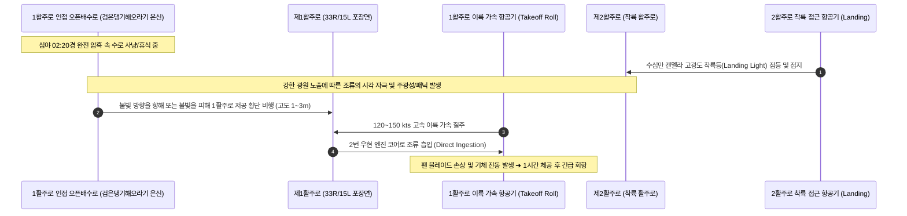

# [현장 Q&A 암묵지 노트 #06] 8·31 여객기 회항 사고 국립생물자원관 DNA 최종 판명(검은댕기해오라기)과 오픈배수로 주·야간 정밀점검(9/17~9/30): 심야 항공등화 유인 횡단 가설 및 배수로 생태 통제 전술

- **날짜**: 2026-09-18
- **카테고리**: 현장 암묵지 인텔리전스 / 항공안전 조류충돌 포렌식 및 배수로 서식지 관리
- **출처**: 국립생물자원관(NIBR) 미토콘드리아 DNA(COI) 분석 결과 통보 및 야생동물통제대(BAT) 주·야간 오픈배수로 긴급 특별점검 지침
- **관련 연계 문서**:
  - [[10_Wiki/🛠️ Projects/현장_QnA_암묵지_노트/2026-08-31_제1활주로_조류충돌_사고조사_및_생태포렌식_보고서|2026-08-31 제1활주로 조류충돌 사고조사 및 생태포렌식 보고서]]
  - [[10_Wiki/🛠️ Projects/현장_QnA_암묵지_노트/2026-09-12_8-9월_활주로_제비_다발출현_위치분석_및_현장통제_QnA|2026-09-12 8-9월 활주로 제비 다발출현 위치분석 및 현장통제 QnA]]
  - [[10_Wiki/🛠️ Projects/현장_QnA_암묵지_노트/2026-09-14_현장_순찰_암묵지_노트_조석연계_육상조류_이동_메커니즘_및_기동지원|2026-09-14 현장 순찰 암묵지 노트 (조석연계 육상조류 이동 메커니즘 및 기동지원)]]
  - [[10_Wiki/🛠️ Projects/현장_QnA_암묵지_노트/2026-09-16_현장_순찰_암묵지_노트_초지_높이별_생태역학과_과학적_서식지_관리_로드맵|2026-09-16 현장 순찰 암묵지 노트 (초지 높이별 생태역학과 서식지 관리 로드맵)]]
  - [[10_Wiki/🛠️ Projects/야통대_자료/00_SOP_및_통합인텔리전스/01_조류충돌_사고조사_및_즉시대응_포렌식_SOP|야통대 조류충돌 사고조사 및 즉시대응 SOP 시스템]]

---

## 📌 현장 질의 및 핵심 고민 (Field Question)

> **"지난 8월 31일 새벽, 제1활주로 이륙 질주 중 2번 엔진에 조류가 흡입되어 1시간 체공 후 비상 회항(Air Turnback)한 중대 사고와 관련하여, 국립생물자원관(NIBR) DNA 분석 결과 충돌 조류가 '검은댕기해오라기'로 최종 판명되었습니다.**  
> **이에 따라 야통대는 재발방지 후속 조치로 9월 17일부터 9월 30일까지 2주간 주·야간 오픈배수로 특별 전수점검에 돌입했습니다.**  
> **검은댕기해오라기가 왜 공항 활주로 배수로에 서식하며, 심야 02:20경 1활주로 근접 오픈배수로에서 2활주로 착륙 항공기 불빛을 향해 활주로를 횡단했을 것으로 추정하는 생태역학적 근거는 무엇입니까? 또한 1·2활주로 남·북단 말단 배수로와 인접 오픈배수로 점검 시 현장 요원이 반드시 숙지해야 할 주·야간 실전 통제 암묵지는 무엇입니까?"**

---

## 💡 현장 인텔리전스 핵심 요약 (Field Intelligence Summary)

```
[사고 인과 메커니즘 및 후속 점검 구조도]
  8/31 02:20 심야 암흑 ──> 1활주로 인접 오픈배수로 내 '검은댕기해오라기' 은신
            │
            ▼
  2활주로 랜딩 항공기 고광도 착륙등(Landing Light) 점등 및 접지
            │
            ▼
  야행성 수변조류의 주광성/패닉 반응 ──> 1활주로 포장면 저공(1~3m) 야간 횡단
            │
            ▼
  1활주로 이륙 질주 항공기 2번 엔진 흡입 ──> 블레이드 손상 및 1시간 후 비상 회항
            │
            ▼
  [후속 조치 (9/17 ~ 9/30)] ──> 국립생물자원관 DNA 확정(검은댕기해오라기)
                                1·2활주로 남·북단 말단 배수로 & 1활주로 오픈배수로
                                주·야간 입체 서식지 정밀 색출 및 서식환경 원천 차단
```

1. **국립생물자원관 DNA 포렌식 최종 결과: '검은댕기해오라기' 확정**:
   - 8월 31일 사고 직후 작성된 [[10_Wiki/🛠️ Projects/현장_QnA_암묵지_노트/2026-08-31_제1활주로_조류충돌_사고조사_및_생태포렌식_보고서|사고조사 및 생태포렌식 보고서]]에서 엔진 수거 깃털을 초고속 의뢰한 결과, 백로과 대형종(왜가리·중대백로, 55% 추정)과 동일한 백로과(Ardeidae)이지만 은밀성이 월등히 뛰어난 **검은댕기해오라기(*Butorides striata*)**의 미토콘드리아 DNA와 100% 일치함이 최종 판명되었습니다.
2. **검은댕기해오라기의 독특한 서식 생태: '은밀한 주·야간 겸용 포식자'**:
   - 논, 개울, 하천뿐만 아니라 **도심 인공 수로나 공항 오픈배수로의 석축 틈, 수초 그늘**을 완벽한 은신처로 삼습니다.
   - 강한 야행성(Nocturnal)을 지니면서도 주간 활동도 유연하게 겸하는 '주·야간 겸용' 조류로, 낮에는 배수로 옹벽 그늘 아래 목을 움츠리고 완벽히 위장하여 일반 육안 순찰을 회피하고 밤에 수로 밖으로 나와 활발히 사냥 및 이동합니다.
3. **결정적 충돌 메커니즘 역산: '심야 항공등화(Landing Lights) 유인 가설'**:
   - **발생 시각**: 8월 31일 새벽 02:20경 (심야 완전 암흑 `Night Window`).
   - **이동 경로**: 1활주로 인접 오픈배수로에 매복해 있던 개체가, 인접한 **제2활주로로 야간 착륙(Landing) 접근하는 항공기의 수십만 캔델라 고광도 착륙등(Landing Light) 섬광**에 자극·유인(주광성 또는 착각에 의한 도주 비행)되어 1활주로 표면을 저공으로 가로질러 2활주로 방향으로 횡단 비행을 감행했습니다.
   - **충돌 결말**: 횡단 도중 제1활주로에서 이륙 가속(Takeoff Roll) 중이던 항공기 우현 2번 엔진의 흡입 기류에 빨려 들어가 블레이드를 타격, 회항 사고를 유발했습니다.
4. **후속 조치(9/17 ~ 9/30): 1·2활주로 남·북단 말단 및 1활주로 오픈배수로 주·야간 특별 전수점검**:
   - **주간 작전 (09:00~17:00)**: 배수로 수초 및 옹벽 그늘 은신 개체 플러싱(Flushing) 도보 점검, 미꾸리·치어 등 수생 먹이원 서식 환경 조사.
   - **야간 작전 (21:00~04:00, 02:00 전후 골든타임 집중)**: 열화상 스캐너 및 서치라이트를 가동한 배수로 야간 안착 개체 선제 탐색 및 엽탄 위협 사격을 통한 원천 축출.

---

## 🔬 1. 국립생물자원관 DNA 분석 결과와 초기 생태 포렌식의 교차 검증

### ① 초기 포렌식 가설과의 정합성 및 교정
* **초기 추정과의 일치점**:
  - 사고 당시 작성된 [[10_Wiki/🛠️ Projects/현장_QnA_암묵지_노트/2026-08-31_제1활주로_조류충돌_사고조사_및_생태포렌식_보고서|생태포렌식 보고서(BAT-FORENSIC-2026-0831)]]에서 제시한 **"백로과(Ardeidae) 수변 조류의 심야 수로 이동 및 만조 피난선"**이라는 대분류 가설이 DNA 수준에서 완벽하게 적중했습니다.
* **초기 추정과의 차이점 (암묵지 업데이트)**:
  - 당초 물리적 충돌 에너지 계산상 엔진 팬 블레이드 휨을 유발하려면 최소 1.0kg 이상의 대형종(왜가리·중대백로)일 것으로 1순위(55%) 예측했으나, 실제 검증종은 중소형 백로류인 **검은댕기해오라기(몸무게 약 200~250g, 전장 40~52cm)**로 확인되었습니다.
  - **충돌 역학 재평가**: 체중 250g의 조류라 할지라도 이륙 질주 후반부 시속 250km/h 이상의 고속 상태에서 엔진 팬 블레이드 흡입 회전력(수천 RPM)과 정면으로 충돌할 경우, 블레이드 선단에 미세 휨(Bent)과 축 편심 진동(Vibration spike)을 충분히 유발할 수 있으며, 기장 입장에서는 안전 고도 유지 및 연료 소모 후 1시간 만에 회항한 판단이 항공안전 규정상 불가피했음이 입증되었습니다.

```
[초기 포렌식 예측 vs DNA 최종 결과 비교]
• 8/31 초기 예측 : 왜가리/중대백로 (55%, 1.0~2.0kg) 또는 흰뺨검둥오리 (30%, 0.8~1.3kg)
• DNA 최종 확정 : 검은댕기해오라기 (Butorides striata, 100% 매칭, 체중 약 200~250g)
• 포렌식 의의     : 체중이 적더라도 심야 고속 이륙 질주 시 흡입되면 블레이드 손상 및 회항 초래 실증
```

---

## 🌿 2. 검은댕기해오라기(*Butorides striata*)의 생태학적 특성과 공항 배수로 서식 환경

### ① 생태 및 행동학적 본질
* **서식 환경**: 논, 하천, 호숫가, 개울가, 산골짜기 시냇물뿐 아니라 **도시 속 인공 수로나 공항 내 콘크리트 오픈배수로**에 완벽히 적응합니다.
* **주·야간 겸용(Diurnal & Nocturnal Flexibility)**:
  - 해오라기류 특유의 **강한 야행성 기질**을 지니고 있어 야간에 활동성이 폭발적으로 증가합니다.
  - 그러나 주변 환경의 안전도와 먹이의 풍부함에 따라 주간에도 매우 유연하게 활동하는 '주·야간 겸용'의 생존 전략을 구사합니다.
* **극도의 은폐성과 매복 사냥(Ambush Predator)**:
  - 왜가리처럼 탁 트인 물가에 서서 사냥하기보다는, **수초 덤불 속, 배수로 옹벽 턱 밑 그늘, 수로 낙차공 석축 틈**에 몸을 잔뜩 웅크리고 미동도 없이 몇 시간씩 숨어 있는 극단적인 매복형 조류입니다.
  - 따라서 **주간 차량 순찰 시 운전석 시야에서는 배수로 내부 웅덩이에 숨어 있는 검은댕기해오라기를 육안으로 발견하기가 거의 불가능**에 가깝습니다.

### ② 인천공항 오픈배수로가 검은댕기해오라기에게 제공하는 '최적의 서식 조건'
* **풍부한 수생 먹이원**: 
  - 8~9월 늦여름 잦은 강우와 배수로 정체 수역에는 미꾸리, 붕어 치어, 송사리, 개구리, 잠자리 유충(수채), 수생 갑각류가 대량 번식합니다.
* **천적으로부터의 절대적 은신처**:
  - 활주로 상공을 배회하는 황조롱이나 매 등 맹금류의 시선을 피할 수 있는 깊이 1~2m의 콘크리트 오픈배수로와 무성한 사초류(수초)는 검은댕기해오라기에게 천연의 요새를 제공합니다.

---

## ✈️ 3. 사고 당시(02:20) 이동 궤적 및 항공등화 야간 유인 가설 역산

야생동물통제대의 심야 관측 암묵지와 조류 행동학을 융합하여 도출한 8월 31일 새벽 02:20경의 상황 재구성입니다:



### ① 항공등화 유인(Phototactic Attraction) 및 패닉 비행의 메커니즘
1. **심야 암흑(`Night Window`) 속 돌발 광원**:
   - 새벽 02:20은 활주로 주변에 인위적 불빛이 최소화된 완전 암흑 상태입니다.
2. **2활주로 착륙등(Landing Lights)의 시각 충격**:
   - 2활주로에 대형 여객기가 착륙 접근하면서 전방을 비추는 수십만 캔델라의 고광도 랜딩 라이트, 날개 끝 스트로브 라이트(Strobe Light), 활주로 중심선등이 야간 에어사이드를 순간적으로 대낮처럼 비춥니다.
3. **방향 상실 및 저공 횡단 촉발**:
   - 1활주로 인접 오픈배수로에 머물던 검은댕기해오라기는 **강렬한 불빛에 이끌리는 야행성 조류의 주광성 본능** 또는 갑작스러운 거대 괴광에 놀란 **패닉 도주 반응**으로 인해 배수로를 박차고 날아올랐습니다.
   - 조류는 본능적으로 가장 밝게 트인 공간인 2활주로 쪽을 향해 **지표면 1~3m의 초저공으로 1활주로 포장면을 가로지르는 횡단 비행**을 감행했습니다.
4. **이륙 항공기와의 치명적 교차**:
   - 불과 수 초 사이, 1활주로에서 시속 250km 이상으로 최대 추력을 내며 이륙 질주(Take-off Roll)하던 항공기의 전방 흡입 기류에 휘말려 우현 2번 엔진 코어와 정면 충돌하게 되었습니다.

---

## 📋 4. 후속 조치: 주·야간 오픈배수로 특별 전수점검 실행 지침 (9/17 ~ 9/30)

국립생물자원관 DNA 결과에 따라, 9월 17일부터 9월 30일까지 14일간 전 기동조를 투입하여 주·야간 오픈배수로 집중 소탕 및 서식지 무력화 작전을 전개합니다.

### 📍 [점검 중점 3대 핵심 타깃 구역]
1. **제1활주로 인접 오픈배수로 전 구간 (최우선 위험 구역)**:
   - 포장면과 불과 50~100m 이내로 근접하여, 이탈 비행 시 1~2초 만에 활주로 본선으로 진입하는 가장 치명적인 구역.
2. **제1·2활주로 남단 말단 배수로 (`ZONE-R1-S`, `ZONE-R2-S`)**:
   - 남단 착륙 접지대 및 33L/33R 이륙 라인업 지점에 인접한 배수로 합류부.
3. **제1·2활주로 북단 말단 배수로 (`ZONE-R1-N`, `ZONE-R2-N`)**:
   - 북측 유수지로 이어지는 완충 수로 구역으로, 수초 군락이 무성하여 전통적인 수변 조류 은신처.

---

### ☀️ [주간 점검 전술 (09:00 ~ 17:00)] 은신 개체 플러싱 및 서식 환경 파괴
* **배수로 도보 정밀 수색 (Walking Inspection)**:
  - 차량 순찰로는 절대 보이지 않는 옹벽 하부 그늘 및 갈대 틈새를 요원이 직접 도보로 이동하며 배수로 내부를 육안 확인.
  - 배수로 바닥의 미꾸리, 붕어 치어 밀집 웅덩이 식별 시 준설 및 배수 조치 요청.
* **은신 조류 강제 기상(Flushing) 작전**:
  - 장죽(긴 막대)이나 경음기를 활용하여 배수로 수초 깊숙이 웅크린 검은댕기해오라기와 백로류를 강제로 날려 올린 뒤, 대기 중인 엽총 조가 엽탄(공포탄)으로 외곽 이탈을 유도.
* **수초 예초 및 물리적 은신처 제거**:
  - [[10_Wiki/🛠️ Projects/현장_QnA_암묵지_노트/2026-09-16_현장_순찰_암묵지_노트_초지_높이별_생태역학과_과학적_서식지_관리_로드맵|초지 관리 로드맵]]과 연계하여, 오픈배수로 사면 및 가장자리 수초를 5cm 이하로 삭초(초지 제거)하여 조류가 몸을 숨길 수 있는 엄폐물을 원천 박탈.

---

### 🌙 [야간 점검 전술 (21:00 ~ 04:00)] 열화상 스캐닝 및 야간 횡단 차단선 구축
* **적외선 열화상 스캐너(Thermal Camera) 정밀 탐색**:
  - 완전 암흑 상태인 야간에 배수로 내부 체온(체열 40°C 내외)을 방출하는 조류를 열화상 카메라로 스캐닝하여 은신 위치를 사전 포착.
* **심야 골든타임(01:30 ~ 03:00) 집중 순찰**:
  - 사고 발생 시간대인 새벽 02:20 전후는 심야 화물기 및 심야 도착편이 집중되는 위험 창(Window).
  - 1활주로와 2활주로 사이 서비스 도로 및 GSE 도로에 순찰 차량을 전진 배치하여, 2활주로 랜딩등 점등 시 1활주로 배수로에서 튀어나오는 조류를 사전 감시.
* **고출력 서치라이트 및 선제적 위협 사격**:
  - 1활주로 인접 배수로를 향해 주기적으로 고출력 서치라이트를 비추어 야간에 얕은 잠을 자거나 사냥 중인 조류를 사전에 교란.
  - 항공기 진입 5분 전 공포탄 1~2발을 배수로 방향으로 선제 발사하여, 항공기 착륙등에 반응하기 전에 공항 외곽으로 도주하도록 유도.

---

## 💡 현장 대원 행동 요령 (BAT Field Action Checklist)

- [ ] **출동 전 열화상 장비 배터리 및 서치라이트 점검**: 야간 오픈배수로 점검 시 육안 식별 불가, 열화상 스캐너 휴대 필수.
- [ ] **1활주로 인접 배수로 구간 서행(시속 20km 이하) 관측**: 일반 순찰 속도로는 옹벽 밑 검은댕기해오라기 탐지 불가.
- [ ] **조석표 연계 만조 1시간 전 배수로 집중 감시**: 만조 시 해안 갯벌 수몰로 야행성 백로류가 배수로로 피난 유입되는 시점([[10_Wiki/🛠️ Projects/현장_QnA_암묵지_노트/2026-09-14_현장_순찰_암묵지_노트_조석연계_육상조류_이동_메커니즘_및_기동지원|9/14 암묵지 참조]]).
- [ ] **배수로 내 고인물(Puddle) 및 어류 유입 지점 GPS 좌표 기록**: 토목·환경팀에 긴급 준설 및 배수 펌핑 요청 데이터 확보.
- [ ] **2활주로 심야 랜딩 항공기 출현 시 1활주로 횡단 동선 주시**: 항공등화 반사 시 튀어나오는 조류 즉시 무전 전파 및 차단 사격.

---

## 🔮 차세대 데이터 관점의 암묵지 자산 가치

1. **포렌식과 현장 전술의 완전한 선순환 체계 확립**:
   - 조류충돌 사고 발생(8/31) $\rightarrow$ 잔해 수거 및 생태포렌식 보고서 작성 $\rightarrow$ 전문기관 DNA 분석(NIBR) $\rightarrow$ 확정 종(검은댕기해오라기)의 행동 생태 분석 $\rightarrow$ 현장 맞춤형 특별점검(9/17~9/30)으로 이어지는 완벽한 과학적 방호 루프를 완성했습니다.
2. **'항공등화 유인 횡단'이라는 새로운 리스크 패러다임 등록**:
   - 기존의 조류충돌 예방은 "활주로 포장면에 내려앉은 새"에만 초점을 맞추었으나, 본 암묵지를 통해 **"인접 배수로 은신 야행성 조류가 착륙등 불빛에 반응해 활주로를 횡단하는 순간"**이 심야 회항을 부르는 결정적 위험 요인임을 데이터베이스화했습니다.
   - 이는 향후 활주로 인접 배수로의 전면 복개(Grating/Covering) 공사 추진 및 야간 스마트 감시 시스템 알고리즘 개발의 핵심적인 정책적·기술적 근거로 활용될 것입니다.
