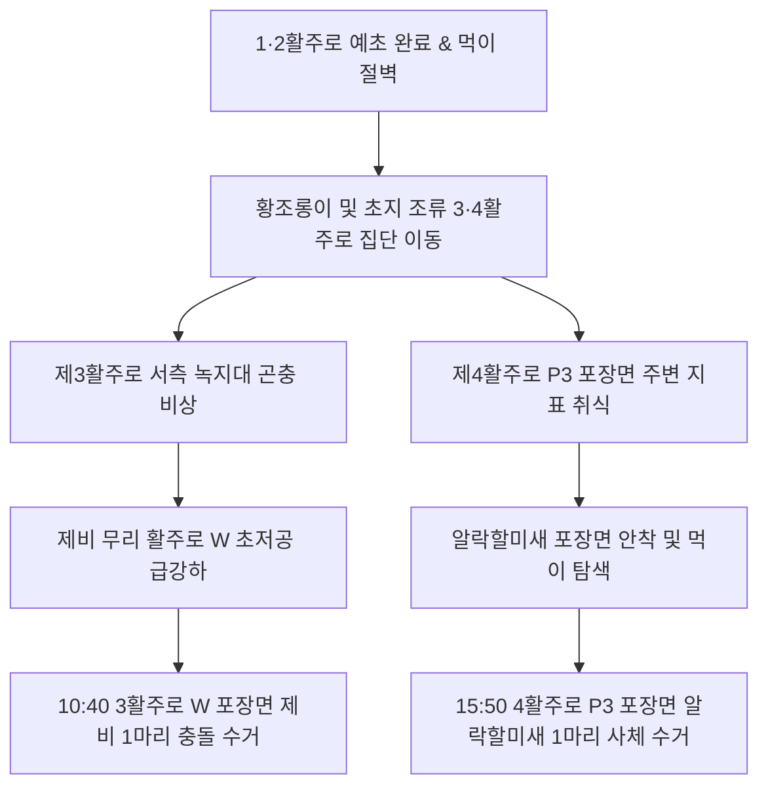

# [현장 Q&A 암묵지 노트 #07] 1·2활주로 예초(Mowing) 직후 황조롱이의 3·4활주로 서식지 이동(Displacement)과 연쇄 조류충돌(제비·알락할미새 사체 수거) 실증: '풍선효과' 차단을 위한 동시 다각 방호 전술

- **날짜**: 2026-09-19
- **카테고리**: 현장 암묵지 인텔리전스 / 예초생태역학 및 활주로간 서식지이동(Displacement)
- **출처**: 2026-09-15 1·2활주로 주간 예초 실황, 9-16 1·2·3·4활주로 4개 근무팀 전수 관측 통계 및 3·4활주로 조류충돌·사체수거(제비·알락할미새) 현장 포렌식 기록
- **관련 연계 문서**:
  - [[10_Wiki/🛠️ Projects/현장_QnA_암묵지_노트/2026-09-15_현장_순찰_암묵지_노트_예초직후_황조롱이_급증_메커니즘_및_조석연계_조류예측|현장 Q&A 암묵지 노트 #03: 예초(Mowing) 직후 맹금류 급증 메커니즘과 조석 연계 예측]]
  - [[10_Wiki/🛠️ Projects/현장_QnA_암묵지_노트/2026-09-16_현장_순찰_암묵지_노트_초지_높이별_생태역학과_과학적_서식지_관리_로드맵|현장 Q&A 암묵지 노트 #04: 초지 식생고 역학 및 연간 서식지 관리 로드맵]]
  - [[10_Wiki/🛠️ Projects/현장_QnA_암묵지_노트/2026-09-12_8-9월_활주로_제비_다발출현_위치분석_및_현장통제_QnA|현장 Q&A 암묵지 노트 #01: 8~9월 활주로 제비 다발출현 위치분석 및 통제 QnA]]
  - [[10_Wiki/🛠️ Projects/현장_QnA_암묵지_노트/2026-09-14_현장_순찰_암묵지_노트_조석연계_육상조류_이동_메커니즘_및_기동지원|현장 Q&A 암묵지 노트 #02: 조석 연계 육상조류 이동 및 GSE 도로 기동지원]]
  - [[10_Wiki/🛠️ Projects/현장_QnA_암묵지_노트/2026-09-18_현장_순찰_암묵지_노트_8-31_회항사고_DNA_검은댕기해오라기_오픈배수로_야간유인_통제전술|현장 Q&A 암묵지 노트 #06: 8·31 여객기 회항 DNA(검은댕기해오라기)와 오픈배수로 점검]]

---

## 📌 현장 질의 및 핵심 고민 (Field Question)

> **"9월 15일 제1·2활주로 기동지역 주간 제초작업(Mowing) 도중 곤충과 흙 속 먹이 노출로 조류가 대량 유입되는 'Mowing Strike Hazard'로 인해 예초 당일 황조롱이가 폭증했습니다.**  
> **그런데 바로 다음 날인 9월 16일, 1·2활주로에서는 조간 일출 ILS 점검 시 황조롱이가 단 1마리, 주간 4개 근무팀 관측 합계도 8마리로 눈에 띄게 급감했습니다.**  
> **반면 같은 날 9월 16일 주간, 제3·4활주로에서는 오전과 오후 내내 조류 개체수가 이례적으로 급증했습니다. 1·2활주로의 황조롱이는 대체 어디로 사라진 것이며, 3·4활주로에서 발생한 조류충돌(10:40 제비 1마리 수거, 3활주로 W 포장면)과 사체 수거(15:50 알락할미새 1마리, 4활주로 P3 포장면)는 이와 어떤 생태역학적 인과관계가 있습니까? 활주로 간 '풍선효과(Balloon Effect)'를 차단할 실전 통제 전술은 무엇입니까?"**

---

## 💡 현장 인텔리전스 핵심 요약 (Field Intelligence Summary)

```
[1·2활주로 예초 여파와 3·4활주로 서식지 이동(Displacement) 메커니즘]
  9/15 1·2활주로 대단위 예초(Mowing) ──> 지표 먹이 일시 노출로 황조롱이 1·2활주로 집중 흡인
                │
                ▼ (작업 완료 및 24시간 경과 후)
  1·2활주로 초지 식생고 5cm 이하 단초화 ──> 곤충·설치류 은신처 및 지표 먹이 완전 고갈
                │
                ▼ [생태적 서식지 이동 (Habitat Displacement)]
  황조롱이 무리가 아직 예초되지 않은 비(非)예초 초지가 풍부한 제3·4활주로 녹지대로 집단 이동!
                │
                ▼ 9/16 3·4활주로 연쇄 충돌 발생 (현장 실증 데이터)
  ┌────────────────────────────────────────┴────────────────────────────────────────┐
  ▼                                                                                 ▼
[10:40 제3활주로 W 포장면]                                        [15:50 제4활주로 P3 포장면]
• 충돌 조류: 제비 1마리 수거                                      • 충돌 조류: 알락할미새 1마리 사체 수거
• 배경: 맹금류 유입 + 미예초 초지 곤충 활공                      • 배경: 포장면 주변 지표 곤충 취식 중 항공기 충돌
```

1. **1·2활주로 황조롱이 급감의 원인: 먹이 고갈에 따른 '서식지 이동(Habitat Displacement)'**:
   - 9월 15일 예초 당일에는 깎인 풀 밑에서 노출된 곤충과 등줄쥐로 인해 황조롱이가 1·2활주로 전역에 몰려들었으나, **작업 완료 후 하룻밤이 지나자 먹이원이 급속히 소진되고 초지가 5cm 이하로 깎여 은신 먹이가 전무**해졌습니다.
   - 이에 따라 황조롱이 무리는 먹이 환경이 아직 풍부하고 풀이 길게 자라 있는 서측 대체 서식지인 **제3·4활주로 배후 녹지대(녹지대 52, 47, 227, 331 등)로 대규모 서식지를 강제 전환**했습니다.
2. **9/16 3·4활주로 오전·오후 조류 급증과 연쇄 충돌 실증**:
   - 9월 16일 1·2활주로의 황조롱이 관측량은 8마리(팀당 2마리 수준)로 평소 이하로 떨어진 반면, **3·4활주로는 오전·오후 내내 황조롱이 및 초지 조류 개체수가 급증**했습니다.
   - 그 결정적 증거로 **10:40 제3활주로 W 포장면에서 조류충돌 제비 1마리 수거**, **15:50 제4활주로 P3 포장면에서 알락할미새 1마리 사체 수거**가 잇따라 발생하여 서식지 이동에 따른 위험 전이('풍선효과')가 물리적으로 확인되었습니다.
3. **핵심 전술 암묵지: 활주로 순차 예초 시 '동시 다각 방호(Synchronized Defense)' 필수**:
   - 공항 내 특정 활주로 구역에서 대단위 예초를 실시하면, 익일 조류 충돌 위험은 예초 구역이 아니라 **"예초를 하지 않은 인접 활주로 구역"으로 전이**됩니다.
   - 따라서 1·2활주로 예초 종료 익일부터는 순찰 화력을 3·4활주로로 선제 이동 배치하는 **'전이 위험 예측 기동'**을 전개해야 합니다.

---

## 📊 1. 9/15 vs 9/16 활주로별 관측 데이터 및 시계열 역동

인천공항 야생동물통제대 4개 근무팀(1~4팀)의 순찰 일지와 충돌 기록을 전수 교차 검증한 결과입니다:

| 구분 | 9월 15일 (예초 당일) | 9월 16일 (예초 익일) | 생태역학적 판정 |
| :--- | :--- | :--- | :--- |
| **제1·2활주로 (동측)** | • 주간 대단위 잔디 예초 진행<br>• 일시적 곤충·쥐 노출로 **황조롱이 폭증 (10~12마리 이상 집중 관측)**<br>• ILS 주변 횃대 사냥 빈발 | • 조간 일출 ILS 점검: **단 1마리** 관측<br>• 주간 4개 팀 관측 합계: **총 8마리**로 급감<br>• 초지 고갈로 체류 유인력 상실 | **서식지 이탈 (Emigration)**<br>먹이원 소진 및 단초화에 따른 환경 회피 |
| **제3·4활주로 (서측)** | • 평상시 수준 유지 (간헐적 출현) | • **오전·오후 전 시간대 조류 개체수 급증**<br>• 황조롱이 호버링 및 초지 비행 빈발<br>• 제비 및 알락할미새 활동 반경 포장면 확대 | **서식지 유입 (Immigration)**<br>1·2활주로 이탈 개체의 대체 녹지대 집결 |
| **충돌 및 사체 수거** | • 1·2활주로 집중 퇴치 사격으로 본선 충돌 방어 성공 | • **10:40 3활주로 W 포장면: 제비 1수 충돌 수거**<br>• **15:50 4활주로 P3 포장면: 알락할미새 1수 사체 수거** | **연쇄 충돌 실증 (Spillover Collision)**<br>포장면 침범 및 기체 타격 발생 |

---

## 🔍 2. 생태역학적 인과 분석: 왜 황조롱이는 3·4활주로로 이동했는가?

### ① 예초 24시간 후의 '먹이 절벽(Food Cliff)' 현상
* **예초 0~6시간 (당일 주간)**: 
  - 대형 트랙터 예초기가 풀을 벨 때 메뚜기, 귀뚜라미, 방아깨비가 공중으로 튀어 오르고 흙 속 지렁이와 등줄쥐의 굴이 파괴되면서 지표면은 거대한 '무료 뷔페'가 됩니다.
  - 이 타이밍에는 1·2활주로 전역으로 맹금류가 자석처럼 빨려 들어옵니다([[10_Wiki/🛠️ Projects/현장_QnA_암묵지_노트/2026-09-15_현장_순찰_암묵지_노트_예초직후_황조롱이_급증_메커니즘_및_조석연계_조류예측|9/15 암묵지 노트 #03 참조]]).
* **예초 24시간 경과 (익일 조간~주간)**:
  - 노출되었던 곤충은 까치와 백로, 제비에 의해 거의 전량 포식되거나 인근 수풀로 도망칩니다.
  - 잔디가 5cm 이하로 짧아져 지표면에 더 이상 숨을 곳도, 곤충이 서식할 식생도 남지 않는 '생태적 불모지(Food Desert)'가 형성됩니다.
  - 사냥 효율이 급락한 황조롱이는 먹이를 찾아 시야를 넓히며 에어사이드 내 다른 초지대로 눈을 돌리게 됩니다.

### ② 서측 3·4활주로 배후 녹지대의 '대체 유인력(Alternative Attraction)'
* 공항 서측 제3·4활주로 주변은 제1터미널 인근의 1·2활주로에 비해 **녹지대 면적이 광활하고, 수로와 미예초 자연 초지(사초류·억새 등)가 고밀도로 보존**되어 있습니다.
* 1·2활주로에서 사냥터를 잃은 황조롱이들은 동서 연결 녹지축을 따라 직선거리 약 2~3km 떨어진 제3·4활주로 완충 녹지대(녹지대 52, 47, 227)로 단숨에 날아갔으며, 이로 인해 9월 16일 3·4활주로 상공에 황조롱이 밀도가 비정상적으로 치솟게 된 것입니다.

---

## 🎯 3. 결정적 실증 증거: 9/16 3·4활주로 사체 수거 및 충돌 2건 포렌식

9월 16일 3·4활주로에서 발생한 두 건의 사체 수거는 황조롱이의 이동뿐만 아니라, **맹금류의 이동에 자극받은 식충성·지표성 조류들의 동반 이동과 활주로 포장면 연쇄 침범**을 완벽히 입증합니다.



### 📍 [증거 1] 10:40 제3활주로 W 포장면 제비(Barn Swallow) 충돌 수거
* **수거 위치**: 제3활주로 고속탈출유도로(W 유도로) 인근 활주로 포장면
* **사고 역학**:
  - 황조롱이의 이동과 함께 3활주로 녹지대 상공의 비행 곤충류가 활주로 아스팔트 열섬 기류 쪽으로 밀려남.
  - 먹이를 쫓던 제비 무리가 [[10_Wiki/🛠️ Projects/현장_QnA_암묵지_노트/2026-09-12_8-9월_활주로_제비_다발출현_위치분석_및_현장통제_QnA|8~9월 제비 특유의 1~3m 초저공 활공]]을 전개하던 중 착륙 접지 또는 감속 주행 중이던 항공기 날개/동체 하부에 타격되어 W 포장면에 낙하.

### 📍 [증거 2] 15:50 제4활주로 P3 포장면 알락할미새(White Wagtail) 사체 수거
* **수거 위치**: 제4활주로 P3 유도로 진입정지선 인근 포장면
* **사고 역학**:
  - 알락할미새는 잔디밭과 아스팔트 경계면 바닥을 걸어 다니며 지표 곤충(파리, 딱정벌레)을 쪼아 먹는 전형적인 지표성 조류.
  - 1·2활주로 예초로 인해 지표 먹이터를 잃은 소형 조류들이 4활주로 P3 인근 잔디밭으로 이동하여 먹이를 찾던 중, 활주로 표면으로 올라왔다가 항공기 제트 후류(Jet Blast) 또는 착륙 기어에 충돌·사망함.

---

## 🛡️ 4. 예초 '풍선효과(Balloon Effect)' 차단을 위한 BAT 현장 기동 통제 전술

한쪽 활주로를 누르면 다른 쪽 활주로로 조류가 튀어 오르는 '풍선효과'를 제어하기 위한 실전 통제 수칙입니다:

### 1. [시차 연계 기동 배치] 예초 익일 '반대편 활주로' 선제 증원
- 1·2활주로 주간 예초가 실시된 날에는 1·2활주로에 기동력을 집중하되, **예초 종료 당일 일몰 및 익일 조간부터는 순찰 차량 1대를 3·4활주로로 사전 시차 전환(Shift) 배치**해야 합니다.
- 1·2활주로가 조용해졌다고 해서 경계를 늦추지 말고, **"1·2활주로의 평화는 3·4활주로의 폭풍전야"**라는 원칙을 적용합니다.

### 2. [GSE 도로망을 통한 활주로 간 최단거리 셔틀 기동]
- 1·2활주로와 3·4활주로는 동서로 넓게 격리되어 있으므로, 이동 시 일반 외곽도로 대신 [[10_Wiki/🛠️ Projects/현장_QnA_암묵지_노트/2026-09-14_현장_순찰_암묵지_노트_조석연계_육상조류_이동_메커니즘_및_기동지원|GSE 도로망]]을 관통하여 5분 이내에 서측 기동지역으로 급속 전개할 수 있는 기동로를 상시 유지합니다.

### 3. [순차적 분할 예초(Staggered Mowing) 건의]
- 토목/시설팀에 잔디 깎기 일정을 건의할 때, 1·2활주로 전면 예초 후 곧바로 3·4활주로를 깎는 방식 대신, **활주로별로 완충 구역(Buffer Zone)을 남기며 3~4일 간격으로 순차 예초**를 진행하도록 협의하여 조류의 급격한 서식지 이동 충격을 분산시킵니다.

---

## 📋 현장 대원 행동 요령 (BAT Field Action Checklist)

- [ ] **전일 예초 구역 이력 크로스체크**: 출근 즉시 인수인계 일지에서 어제 어느 활주로 초지 예초가 진행되었는지 반드시 확인.
- [ ] **예초 익일 3·4활주로 W 유도로 및 P3 구역 집중 감시**: 10:40 제비 충돌 및 15:50 알락할미새 수거 지점을 중점 감시 구역(Red Zone)으로 설정.
- [ ] **조간 06:00~09:00 ILS 및 평행 유도로 횃대 선제 스캐닝**: 서식지를 옮겨와 ILS 안테나나 표지판에 앉아 있는 황조롱이 엽탄 경퇴.
- [ ] **활주로 포장면 진입 조류(알락할미새·제비) 발견 즉시 관제탑 활주로 점검 요청**: 포장면에 머무는 지표 조류는 사체 수거로 직결되므로 즉각적인 런웨이 체커(Runway Checker) 공조 추진.

---

## 🔮 차세대 데이터 및 AI 조류충돌 예측 관점의 암묵지 자산 가치

1. **'서식지 변위(Displacement Vector)' 알고리즘 데이터 확보**:
   - 본 기록은 향후 AI 기반 조류충돌 예측 시스템에 *"활주로 A 예초 작업 완료 후 +24시간 시점 $\rightarrow$ 활주로 B 조류 위험 지수 2.5배 상향 자동 알림"*이라는 구체적인 행동 역학 규칙(Rule)을 코딩할 수 있는 결정적 실측 근거가 됩니다.
2. **사체 수거 위치 데이터와 비행 동선의 입체 융합**:
   - 3활주로 W 포장면(제비)과 4활주로 P3 포장면(알락할미새)이라는 정밀한 지리적 좌표(Spatial Data)는 공항 내 소형 조류의 포장면 침범 취약 지점 핫스팟 맵(Hotspot Map)을 정밀화하는 핵심 자산입니다.
